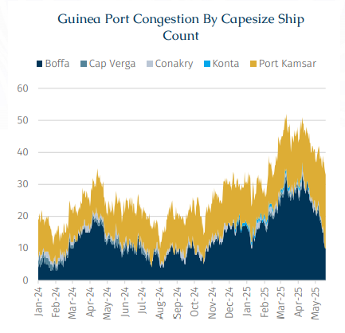
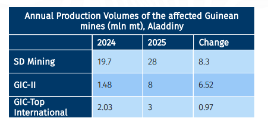
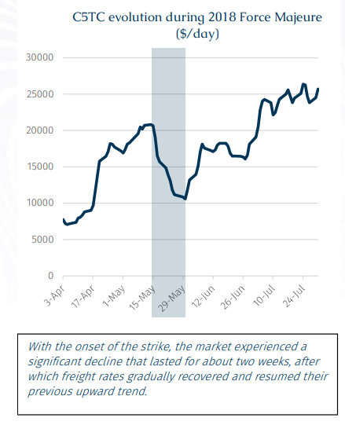

# Unexpected Revocation - A Guinea Tale

**Date:** May 27, 2025  
**Publisher:** Breakwave Advisors | **Category:** Market Insights  
**Original URL:** [https://www.breakwaveadvisors.com/insights/2025/5/27/unexpected-revocation-a-guinea-tale](https://www.breakwaveadvisors.com/insights/2025/5/27/unexpected-revocation-a-guinea-tale)  

---

> **Figure 1: Rgb Color Brs Shipbrokers Monogram Logo**  
> [Local Asset](file:///C:/Users/Dell/Github/Shipping/corpus/03-breakwave/insights/2025/assets/2025-05-27_unexpected-revocation-a-guinea-tale_img_rgb-color-brs-shipbrokers-monogram-l_ee79606c8e74.png)

Back in March, port congestion in Guinea drove a rally in Capesize freight rates as around 50 units were waiting to load at anchorages in Guinea, compared with just 25 vessels one year earlier. These additional 25 delayed vessels were therefore prevented from being immediately deployed for actual operations, which in turn supported freight rates across the entire Capesize market. However, with the latest major announcement out of Guinea government, this port congestion may be resolved in an unexpected way.

> **Figure 2: Among the Revoked Licenses**  
> *Among the revoked licenses, Axis Minérales stands out as it was the only fully operational mine with significant output. According to Aladdiny, Axis Minérales produced 23.2 mln mt of bauxite in 2024 and was expected to reach 39 mln mt in 2025, with a monthly shipment volume of around 3.25 mln mt—equivalent to 19 Capesize stems. The mine was operated under a lease agreement by SD Mining, GIC-II, and GIC-Top International. Although the Guinean government is expected to renegotiate and eventually reach new agreements with the three miners, in the short term both mining and logistics have been suspended with no clear timeline for resumption. Withforce majeurebeing announced, this will have major implications for the dry bulk shipping market and serves as a renewed warning for companies planning to enter Guinea.*  
> [Local Asset](file:///C:/Users/Dell/Github/Shipping/corpus/03-breakwave/insights/2025/assets/2025-05-27_unexpected-revocation-a-guinea-tale_img_cea3cf84ceb9ceb3cebcceb9cf8ccf84cf85_62468eb0dc40.png)

On 14 May, Guinea's transitional president Mamadi Doumbouya revoked 46 bauxite mining licenses previously granted to mining companies, returning these mining areas to the state without compensation. The Guinean government cited that these miners had violated Article 41 of the Guinean Mining Code, titled “Commencement of Mining Operations”, by failing to carry out the agreed investment and exploitation activities as stipulated in their original contracts.The affected companies include: Société des Bauxites de Guinée (SBG), Bauxite Kimbo SAU, Bauxite de Kimbo, Société Foroir Africa Ressources, Société Foroir Afrique Ressources, Société Teresa Mining Logistics, Société Shingrong Développement Minier, and Axis Minérales.

In recent years, many companies have entered Guinea's bauxite mining industry, with agreements typically requiring stable investment in mining infrastructure in exchange for the mining charters. However, some companies had only initiated financing without securing funds, while others were stalled due to strategic indecision or market misjudgment. For example, although SBG completed its first bauxite export in February 2023 and KIMBO followed in September 2023, both companies saw exports come to a halt soon after. Despite proving that exports were technically feasible, high costs have thus far prevented sustainable volumes. Market consensuses believe those initial shipments were done primarily to avoid having their licenses revoked, as the shipments were reportedly sold at a loss.

> **Figure 3: This Is Not the First Time the Guinean Bauxite Industry Has**  
> *This is not the first time the Guinean bauxite industry has experiencedforce majeure. In May 2018, Société Minière de Boké (SMB) declaredforce majeuredue to worker strikes, which completely halted bauxite production and resulted in a loss of around 1 mln mt in 10 days. That event had a significant impact on the global dry bulk market, especially for Capesize vessels. Many Cape vessels which had already anchored in Guinea or were ballasting toward it were forced back into the spot market, adding downward pressure to the seaborne market. Against this backdrop, the Capesize 5TC index broke its previous upward trend, plunging from $20,646/day on May 15 to $10,583/day on May 30, marking a 49% decline. This time, over the past three index days, the C5TC fell from $16,736/day to $15,383/day, while the FFA contracts for June and July also declined, dropping by 1,133 and 887 points respectively from last Friday to $17,771/day and $17,942/day.*  
> [Local Asset](file:///C:/Users/Dell/Github/Shipping/corpus/03-breakwave/insights/2025/assets/2025-05-27_unexpected-revocation-a-guinea-tale_img_cea3cf84ceb9ceb3cebcceb9cf8ccf84cf85_4bec5e9d698d.png)

> **Figure 4: Στιγμιότυπο Οθόνης 2025 05 27 125816**  
> [Local Asset](file:///C:/Users/Dell/Github/Shipping/corpus/03-breakwave/insights/2025/assets/2025-05-27_unexpected-revocation-a-guinea-tale_img_cea3cf84ceb9ceb3cebcceb9cf8ccf84cf85_935b11e33c0f.png)

Overall, with a large influx of prompt Capesize tonnage into the market in the short term, freight rates are likely to come under significant pressure. In the longer term, on the positive side, the Guinean bauxite mines whose licenses were revoked may be taken over by new players and re-enter the market, potentially boosting overall Guinea’s bauxite output. On the negative side, the Guinean government appears to be seeking to emulate the “Saudi oil model” — leveraging its abundant bauxite resources not merely for raw ore exports (akin to the Saudi starting with its crude exports), but to further extend further along the value chain through the construction of alumina refineries and aluminum smelters, thereby advancing domestic industrialization.

For Chinese players, the issue of over-reliance on a single import country is once again coming into focus. Alternatives — led by Australia — are likely to remain as key competitors to Guinea. In addition to the competition among exporting countries, the competition between upstream and downstream commodities is also worth our attention. Indonesia has been actively deploying new alumina refineries (a strategy Guinea is also considering) and is playing an increasingly important role in the global alumina trade. These developments, whether it’s a shift in loading origin from Guinea to Australia, or a shift in cargo type from bauxite to alumina, could put downward pressure on global seaborne trade. We will provide more detailed insights into the latest developments in the alumina market in this week’s Market Pointer.

---

**Tags:** Drybulk, Shipping, Markets  
