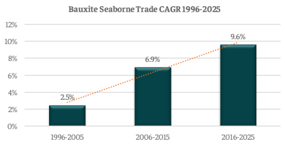

# Bauxite: A critical raw material

**Date:** May 28, 2025  
**Publisher:** Breakwave Advisors | **Category:** Market Insights  
**Original URL:** [https://www.breakwaveadvisors.com/insights/2025/5/28/bauxite-a-critical-raw-material](https://www.breakwaveadvisors.com/insights/2025/5/28/bauxite-a-critical-raw-material)  

---

*By*[*Nikolaos Tagoulis*](https://www.linkedin.com/in/nikolaos-tagoulis-9317252a/)

Guinea's military government recent decision to revoke 51 mining licenses, for bauxite, gold, diamond, graphite, and iron due to noncompliance issues underscores a growing wave of "resource nationalism" across sub-Saharan Africa. This move, citing violations of national mining code, highlights a trend where African nations aim to secure a larger share of resource revenues through revised policies. Such actions introduce heightened risks for investors and supply chains, signaling the West African nation’s intent for tighter state control over its mineral wealth. Since 2015, Guinea has emerged as a major bauxite exporter, boosted by foreign investments modernizing its infrastructure. Concurrently, Indonesia's renewed restriction on raw bauxite exports in 2023 has redirected buyers towards Australia and West Africa, reshaping global trade patterns.

Over the past three decades, seaborne bauxite trade has expanded significantly. The CAGR stood at a modest 2.5% from 1996 to 2005, accelerating to 6.9% between 2006 and 2015, and further surging to 9.6% from 2016 through 2025. A primary catalyst for this robust growth has been China's escalating reliance on bauxite to fuel its rapidly expanding aluminum output. Initially, this demand supported China's burgeoning construction and infrastructure sectors. The expansion of China's middle class has also bolstered demand across aluminum-intensive sectors such as packaging, transportation, and consumer durables. More recently, the global transition towards a low-carbon economy has arisen as another critical driver, with aluminum playing a central role in markets like electric vehicles, solar panel frames, and energyefficient buildings, thereby amplifying bauxite demand.

> **Figure 1: Στιγμιότυπο Οθόνης 2025 05 28 091125**  
> **Interactive Data & Source:** [Intermodal](https://www.intermodal.gr/) | [Local Asset](file:///C:/Users/Dell/Github/Shipping/corpus/03-breakwave/insights/2025/assets/2025-05-28_bauxite-a-critical-raw-material_img_cea3cf84ceb9ceb3cebcceb9cf8ccf84cf85_bc07dc495e9f.png)

Contrary to the prevailing trends in dry bulk trade, bauxite is poised to be the strongest-performing minor bulk commodity in 2025. While major bulks face headwinds and other minor bulks anticipate only marginal growth, bauxite trade stands out as a notable exception, adding to tonnage demand for bulkers within an otherwise uneven dry bulk landscape, which has been influenced by weakened Chinese dry bulk demand due to declining local manufacturing activity and projected slower GDP growth.

More specifically, global bauxite trade surged by 12% in 2024 and is expected to expand by an additional 9% in 2025, reaching an alltime high of 205 million tons. The main reason for this growth is the robust Guinean exports to China, which are forecasted to grow by 9% and 6% in full 2025 and 2026, respectively. These exports support the latter’s surging EV sector, where aluminum is critical for lightweighting, and the construction of energy infrastructure and solar panels, a large share of which globally are manufactured in China. Furthermore, the Asian powerhouse has evolved also to a major aluminum exporter, with soaring aluminum wire and cable exports driven by the growing global momentum of copper substitution with aluminum.

However, the expansion of alumina refinery capacity in Guinea may temper future bauxite exports. For instance, China's State Power Investment Corporation's plan to construct the largest alumina refinery in the West Africa nation, signals a potential gradual shift away from raw bauxite exports towards in-country refining. This strategic shift, combined with governmental decisions like the recent revocation of mining licenses, could significantly impact future trade volumes and investment sentiment.

Given the importance of bauxite as a critical raw material for several industries globally, the Guinean military government's intentions for a larger share of national mineral revenues could add a layer of complexity to the bauxite trade. This dynamic indicates the interplay between political decisions, industrial output, and the global commodity markets.

Data Source:[Intermodal](https://www.intermodal.gr/)

---

**Tags:** Drybulk, Shipping, Markets  
