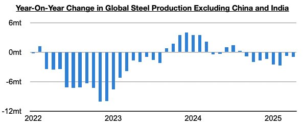

# Global Steel Production Ex-China Remains In Contraction

**Date:** May 29, 2025  
**Publisher:** Breakwave Advisors | **Category:** Market Insights  
**Original URL:** [https://www.breakwaveadvisors.com/insights/2025/5/29/global-steel-production-ex-china-remains-in-contraction](https://www.breakwaveadvisors.com/insights/2025/5/29/global-steel-production-ex-china-remains-in-contraction)  

---

*By*[*Jeffrey Landsberg*](https://www.linkedin.com/in/jeffrey-landsberg-70ab957/)

As we discussed in Commodore Research's most recent Weekly Executive Report, we continue to see considerable economic weakness (unrelated to tariffs) outside of China. For the dry market, steel production weakness, in particular, remains very significant. Global steel production outside of China has now contracted on a year-on-year basis during six of the last eight months. Taking India out of the equation, it has contracted on a year-on-year basis during all eight of these months.

> **Figure 1: Chart**  
> [Local Asset](file:///C:/Users/Dell/Github/Shipping/corpus/03-breakwave/insights/2025/assets/2025-05-29_global-steel-production-ex-china-remains-in-contraction_img_chart_17f0d6b443c2.jpg)

Overall, this contraction remains a headwind that the dry bulk market must continue to contend with. Going forward, we continue to stress that global iron ore production will continue to largely determine iron ore trade volume -- but iron ore prices will continue to largely determine global iron ore production. Weakness in steel production is not at all helpful for iron ore prices and ultimately could slow the growth in iron ore production if steel production does not rebound.

---

**Tags:** Drybulk, Economy, Markets  
