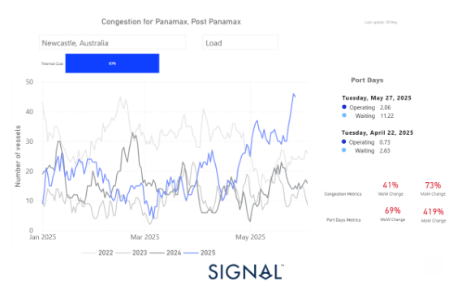
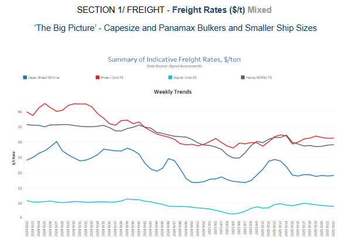
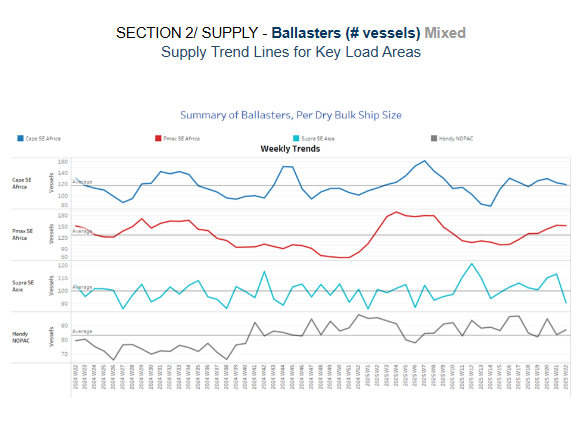
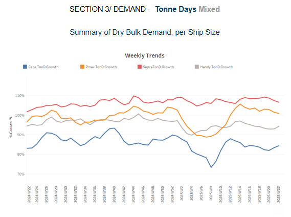
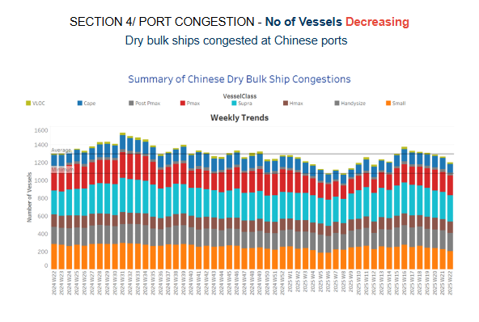

# Increased Congestion at Newcastle Dry Port

**Date:** May 29, 2025  
**Publisher:** Breakwave Advisors | **Category:** Market Insights  
**Original URL:** [https://www.breakwaveadvisors.com/insights/2025/5/29/increased-congestion-at-newcastle-dry-port](https://www.breakwaveadvisors.com/insights/2025/5/29/increased-congestion-at-newcastle-dry-port)  

---

**Dry Weekly Market Monitor - Week 22, 2025**
Snapshot of Spot Freight Rates, Supply-Demand Trends, Port Congestions
May 28, 2025

> **Figure 1: Στιγμιότυπο Οθόνης 2025 05 29 142322**  
> **Interactive Data & Source:** [Signal Ocean Platform](https://www.thesignalgroup.com/signal-ocean-platform) | [Local Asset](file:///C:/Users/Dell/Github/Shipping/corpus/03-breakwave/insights/2025/assets/2025-05-29_increased-congestion-at-newcastle-dry-port_img_cea3cf84ceb9ceb3cebcceb9cf8ccf84cf85_cc50a80eff72.png)

**This week’s Market Monitor focuses on Australian dry bulk port congestion**, following last week’s news of debris disrupting operations at Newcastle, the country’s largest thermal coal port. Newcastle’s loading port efficiency appears to be under serious turbulence due to severe rainfall leading to flooding across the Hunter River tributaries, a key region for coal mining. This has already signalled a significant impact on key congestion metrics, with an increase in port days in waiting status.

As of May 27th, congestion levels reflect the impact of extreme weather conditions, with vessel queues at Newcastle peaking at more than 40 ships waiting to load thermal coal. In addition, waiting days have surged to 11 from just 3 a month ago. Currently, congestion has spiked to levels not seen since the start of 2022.

Congestion metrics from Signal Ocean Data Port Insights record a 41% weekly increase in the number of Panamax and Post-Panamax dry bulk vessels, and a 73% monthly increase. In terms of port days metrics, there is a 69% weekly increase, while on a monthly basis, the figure has spiked, showing a 419% change.

The coming days will reveal whether this upward trend in congested volumes will persist or ease as weather conditions normalize. The recent situation underscores how severe weather can disrupt port efficiency and the importance of port infrastructure to prevent operational disruptions in the event of a natural disaster.

There remains cautious uncertainty about the immediate recovery of the increased congestion metrics. When it comes to the volume of Australian thermal coal exports, the first quarter Signal Ocean Cargo Flows Trend Analysis indicated a 12% decrease compared to the activity seen during the first quarter of the previous year, while on a monthly level, year-to-date data shows a 26% decrease. Thus, the scenario of a sustained spike in waiting port days for loading thermal coal at Newcastle seems unlikely to be maintained once the operational issues are resolved, as the monthly volume of thermal coal exports from Australia has not yet significantly increased to justify such a sharp rise in port delays. This suggests we may soon see an easing trend in Australian dry bulk port congestion.

In the scenario of a delayed resolution, the debris issue could lead to further operational inefficiencies and support an increase in loading congestion metrics at other alternative Australian ports. In the case of Australian Port Walcott, the first signs have already appeared, with a 35% increase in the number of Capesize vessels for iron ore loading and a rise in the number of waiting days to 9, up 160% on a weekly basis. Meanwhile, it is worth noting that North Chinese ports, especially Tianjin, also experienced a record spike in congestion for the Supramax vessel segment in mid-April. This was primarily due to adverse weather, particularly fog, which increased port waiting times. Fortunately, conditions have started to normalize as warmer temperatures return to Tianjin. In the large vessel size category of the VLOC, a slowdown in the number of vessels congested at Ponta da Madeira is observed at levels lower than those recorded in 2022, 2023, and 2024. For Capesize vessels, the congestion trend also indicates significantly lower volumes compared to the peak seen in March 2024, with a recent 3% monthly increase.

> **Figure 2: Στιγμιότυπο Οθόνης 2025 05 29 142439**  
> **Interactive Data & Source:** [Signal Ocean Platform](https://www.thesignalgroup.com/signal-ocean-platform) | [Local Asset](file:///C:/Users/Dell/Github/Shipping/corpus/03-breakwave/insights/2025/assets/2025-05-29_increased-congestion-at-newcastle-dry-port_img_cea3cf84ceb9ceb3cebcceb9cf8ccf84cf85_a5d0d0fbed3a.png)

Freight market sentiment for the Capesize Brazil/North China and Panamax Continent/Far East routes remained flat compared to the previous week.

- **Capesize**vessel freight rates from Brazil to North China were around $19 per tonne, showing a 4% annual decrease.
- **Panamax**vessel freight rates from the Continent remained stable at approximately $31 per tonne, mirroring the recovery seen in the third week of May. This level indicates a slight downward trend compared to the previous month, aligning with market momentum observed at the end of May in the prior year.
- **Supramax**vessel freight rates from Indonesia to the East Coast declined by 3% week-on-week, falling below $9 per tonne.
- **Handysize**vessel freight rates for the NOPAC Far East route held steady for the fourth consecutive week, continuing a modest upward trend near $29 per tonne. However, rates have not yet returned to the $30 per tonne level recorded in early April.

> **Figure 3: Στιγμιότυπο Οθόνης 2025 05 29 142527**  
> **Interactive Data & Source:** [Signal Ocean Platform](https://www.thesignalgroup.com/signal-ocean-platform) | [Local Asset](file:///C:/Users/Dell/Github/Shipping/corpus/03-breakwave/insights/2025/assets/2025-05-29_increased-congestion-at-newcastle-dry-port_img_cea3cf84ceb9ceb3cebcceb9cf8ccf84cf85_d24e8862d987.png)

The Panamax SE Africa region continues its upward trend in vessel numbers as May concludes. Conversely, the Supramax SE Asia vessel count has recently experienced a sharp decline, falling below its yearly trend.

- **Capesize, SE Africa:**The number of vessels dropped to 119, while the last bottom was seen at the end of week 15.
- **Panamax SE Africa:**The fourth decade of May held a rising trend, with the vessel count approaching nearly 150, which is nearly 20% more than the annual trend.
- **Supramax SE Asia:**The vessel count recorded a noticeable downward trend before the end of the month, and the number of vessels dropped 9 below the annual trend.
- **Handysize NOPAC:**The vessel count started to gradually move above the annual trend despite indications of a decrease at the end of the previous week; however, this does not indicate that it will spike to the high seen two weeks ago.

> **Figure 4: Στιγμιότυπο Οθόνης 2025 05 29 142629**  
> **Interactive Data & Source:** [Signal Ocean Platform](https://www.thesignalgroup.com/signal-ocean-platform) | [Local Asset](file:///C:/Users/Dell/Github/Shipping/corpus/03-breakwave/insights/2025/assets/2025-05-29_increased-congestion-at-newcastle-dry-port_img_cea3cf84ceb9ceb3cebcceb9cf8ccf84cf85_0e10620bd1d2.png)

The outlook for dry growth tonne days remained mixed, with the Capesize and Handysize vessel size segments recording a soft recovery, while a decrease persisted in the Panamax and Supramax segments

- **Capesize**: The current data confirms signs from the previous week of a soft upward trend at the end of the month, while still being lower than the peak of week 11 and significantly higher than the bottom low of week 8.
- **Panamax**: The gradual decline from the last peak of week 14 is consistent with the previous weeks of May, while still being significantly higher than the lowest point of week 8, as also highlighted in the Capesize.
- **Supramax**: Despite an elevated level, the growth rate has not shown any signs of spike since the end of week 13.
- **Handysize**: The growth rate has softened since its peak at the end of week 13, with records of a soft recovery before the end of the month.

> **Figure 5: Στιγμιότυπο Οθόνης 2025 05 29 142715**  
> **Interactive Data & Source:** [Signal Ocean Platform](https://www.thesignalgroup.com/signal-ocean-platform) | [Local Asset](file:///C:/Users/Dell/Github/Shipping/corpus/03-breakwave/insights/2025/assets/2025-05-29_increased-congestion-at-newcastle-dry-port_img_cea3cf84ceb9ceb3cebcceb9cf8ccf84cf85_b25f0ad36500.png)

Dry bulk port congestion in China continued to ease in the last week of May, with a downward trend seen in all the vessel-size segments.

- **Capesize**: Capesize vessel congestion dropped below 100 for the first time since the end of week 10.
- **Panamax**: Panamax vessel congestion continued its downward trend but at a slower pace, standing at approximately 222 vessels, just two fewer than at the end of the previous week.
- **Supramax**: The last week of May indicated levels dropping below 280, which is 14% lower than the peak of week 19.
- **Handysize**: Port congestion indicated a decrease to 200 vessels, which is 10 lower than the end of the previous week.

Data Source:[Signal Ocean Platform](https://www.thesignalgroup.com/signal-ocean-platform)

---

**Tags:** Drybulk, Shipping, Markets  
