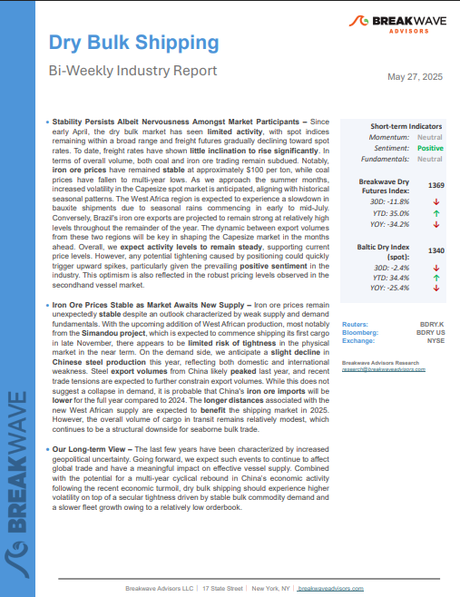
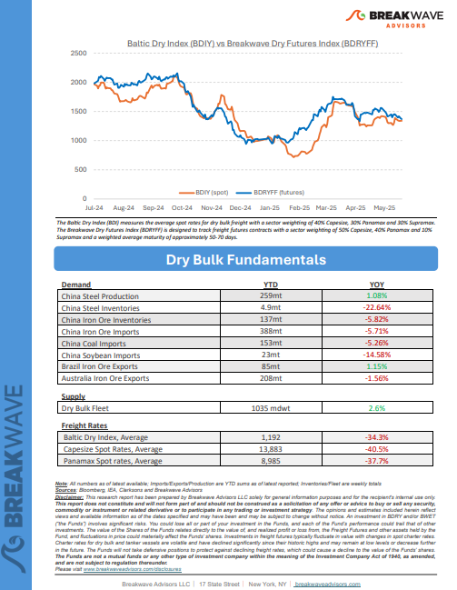
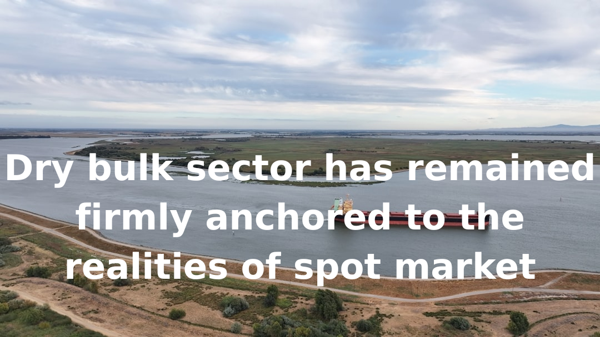

# Breakwave Weekend Read

**Date:** May 30, 2025  
**Publisher:** Breakwave Advisors | **Category:** Market Insights  
**Original URL:** [https://www.breakwaveadvisors.com/insights/2024/10/25/breakwave-weekend-read-547kk-rw7zy](https://www.breakwaveadvisors.com/insights/2024/10/25/breakwave-weekend-read-547kk-rw7zy)  

---

## Welcome Tobreakwave Advisorsweekend Read

***As the week comes to a close, take a moment to review the key insights from the past few days. Missed something? We've gathered all the top insights for you to catch up at your convenience.***

## Breakwave Shipping Report

**Stability Persists Albeit Nervousness Amongst Market Participants**– Since early April, the dry bulk market has seen**limited activity,**with spot indices remaining within a broad range and freight futures gradually declining toward spot rates.

[Read More](https://www.breakwaveadvisors.com/insights/2025527-dry5kji5547)

> **Figure 1: Στιγμιότυπο Οθόνης 2025 05 30 111454**  
> **Interactive Data & Source:** [Breakwave Advisors Market Insights](https://www.breakwaveadvisors.com/insights/2025/5/25/dry-bulk-sector-has-remained-firmly-anchored-to-the-realities-of-spot-market) | [Local Asset](file:///C:/Users/Dell/Github/Shipping/corpus/03-breakwave/insights/2025/assets/2025-05-30_breakwave-weekend-read-547kk-rw7zy_img_cea3cf84ceb9ceb3cebcceb9cf8ccf84cf85_3b060c62416b.png)

> **Figure 2: Στιγμιότυπο Οθόνης 2025 05 30 111509**  
> **Interactive Data & Source:** [Breakwave Advisors Market Insights](https://www.breakwaveadvisors.com/insights/2025/5/25/dry-bulk-sector-has-remained-firmly-anchored-to-the-realities-of-spot-market) | [Local Asset](file:///C:/Users/Dell/Github/Shipping/corpus/03-breakwave/insights/2025/assets/2025-05-30_breakwave-weekend-read-547kk-rw7zy_img_cea3cf84ceb9ceb3cebcceb9cf8ccf84cf85_bb5ad275b4dd.png)

## Dry Bulk Sector Has Remained Firmly Anchored to the Realities of Spot Market

> **Figure 3: Ανώνυμο Σχέδιο (6)**  
> **Interactive Data & Source:** [Breakwave Advisors Market Insights](https://www.breakwaveadvisors.com/insights/2025/5/25/dry-bulk-sector-has-remained-firmly-anchored-to-the-realities-of-spot-market) | [Local Asset](file:///C:/Users/Dell/Github/Shipping/corpus/03-breakwave/insights/2025/assets/2025-05-30_breakwave-weekend-read-547kk-rw7zy_img_ce91cebdcf8ecebdcf85cebccebfcf83cf87_1c22fd81d396.png)

Whilst many global markets are still trying to quantify and reassess their footing in the wake of the trade war truce, the dry bulk sector has remained firmly anchored to the realities of spot market cargo flows.

Doric Weekly Market Insights

## VLCC Tonne Days

> **Figure 4: Προσθέστε Επικεφαλίδα**  
> **Interactive Data & Source:** [Breakwave Advisors Market Insights](https://www.breakwaveadvisors.com/insights/2025/5/26/vlcc-tonne-days) | [Local Asset](file:///C:/Users/Dell/Github/Shipping/corpus/03-breakwave/insights/2025/assets/2025-05-30_breakwave-weekend-read-547kk-rw7zy_img_cea0cf81cebfcf83ceb8ceadcf83cf84ceb5_c6f6a398bc1f.png)

At the end of the third week of May, we are analysing the AG growth in tonne days within the dirty segment for VLCC tankers..

Signal Ocean Tanker Weekly Market Monitor

## Unexpected Revocation - A Guinea Tale

> **Figure 5: Ανώνυμο Σχέδιο**  
> **Interactive Data & Source:** [Breakwave Advisors Market Insights](https://www.breakwaveadvisors.com/insights/2025/5/27/unexpected-revocation-a-guinea-tale) | [Local Asset](file:///C:/Users/Dell/Github/Shipping/corpus/03-breakwave/insights/2025/assets/2025-05-30_breakwave-weekend-read-547kk-rw7zy_img_ce91cebdcf8ecebdcf85cebccebfcf83cf87_1de7c5623244.png)

Back in March, port congestion in Guinea drove a rally in Capesize freight rates as around 50 units were waiting to load at anchorages in Guinea, compared with just 25 vessels one year earlier.

BRS Weekly Dry Bulk Newsletter

## Bauxite: A Critical Raw Material

> **Figure 6: Στιγμιότυπο Οθόνης 2025 05 28 091125**  
> **Interactive Data & Source:** [Breakwave Advisors Market Insights](https://www.breakwaveadvisors.com/insights/2025/5/28/bauxite-a-critical-raw-material) | [Local Asset](file:///C:/Users/Dell/Github/Shipping/corpus/03-breakwave/insights/2025/assets/2025-05-30_breakwave-weekend-read-547kk-rw7zy_img_cea3cf84ceb9ceb3cebcceb9cf8ccf84cf85_bc07dc495e9f.png)

Guinea's military government recent decision to revoke 51 mining licenses, for bauxite, gold, diamond, graphite, and iron due to noncompliance issues underscores a growing wave of "resource nationalism" across sub-Saharan Africa.

[Read More](https://www.breakwaveadvisors.com/insights/2025/5/28/bauxite-a-critical-raw-material)

Intermodal Weekly Market Report

## Increased Congestion at Newcastle Dry Port

> **Figure 7: Ανώνυμο Σχέδιο (1)**  
> **Interactive Data & Source:** [Breakwave Advisors Market Insights](https://www.breakwaveadvisors.com/insights/2025/5/29/increased-congestion-at-newcastle-dry-port) | [Local Asset](file:///C:/Users/Dell/Github/Shipping/corpus/03-breakwave/insights/2025/assets/2025-05-30_breakwave-weekend-read-547kk-rw7zy_img_ce91cebdcf8ecebdcf85cebccebfcf83cf87_513242d621a5.png)

This week’s Market Monitor focuses on Australian dry bulk port congestion, following last week’s news of debris disrupting operations at Newcastle, the country’s largest thermal coal port.

Signal Ocean Dry Weekly Market Monitor

## Global Steel Production Ex-China Remains in Contraction

> **Figure 8: Προσθέστε Επικεφαλίδα (1)**  
> **Interactive Data & Source:** [Breakwave Advisors Market Insights](https://www.breakwaveadvisors.com/insights/2025/5/29/global-steel-production-ex-china-remains-in-contraction) | [Local Asset](file:///C:/Users/Dell/Github/Shipping/corpus/03-breakwave/insights/2025/assets/2025-05-30_breakwave-weekend-read-547kk-rw7zy_img_cea0cf81cebfcf83ceb8ceadcf83cf84ceb5_862fed177240.png)

We continue to see considerable economic weakness (unrelated to tariffs) outside of China.

From Commodore's Weekly Dry Bulk Reports

## Tariffs Halted?

> **Figure 9: Ανώνυμο Σχέδιο (2)**  
> **Interactive Data & Source:** [Breakwave Advisors Market Insights](https://www.breakwaveadvisors.com/insights/2025/5/29/tariffs-halted) | [Local Asset](file:///C:/Users/Dell/Github/Shipping/corpus/03-breakwave/insights/2025/assets/2025-05-30_breakwave-weekend-read-547kk-rw7zy_img_ce91cebdcf8ecebdcf85cebccebfcf83cf87_21d3edc04c79.png)

The US Court of International Trade deemed the tariffs illegal under the International Emergency Economic Powers Act.

Forvis Mazars Weekly Note

## Coal Power Expansion — China in Global Context

> **Figure 10: Unsplash Image 9v Nork6p1w**  
> **Interactive Data & Source:** [Breakwave Advisors Market Insights](https://www.breakwaveadvisors.com/insights/2025/5/30/coal-power-expansion-china-in-global-context) | [Local Asset](file:///C:/Users/Dell/Github/Shipping/corpus/03-breakwave/insights/2025/assets/2025-05-30_breakwave-weekend-read-547kk-rw7zy_img_unsplash-image-9v-nork6p1w_4f61dd8914c5.jpg)

As the world grapples with intensifying climate and energy challenges, the future of coal remains a critical issue.

Allied Weekly Report

## Copper Gains Amid Signs of Stronger Demand

> **Figure 11: Ανώνυμο Σχέδιο (3)**  
> **Interactive Data & Source:** [Breakwave Advisors Market Insights](https://www.breakwaveadvisors.com/insights/2025/5/30/copper-gains-amid-signs-of-stronger-demand) | [Local Asset](file:///C:/Users/Dell/Github/Shipping/corpus/03-breakwave/insights/2025/assets/2025-05-30_breakwave-weekend-read-547kk-rw7zy_img_ce91cebdcf8ecebdcf85cebccebfcf83cf87_6b6fae9761b4.png)

A weaker USD helped boost investor appetite in commodities. However, uncertainty over US trade policies kept the gains limited.

Commodities Wrap

## Dirty Oil Flows Shift

> **Figure 12: Dirty Oil Flows Shift**  
> **Interactive Data & Source:** [Breakwave Advisors Market Insights](https://www.breakwaveadvisors.com/insights/2025/5/30/dirty-oil-flows-shift) | [Local Asset](file:///C:/Users/Dell/Github/Shipping/corpus/03-breakwave/insights/2025/assets/2025-05-30_breakwave-weekend-read-547kk-rw7zy_img_dirtyoilflowsshift_6e6e22a0ccb6.png)

Europe witnessed a 10% increase in crude oil imports in May 2025, likely due to refineries completing maintenance ahead of schedule, boosting crude demand.

Signal Ocean Tanker Weekly Market Monitor

---

**Tags:** Shipping, Tankers, Drybulk  
