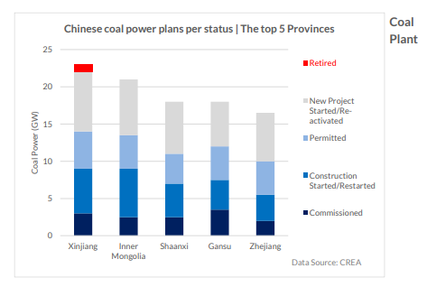
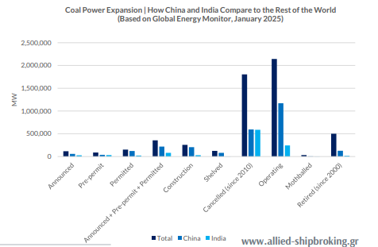

# Coal Power Expansion — China in Global Context

**Date:** May 30, 2025  
**Publisher:** Breakwave Advisors | **Category:** Market Insights  
**Original URL:** [https://www.breakwaveadvisors.com/insights/2025/5/30/coal-power-expansion-china-in-global-context](https://www.breakwaveadvisors.com/insights/2025/5/30/coal-power-expansion-china-in-global-context)  

---

As the world grapples with intensifying climate and energy challenges, the future of coal remains a critical issue. Despite global momentum toward decarbonization, recent developments in China reveal that coal continues to play an evolving role in the nation’s energy mix. This raises the question: are there meaningful steps toward a greener future that signal a transition to less coal power and more renewable energy? This analysis examines the expansion of coal power in China and India within a global context, drawing on data from the Global Coal Data Tracker to understand the current coal landscape.

### Continued Coal Plant Construction, But with Lower Emissions

China has committed to building coal-fired power plants through at least 2027. However, these new plants must be cleaner and more flexible than their predecessors. Specifically, the new fleet is expected to emit 10–20% less carbon per unit of power output compared to existing plants. Crucially, they must also be capable of adjusting their output to meet peak power demand.

### Ongoing Investment in Coal Infrastructure, with Signs of a Structural Shift

Thermal power generation—primarily coal-based—recorded a 2.3% decline in April and a 4.1% decrease from January to April 2025, according to Reuters (May 19, 2025). Does this suggest coal may be losing its role as the backbone of China’s power system? At the same time, China—the world’s secondlargest economy—achieved significant renewable energy milestones, with solar and wind power growing by 45% and 18% year-on-year, respectively, according to China’s National Energy Administration.

> **Figure 1: Στιγμιότυπο Οθόνης 2025 05 30 115338**  
> **Interactive Data & Source:** [Allied-shipbroking](https://www.allied-shipbroking.gr/) | [Local Asset](file:///C:/Users/Dell/Github/Shipping/corpus/03-breakwave/insights/2025/assets/2025-05-30_coal-power-expansion-china-in-global-context_img_cea3cf84ceb9ceb3cebcceb9cf8ccf84cf85_a37620877719.png)

### Utilization at a Record Low

Interestingly, while new coal capacity is being added, it is not being used intensively. Instead, these plants are increasingly serving as backup to ensure grid reliability when renewable sources underperform. According to Climate Energy Finance, the average coal plant in China operated at a record -low utilization rate of 46% during the first four months of 2025.

### What’s Next?

China appears to be reassessing coal’s role as part of a transitional strategy— managing new capacity with a greener outlook, rather than simply expanding fossil fuel use. While coal is gradually fading from its traditional "king" status, it remains a strategic pillar in China’s energy system. In the coming years, the key question will not be whether coal is disappearing, but how its role is being reshaped as China works toward its environmental sustainability goals.

The data in the chart below illustrate the global landscape of coal power development as of January 2025, with a particular focus on China and India.

- **Announced Projects:**China accounts for 50% of global announced coal projects, while India makes up 23%.
- **Pre-permit Stage:**China holds 43% of global projects in the prepermit stage, compared to India’s 37%.
- **Permitted Projects:**China represents 80% of permitted projects, while, India accounts for only 15%.
- **Construction:**China leads with 80% of global coal capacity under construction, while India holds 10%.
- **Operational Capacity:**China dominates global coal plant operations with 55% of existing capacity, while India holds 11%, showing a significant difference in existing infrastructure
- **Shelved and Cancelled Projects:**China accounts for 66% of shelved capacity and 32% of cancelled projects since 2010.
- **Retired and Mothballed Plants:**China has retired 25% of global coal plants since 2000 and mothballed 10%. India, by contrast, has retired only 3% and mothballed 2%, indicating a relatively slower phase-out process.

> **Figure 2: Στιγμιότυπο Οθόνης 2025 05 30 115707**  
> **Interactive Data & Source:** [Allied-shipbroking](https://www.allied-shipbroking.gr/) | [Local Asset](file:///C:/Users/Dell/Github/Shipping/corpus/03-breakwave/insights/2025/assets/2025-05-30_coal-power-expansion-china-in-global-context_img_cea3cf84ceb9ceb3cebcceb9cf8ccf84cf85_b2a9c6e5b81d.png)

Data Source:[Allied](https://www.allied-shipbroking.gr/)

---

**Tags:** Coal, Drybulk, Shipping  
