# Dirty Oil Flows Shift

**Date:** May 30, 2025  
**Publisher:** Breakwave Advisors | **Category:** Market Insights  
**Original URL:** [https://www.breakwaveadvisors.com/insights/2025/5/30/dirty-oil-flows-shift](https://www.breakwaveadvisors.com/insights/2025/5/30/dirty-oil-flows-shift)  

---

### Tanker - Weekly Market Monitor

Snapshot of Crude and Product Freight Rates, Supply-Demand

Week 22, 30 May, 2025

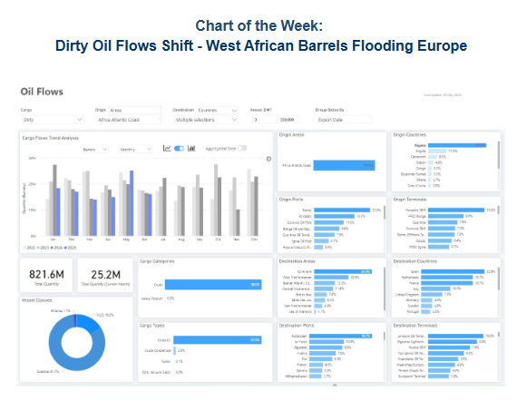

> **Figure 1: Στιγμιότυπο Οθόνης 2025 05 30 160048**  
> **Interactive Data & Source:** [Signal Ocean Platform](https://www.thesignalgroup.com/signal-ocean-platform) | [Local Asset](file:///C:/Users/Dell/Github/Shipping/corpus/03-breakwave/insights/2025/assets/2025-05-30_dirty-oil-flows-shift_img_cea3cf84ceb9ceb3cebcceb9cf8ccf84cf85_6b70c2167074.png)

Europe witnessed a 10% increase in crude oil imports in May 2025, likely due to refineries completing maintenance ahead of schedule, boosting crude demand. This period also saw a notable change in import origins, with a decrease in volumes from the United States.

Crude imports from West Africa, especially Nigeria, are estimated to have surged by 70%. Similarly, imports from Libya and Algeria increased by 20% and 70%, respectively. These regions primarily supply light sweet crude, leading to a temporary oversupply of this grade in Europe.

One potential factor contributing to this shift is Nigeria's Dangote Refinery. It canceled a planned maintenance for its gasoline-producing unit and instead conducted necessary repairs during an unplanned outage in April and early May, allowing for a quick resumption of operations.

This change in sourcing had two main effects. First, it reduced U.S. crude exports to Europe, particularly WTI, amid rising domestic demand and improved U.S. Gulf Coast refinery runs. Second, the shorter distances from West and North Africa to Europe compared to transatlantic voyages from the U.S. resulted in decreased tonne-miles, despite strong crude demand. Consequently, the reduction in long-haul shipments has put downward pressure on the dirty tanker market, particularly the VLCC and Suezmax segments, contributing to the current bearish market sentiment.

Looking forward, the price difference between WTI and Nigeria's Bonny Light crude will be a key factor for European buyers. As of late May 2025, Bonny Light was priced around $66 per barrel, up from an average of $60 earlier in the month but still below Nigeria's 2025 budget benchmark of $75. In comparison, WTI was trading at approximately $60.63 per barrel on May 30. While West African crude has recently gained market share in Europe, the relatively lower price of U.S. light sweet crude could make American barrels more attractive again.

### Special Focus: Tanker Sanctions

A key factor tightening crude tanker availability in 2025 is the latest wave of EU and UK sanctions targeting the so-called “extra-sanctioned” fleet. As illustrated in the accompanying chart, the number of sanctioned tankers has risen consistently this year, with a sharp acceleration since mid-2025, driving a 248% year-on-year increase.

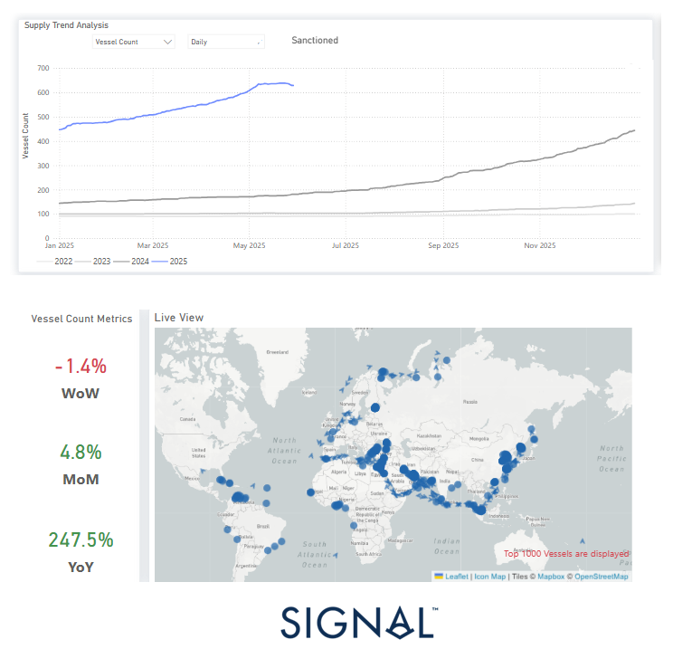

> **Figure 2: Market Chart 2**  
> **Interactive Data & Source:** [Signal Ocean Platform](https://www.thesignalgroup.com/signal-ocean-platform) | [Local Asset](file:///C:/Users/Dell/Github/Shipping/corpus/03-breakwave/insights/2025/assets/2025-05-30_dirty-oil-flows-shift_img_unnamed_61e13e36c6a5.png)

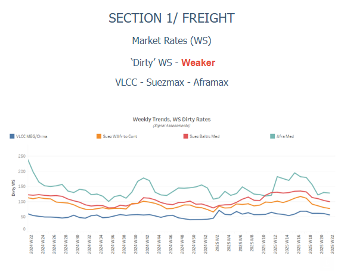

> **Figure 3: Στιγμιότυπο Οθόνης 2025 05 30 160220**  
> **Interactive Data & Source:** [Signal Ocean Platform](https://www.thesignalgroup.com/signal-ocean-platform) | [Local Asset](file:///C:/Users/Dell/Github/Shipping/corpus/03-breakwave/insights/2025/assets/2025-05-30_dirty-oil-flows-shift_img_cea3cf84ceb9ceb3cebcceb9cf8ccf84cf85_acdd5d91d47c.png)

The Baltic Dirty Tanker Index (BDTI) has fallen by 25% compared to last year. This downward trend is influenced by increasing net supply in the Arabian Gulf, particularly impacting VLCC AG-China rates. The anticipated summer season is expected to further pressure the dirty oil freight market due to the ongoing mismatch between projected global oil supply and demand. This broader weakness is also reflected across specific vessel classes and routes.

- VLCC freight rates on the MEG–China route have dropped to WS 54, down 11% week-on-week and 20% lower than at the end of May 2020. Suezmax rates on the West Africa–Europe route stand at WS 80, representing a 30% monthly decrease, while Baltic–Mediterranean rates have fallen below WS 98, down 28% over the same period. In contrast, Aframax rates in the Mediterranean have shown tentative signs of a rebound at WS 125, though still 7% lower on a weekly basis.

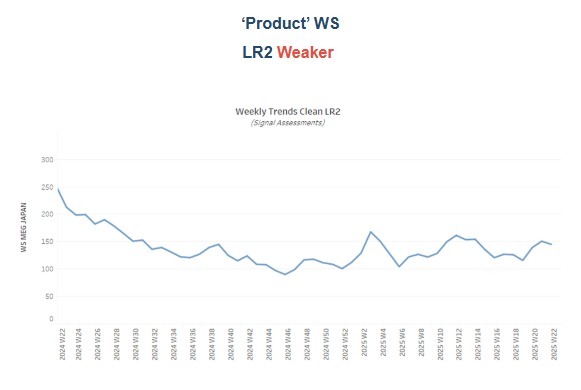

> **Figure 4: Στιγμιότυπο Οθόνης 2025 05 30 160451**  
> **Interactive Data & Source:** [Signal Ocean Platform](https://www.thesignalgroup.com/signal-ocean-platform) | [Local Asset](file:///C:/Users/Dell/Github/Shipping/corpus/03-breakwave/insights/2025/assets/2025-05-30_dirty-oil-flows-shift_img_cea3cf84ceb9ceb3cebcceb9cf8ccf84cf85_d829c0544434.png)

- **LR2**clean freight rates on the AG route rose to WS138. While this reflects an 11% weekly decline, rates are up 8% compared to a month ago, indicating signs of a rebound. The upward momentum appears to be supported by a recent drop in vessel availability in the Arabian Gulf, observed during the final days of May.

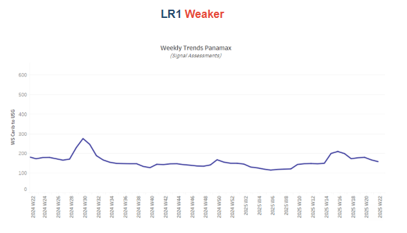

> **Figure 5: Στιγμιότυπο Οθόνης 2025 05 30 160544**  
> **Interactive Data & Source:** [Signal Ocean Platform](https://www.thesignalgroup.com/signal-ocean-platform) | [Local Asset](file:///C:/Users/Dell/Github/Shipping/corpus/03-breakwave/insights/2025/assets/2025-05-30_dirty-oil-flows-shift_img_cea3cf84ceb9ceb3cebcceb9cf8ccf84cf85_66132994673b.png)

- **Panamax**Carib-to-USG rates declined to WS150, continuing the weakening trend seen since last week. This level is 8% lower than a month ago, with further downside potential linked to decreasing dirty tonne-days for Panamax vessels from the Caribbean. In May, tonne-day levels to all destinations, including the USG, have dropped below those recorded in both 2023 and 2024, signaling weaker underlying demand.

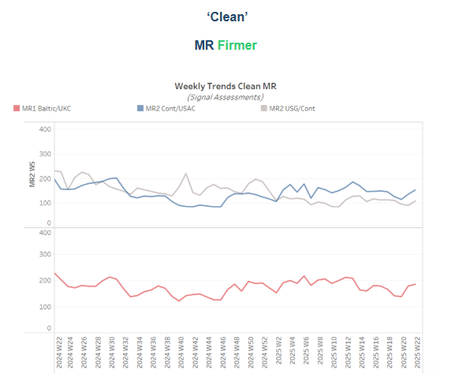

> **Figure 6: Στιγμιότυπο Οθόνης 2025 05 30 160632**  
> **Interactive Data & Source:** [Signal Ocean Platform](https://www.thesignalgroup.com/signal-ocean-platform) | [Local Asset](file:///C:/Users/Dell/Github/Shipping/corpus/03-breakwave/insights/2025/assets/2025-05-30_dirty-oil-flows-shift_img_cea3cf84ceb9ceb3cebcceb9cf8ccf84cf85_190bfb018d6e.png)

- **Baltic-to-Continent MR1**freight rates remained steady around WS180, continuing last week's positive trend and showing a 7% increase for the month. Despite this, the outlook for June is unclear due to an anticipated rise in vessel supply above the yearly average by the close of May.**Continent-to-USAC MR2**freight rates increased to WS158, a 5% weekly gain. This rise is highly attributed to stronger clean tonne-day growth in the MR2 sector compared to MR1, alongside decreased vessel activity in Amsterdam.

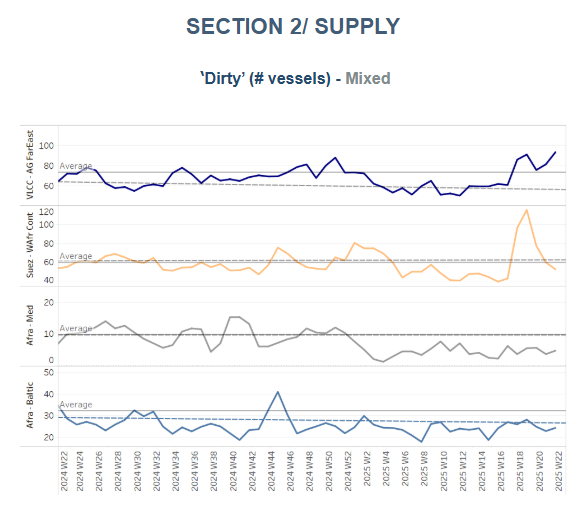

> **Figure 7: Στιγμιότυπο Οθόνης 2025 05 30 160741**  
> **Interactive Data & Source:** [Signal Ocean Platform](https://www.thesignalgroup.com/signal-ocean-platform) | [Local Asset](file:///C:/Users/Dell/Github/Shipping/corpus/03-breakwave/insights/2025/assets/2025-05-30_dirty-oil-flows-shift_img_cea3cf84ceb9ceb3cebcceb9cf8ccf84cf85_9e7893b186bf.png)

The bearish outlook for VLCC crude oil freight is reinforced by a surge in vessel availability in the Arabian Gulf. For the last four weeks, cargo volumes have consistently lagged behind vessel activity, indicating that a swift rebound seems unlikely.

- In the VLCC sector, the number of vessels at Ras Tanura has climbed to roughly 93, approximately 20 above the yearly average, increasing tonnage pressure in the area. Conversely, the Suezmax sector in West Africa (WAFR) experienced a jump in vessel numbers at the close of Week 19, but levels have since decreased, recently dropping below the annual average of 60. Aframax availability in the Mediterranean and Baltic regions remains significantly limited, with current figures still considerably lower than the historical benchmark of 10.

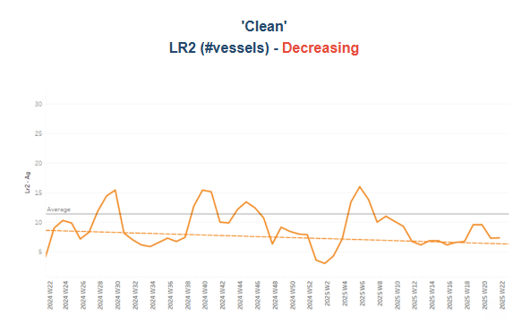

> **Figure 8: Στιγμιότυπο Οθόνης 2025 05 30 160833**  
> **Interactive Data & Source:** [Signal Ocean Platform](https://www.thesignalgroup.com/signal-ocean-platform) | [Local Asset](file:///C:/Users/Dell/Github/Shipping/corpus/03-breakwave/insights/2025/assets/2025-05-30_dirty-oil-flows-shift_img_cea3cf84ceb9ceb3cebcceb9cf8ccf84cf85_4f535459c150.png)

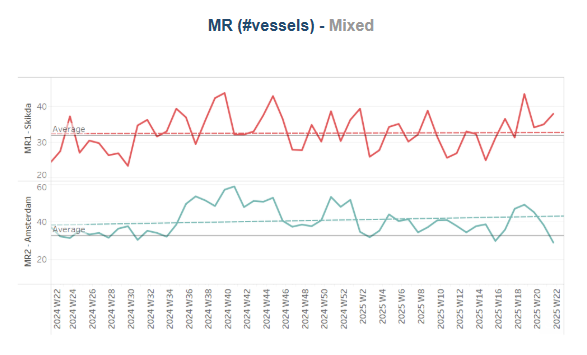

> **Figure 9: Στιγμιότυπο Οθόνης 2025 05 30 160839**  
> **Interactive Data & Source:** [Signal Ocean Platform](https://www.thesignalgroup.com/signal-ocean-platform) | [Local Asset](file:///C:/Users/Dell/Github/Shipping/corpus/03-breakwave/insights/2025/assets/2025-05-30_dirty-oil-flows-shift_img_cea3cf84ceb9ceb3cebcceb9cf8ccf84cf85_c3f24110d984.png)

- Clean tanker supply showed signs of tightening in**Jubail for LR2 vessels**and in**Amsterdam for the MR2**segment toward the end of May. In both regions, ship counts fell below their respective annual averages, with LR2 vessel count volume in the AG notably weak.

- In contrast, MR1 vessel activity at Skikda has remained elevated. May ended with ship counts around 38, roughly six above the annual average of 32, following a notable spike during Week 19. This heightened availability could exert downward pressure on WS rate assessments in the coming weeks.

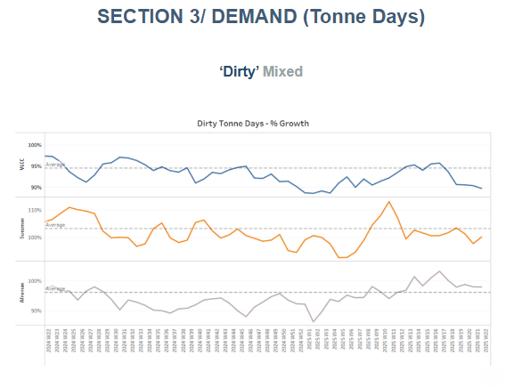

> **Figure 10: Στιγμιότυπο Οθόνης 2025 05 30 160942**  
> **Interactive Data & Source:** [Signal Ocean Platform](https://www.thesignalgroup.com/signal-ocean-platform) | [Local Asset](file:///C:/Users/Dell/Github/Shipping/corpus/03-breakwave/insights/2025/assets/2025-05-30_dirty-oil-flows-shift_img_cea3cf84ceb9ceb3cebcceb9cf8ccf84cf85_e4f7a53a1f37.png)

- **Dirty**tonne days: The seasonal development of dirty tonne days remains below the growth rates observed in 2023 and early 2024, largely due to continued weakness in the VLCC segment. In the Suezmax segment, growth has been more volatile, with a mild uptick observed mid-March. In contrast, the Aframax segment is maintaining weekly growth slightly above its historical average over the past month.

- The IEA revised its oil demand growth projections downward in mid-May, emphasizing a surplus between supply and demand. With demand growth now expected to average 760,000 barrels per day and supply rising by 970,000 barrels per day, this imbalance is likely to continue weighing on the development of tanker tonne days, particularly in the dirty segment.

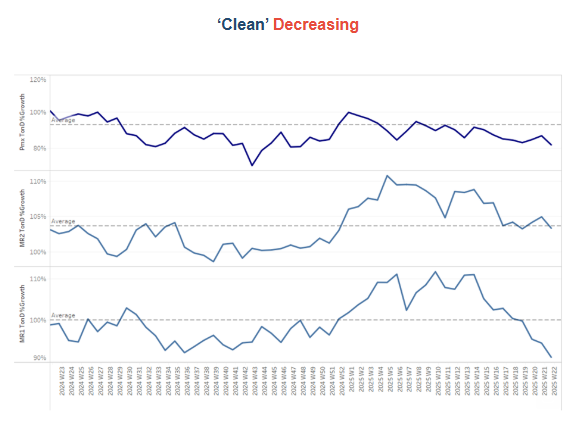

> **Figure 11: Στιγμιότυπο Οθόνης 2025 05 30 161047**  
> **Interactive Data & Source:** [Signal Ocean Platform](https://www.thesignalgroup.com/signal-ocean-platform) | [Local Asset](file:///C:/Users/Dell/Github/Shipping/corpus/03-breakwave/insights/2025/assets/2025-05-30_dirty-oil-flows-shift_img_cea3cf84ceb9ceb3cebcceb9cf8ccf84cf85_71077d264c92.png)

- **Panamax**tonne days: The seasonal development of tonne days in the Panamax tanker vessel size category for the clean cargo type continues the decrease seen since the end of mid-March, with gasoil recently indicating extremely low levels of growth rates.

- **MR**tonne-days: The seasonal development of tonne-days in the MR tanker vessel size segment for clean cargo is currently at significantly reduced levels for the MR1 segment, primarily due to weak gasoline demand. In contrast, the MR2 vessel size is performing more steadily than MR1, with growing expectations of a stronger showing in the summer, driven by typically higher travel demand and the seasonal refinery switch to summer gasoline blends.

Data Source:[Signal Ocean Platform](https://www.thesignalgroup.com/signal-ocean-platform)

---

**Tags:** Tankers, Markets, Crude  
