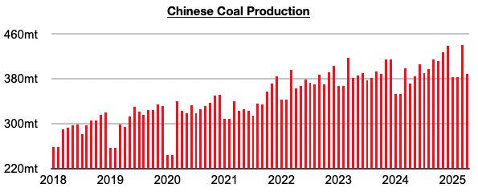
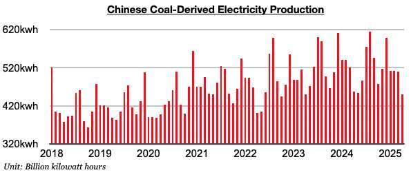

# China's Coal Import Prospects For This Year Remain Bleak

**Date:** June 02, 2025  
**Publisher:** Breakwave Advisors | **Category:** Market Insights  
**Original URL:** [https://www.breakwaveadvisors.com/insights/2025/6/1/chinas-coal-import-prospects-for-this-year-remain-bleak](https://www.breakwaveadvisors.com/insights/2025/6/1/chinas-coal-import-prospects-for-this-year-remain-bleak)  

---

*By*[*Jeffrey Landsberg*](https://www.linkedin.com/in/jeffrey-landsberg-70ab957/)

As we discussed for clients in Commodore Research's most recent Weekly China Report, domestic coal production totaled 389.3 million tons in April. This is down month-on-month by 51.3 million tons (-12%), is up year-on-year by 17.6 million tons (5%), and marks an eleventh straight month where China's coal production has grown on a year-on-year basis.

> **Figure 1: Chart 1**  
> [Local Asset](file:///C:/Users/Dell/Github/Shipping/corpus/03-breakwave/insights/2025/assets/2025-06-02_chinas-coal-import-prospects-for-this-year-remain-bleak_img_chart1_ef912c9d0e6e.jpg)

Coal-derived electricity generation totaled only 449.1 billion kilowatt hours. This is down month-on-month by 60.8 billion kilowatt hours (-12%) and is down year-on-year by 8.8 billion kilowatt hours (-2%).

> **Figure 2: Chart 2**  
> [Local Asset](file:///C:/Users/Dell/Github/Shipping/corpus/03-breakwave/insights/2025/assets/2025-06-02_chinas-coal-import-prospects-for-this-year-remain-bleak_img_chart2_4ccdf1e5ef18.jpg)

Overall, it remains problematic for China's coal import demand prospects that coal-derived electricity generation has again fared worse than coal output. This has now occurred for seven straight months (and during each of the last five months, coal-derived electricity generation has contracted on a year-on-year basis). As we continue to discuss in Commodore Research's Weekly China Reports and Weekly Executive Reports, we remain bearish for China’s 2025 coal import prospects.

---

**Tags:** Coal, China, Drybulk  
