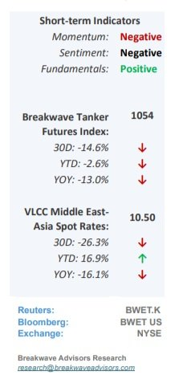
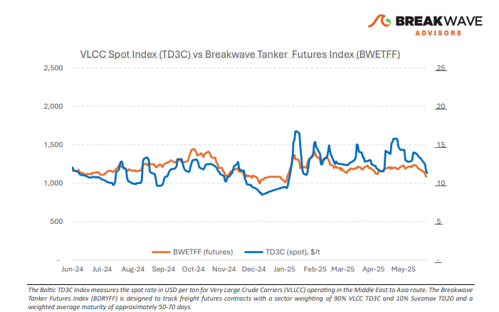
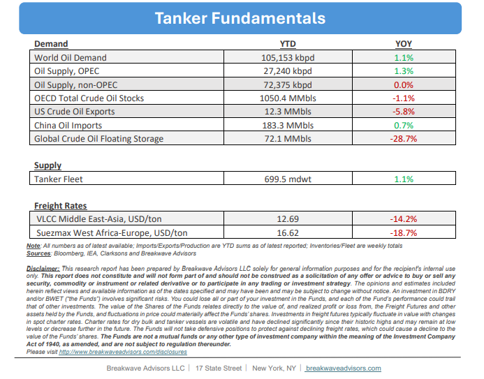

# Breakwave Bi-Weekly Tanker Report - June 3, 2025

**Date:** June 03, 2025  
**Publisher:** Breakwave Advisors | **Category:** Market Insights  
**Original URL:** [https://www.breakwaveadvisors.com/insights/2025306wet855jjej587](https://www.breakwaveadvisors.com/insights/2025306wet855jjej587)  

---

•**VLCC Market Under Pressure Amid Summer Lull and Weak Demand**– Despite some mid-May signs of rate stabilization that briefly lifted sentiment, the end of May paints a negative picture for the**VLCC freight market**across both Eastern and Western routes. Spot rates for MEG/China and West Africa/China declined by double digits, reflecting a broader bearish trend as the market transitions into the**traditional summer demand lull**. However, attention now turns to the recently announced**OPEC+ decision to increase production**by 411,000 barrels per day in July, the third consecutive monthly hike. If these additional barrels materialize in the physical market, they could offer much-needed support for VLCC fleet utilization, which currently remains flat. As a result, a**tightening of the tonnage list**is not expected to materialize in early June, but the OPEC+ output decision introduces a potentially supportive factor for vessel demand in the weeks ahead. In related developments, recent reports highlighted the**more competitive pricing**of Saudi Arabian light crude, which may stimulate Chinese demand in the near term. According to a Reuters survey of four Asian refining sources, Arab Light prices are expected to drop by $0.40–0.50 per barrel, settling at $0.90–$1.00/bbl lower than the previous month. This would represent the lowest pricing level for Arab Light since January reflecting, and in our view, a**weaker demand outlook that requires price concessions**. However, in the near term, the ongoing mismatch between vessel availability and demand continues to weigh on VLCC earnings across the board.

> **Figure 1: %Ce%a3%cf%84%ce%b9%ce%b3%ce%bc%ce%b9%cf%8c%cf%84%cf%85%cf%80%ce%bf+%ce%bf%ce%b8%cf%8c%ce%bd%ce%b7%cf%82+2025 06 02+223708**  
> [Local Asset](file:///C:/Users/Dell/Github/Shipping/corpus/03-breakwave/insights/2025/assets/2025-06-03_2025306wet855jjej587_img_25ce25a325cf258425ce25b925ce25b325ce_4f50e0e5e8a5.jpg)

•**Geopolitics and Fundamentals Continue to Drive Volatility in Oil**– Despite relatively**weak fundamentals**in the oil markets, prices have stabilized around the mid-$60 per barrel range for Brent. This resilience occurs amid increased**geopolitical uncertainties**and the first significant supply increase by OPEC+ in several years. Key factors influencing the market remain the escalation of the**Russia-Ukraine**conflict and ongoing negotiations between the**U.S. and Iran**. Currently, the additional OPEC+ supply volumes and the subdued demand outlook from China have taken a backseat in traders’ considerations. The past few years have been marked by**unexpected and highly impactful events**in the oil market, making it prudent for energy investors to adopt a cautious stance regarding definitive forecasts of price direction. While the ongoing increase in OPEC+ supply is concerning amid a generally weak demand environment, this information is widely known and clearly reflected in market prices. Consequently, the primary uncertainty lies in potential unexpected supply disruptions, which continue to sustain the geopolitical premium in oil prices.

•**Our Long-term View**– The tanker market is recovering from a long period of staggered rates as the growth in new vessel supply shrinks while oil demand remains elevated in line with the global economy. A historically low orderbook combined with favorable shifting trade patterns should continue to support increased spot rate volatility, which combined with the ongoing geopolitical turmoil, should sustain freight rates in the medium to long term.

> **Figure 2: Στιγμιότυπο Οθόνης 2025 06 02 223536**  
> [Local Asset](file:///C:/Users/Dell/Github/Shipping/corpus/03-breakwave/insights/2025/assets/2025-06-03_2025306wet855jjej587_img_cea3cf84ceb9ceb3cebcceb9cf8ccf84cf85_5ad647bca8c2.png)

> **Figure 3: Στιγμιότυπο Οθόνης 2025 06 02 223546**  
> [Local Asset](file:///C:/Users/Dell/Github/Shipping/corpus/03-breakwave/insights/2025/assets/2025-06-03_2025306wet855jjej587_img_cea3cf84ceb9ceb3cebcceb9cf8ccf84cf85_e6ca7e4a0042.png)

### Subscribe:
