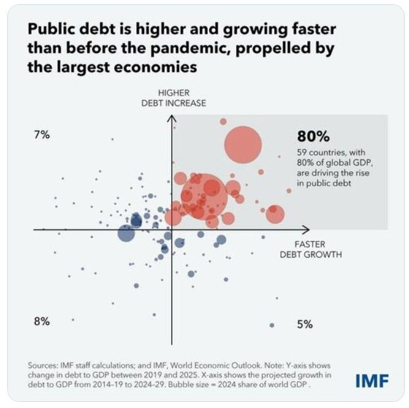
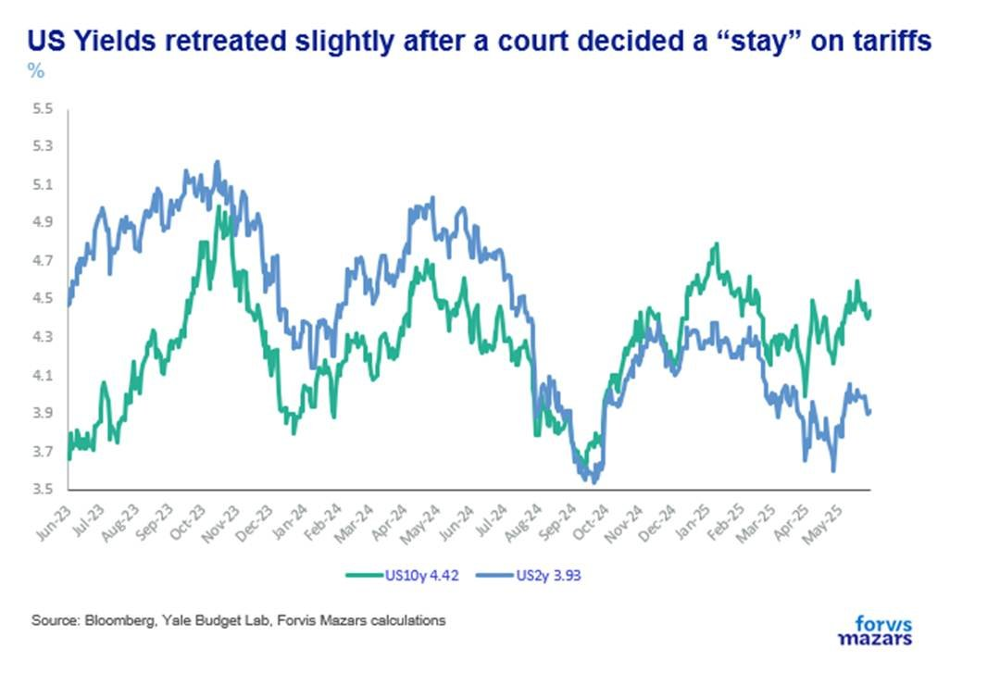
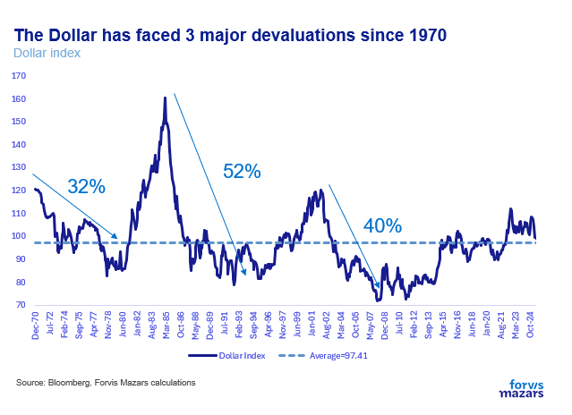
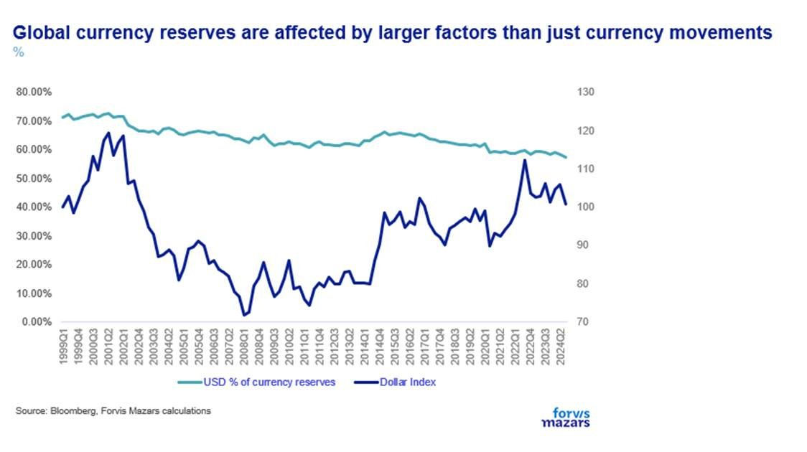

# Dollar devaluation does not mean Dollar catastrophe

**Date:** June 03, 2025  
**Publisher:** Breakwave Advisors | **Category:** Market Insights  
**Original URL:** [https://www.breakwaveadvisors.com/insights/2025/6/3/dollar-devaluation-does-not-mean-dollar-catastrophe](https://www.breakwaveadvisors.com/insights/2025/6/3/dollar-devaluation-does-not-mean-dollar-catastrophe)  

---

The three things investors need to know this week

1. **We acknowledge that risks are rising as a result of the trade war and higher debt, but we believe that they are manageable as long as we accept that we live in a more volatile world.**
2. **While the warnings about the US economy are all too real investors and businesses would do well to remember that in this, monetary, world, central banks can absorb a lot of the economic and financial shocks.**
3. **Currency devaluation is the major course open for the government which faces a rapid debt build-up and wants to reduce its trade deficit. But that doesn’t mean the end of the dollar’s reserve currency status.**

*By*[*George Lagarias*](https://www.linkedin.com/in/george-lagarias-mba-3baa769/)

-------------------------------------

Summary

In the last few weeks we have seen the conversation drift away from tariffs and towards the more pressing issue of debt market dislocations. Many prominent economists and business leaders warn of dislocations in the global bond market. We believe that businesses and investors need to accept that the world going forward will be more volatile and unpredictable. However, a clear pattern begins to emerge. The Fed can mitigate some of the economic shocks and stabilise bond markets. To do this, however, it needs to print money, which means further pressuring the dollar down. So far the dollar index (against a basket of currencies) has lost 8% from its peak. This would not necessarily be incompatible with the White House’s aspirations of reducing the debt in real terms, reducing the trade deficit and rekindling manufacturing. Nor would it necessarily threaten the global currency reserve status of the Greenback.

-------------------------------

In the past weeks, we have heard many warnings coming from eminent personalities of the business, economic and financial world. Jamie Dimon, CEO of JP Morgan warned of “Cracks in the bond market that are going to happen”. Maurice Obstfeld, former Chief Economist of the IMF, as well as Nobel Laureates Paul Krugman and Joseph Stiglitz, suggested that the US is both in for higher inflation and much slower economic growth. Kenneth Rogoff, Chair of International Economics at Harvard (and Chess Grandmaster at 25), warned that the White House has “accelerated the dollar's decline and brings us closer to the day when US debt triggers a crisis”.

*Is it really that bad?*

Well yes and no. It all sounds very horrible until we begin acknowledging higher uncertainty and volatility as part of the course. We, as in my generation, have spent many years in the “Great Moderation”, a time when inflation exported from China lowered macroeconomic volatility, making the life of central bankers a lot easier. After globalisation peaked, around 2008-09, and following the disruption of the Global Financial Crisis, central banks made sure market volatility was repressed along with economic volatility. Between 2009 and 2022, the Federal Reserve suppressed both the short and the long end of the yield curve, printing money at any sign of distress, essentially treating investors as a group that needed to re-learn to take risks in baby steps.

While that crutch was violently removed after 2022, when inflation forced a series of rate hikes and the demolition (for lack of a better word) of a 30-year bull market in bonds,**we still, to this day, remain a generation of investors and business people whom market and economic volatility are the exception, not the norm.**

Our Chief Investment Officer,[Ben Seager-Scottt](https://www.linkedin.com/in/benseagerscott/), and I, have often noted that the “New Normal” is actually a return of the “old” normal, when China was no longer exporting so much deflation to the world (it still does up to a point) and when central banks would not print billions responding to every impulse from the equity and the bond markets. A time when investors and businesses built plans expecting and preparing for the unexpected, and treating volatility as an opportunity as much as a threat. “Resilience”, which might have been too expensive in a low-tariff, just-in-time-inventory world, is key in this environment. It would be naïve to expect a return to a low volatility environment when global debt grows at the present alarming pace, pressuring economies across the globe.

> **Figure 1: Market Chart 1**  
> [Local Asset](file:///C:/Users/Dell/Github/Shipping/corpus/03-breakwave/insights/2025/assets/2025-06-03_dollar-devaluation-does-not-mean-dollar-catastrophe_img_image001_9d38ad0afa36.jpg)

**We have, in our previous publications, factored in lower US and global growth, and higher US inflation. The likelihood of both increases significantly in the third quarter of the year when pre-tariff inventories begin to run out. As such, market volatility is also part of the course.**

At the time of writing,**the assumption that by then the trade war will be over (despite last week’s initial ruling against tariffs ) seems excessively optimistic, as the US government seems intent on raising money from tariffs and using access to the US consumer (as well as security) as bargaining chips for future trade deals. This trade war should not be seen as one man’s folly but rather as fuelled by large geopolitical and geoeconomic themes, like the inevitable clash between two superpowers (US and China) and the debt build-up.**

> **Figure 2: Market Chart 2**  
> [Local Asset](file:///C:/Users/Dell/Github/Shipping/corpus/03-breakwave/insights/2025/assets/2025-06-03_dollar-devaluation-does-not-mean-dollar-catastrophe_img_image005_f17d563fb722.jpg)

To be sure, elevated inflation makes the job of the central bank difficult, as it may have to choose between its growth and inflation mandates. But over and above those mandates, they have another: financial stability. If Mr Dimon’s warnings about rising debt affecting bond markets are right, then the Fed will likely have to re-start bond purchases to make sure the Treasury market remains stable- and keep the government funded at the same time. And while it may seem like the sacred central bank independence is sacrificed to the gods of politics, we should remember that central banks are not independent enough to ignore the political predicaments of their own countries and could print money to fight fires, like the ECB in 2012, the Bank of Japan for over 40 years or the Bank of England after the disastrous mini-budget of 2022, to name a few.

**So while the warnings are all too real, and definitely voiced time and again in this newsletter, investors and businesses would do well to remember that in this, monetary, world, central banks can absorb a lot of the shocks.**

**What is the downside? Currency devaluation.**For a central bank to stabilise markets, it needs to increase the money supply (to issue money and pay for the government debt it purchases). This could bring the currency under pressure. And much talk is being made about the Dollar lately. The US government faces a debt-to-GDP of 134% and a deficit of 9% by the end of 2034, even without the provisions of the new tax bill accounted for. As such, investors are more reticent to buy US debt, which makes it more palatable for the central bank to intervene.

Is it the end of the Dollar as a global reserve?

Hardly. From the 750 currencies used in 1700, around a fifth remains, and all have devaluated. The US Dollar alone has experienced 3 +30% devaluation episodes since the 1970.

> **Figure 3: Market Chart 3**  
> [Local Asset](file:///C:/Users/Dell/Github/Shipping/corpus/03-breakwave/insights/2025/assets/2025-06-03_dollar-devaluation-does-not-mean-dollar-catastrophe_img_image003_66280fc8094f.png)

Yet, none of these has come near to strip the Dollar of its reserve currency status

> **Figure 4: Market Chart 4**  
> [Local Asset](file:///C:/Users/Dell/Github/Shipping/corpus/03-breakwave/insights/2025/assets/2025-06-03_dollar-devaluation-does-not-mean-dollar-catastrophe_img_image006_1155c924097a.jpg)

The currency reserve status is a behavioural issue. Which currency will someone in Turkey or Argentina or another country with high inflation choose to convert their salary into at the first of the month? Which currency will they choose when their own face a crisis or a devaluation?

The Dollar is down 8.5% versus its recent highs and could lose as much as another 34% to reach post 1970s lows without -based on historical evidence- risking its reserve status.

It will take decades for the dollar’s status to change. In the meanwhile**, it is likely that currency devaluation is the major course open for the government which faces a rapid debt build-up and wants to reduce its trade deficit.**At the end of the day, currencies devalue mostly against their own debt. The question is, will other countries follow, triggering not a trade war, but its ugly cousin, a currency war? But this is a conversation for another day.

---

**Tags:** Macro, Economy, Markets  
