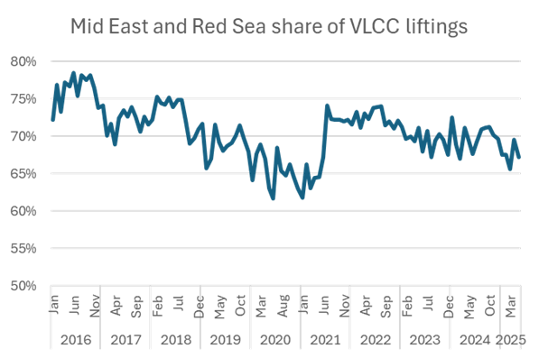
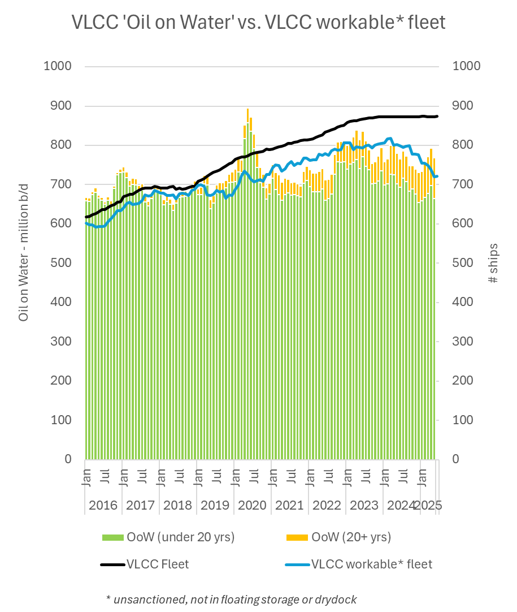

# Tankers Research Update

**Date:** June 05, 2025  
**Publisher:** Breakwave Advisors | **Category:** Market Insights  
**Original URL:** [https://www.breakwaveadvisors.com/insights/2025/6/5/tankers-research-update](https://www.breakwaveadvisors.com/insights/2025/6/5/tankers-research-update)  

---

### Muted VLCC Response to OPEC+ Accelerated July Output Hike

- The eight members of OPEC+ agreed on May 31 to collectively raise crude production by 411k b/d in July, mirroring monthly increments approved for May and June.

- Speculation on the reasons behind the more rapid reversal of voluntary cuts by the eight continue to focus on a) bringing discipline to quota violators such as Kazakhstan and Iraq, b) reclaiming market share lost to US shale output and c) accommodating Washington’s desire to lower global oil prices.
- OPEC+ members that continue to produce above their quotas include Kazakhstan (400k b/d above quota according to data from the OPEC Secretariat), UAE (estimated by the IEA to be overproducing by about 350k b/d) and Iraq (still exceeded its April target by 300k b/d).
- Despite recently announced crude production increases, crude exports from Saudi Arabia declined slightly in May (5.97m b/d) compared to April (6.1m b/d), according to Vortexa. This might be due to the higher local crude consumption for summer cooling power generation, a delayed reaction to increased production, or local stock building. The relationship between Saudi crude output and exports is poorly understood outside the kingdom.
- Russia’s seaborne crude exports showed little response to their recent production increase pledge, with exports slipping from 4.92m b/d in April to 4.68m b/d in May after holding steady in March.
- VLCCs would be the main beneficiaries of higher Middle Eastern seaborne crude exports. The Mid East/Red Sea region has accounted for between 60% and 80% of VLCC liftings since 2016 - 67% last month.

> **Figure 1: 9a86 Image 0 1749043452183**  
> [Local Asset](file:///C:/Users/Dell/Github/Shipping/corpus/03-breakwave/insights/2025/assets/2025-06-05_tankers-research-update_img_9a86-image-0-1749043452183_62304719ed15.png)

- VLCC exports from the Middle East Gulf were down by 7% in May vs. April. Notable monthly declines came from Iran (-21%), Iraq (-7%), and Saudi (-5%). The volume or oil carried by VLCC’s (a useful policy for overall VLCC demand) last month was down 3% on April, but still up 5% on last December. Most of the drop was felt by ships under 20 years old.

- Thanks largely to OFAC sanctions against Iran-linked shipping, the fleet of workable VLCCs (sanction free, not in floating storage or drydock) has shrunk by 12% since this time last year. Oil on the water demand has fallen 4% over the same period. A continuation of aggressive output increases by the OPEC eight into August is now broadly expected by the market. Assuming this does indeed feed into increased exports later this year (after peak seasonal cooling demand, perhaps) VLCCs will be in a strong position to lift rates – assuming OPEC+ countries do as they say.

> **Figure 2: 480e Image 1 1749043452186**  
> [Local Asset](file:///C:/Users/Dell/Github/Shipping/corpus/03-breakwave/insights/2025/assets/2025-06-05_tankers-research-update_img_480e-image-1-1749043452186_4c6632d81cbb.png)

- Earnings on the main VLCC route from the Middle East to China slumped from just over $56k/day at the end of April to just under $26k/day yesterday, with little obvious sign of immediate improvement according to our spot desk. H2 2025 FFAs have dropped by around $5k/day with it - perhaps unfairly, in our view.

---

**Tags:** Crude, Shipping, Markets  
