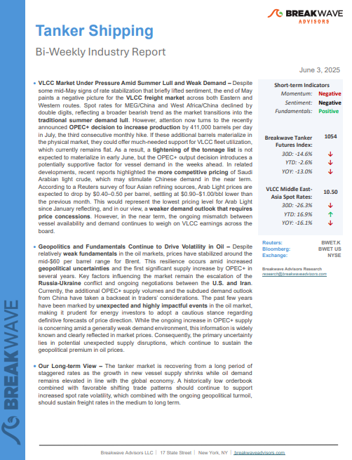
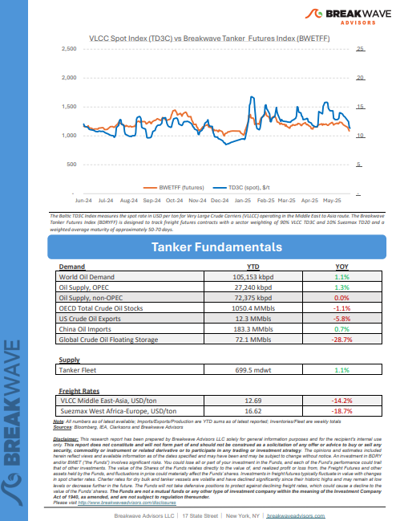
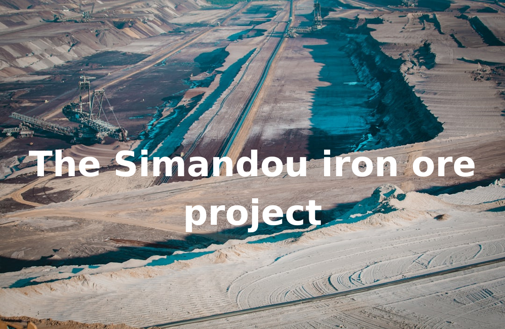

# Breakwave Weekend Read

**Date:** June 06, 2025  
**Publisher:** Breakwave Advisors | **Category:** Market Insights  
**Original URL:** [https://www.breakwaveadvisors.com/insights/2024/10/25/breakwave-weekend-read-547kk-rw7zy-awmfb](https://www.breakwaveadvisors.com/insights/2024/10/25/breakwave-weekend-read-547kk-rw7zy-awmfb)  

---

## Welcome Tobreakwave Advisorsweekend Read

***As the week comes to a close, take a moment to review the key insights from the past few days. Missed something? We've gathered all the top insights for you to catch up at your convenience.***

## Breakwave Shipping Report

**VLCC Market Under Pressure Amid Summer Lull and Weak Demand**– Despite some mid-May signs of rate stabilization that briefly lifted sentiment, the end of May paints a negative picture for the**VLCC freight market**across both Eastern and Western routes.

[Read More](https://www.breakwaveadvisors.com/insights/2025306wet855jjej587)

> **Figure 1: Στιγμιότυπο Οθόνης 2025 06 02 223652**  
> **Interactive Data & Source:** [Breakwave Advisors Market Insights](https://www.breakwaveadvisors.com/insights/2025/6/1/complex-picture) | [Local Asset](file:///C:/Users/Dell/Github/Shipping/corpus/03-breakwave/insights/2025/assets/2025-06-06_breakwave-weekend-read-547kk-rw7zy-awmfb_img_cea3cf84ceb9ceb3cebcceb9cf8ccf84cf85_7f4ae4cfbad4.png)

> **Figure 2: Στιγμιότυπο Οθόνης 2025 06 02 223528**  
> **Interactive Data & Source:** [Breakwave Advisors Market Insights](https://www.breakwaveadvisors.com/insights/2025/6/1/complex-picture) | [Local Asset](file:///C:/Users/Dell/Github/Shipping/corpus/03-breakwave/insights/2025/assets/2025-06-06_breakwave-weekend-read-547kk-rw7zy-awmfb_img_cea3cf84ceb9ceb3cebcceb9cf8ccf84cf85_8a53409b402e.png)

## Complex Picture

> **Figure 3: Complex Picture**  
> **Interactive Data & Source:** [Breakwave Advisors Market Insights](https://www.breakwaveadvisors.com/insights/2025/6/1/complex-picture) | [Local Asset](file:///C:/Users/Dell/Github/Shipping/corpus/03-breakwave/insights/2025/assets/2025-06-06_breakwave-weekend-read-547kk-rw7zy-awmfb_img_complexpicture_68ca3d690ca1.png)

A year ago, in May 2024, an International Monetary Fund (IMF) mission concluded a visit to China, expressing cautious optimism about the country's economic trajectory.

Doric Weekly Market Insights

## China's Coal Import Prospects for This Year Remain Bleak

> **Figure 4: China's Coal Import Prospects for This Year Remain Bleak**  
> **Interactive Data & Source:** [Breakwave Advisors Market Insights](https://www.breakwaveadvisors.com/insights/2025/6/1/chinas-coal-import-prospects-for-this-year-remain-bleak) | [Local Asset](file:///C:/Users/Dell/Github/Shipping/corpus/03-breakwave/insights/2025/assets/2025-06-06_breakwave-weekend-read-547kk-rw7zy-awmfb_img_china27scoalimportprospectsforthisye_48918a769f94.png)

As we discussed for clients in Commodore Research's most recent Weekly China Report, domestic coal production totaled 389.3 million tons in April.

From Commodore's Weekly Dry Bulk Reports

## Dollar Devaluation Does Not Mean Dollar Catastrophe

> **Figure 5: Dollar Devaluation Does Not Mean Dollar Catastrophe**  
> **Interactive Data & Source:** [Breakwave Advisors Market Insights](https://www.breakwaveadvisors.com/insights/2025/6/3/dollar-devaluation-does-not-mean-dollar-catastrophe) | [Local Asset](file:///C:/Users/Dell/Github/Shipping/corpus/03-breakwave/insights/2025/assets/2025-06-06_breakwave-weekend-read-547kk-rw7zy-awmfb_img_dollardevaluationdoesnotmeandollarca_5091aa89830b.png)

In the last few weeks we have seen the conversation drift away from tariffs and towards the more pressing issue of debt market dislocations.

Forvis Mazars Weekly Note

## Greek Ordering Activity in 2025: Strategic Focus Amid Global Contraction

> **Figure 6: Greek Ordering Activity in 2025**  
> **Interactive Data & Source:** [Breakwave Advisors Market Insights](https://www.breakwaveadvisors.com/insights/2025/6/4/greek-ordering-activity-in-2025-strategic-focus-amid-global-contraction) | [Local Asset](file:///C:/Users/Dell/Github/Shipping/corpus/03-breakwave/insights/2025/assets/2025-06-06_breakwave-weekend-read-547kk-rw7zy-awmfb_img_greekorderingactivityin2025_0bee552f23ba.png)

The 2025 newbuilding market finds itself firmly on a path of deceleration.

[Read More](https://www.breakwaveadvisors.com/insights/2025/6/4/greek-ordering-activity-in-2025-strategic-focus-amid-global-contraction)

Allied Weekly Report

## The Simandou Iron Ore Project

> **Figure 7: Ανώνυμο Σχέδιο**  
> **Interactive Data & Source:** [Breakwave Advisors Market Insights](https://www.breakwaveadvisors.com/insights/2025/6/4/the-simandou-iron-ore-project) | [Local Asset](file:///C:/Users/Dell/Github/Shipping/corpus/03-breakwave/insights/2025/assets/2025-06-06_breakwave-weekend-read-547kk-rw7zy-awmfb_img_ce91cebdcf8ecebdcf85cebccebfcf83cf87_612d4240bf5e.png)

The long-awaited Simandou iron ore project in Guinea is poised to shift the global dynamics of iron ore supply and maritime trade.

Intermodal Weekly Market Report

## India Crude Imports Set to Increase with Higher Refining Capacity in H2 2025

> **Figure 8: Προσθέστε Επικεφαλίδα**  
> **Interactive Data & Source:** [Breakwave Advisors Market Insights](https://www.breakwaveadvisors.com/insights/2025/6/5/india-crude-imports-set-to-increase-with-higher-refining-capacity-in-h2-2025) | [Local Asset](file:///C:/Users/Dell/Github/Shipping/corpus/03-breakwave/insights/2025/assets/2025-06-06_breakwave-weekend-read-547kk-rw7zy-awmfb_img_cea0cf81cebfcf83ceb8ceadcf83cf84ceb5_d230cc601c51.png)

This blog explores the outlook on India’s crude imports, refinery projects and the country’s crude import basket.

Vortexa Freight Weekly

## Tankers Research Update

> **Figure 9: Προσθέστε Επικεφαλίδα (1)**  
> **Interactive Data & Source:** [Breakwave Advisors Market Insights](https://www.breakwaveadvisors.com/insights/2025/6/5/tankers-research-update) | [Local Asset](file:///C:/Users/Dell/Github/Shipping/corpus/03-breakwave/insights/2025/assets/2025-06-06_breakwave-weekend-read-547kk-rw7zy-awmfb_img_cea0cf81cebfcf83ceb8ceadcf83cf84ceb5_96d359af39ab.png)

Muted VLCC response to OPEC+ accelerated July output hike

Braemar Research

## Growth Again in New Home Sales in China

> **Figure 10: Growth Again in New Home Sales in China**  
> **Interactive Data & Source:** [Breakwave Advisors Market Insights](https://www.breakwaveadvisors.com/insights/2025/6/6/growth-again-in-new-home-sales-in-china) | [Local Asset](file:///C:/Users/Dell/Github/Shipping/corpus/03-breakwave/insights/2025/assets/2025-06-06_breakwave-weekend-read-547kk-rw7zy-awmfb_img_growthagaininnewhomesalesinchina_01214b37d9eb.png)

As we discussed for clients in Commodore Research's most recent Weekly Executive Report, April ended with 781 million square meters of floor space available in China's commercial buildings (the majority of which are residential buildings).

From Commodore's Weekly Dry Bulk Reports

## Dwindling Inventories Pushes Copper Higher

> **Figure 11: Ανώνυμο Σχέδιο (2)**  
> **Interactive Data & Source:** [Breakwave Advisors Market Insights](https://www.breakwaveadvisors.com/insights/2025/6/6/dwindling-inventories-pushes-copper-higher) | [Local Asset](file:///C:/Users/Dell/Github/Shipping/corpus/03-breakwave/insights/2025/assets/2025-06-06_breakwave-weekend-read-547kk-rw7zy-awmfb_img_ce91cebdcf8ecebdcf85cebccebfcf83cf87_e7ab15a16b08.png)

Easing trade tensions helped push the energy sector higher. Metals gained on signs of tightness as supply disruptions mount.

Commodities Wrap

---

**Tags:** Shipping, Tankers, Drybulk  
