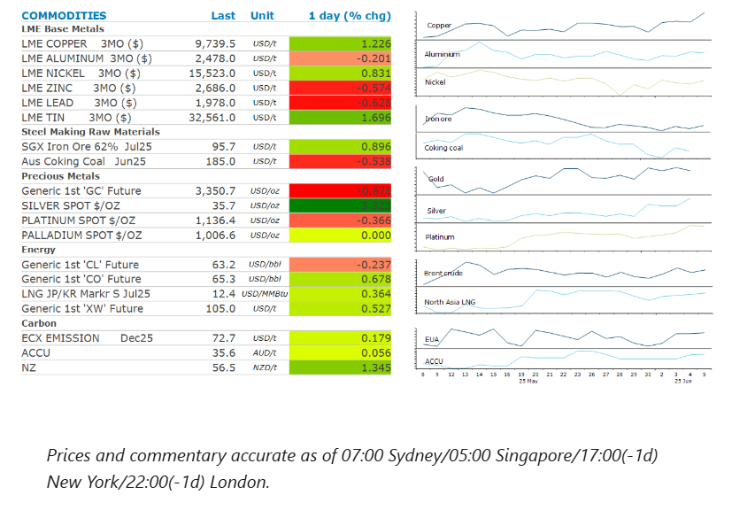
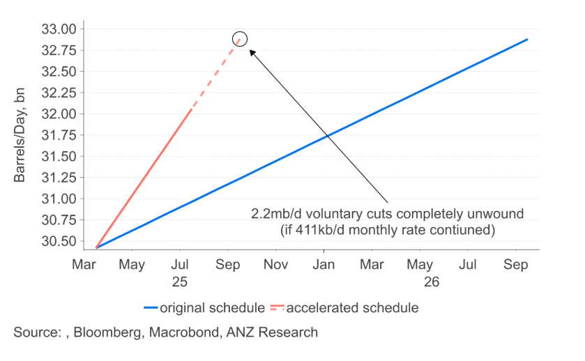

# Dwindling inventories pushes copper higher

**Date:** June 06, 2025  
**Publisher:** Breakwave Advisors | **Category:** Market Insights  
**Original URL:** [https://www.breakwaveadvisors.com/insights/2025/6/6/dwindling-inventories-pushes-copper-higher](https://www.breakwaveadvisors.com/insights/2025/6/6/dwindling-inventories-pushes-copper-higher)  

---

Easing trade tensions helped push the energy sector higher. Metals gained on signs of tightness as supply disruptions mount.

*By*[*Daniel Hynes*](https://www.linkedin.com/in/dahynes/)

> **Figure 1: Στιγμιότυπο Οθόνης 2025 06 06 144439**  
> **Interactive Data & Source:** [Publications Anz](https://publications.anz.com/SingletrackCMS__DownloadDocument?docRef=745a9750-5514-4ac6-b985-27c8addb4c29&uid=bd219b92-f5cc-400e-9646-4178791864b7&jobRef=18c58deb-65d3-424a-8b60-5cde2dcecd49) | [Local Asset](file:///C:/Users/Dell/Github/Shipping/corpus/03-breakwave/insights/2025/assets/2025-06-06_dwindling-inventories-pushes-copper-higher_img_cea3cf84ceb9ceb3cebcceb9cf8ccf84cf85_8a94fedd5b7b.png)

### Market Commentary

**Copper**rose to a fresh two month high amid ongoing signs of tightness. The recent plunge in inventories in London Metal Exchange warehouses continued, with order for another 14kt from facilities in South Korea and Netherlands. That’s the 14th consecutive day of declines, with inventories now standing at 54.7kt, the lowest since July 2023. Robust[**demand in China**](https://publications.anz.com/SingletrackCMS__DownloadDocument?docRef=745a9750-5514-4ac6-b985-27c8addb4c29&uid=bd219b92-f5cc-400e-9646-4178791864b7&jobRef=18c58deb-65d3-424a-8b60-5cde2dcecd49)has triggered the withdrawals, and renewed supply side issues have also played a part. Copper miner Teck Resources reported production setbacks at two operations in Chile this week. In the Democratic Republic of Congo, the Kamo-Kakula copper operation was impacted by seismic activity, which has resulted in flooding of the underground portion of the operation. It is expected to remain closed until Q4 2025. Sentiment was boosted by easing trade tensions. Trump and Xi agreed to more trade talks, after Trump said they cleared up disputes on rare earth exports during a call. That has generated some hope for lower duties between their economies.**Aluminium**failed to follow copper higher as the market contemplates the impact of 50% tariffs on imports into the US. The US aluminium association urged Trump to reconsider the levy due to the negative impact it will have on local manufacturers.

**Gold**gave back some of yesterday’s gains as easing trade tensions curbed haven buying. However,**silver**surged to its highest level in 13 years, triggered by improving fundamentals and technical momentum. After underperforming against gold, silver has suddenly attracted interest from investors. Holdings into silver-backed ETFs are up 2.2moz on Wednesday, according to Bloomberg data. Outside of investor interest, demand from clean energy technology sectors has also been strong. This should see the market, for a fifth consecutive year, in deficit.

Easing trade tensions also boosted sentiment across the**crude****oil**market. Brent crude gained nearly 1% following reports of the Trump-Xi call. However, the prospect of further hikes in OPEC supply continue to hang over the market. With OPEC approving another 411kb/d increase in output for July, it will have increased supply by 1.38mb/d in the first four months of the phase out plan, or 64% of the 2.2mb/d in voluntary production cuts. We suspect OPEC is taking the opportunity of stronger seasonal demand and a lack of response from non-OPEC producers to[**regain market share**](https://publications.anz.com/SingletrackCMS__DownloadDocument?docRef=bb4352ba-5719-4546-817e-5d3eb5be53ba&uid=bd219b92-f5cc-400e-9646-4178791864b7&jobRef=18c58deb-65d3-424a-8b60-5cde2dcecd49). What is not clear is whether that will extend into the second half of the year. A permanent shift to a market driven strategy would push the oil market into a sizeable surplus in H2 2025 and almost surely lead to lower oil prices. If Saudi Arabia chooses to keep its powder dry and revert to smaller monthly increase, that may alleviate the downward pressure on prices. Whichever way the OPEC+ moves on the pace of the phase out, it raises the question of whether it will bring forward the unwinding of the broader supply agreement with all members of the group. If prices prove resilient despite the recent acceleration in OPEC’s output, a broader recalibration of the group’s production ceiling might come sooner than anticipated.

**European gas**rallied after flows from top supplier Norway plunged amid a fresh bout of maintenance. This has raised concerns about Europe’s ability to refill storage facilities. Energy company Uniper SE said that its Breitbrunn facility, the fourth biggest in Germany, will not achieve the national goal of 80% full ahead of next winter.

### Chart of the Day

The OPEC+ alliance approved a 411kb/d increase in output for July. This will bring the increase in supply to 1.38mb/d in the first four months of the phase out plan, or 64% of the 2.2mb/d in voluntary production cuts. If this rate continues, it will have completely unwound the 2.2mb/d of voluntary cuts 12 months earlier than originally planned.

> **Figure 2: Στιγμιότυπο Οθόνης 2025 06 06 144530**  
> **Interactive Data & Source:** [Linkedin](https://www.linkedin.com/newsletters/commodities-wrap-6692196755876012032/?fbclid=IwAR3kiXJqZdxmp9ZcRwBNI7FsBySI-XSC0pfPur1qzjt7OZp7PTE59Tsl1QI) | [Local Asset](file:///C:/Users/Dell/Github/Shipping/corpus/03-breakwave/insights/2025/assets/2025-06-06_dwindling-inventories-pushes-copper-higher_img_cea3cf84ceb9ceb3cebcceb9cf8ccf84cf85_bd0a4eacc8f5.png)

Data source:[Commodities Wrap](https://www.linkedin.com/newsletters/commodities-wrap-6692196755876012032/?fbclid=IwAR3kiXJqZdxmp9ZcRwBNI7FsBySI-XSC0pfPur1qzjt7OZp7PTE59Tsl1QI)

---

**Tags:** Commodities, Shipping, Markets  
