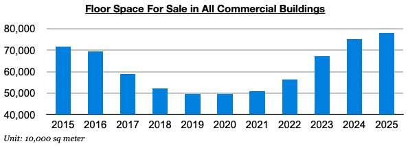
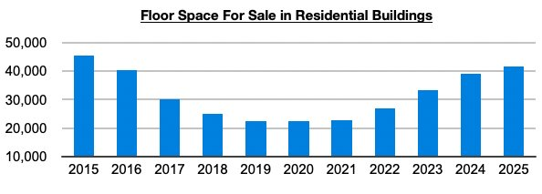
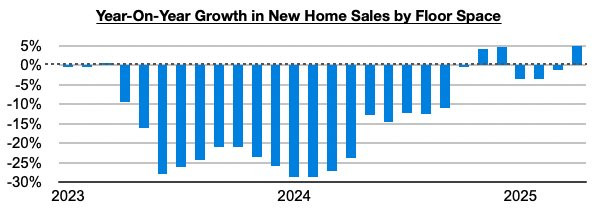

# Growth Again in New Home Sales in China

**Date:** June 06, 2025  
**Publisher:** Breakwave Advisors | **Category:** Market Insights  
**Original URL:** [https://www.breakwaveadvisors.com/insights/2025/6/6/growth-again-in-new-home-sales-in-china](https://www.breakwaveadvisors.com/insights/2025/6/6/growth-again-in-new-home-sales-in-china)  

---

*By*[*Jeffrey Landsberg*](https://www.linkedin.com/in/jeffrey-landsberg-70ab957/)

As we discussed for clients in Commodore Research's most recent Weekly Executive Report, April ended with 781 million square meters of floor space available in China's commercial buildings (the majority of which are residential buildings). Data is still pending for May. Overall, this 781 million square meter total is down month-on-month by 1% but it is still a huge amount that continues to show extreme oversupply.

> **Figure 1: Chart 1**  
> [Local Asset](file:///C:/Users/Dell/Github/Shipping/corpus/03-breakwave/insights/2025/assets/2025-06-06_growth-again-in-new-home-sales-in-china_img_chart1_b003a134f02f.jpg)

April ended with 417 million square meters of floor space available in purely residential buildings. This is also down month-on-month by 1%, but of course is still a huge amount as well.

> **Figure 2: Chart 2**  
> [Local Asset](file:///C:/Users/Dell/Github/Shipping/corpus/03-breakwave/insights/2025/assets/2025-06-06_growth-again-in-new-home-sales-in-china_img_chart2_91ef5c073bbd.jpg)

Encouraging, though, is that new home sales in April increased year-on-year by 5%. Sales have now increased on a year-on-year basis during three of the last six months. Previously, they had contracted on a year-on-year basis for nineteen straight months.

> **Figure 3: Chart 3**  
> [Local Asset](file:///C:/Users/Dell/Github/Shipping/corpus/03-breakwave/insights/2025/assets/2025-06-06_growth-again-in-new-home-sales-in-china_img_chart3_a23b38f239bb.jpg)

---

**Tags:** China, Markets, Economy  
