# Capesize Iron Ore Freight Market Trends

**Date:** June 09, 2025  
**Publisher:** Breakwave Advisors | **Category:** Market Insights  
**Original URL:** [https://www.breakwaveadvisors.com/insights/2025/6/8/capesize-iron-ore-freight-market-trends](https://www.breakwaveadvisors.com/insights/2025/6/8/capesize-iron-ore-freight-market-trends)  

---

**Dry Weekly Market Monitor - Week 23, 2025**
Snapshot of Spot Freight Rates, Supply-Demand Trends, Port Congestions
June 06, 2025

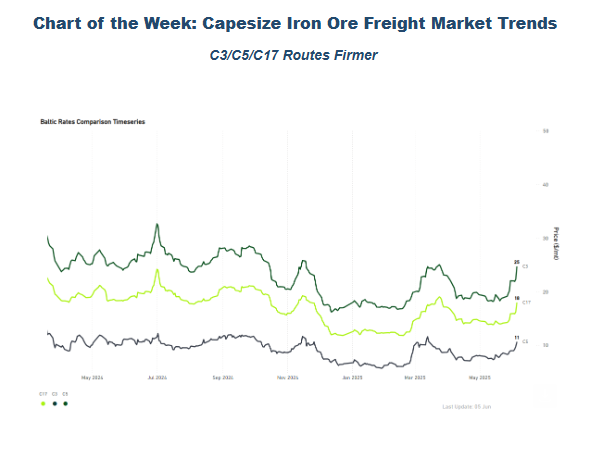

> **Figure 1: Στιγμιότυπο Οθόνης 2025 06 09 005152**  
> **Interactive Data & Source:** [Signal Ocean Platform](https://go.signalocean.com/e/983831/-05-30--utm-source-chatgpt-com/2r5vc7/500201448/h/Tla8FZ9CogOeOS0_WNMs0rI3pbClKH-3cCL5J3FHgFc) | [Local Asset](file:///C:/Users/Dell/Github/Shipping/corpus/03-breakwave/insights/2025/assets/2025-06-09_capesize-iron-ore-freight-market-trends_img_cea3cf84ceb9ceb3cebcceb9cf8ccf84cf85_7a0457027570.png)

This week's Market Monitor highlights Capesize freight market trends across the C3, C5, and C17 routes, as the Baltic Dry Index (BDI) gains momentum, driven primarily by the strong performance of the Capesize segment. A key indicator of current market sentiment appears to be the slight tightening in the ballaster count in both the North and South Atlantic, coupled with steady Chinese iron ore demand. Meanwhile, iron ore supply from Guinea is expected to rise, alongside continuing shipments from Australia and Brazil.

### Iron Ore Demand Trends | Focus on China

Amid indications of a dip in iron ore flows to China, May concluded with a total volume of Capesize iron ore shipments from Australia, Brazil, and Guinea of approximately $82 million (mt), an increase of 14% compared to the previous month. February appears to be the month with the lowest volume, at around $59 million (mt), which is 30% lower than the end of May. In contrast, the end of May exceeded the volumes recorded at the end of March, which were about $78.5 million (mt).

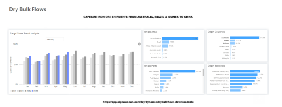

> **Figure 2: Στιγμιότυπο Οθόνης 2025 06 09 005301**  
> **Interactive Data & Source:** [Signal Ocean Platform](https://go.signalocean.com/e/983831/-05-30--utm-source-chatgpt-com/2r5vc7/500201448/h/Tla8FZ9CogOeOS0_WNMs0rI3pbClKH-3cCL5J3FHgFc) | [Local Asset](file:///C:/Users/Dell/Github/Shipping/corpus/03-breakwave/insights/2025/assets/2025-06-09_capesize-iron-ore-freight-market-trends_img_cea3cf84ceb9ceb3cebcceb9cf8ccf84cf85_307f5f9e2f38.png)

Meanwhile,[iron ore traders](https://go.signalocean.com/e/983831/-05-30--utm-source-chatgpt-com/2r5vc7/500201448/h/Tla8FZ9CogOeOS0_WNMs0rI3pbClKH-3cCL5J3FHgFc)are said to have recently revised up their bearish-case pricing scenarios to between $80 and $85 per ton versus $75 or lower at the start of the year. Market expectations underline that medium-term demand for iron ore should remain firm because China's young fleet of blast furnaces will require iron ore for at least another decade, said analysts at the flagship Singapore International Ferrous Week Conference at the end of May.

**Upcoming Iron Ore Supply: The Simandou Project remains a long-term downside risk for prices**

The Simandou iron ore project in Guinea, one of the world's largest undeveloped high-grade iron ore reserves, is expected to begin shipments in November 2025. When fully operational, the mine could supply up to 120 million metric tons annually. However, elevated operational risks persist due to political instability and unresolved disputes with the Guinean government.

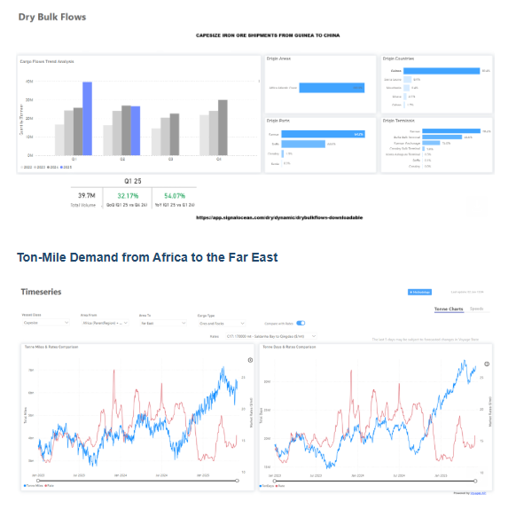

> **Figure 3: Στιγμιότυπο Οθόνης 2025 06 09 005416**  
> **Interactive Data & Source:** [Signal Ocean Platform](https://www.thesignalgroup.com/signal-ocean-platform) | [Local Asset](file:///C:/Users/Dell/Github/Shipping/corpus/03-breakwave/insights/2025/assets/2025-06-09_capesize-iron-ore-freight-market-trends_img_cea3cf84ceb9ceb3cebcceb9cf8ccf84cf85_929427b0acfd.png)

Increasing ton-mile demand is evident on the Africa-Far East route, fueled by steady iron ore shipments from Africa's Atlantic Coast to China. This development may bolster earnings on the C17 route and strengthen positive market sentiment in the Pacific.

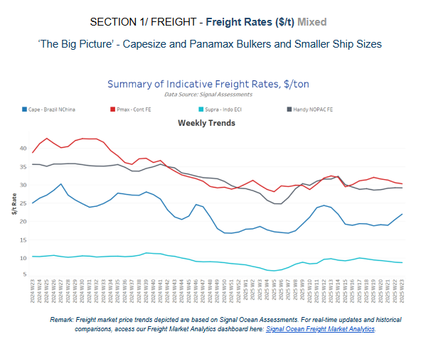

> **Figure 4: Στιγμιότυπο Οθόνης 2025 06 09 005520**  
> **Interactive Data & Source:** [Signal Ocean Platform](https://www.thesignalgroup.com/signal-ocean-platform) | [Local Asset](file:///C:/Users/Dell/Github/Shipping/corpus/03-breakwave/insights/2025/assets/2025-06-09_capesize-iron-ore-freight-market-trends_img_cea3cf84ceb9ceb3cebcceb9cf8ccf84cf85_3d9dcaeb940d.png)

According to real-time assessments by Signal Ocean, Capesize freight rates on the Brazil–North China route continue to closely track the Baltic C3 benchmark, showing a similarly firm trend as highlighted earlier in the report.

- **Capesize**vessel freight rates increased by 12% week-on-week, reaching approximately $22 per tonne. This upward trend is likely to continue due to a gradual reduction in the number of ballasters in the South Atlantic.
- **Panamax**vessel freight rates from the Continent stood around $31 per tonne; whereas, before the end of the week, the Baltic Panamax Index seems to be gaining ground from the performance of the P2A_82 route (Skaw-Gibraltar trip to Taiwan-Japan) and P1A_82 route (Skaw-Gibraltar transatlantic round voyage).
- **Supramax**freight rates from Indonesia to the East Coast have remained below $9 per tonne since mid-May, with the vessel count of Supramax arrivals to Indonesia for the next ten days rising to more than the levels of the Panamax size. In the Handysize segment, freight rates for the NOPAC–Far East round voyage have remained under $30 per tonne since mid-April, reflecting an 18% year-on-year decrease. Estimated vessel arrivals to the Far East for both**Handysize**and Supramax segments also point to an upward trend in the coming 10 days.

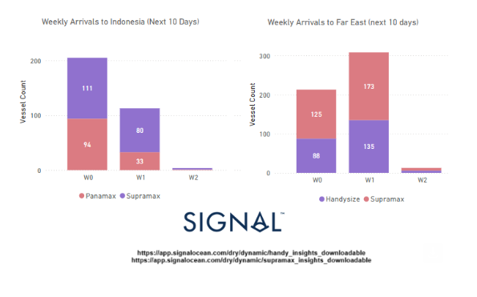

> **Figure 5: Στιγμιότυπο Οθόνης 2025 06 09 005624**  
> **Interactive Data & Source:** [Signal Ocean Platform](https://www.thesignalgroup.com/signal-ocean-platform) | [Local Asset](file:///C:/Users/Dell/Github/Shipping/corpus/03-breakwave/insights/2025/assets/2025-06-09_capesize-iron-ore-freight-market-trends_img_cea3cf84ceb9ceb3cebcceb9cf8ccf84cf85_a66823b65c80.png)

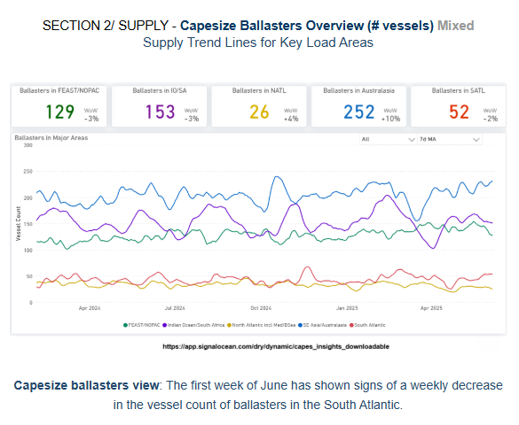

> **Figure 6: Στιγμιότυπο Οθόνης 2025 06 09 005912**  
> **Interactive Data & Source:** [Signal Ocean Platform](https://www.thesignalgroup.com/signal-ocean-platform) | [Local Asset](file:///C:/Users/Dell/Github/Shipping/corpus/03-breakwave/insights/2025/assets/2025-06-09_capesize-iron-ore-freight-market-trends_img_cea3cf84ceb9ceb3cebcceb9cf8ccf84cf85_a754e1280681.png)

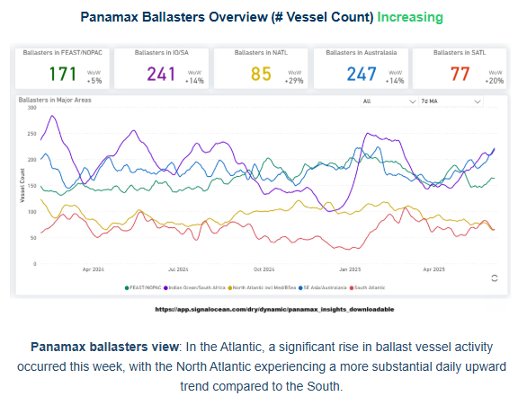

> **Figure 7: Στιγμιότυπο Οθόνης 2025 06 09 005924**  
> **Interactive Data & Source:** [Signal Ocean Platform](https://www.thesignalgroup.com/signal-ocean-platform) | [Local Asset](file:///C:/Users/Dell/Github/Shipping/corpus/03-breakwave/insights/2025/assets/2025-06-09_capesize-iron-ore-freight-market-trends_img_cea3cf84ceb9ceb3cebcceb9cf8ccf84cf85_db4470c1447a.png)

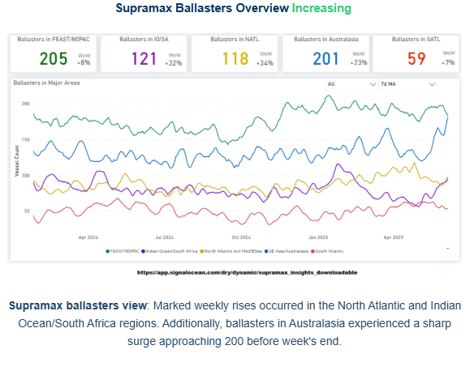

> **Figure 8: Στιγμιότυπο Οθόνης 2025 06 09 005931**  
> **Interactive Data & Source:** [Signal Ocean Platform](https://www.thesignalgroup.com/signal-ocean-platform) | [Local Asset](file:///C:/Users/Dell/Github/Shipping/corpus/03-breakwave/insights/2025/assets/2025-06-09_capesize-iron-ore-freight-market-trends_img_cea3cf84ceb9ceb3cebcceb9cf8ccf84cf85_8eba1fe4a6e4.png)

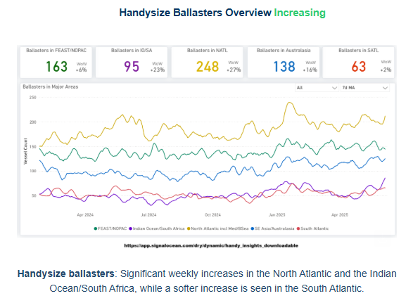

> **Figure 9: Στιγμιότυπο Οθόνης 2025 06 09 005940**  
> **Interactive Data & Source:** [Signal Ocean Platform](https://www.thesignalgroup.com/signal-ocean-platform) | [Local Asset](file:///C:/Users/Dell/Github/Shipping/corpus/03-breakwave/insights/2025/assets/2025-06-09_capesize-iron-ore-freight-market-trends_img_cea3cf84ceb9ceb3cebcceb9cf8ccf84cf85_fde8b6687b7f.png)

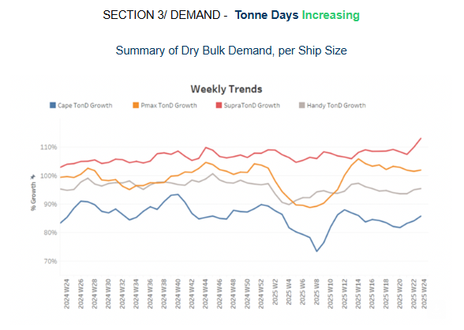

> **Figure 10: Στιγμιότυπο Οθόνης 2025 06 09 005947**  
> **Interactive Data & Source:** [Signal Ocean Platform](https://www.thesignalgroup.com/signal-ocean-platform) | [Local Asset](file:///C:/Users/Dell/Github/Shipping/corpus/03-breakwave/insights/2025/assets/2025-06-09_capesize-iron-ore-freight-market-trends_img_cea3cf84ceb9ceb3cebcceb9cf8ccf84cf85_2a0d9c9c9642.png)

- The overall growth in dry bulk tonne days appears to be gaining momentum, driven primarily by the**Capesize**and**Supramax**segments. In the Capesize segment, the weekly percentage increase in tonne days is approaching the peak recorded in week 10, while the Supramax segment has shown a notable spike since the end of May. This recent recovery in tonne-day growth may support a stronger rebound in Capesize freight market sentiment, particularly as the number of ballasting vessels continues to decline.

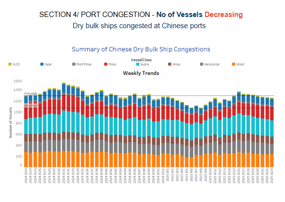

> **Figure 11: Στιγμιότυπο Οθόνης 2025 06 09 010159**  
> **Interactive Data & Source:** [Signal Ocean Platform](https://www.thesignalgroup.com/signal-ocean-platform) | [Local Asset](file:///C:/Users/Dell/Github/Shipping/corpus/03-breakwave/insights/2025/assets/2025-06-09_capesize-iron-ore-freight-market-trends_img_cea3cf84ceb9ceb3cebcceb9cf8ccf84cf85_aa19f8f3423d.png)

- In early June,**Chinese dry bulk port congestion**continued to ease, extending the decline observed in late May. This improvement is primarily driven by reduced congestion in the Capesize and Handysize segments. Looking at the broader picture of dry bulk vessels in waiting status at Chinese ports, the**7-day**moving average of waiting times is approaching two days, indicating that the downward trend in the overall count of congested Chinese dry bulk vessels is likely to persist. Recently, the average wait time for Capesize vessels at China's Caofeidian port has decreased considerably, with the 7-day moving average of actual waiting days dropping below one day.

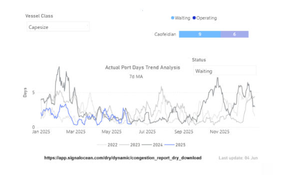

> **Figure 12: Στιγμιότυπο Οθόνης 2025 06 09 010255**  
> **Interactive Data & Source:** [Signal Ocean Platform](https://www.thesignalgroup.com/signal-ocean-platform) | [Local Asset](file:///C:/Users/Dell/Github/Shipping/corpus/03-breakwave/insights/2025/assets/2025-06-09_capesize-iron-ore-freight-market-trends_img_cea3cf84ceb9ceb3cebcceb9cf8ccf84cf85_310cf70f5db4.png)

Data Source:[Signal Ocean Platform](https://www.thesignalgroup.com/signal-ocean-platform)

---

**Tags:** Drybulk, Shipping, Markets  
