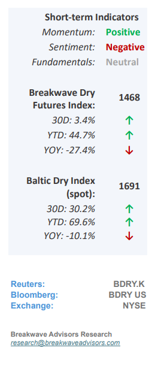
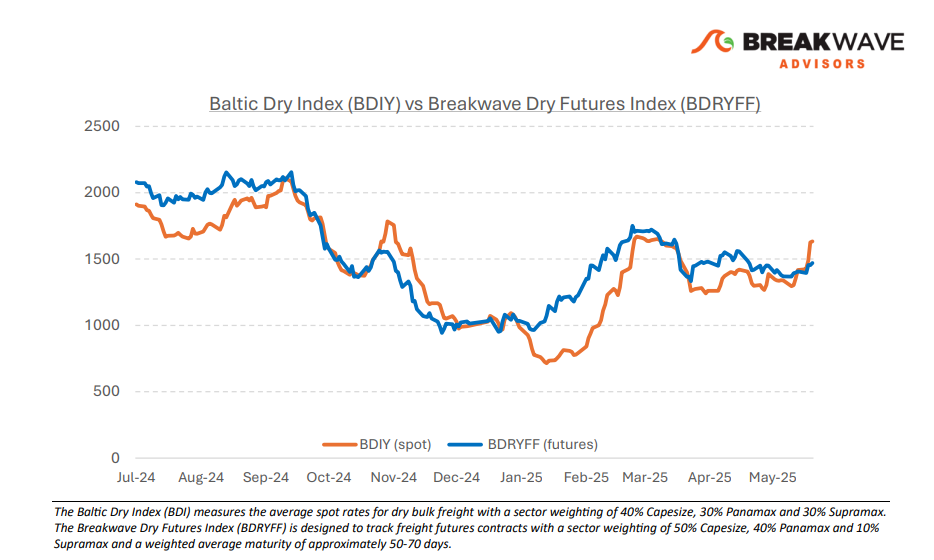
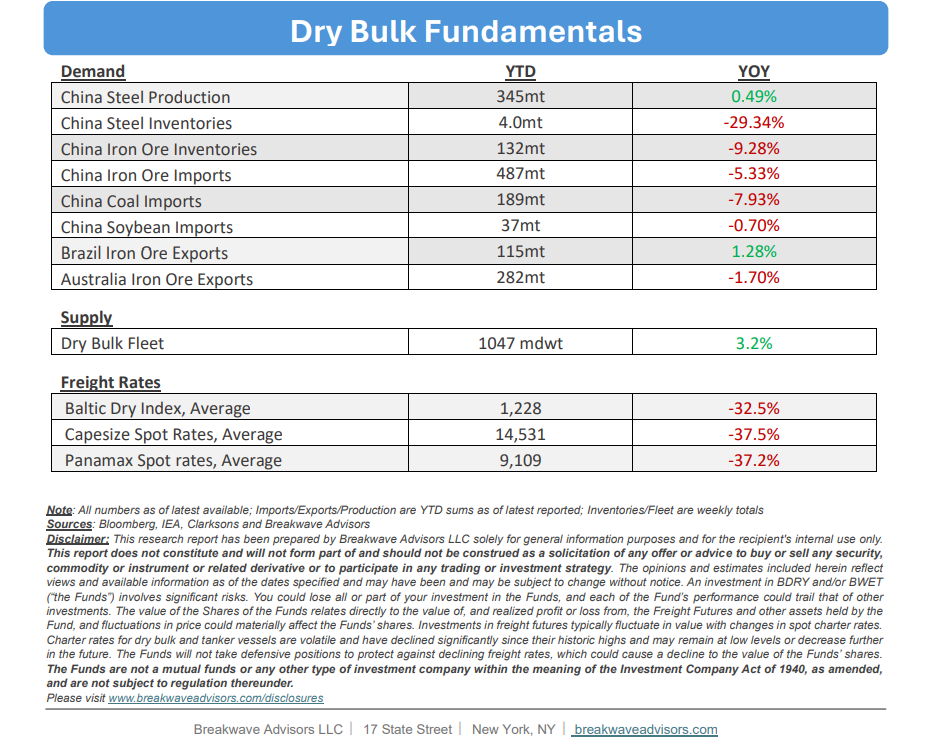

# Breakwave Bi-Weekly Dry Bulk Report - June 10, 2025

**Date:** June 10, 2025  
**Publisher:** Breakwave Advisors | **Category:** Market Insights  
**Original URL:** [https://www.breakwaveadvisors.com/insights/2025610-dry5kji55547l](https://www.breakwaveadvisors.com/insights/2025610-dry5kji55547l)  

---

•**Physical Leads the Way as Traders Remain Cautious**– A resurgence in activity across all asset classes has propelled dry bulk spot rates to multi-month highs, with**Capesize rates reaching their best levels of the year**and Panamax spot rates surpassing $10,000 once again. However, freight**traders**remain**cautious**: freight futures have not experienced a similar rally, resulting in a sharply**backwardated**curve for Capesizes and a slightly backwardated curve for Panamaxes. Yet, the Capesize market is currently driven by**genuine demand**in the Atlantic basin. While traders sustain the view that this rally may be short-lived, market sentiment often could lead to more optimistic outcomes that endure longer than initially anticipated. With s subdued freight futures outlook, it remains to be seen whether there is room for further upward movement.**Fundamentally**, the market appears**neutral**, at best. Year-to-date iron ore imports into China are approximately 5% below last year’s levels, and upcoming weather conditions are soon expected to negatively impact the West Africa region, which has so far demonstrated robust bauxite exports, in the process supporting the overall dry bulk market. However, we believe that the**discounts**reflected in the futures market present a**potential advantage**for investors willing to take the risk for an early summer rebound, despite fundamentals currently not appearing particularly attractive. In the short term, the balance between cargo volumes and fleet supply remains the primary driver of rates and such balance can shift unpredictably, regardless of long-term fundamentals. Currently, the**Baltic Dry Index is at its highest point of the year.**Should this strength persist, freight futures markets may have considerable room for an upward correction.

> **Figure 1: Στιγμιότυπο Οθόνης 2025 06 10 005245**  
> [Local Asset](file:///C:/Users/Dell/Github/Shipping/corpus/03-breakwave/insights/2025/assets/2025-06-10_2025610-dry5kji55547l_img_cea3cf84ceb9ceb3cebcceb9cf8ccf84cf85_9ac55269d9dc.png)

•**Lower Iron Ore Trade and Guinea Political Interventions Pose Risks**– Iron ore remains the most important commodity in dry bulk shipping, and alongside coal, collectively accounting for over 80% of all cargo transported by major bulk carriers. To date,**iron ore volumes**have been relatively**weak**, with China’s imports approximately 5% lower compared to last year. However, a notable increase in**bauxite exports from West Africa,**particularly from Guinea, has bolstered Capesize demand in the Atlantic basin, partially offsetting the aforementioned weakness. The recent announcement by the**Guinean government**to**revoke**numerous mining**licenses**raises concerns. While most affected operations are relatively small, the potential for significant disruption exists if a broader standstill develops between the government and the involved companies. In the long term, the**Guinean government’s focus on domestic refining**and exporting finished bauxite products is likely to be a**negative**for dry bulk shipping, particularly impacting the largest bulk carriers. This shift could reduce the volume of raw bauxite available for export, influencing freight demand in the Atlantic at a time when Chinese demand for iron ore is flattening.

•**Our Long-term View**– The last few years have been characterized by increased geopolitical uncertainty. Going forward, we expect such events to continue to affect global trade and have a meaningful impact on effective vessel supply. Combined with the potential for a multi-year cyclical rebound in China’s economic activity following the recent economic turmoil, dry bulk shipping should experience higher volatility on top of a secular tightness driven by stable bulk commodity demand and a slower fleet growth owing to a relatively low orderbook.

> **Figure 2: Στιγμιότυπο Οθόνης 2025 06 09 231243**  
> [Local Asset](file:///C:/Users/Dell/Github/Shipping/corpus/03-breakwave/insights/2025/assets/2025-06-10_2025610-dry5kji55547l_img_cea3cf84ceb9ceb3cebcceb9cf8ccf84cf85_3d349a35c476.png)

> **Figure 3: Στιγμιότυπο Οθόνης 2025 06 10 005313**  
> [Local Asset](file:///C:/Users/Dell/Github/Shipping/corpus/03-breakwave/insights/2025/assets/2025-06-10_2025610-dry5kji55547l_img_cea3cf84ceb9ceb3cebcceb9cf8ccf84cf85_456989f53fbf.png)

### Subscribe:
