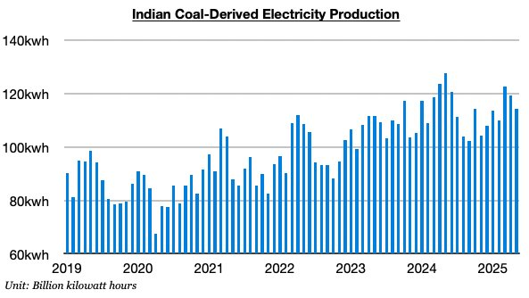

# Strengths and Weaknesses in Current Dry Bulk Market

**Date:** June 11, 2025  
**Publisher:** Breakwave Advisors | **Category:** Market Insights  
**Original URL:** [https://www.breakwaveadvisors.com/insights/2025/6/11/strengths-and-weaknesses-in-current-dry-bulk-market](https://www.breakwaveadvisors.com/insights/2025/6/11/strengths-and-weaknesses-in-current-dry-bulk-market)  

---

*By*[*Jeffrey Landsberg*](https://www.linkedin.com/in/jeffrey-landsberg-70ab957/)

Overall dry bulk rates increased last week. Capesize rates jumped another 25%. The jump in capesize rates has dominated many headlines -- but as we stressed in Commodore Research's Weekly Executive Report this week, the rebound in panamax rates is significant too. Prior to last week, the last time that panamax rates had risen by just 1% or more was back in April. As with two weeks ago, a significant driver behind last week’s capesize surge has been growth in spot iron ore cargo volume, which has once again included more Brazilian cargoes. Noteworthy in the panamax market is that a huge amount of South American spot grain cargoes came to the market and again exceeded the trailing four week average. Last week’s 25 South American spot grain cargoes has marked the largest amount reported all year. This surge helped panamax rates jump 11% last week.

Overall, we must continue to stress that China’s steel production remains at a firm level and that we remain bullish for China’s iron ore import prospects. The recent strength in spot iron ore volume and uptick in capesize rates is not extremely surprising. At the same time, though, we must continue to stress that we remain very concerned for global coal trade prospects. While in last week’s Weekly Executive Report we reiterated our bearishness for China’s coal-derived electricity generation and China’s coal import prospects, this week’s Weekly Executive Report included a focus on India. India’s total electricity generation and coal-derived electricity generation have both now contracted on a year-on-year basis during three of the last five months. And very concerning for the dry bulk market is that last month saw India’s coal-derived electricity fall year-on-year by 11%, which is the largest contraction seen this decade. As we have stressed often in our Weekly Executive Reports this year, weakness in India’s overall economy, combined with the return of sustained growth in Indian hydropower production, continues to put considerable pressure on India’s coal-derived electricity generation and demand for imported coal.

> **Figure 1: Chart**  
> [Local Asset](file:///C:/Users/Dell/Github/Shipping/corpus/03-breakwave/insights/2025/assets/2025-06-11_strengths-and-weaknesses-in-current-dry-bulk-market_img_chart_ca88248730d8.jpg)

---

**Tags:** China, Drybulk, Shipping  
