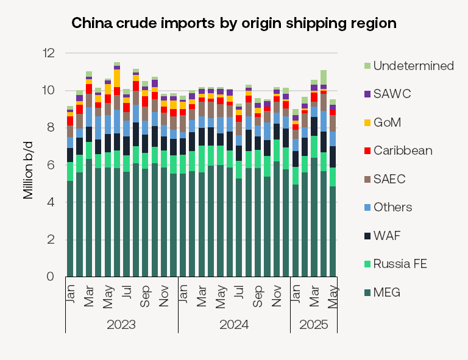

# Tankers Research Update

**Date:** June 11, 2025  
**Publisher:** Breakwave Advisors | **Category:** Market Insights  
**Original URL:** [https://www.breakwaveadvisors.com/insights/2025/6/11/tankers-research-update](https://www.breakwaveadvisors.com/insights/2025/6/11/tankers-research-update)  

---

### VLCC Tonne Miles Fell As China's Crude Imports Fell to Four-Month Low in May

- China’s crude oil imports fell to a four-month low in May, dropping to 9.54m b/d, according to data from Vortexa. This represents a 14% decline from April’s 11.1m b/d.
- Shipments from the Middle East Gulf (MEG) to China were particularly impacted, falling to 4.85m b/d in May—a 15% decrease from 5.69m b/d in April and the lowest volume since June 2022. The decline in imports was driven primarily by reduced volumes from key suppliers: Iran (-400k b/d), UAE (-188k b/d), Iraq (-183k b/d) and Saudi Arabia (-153k b/d). These barrels are largely transported on VLCCs, leading to a 7.3% drop in VLCC tonne miles, which fell to 475 billion tonne miles in May.

> **Figure 1: Japanese Refiner Taiyo Oil Has Taken Delivery of Russian Crude**  
> *Japanese refiner Taiyo Oil has taken delivery of Russian crude aboard the sanctioned Aframax tankerVoyager(113,000 DWT, built 2013). The vessel, blacklisted by both the US and EU, was allowed to discharge under a special waiver granted to the refiner by Japanese authorities on May 21.*  
> [Local Asset](file:///C:/Users/Dell/Github/Shipping/corpus/03-breakwave/insights/2025/assets/2025-06-11_tankers-research-update_img_9253-image-0-1749613240679_f9d95b366760.png)

- The steep reduction in Iranian flows to China is attributed to the tightening of US sanctions, which have disrupted Tehran’s export channels. Meanwhile, demand from China’s independent refiners has waned as they operate at near-record-low run rates, according to OilChem. The slowdown is attributed to seasonal maintenance, continued work on the ESPO pipeline (expected to last through July), and high inventory levels following prior stockpiling.

- Discounted Iranian crude, once attractive due to its lower prices, has been increasingly edged out by competing Russian grades such as Sokol and Novy Port, which have gained favour among Chinese refiners due to more competitive pricing. Chinese crude imports from Russia fell to 1.19m b/d in May from 1.41m b/d in April.
- China has refrained from purchasing any US crude with May seeing zero crude imports from the US, compared to April’s 107k b/d.

### Eu Propose to Ban Indirect Imports of Russian-Origin Fuels

- On Tuesday, the European Commission proposed its 18th Russian sanctions package - focusing on Russia’s energy revenues, banking, and military industry.
- The package is likely to be approved by EU energy ministers by the end of this month.
- The sanctions package includes the following proposals:

- A ban on the import of refined petroleum products derived from Russian crude oil, thus closing a critical loophole that allows Russian crude to reach Europe indirectly. India and Turkey—two of the EU’s top fuel suppliers—have emerged as significant refiners of discounted Russian crude after the invasion of Ukraine. So far this year, the two countries imported a combined 2m b/d of Russian crude and exported roughly 474k b/d of refined fuels to the EU
- Sanctions against 22 Russian banks, expanding restrictions beyond exclusion from SWIFT to a full transaction ban, targeting institutions involved in sanctions evasion
- A ban on all transactions related to Russia’s Nord Stream gas pipelines, further limiting Moscow’s energy leverage.
- Sanctions against a further 77 vessels linked to Russia’s shadow fleet. This would lift total EU sanctions against over 400 ships. These tankers are often older and operating under opaque ownership or lacking proper insurance.
- Lowering the G7 price cap for $60/bbl to €45/bbl.

### Japanese Refiner Taiyo Oil Takes Russian Crude First Time After Two Years

- The*Voyager*, formerly known as the*Vernadsky Prospect*and once operated by sanctioned Russian state tanker giant Sovcomflot, is now listed under the management of Starfish Ship Management, a Dubai-based entity. The vessel loaded approximately 600,000 barrels of Sakhalin crude at the Prigorodnoye terminal on Sakhalin Island on May 25 and discharged at Kikuma, Japan, earlier this week.
- This marks Japan’s first import of Russian crude in over two years, reflecting Tokyo’s strategic prioritisation of energy security amid ongoing global market volatility. Japan continues to allow imports from the Sakhalin-2 project under a national security exemption, particularly given its longstanding investment and reliance on the project.
- Waivers issued by both US and EU authorities for these shipments are currently valid through the end of June but are expected to be extended. A spokesperson for Taiyo Oil confirmed the transaction, noting the crude was procured at the request of Japan’s Ministry of Economy, Trade and Industry.
- Before the invasion of Ukraine, Japan regularly imported around four cargoes per month from Sakhalin.

---

**Tags:** Tankers, Crude, Markets  
