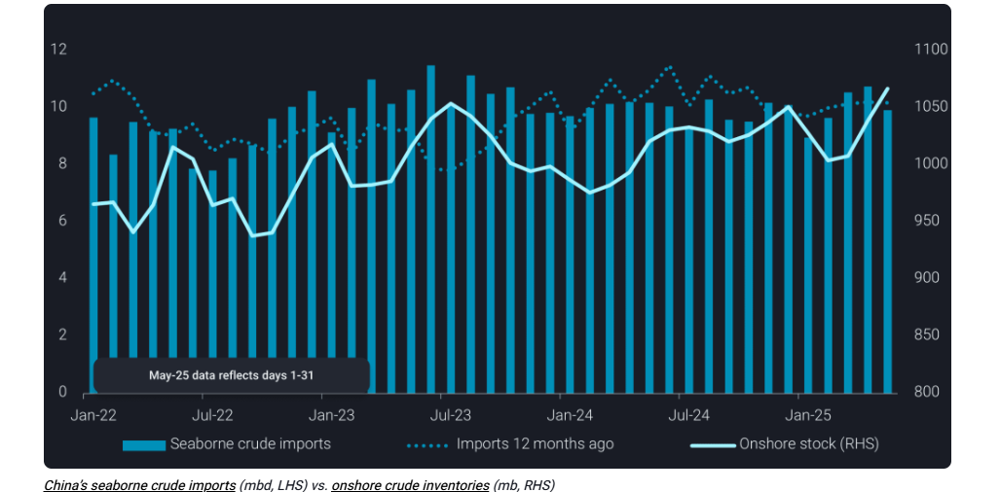
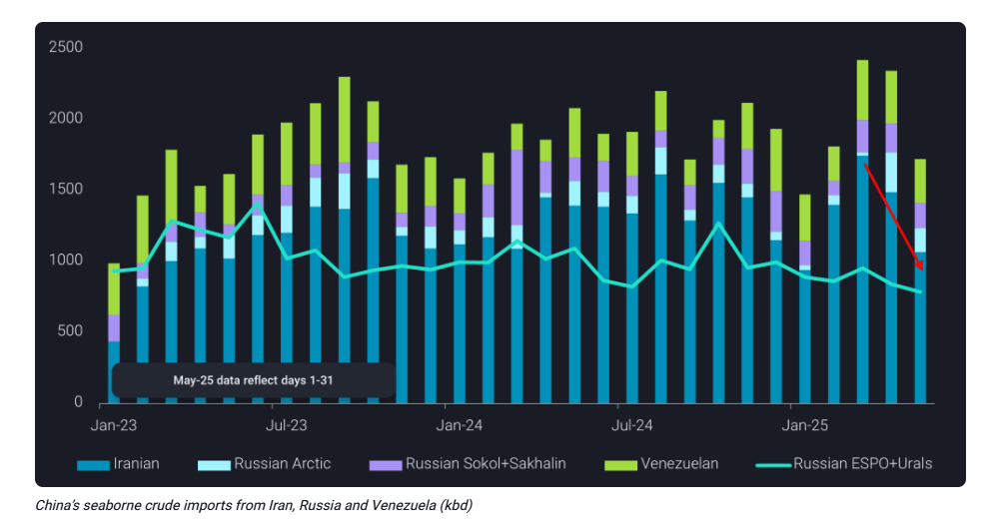
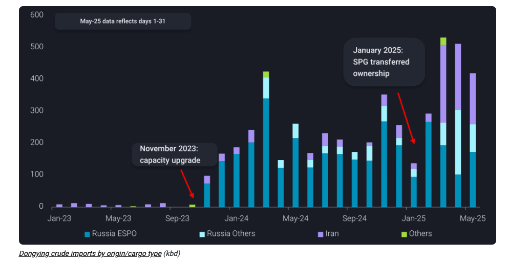

# Will China continue to build stock?

**Date:** June 11, 2025  
**Publisher:** Breakwave Advisors | **Category:** Market Insights  
**Original URL:** [https://www.breakwaveadvisors.com/insights/2025/6/11/will-china-continue-to-build-stock](https://www.breakwaveadvisors.com/insights/2025/6/11/will-china-continue-to-build-stock)  

---

China recorded another month of strong crude stock builds in May, even as seaborne imports softened. This trend raises a key question for markets: what are the latest figures telling us about China’s underlying demand?

*By*[*Emma Li*](https://www.linkedin.com/in/emma-li-73003443/)

China’s seaborne crude imports fell 8% month-on-month and 3% year-on-year in May, dipping below the 10mbd mark. Volumes from nearly all major suppliers—including Saudi Arabia, Iraq, Russia, and Iran—declined from April levels.

Yet, despite lower imports, China’s onshore crude inventories continued to climb, with the stockpiling rate exceeding 1mbd for the second consecutive month.

According to Vortexa’s calculations, implied refinery runs fell 3% y-o-y, returning to levels close to the three-year seasonal average. This points to lower average utilisation rates, especially given the considerable capacity additions seen in recent years.

The main run rate decline is from independent teapot refiners, who are facing delayed spring maintenance this year. While their refining margins briefly improved in April, they weakened again in May—contributing to reduced processing activity.

Chinese oil majors also saw significant capacity offline in May, as the month marked a peak in scheduled maintenance. With several state-run refineries expected to complete turnarounds in late May and early June, throughput is may well rebound in June.

That said, before imports rise meaningfully, China’s stockbuilds could moderate in June, before potentially picking up again in July–August, as cheaper OPEC barrels may arrive after the recent policy adjustments.

> **Figure 1: Στιγμιότυπο Οθόνης 2025 06 11 122949**  
> **Interactive Data & Source:** [Vortexa](https://www.vortexa.com//oil-gas-data-traders-analysts-data-scientists?gclid=Cj0KCQjw8_qRBhCXARIsAE2AtRZKOvMnbilZ_6_91d7huSFFy71pWLrnPwGwOHVzXsmsG-1a1mZnQw8aAt89EALw_wcB&hsa_acc=1782073842&hsa_ad=548425387665&hsa_cam=14746637662&hsa_grp=125038601902&hsa_kw=&hsa_mt=&hsa_net=adwords&hsa_src=g&hsa_tgt=dsa-1431852288425&hsa_ver=3&utm_campaign=%5BCD%5D%20-%20DSA%20-%20EMEA&utm_medium=cpc&utm_medium=ppc&utm_source=google&utm_source=adwords&utm_term=) | [Local Asset](file:///C:/Users/Dell/Github/Shipping/corpus/03-breakwave/insights/2025/assets/2025-06-11_will-china-continue-to-build-stock_img_cea3cf84ceb9ceb3cebcceb9cf8ccf84cf85_0a4920dc8150.png)

## Teapots Curb Sanctioned Crude Intake Amid High Stocks and Weaker Demand

Imports of discounted crude from Iran, Russia, and Venezuela declined from record highs during April and May, reflecting weaker teapot demand.

Beyond the widespread maintenance activity expected to stretch into July, ample onshore inventories in Shandong allowed teapots to pull back on spot crude purchases, especially of Iranian barrels

> **Figure 2: Στιγμιότυπο Οθόνης 2025 06 11 123056**  
> **Interactive Data & Source:** [Vortexa](https://www.vortexa.com//oil-gas-data-traders-analysts-data-scientists?gclid=Cj0KCQjw8_qRBhCXARIsAE2AtRZKOvMnbilZ_6_91d7huSFFy71pWLrnPwGwOHVzXsmsG-1a1mZnQw8aAt89EALw_wcB&hsa_acc=1782073842&hsa_ad=548425387665&hsa_cam=14746637662&hsa_grp=125038601902&hsa_kw=&hsa_mt=&hsa_net=adwords&hsa_src=g&hsa_tgt=dsa-1431852288425&hsa_ver=3&utm_campaign=%5BCD%5D%20-%20DSA%20-%20EMEA&utm_medium=cpc&utm_medium=ppc&utm_source=google&utm_source=adwords&utm_term=) | [Local Asset](file:///C:/Users/Dell/Github/Shipping/corpus/03-breakwave/insights/2025/assets/2025-06-11_will-china-continue-to-build-stock_img_cea3cf84ceb9ceb3cebcceb9cf8ccf84cf85_6a131eca4ae6.png)

China’s Iranian crude imports dropped to below 1.1mbd in May, down nearly 30% m-o-m, and below the 2024 average of approximately 1.4mbd.

Still, teapots will continue to depend on discounted barrels to preserve margins. With Indian refiners competing for Russian crude—both from western-facing ports and the Far East —Iranian supply remains a key feedstock for China’s independents.

## Operations at Us-Sanctioned Terminal Recover After Brief Disruption

The drop in Iranian crude imports in May is partially linked to a temporary operational slowdown at Dongying Port in northern Shandong, after one of its crude terminals was sanctioned by the US Office of Foreign Assets Control (OFAC) in early May.

Discharge operations were disrupted for about a week, but gradually recovered thereafter. The port has handled over 400kbd of crude imports through May, compared to around 520kbd in the preceding two months.

> **Figure 3: Στιγμιότυπο Οθόνης 2025 06 11 123146**  
> **Interactive Data & Source:** [Vortexa](https://www.vortexa.com//oil-gas-data-traders-analysts-data-scientists?gclid=Cj0KCQjw8_qRBhCXARIsAE2AtRZKOvMnbilZ_6_91d7huSFFy71pWLrnPwGwOHVzXsmsG-1a1mZnQw8aAt89EALw_wcB&hsa_acc=1782073842&hsa_ad=548425387665&hsa_cam=14746637662&hsa_grp=125038601902&hsa_kw=&hsa_mt=&hsa_net=adwords&hsa_src=g&hsa_tgt=dsa-1431852288425&hsa_ver=3&utm_campaign=%5BCD%5D%20-%20DSA%20-%20EMEA&utm_medium=cpc&utm_medium=ppc&utm_source=google&utm_source=adwords&utm_term=) | [Local Asset](file:///C:/Users/Dell/Github/Shipping/corpus/03-breakwave/insights/2025/assets/2025-06-11_will-china-continue-to-build-stock_img_cea3cf84ceb9ceb3cebcceb9cf8ccf84cf85_fa95d08abd4a.png)

While OFAC’s latest designation may prompt other Shandong ports to tighten compliance protocols—potentially increasing STS transfers to non-sanctioned tankers—Dongying is expected to remain a key entry point for Iranian and Russian crude. Now under sanctions, Dongying is likely to stay accommodating to sanctioned tankers.

As of June 9, at least 12 Aframax tankers carrying either Iranian or Russian crude were observed anchoring offshore North Shandong, likely waiting to discharge at Dongying.

## Diverging Demand Outlook: State-Run Refiners vs. Teapots

China’s crude demand is likely to rebound in June, as maintenance winds down and transport fuel demand improves with the summer holidays, planting, and fishing season. However, continued weakness in other consumer sectors, such as construction and manufacturing, is expected to keep overall refinery runs flat-to-below year-ago levels.

Onshore crude inventories reached a four-year high of over 1.07bb in aboveground tanks as of June 8. While this implies that further stockpiling isn’t urgent, the ample spare capacity gives Chinese oil majors flexibility to resume builds when market conditions are favourable.

In contrast, teapot refiners—lacking international exposure and financial hedging tools—will be driven to secure the lowest-cost feedstock available on the spot market. Although persistently weak domestic margins may dampen overall buying appetite, they also incentivise risk-taking, even in the face of ongoing supply-side uncertainty.

Data Source:[Vortexa](https://www.vortexa.com//oil-gas-data-traders-analysts-data-scientists?gclid=Cj0KCQjw8_qRBhCXARIsAE2AtRZKOvMnbilZ_6_91d7huSFFy71pWLrnPwGwOHVzXsmsG-1a1mZnQw8aAt89EALw_wcB&hsa_acc=1782073842&hsa_ad=548425387665&hsa_cam=14746637662&hsa_grp=125038601902&hsa_kw=&hsa_mt=&hsa_net=adwords&hsa_src=g&hsa_tgt=dsa-1431852288425&hsa_ver=3&utm_campaign=%5BCD%5D%20-%20DSA%20-%20EMEA&utm_medium=cpc&utm_medium=ppc&utm_source=google&utm_source=adwords&utm_term=)

---

**Tags:** Crude, Tankers, Market  
