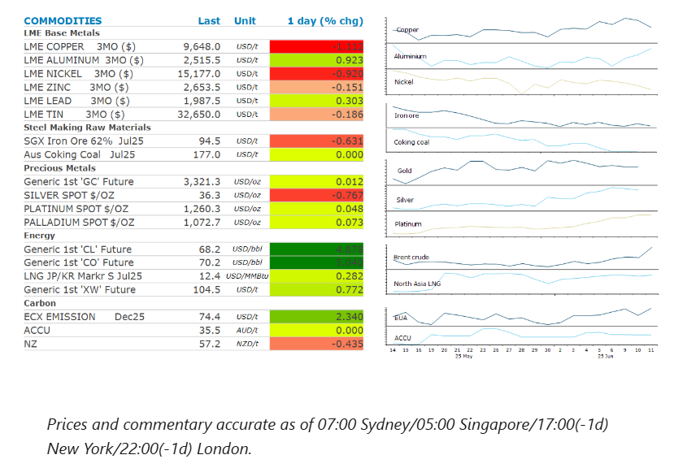
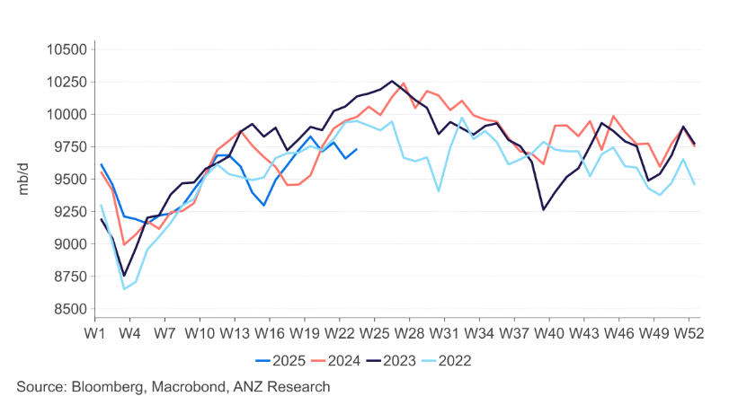

# Oil surges amid renewed geopolitical tensions

**Date:** June 12, 2025  
**Publisher:** Breakwave Advisors | **Category:** Market Insights  
**Original URL:** [https://www.breakwaveadvisors.com/insights/2025/6/12/oil-surges-amid-renewed-geopolitical-tensions](https://www.breakwaveadvisors.com/insights/2025/6/12/oil-surges-amid-renewed-geopolitical-tensions)  

---

Rising geopolitical tensions lifted energy markets. Easing trade tension elicited a muted response from metals. Weak US inflation data pushed gold higher.

*By*[*Daniel Hynes*](https://www.linkedin.com/in/dahynes/)

> **Figure 1: Στιγμιότυπο Οθόνης 2025 06 12 122811**  
> **Interactive Data & Source:** [Linkedin](https://www.linkedin.com/newsletters/commodities-wrap-6692196755876012032/?fbclid=IwAR3kiXJqZdxmp9ZcRwBNI7FsBySI-XSC0pfPur1qzjt7OZp7PTE59Tsl1QI) | [Local Asset](file:///C:/Users/Dell/Github/Shipping/corpus/03-breakwave/insights/2025/assets/2025-06-12_oil-surges-amid-renewed-geopolitical-tensions_img_cea3cf84ceb9ceb3cebcceb9cf8ccf84cf85_921c14152dad.png)

### Market Commentary

**Crude oil**prices surged as geopolitical tension rose in the Middle East. The US government ordered a partial evacuation of its embassy in Iraq due to rising security concerns. The UK Navy also issued a rare warning to mariners that rising tension in the Middle East could affect shipping. This was compounded by speculation about possible supply disruptions in the region, after Agence France-Presse reported that Iran threatened to target US military bases in the region if conflict breaks out. Expectations of a new US-Iran nuclear are slowly evaporating. President Trump said he’s less confident about whether he can convince Tehran to agree on shutting down its nuclear program. Events in the Middle East overshadowed data showing signs of weakening US demand. Distillate demand plunged to all time seasonal lows (excluding 2020) based on the four-week average of product supplied, according to Energy Information Administration data. Gasoline inventories rose 1.5mbbl last week to their highest level in two months, as the US heads into the peak summer driving season. Overall, EIA’s weekly inventory report showed that crude oil inventories fell 3,644kbbl last week.

**Global gas**prices lifted in response to moves in the oil market. However, the recent fall in prices also induced increased activity in Asia.**North Asian LNG**prices pushed higher as Chinese importers returned to the spot market. China’s CNOOC Ltd has already purchased a shipment for July delivery this week, with other enquiring about cargoes later this summer. The nation was the world’s biggest importer of the fuel in 2024 but has cut back this year due to high prices.**European gas**futures gained as much as 4%, as warm weather across the region increases the use of air conditioning.

The US-China trade deal induced a muted response from the**metal**markets. The deal includes the establishment of a framework for implementing the Geneva consensus, which should see the revival of trade flows of sensitive goods, such as rare earths and microchips.**Aluminium**found some support from growing concerns of tightness in the spot market.**Copper**fell following reports that Chinese smelters are preparing to export spot cargoes to take advantage of higher international prices.

**Gold**rose after softer-than-expected inflation data bolstered expectations that the US Fed will cut interest rates later this year. US inflation rose in May, less than forecast, for the fourth month in a row. This triggered a selloff in the USD, which boosted investor appetite for gold. Haven buying was also apparent, following the escalation of geopolitical tension in the Middle East.

Gold’s is an important part of central bank reserves globally. Record high purchases have seen it overtake the euro as the second largest asset in reserves. The share of gold in global foreign reserves at market prices hit 20% at the end of 2024, surpassing the euro at 16%. The USD extended a steady decline to reach 46% of global reserves.

### Chart of the Day

In a worrying sign for oil, US gasoline demand has been soft since the start of the US driving season. Implied demand has edged lower over the past four weeks, according to Energy Information Administration data. At 9.75mb/d, its well below the normal seasonal levels of over 10mb/d.

> **Figure 2: Στιγμιότυπο Οθόνης 2025 06 12 122948**  
> **Interactive Data & Source:** [Linkedin](https://www.linkedin.com/newsletters/commodities-wrap-6692196755876012032/?fbclid=IwAR3kiXJqZdxmp9ZcRwBNI7FsBySI-XSC0pfPur1qzjt7OZp7PTE59Tsl1QI) | [Local Asset](file:///C:/Users/Dell/Github/Shipping/corpus/03-breakwave/insights/2025/assets/2025-06-12_oil-surges-amid-renewed-geopolitical-tensions_img_cea3cf84ceb9ceb3cebcceb9cf8ccf84cf85_1ca1973a8a75.png)

Data source:[Commodities Wrap](https://www.linkedin.com/newsletters/commodities-wrap-6692196755876012032/?fbclid=IwAR3kiXJqZdxmp9ZcRwBNI7FsBySI-XSC0pfPur1qzjt7OZp7PTE59Tsl1QI)

---

**Tags:** Commodities, Shipping, Markets  
