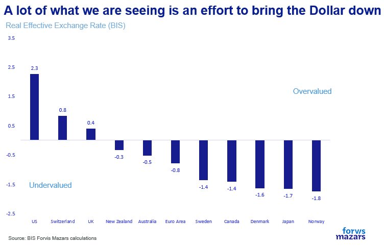
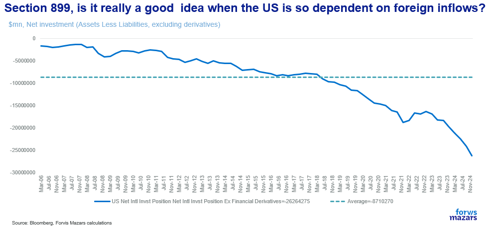
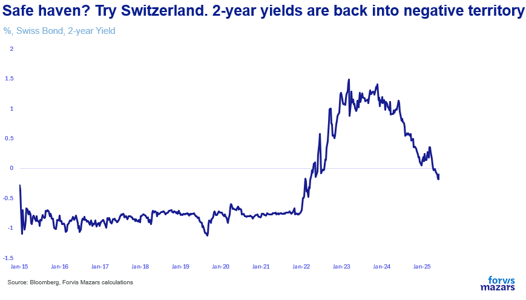

# Would you still buy a US Treasury at 5%? (probably yes)

**Date:** June 12, 2025  
**Publisher:** Breakwave Advisors | **Category:** Market Insights  
**Original URL:** [https://www.breakwaveadvisors.com/insights/2025/6/12/would-you-still-buy-a-us-treasury-at-5-probably-yes](https://www.breakwaveadvisors.com/insights/2025/6/12/would-you-still-buy-a-us-treasury-at-5-probably-yes)  

---

1. **New US capital control rules included in the Mega-bill (which is not yet law) could dent returns for Dollar investors.**
2. **These changes, which will likely affect bonds more than equities, are clearly aimed at reducing demand for the US Dollar, to allow for further depreciation.**
3. **Will this affect the Dollar’s status as a global reserve currency and the Treasury’s as a global risk-free asset? We don’t think that there’s any other market deep enough to satisfy global demand for either.**

*By*[*George Lagarias*](https://www.linkedin.com/in/george-lagarias-mba-3baa769/)

--------------------------------

Executive Summary

**Despite new U.S. tax proposals targeting foreign investors, we believe there is no viable long-term alternative to the Dollar or U.S. Treasuries. While these measures act as light capital controls and may erode fixed income returns, global demand for “risk-free” assets far exceeds the supply of alternatives like Swiss bonds or gold. Investors may grumble—but most will likely adapt, seeking tax-efficient strategies rather than exiting U.S. markets. The U.S. government is betting that its financial dominance remains unshaken, and for now, that bet appears sound. The likely outcome: more tax complexity, modest portfolio adjustments, and a persistent status quo in global capital flows.**

------------------------------------

Far be it from this newsletter to discuss tax policy … despite the fact the Chief Economist works for a renowned global audit, consulting and**tax**firm. Yet, the important economic and financial news of the week are not about the Trump-Musk fallout, or even the National Guard being deployed in California. Rather, investors should turn their attention to a mundane article of the “One Beautiful Bill” called “Section 899”. If voted into law, the section gives the Treasury Secretary (thus the President) the power to tax interest, dividends and rent flowing to foreigners in countries with tax systems that the law defines as “unfair”. The rate will start at 5% but could rise as high as 20%. A separate clause would see remittances towards foreign countries (for companies who make a profit in the US and for whatever reason want to remit money overseas) taxed at 3.5%.

This is in line with the general “tax foreigners” plan of the US administration, and may become especially important as tariff income, which was planned to partially offset the $2.4 fiscal demands from the tax bill, becomes increasingly uncertain after it was challenged in court (an appeals court upheld tariffs for “National Interest” reasons, but everything will likely end up in the Supreme Court where the case will be judged on its merits.

The “foreign tax” is particularly worrying for foreign investors, especially fixed income ones. Equities can afford a modicum of taxation. Dividends are small (1.3% dividend yield) and growth of 12.2% for the last 10 years compensates. But for bondholders, things are different. Someone buying a 2-year bond at 4.2% per annum loses at least 2.5% (and possibly 3%) to inflation, leaving a 1.2% real yield. A coupon of 3.8% would lose 20% due to taxation, so another 0.75%. This would leave investors with a 0.45% return. If the Fed acquiesces to lowering rates to accommodate the White House, even as inflation possibly picks up, or the Dollar retrenches further to improve exports, then it is very easy for a foreign investor to lose money on what is considered the world’s safest asset. As for companies who will want to remit funds for whatever reasons outside the US, they will now have to make sure they don’t repatriate Dollars unless they absolutely need to. Both of these measures are a form of light capital controls.

On the one hand, the policy is consistent with a weaker Dollar as a way to revive manufacturing and reduce trade deficits. A lower Dollar will help American companies export less and import only the bare necessities. Stephen Miran, the President’s Chair of the Council of Economic Advisers is on the record that a weaker Dollar is the best policy, and Treasury Secretary (and possible Fed pick) Scott Bessent has often suggested that there’s no alternative to the Dollar as the global reserve and to American global leadership. In other words, the US government will push for whatever it can get out of the Dollar’s status, in the belief that its position is, for the time being unassailable. There will always be demand for Dollars and for Treasuries, especially around the 5%.

> **Figure 1: Market Chart 1**  
> [Local Asset](file:///C:/Users/Dell/Github/Shipping/corpus/03-breakwave/insights/2025/assets/2025-06-12_would-you-still-buy-a-us-treasury-at-5-probably-yes_img_image001_8650ade01dce.png)

On the other hand, the US’s net investments (assets less liabilities) deficit, is very wide. The country depends on foreign money significantly to keep itself funded.

> **Figure 2: Market Chart 2**  
> [Local Asset](file:///C:/Users/Dell/Github/Shipping/corpus/03-breakwave/insights/2025/assets/2025-06-12_would-you-still-buy-a-us-treasury-at-5-probably-yes_img_image002_8300bac4a854.png)

Up to a point, some of that can be substituted with simple printing by the Fed. The US central bank already owns 15% of all US debt, and could add to that, pushing the Dollar even lower. But, in the words of Kenneth Rogoff, these actions will simply compel competitive economies to find ways to shift away from the Dollar faster, accelerating its decline.

From an investor standpoint, the question is now clear: will investors seek other “Risk Free” investments, like Swiss Bonds (which are again in negative-yielding territory, but have nowhere near the issuance capacity to supplant the Treasury) or the Bund or even real assets (gold, real estate, inflation-linked securities).

> **Figure 3: Market Chart 3**  
> [Local Asset](file:///C:/Users/Dell/Github/Shipping/corpus/03-breakwave/insights/2025/assets/2025-06-12_would-you-still-buy-a-us-treasury-at-5-probably-yes_img_image003_10ee969fa6e1.png)

Or will they behaviourally accept that the US’s financial system advantage is so big, that the government can afford to greatly lean on it and simply try to find more tax-efficient ways to go about their business.

Partial to big ideas as this newsletter is, we simply see no long-term alternative for the Dollar and the Treasury at this point. There isn’t enough gold or Swiss bonds to satisfy global demand for “Risk-Free” assets, even if the Treasury’s risk free status is challenged. It will likely mean a lot of overtime for tax experts, but the status quo will persist.

---

**Tags:** Macro, Economy, Markets  
