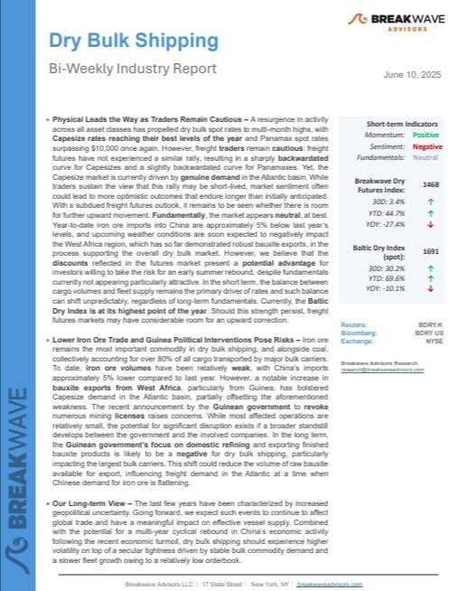
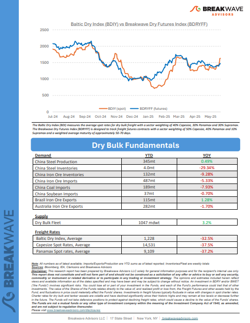

# Breakwave Weekend Read

**Date:** June 13, 2025  
**Publisher:** Breakwave Advisors | **Category:** Market Insights  
**Original URL:** [https://www.breakwaveadvisors.com/insights/2024/10/25/breakwave-weekend-read-547kk-rw7zy-awmfb-mf26k](https://www.breakwaveadvisors.com/insights/2024/10/25/breakwave-weekend-read-547kk-rw7zy-awmfb-mf26k)  

---

## Welcome Tobreakwave Advisorsweekend Read

***As the week comes to a close, take a moment to review the key insights from the past few days. Missed something? We've gathered all the top insights for you to catch up at your convenience.***

## Breakwave Shipping Report

**Physical Leads the Way as Traders Remain Cautious**– A resurgence in activity across all asset classes has propelled dry bulk spot rates to multi-month highs, with**Capesize rates reaching their best levels of the year**and Panamax spot rates surpassing $10,000 once again.

[Read More](https://www.breakwaveadvisors.com/insights/2025610-dry5kji55547l)

> **Figure 1: %Ce%a3%cf%84%ce%b9%ce%b3%ce%bc%ce%b9%cf%8c%cf%84%cf%85%cf%80%ce%bf+%ce%bf%ce%b8%cf%8c%ce%bd%ce%b7%cf%82+2025 06 12+125432**  
> **Interactive Data & Source:** [Breakwave Advisors Market Insights](https://www.breakwaveadvisors.com/insights/2025/6/9/the-global-economy-continues-to-navigate-a-patchy-recovery) | [Local Asset](file:///C:/Users/Dell/Github/Shipping/corpus/03-breakwave/insights/2025/assets/2025-06-13_breakwave-weekend-read-547kk-rw7zy-awmfb-mf26k_img_25ce25a325cf258425ce25b925ce25b325ce_aa4128f0ffc2.jpg)

> **Figure 2: Στιγμιότυπο Οθόνης 2025 06 12 125506**  
> **Interactive Data & Source:** [Breakwave Advisors Market Insights](https://www.breakwaveadvisors.com/insights/2025/6/9/the-global-economy-continues-to-navigate-a-patchy-recovery) | [Local Asset](file:///C:/Users/Dell/Github/Shipping/corpus/03-breakwave/insights/2025/assets/2025-06-13_breakwave-weekend-read-547kk-rw7zy-awmfb-mf26k_img_cea3cf84ceb9ceb3cebcceb9cf8ccf84cf85_7eec5681876e.png)

## The Global Economy Continues to Navigate a Patchy Recovery

> **Figure 3: The Global Economy Continues to Navigate a Patchy Recovery**  
> **Interactive Data & Source:** [Breakwave Advisors Market Insights](https://www.breakwaveadvisors.com/insights/2025/6/9/the-global-economy-continues-to-navigate-a-patchy-recovery) | [Local Asset](file:///C:/Users/Dell/Github/Shipping/corpus/03-breakwave/insights/2025/assets/2025-06-13_breakwave-weekend-read-547kk-rw7zy-awmfb-mf26k_img_theglobaleconomycontinuestonavigatea_631d13db9cf4.png)

As the global economy continues to navigate a patchy recovery, the dry bulk market found some footing this week..

Doric Weekly Market Insights

## Capesize Iron Ore Freight Market Trends

> **Figure 4: Προσθέστε Επικεφαλίδα**  
> **Interactive Data & Source:** [Breakwave Advisors Market Insights](https://www.breakwaveadvisors.com/insights/2025/6/8/capesize-iron-ore-freight-market-trends) | [Local Asset](file:///C:/Users/Dell/Github/Shipping/corpus/03-breakwave/insights/2025/assets/2025-06-13_breakwave-weekend-read-547kk-rw7zy-awmfb-mf26k_img_cea0cf81cebfcf83ceb8ceadcf83cf84ceb5_c28a2983b396.png)

This week's Market Monitor highlights Capesize freight market trends across the C3, C5, and C17 routes, as the Baltic Dry Index (BDI) gains momentum, driven primarily by the strong performance of the Capesize segment.

Signal Ocean Dry Weekly Market Monitor

## Vietnam’s Energy Tightrope - Between Black and Green

> **Figure 5: Ανώνυμο Σχέδιο**  
> **Interactive Data & Source:** [Breakwave Advisors Market Insights](https://www.breakwaveadvisors.com/insights/2025/6/10/vietnams-energy-tightrope-between-black-and-green) | [Local Asset](file:///C:/Users/Dell/Github/Shipping/corpus/03-breakwave/insights/2025/assets/2025-06-13_breakwave-weekend-read-547kk-rw7zy-awmfb-mf26k_img_ce91cebdcf8ecebdcf85cebccebfcf83cf87_c6bec3b46801.png)

Vietnam’s rapid economic growth from the 2010s to the present has solidified its status as a Southeast Asian manufacturing powerhouse.

BRS Weekly Dry Bulk Newsletter

## Strengths and Weaknesses in Current Dry Bulk Market

> **Figure 6: Ανώνυμο Σχέδιο (1)**  
> **Interactive Data & Source:** [Breakwave Advisors Market Insights](https://www.breakwaveadvisors.com/insights/2025/6/11/strengths-and-weaknesses-in-current-dry-bulk-market) | [Local Asset](file:///C:/Users/Dell/Github/Shipping/corpus/03-breakwave/insights/2025/assets/2025-06-13_breakwave-weekend-read-547kk-rw7zy-awmfb-mf26k_img_ce91cebdcf8ecebdcf85cebccebfcf83cf87_93637ca39a50.png)

Overall dry bulk rates increased last week. Capesize rates jumped another 25%.

[Read More](https://www.breakwaveadvisors.com/insights/2025/6/11/strengths-and-weaknesses-in-current-dry-bulk-market)

From Commodore's Weekly Dry Bulk Reports

## Tankers Research Update

> **Figure 7: Προσθέστε Επικεφαλίδα (1)**  
> **Interactive Data & Source:** [Breakwave Advisors Market Insights](https://www.breakwaveadvisors.com/insights/2025/6/11/tankers-research-update) | [Local Asset](file:///C:/Users/Dell/Github/Shipping/corpus/03-breakwave/insights/2025/assets/2025-06-13_breakwave-weekend-read-547kk-rw7zy-awmfb-mf26k_img_cea0cf81cebfcf83ceb8ceadcf83cf84ceb5_4dd4aa7ba29a.png)

VLCC tonne miles fell as China's crude imports fell to four-month low in May.

Braemar Research

## Will China Continue to Build Stock?

> **Figure 8: Ανώνυμο Σχέδιο (2)**  
> **Interactive Data & Source:** [Breakwave Advisors Market Insights](https://www.breakwaveadvisors.com/insights/2025/6/11/will-china-continue-to-build-stock) | [Local Asset](file:///C:/Users/Dell/Github/Shipping/corpus/03-breakwave/insights/2025/assets/2025-06-13_breakwave-weekend-read-547kk-rw7zy-awmfb-mf26k_img_ce91cebdcf8ecebdcf85cebccebfcf83cf87_395ded8bc579.png)

China recorded another month of strong crude stock builds in May, even as seaborne imports softened.

Vortexa Freight Weekly

## Would You Still Buy a Us Treasury at 5%? (Probably Yes)

> **Figure 9: Would You Still Buy a Us Treasury at 5% (Probably Yes)**  
> **Interactive Data & Source:** [Breakwave Advisors Market Insights](https://www.breakwaveadvisors.com/insights/2025/6/12/would-you-still-buy-a-us-treasury-at-5-probably-yes) | [Local Asset](file:///C:/Users/Dell/Github/Shipping/corpus/03-breakwave/insights/2025/assets/2025-06-13_breakwave-weekend-read-547kk-rw7zy-awmfb-mf26k_img_wouldyoustillbuyaustreasuryat52528pr_a1bb9e4229e6.png)

New US capital control rules included in the Mega-bill (which is not yet law) could dent returns for Dollar investors.

Forvis Mazars Weekly Note

## Oil Surges Amid Renewed Geopolitical Tensions

> **Figure 10: Ανώνυμο Σχέδιο (3)**  
> **Interactive Data & Source:** [Breakwave Advisors Market Insights](https://www.breakwaveadvisors.com/insights/2025/6/12/oil-surges-amid-renewed-geopolitical-tensions) | [Local Asset](file:///C:/Users/Dell/Github/Shipping/corpus/03-breakwave/insights/2025/assets/2025-06-13_breakwave-weekend-read-547kk-rw7zy-awmfb-mf26k_img_ce91cebdcf8ecebdcf85cebccebfcf83cf87_1f28fd7e8b3a.png)

Rising geopolitical tensions lifted energy markets. Easing trade tension elicited a muted response from metals. Weak US inflation data pushed gold higher.

Commodities Wrap

## Dwindling Inventories Pushes Copper Higher

> **Figure 11: Ανώνυμο Σχέδιο (2)**  
> **Interactive Data & Source:** [Breakwave Advisors Market Insights](https://www.breakwaveadvisors.com/insights/2025/6/6/dwindling-inventories-pushes-copper-higher) | [Local Asset](file:///C:/Users/Dell/Github/Shipping/corpus/03-breakwave/insights/2025/assets/2025-06-13_breakwave-weekend-read-547kk-rw7zy-awmfb-mf26k_img_ce91cebdcf8ecebdcf85cebccebfcf83cf87_e7ab15a16b08.png)

Easing trade tensions helped push the energy sector higher. Metals gained on signs of tightness as supply disruptions mount.

Commodities Wrap

## Indonesia Remains China's Primary Source of Coal Imports

> **Figure 12: Ανώνυμο Σχέδιο (4)**  
> **Interactive Data & Source:** [Breakwave Advisors Market Insights](https://www.breakwaveadvisors.com/insights/2025/6/13/indonesia-remains-chinas-primary-source-of-coal-imports) | [Local Asset](file:///C:/Users/Dell/Github/Shipping/corpus/03-breakwave/insights/2025/assets/2025-06-13_breakwave-weekend-read-547kk-rw7zy-awmfb-mf26k_img_ce91cebdcf8ecebdcf85cebccebfcf83cf87_75fab2c9932a.png)

As we discussed in Commodore Research's most recent Weekly China Report, April saw China's coal imports from Indonesia total 14.3 million tons.

From Commodore's Weekly Dry Bulk Reports

## Iron Ore Trade Flows

> **Figure 13: Ανώνυμο Σχέδιο (5)**  
> **Interactive Data & Source:** [Breakwave Advisors Market Insights](https://www.breakwaveadvisors.com/insights/2025/6/13/iron-ore-trade-flows) | [Local Asset](file:///C:/Users/Dell/Github/Shipping/corpus/03-breakwave/insights/2025/assets/2025-06-13_breakwave-weekend-read-547kk-rw7zy-awmfb-mf26k_img_ce91cebdcf8ecebdcf85cebccebfcf83cf87_c863875df294.png)

This week’s Market Monitor highlights the strong performance in Capesize iron ore flows, which have continued to support demand throughout the year.

Signal Ocean Dry Weekly Market Monitor

---

**Tags:** Shipping, Tankers, Drybulk  
