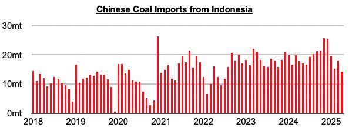
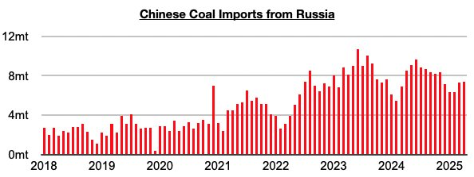
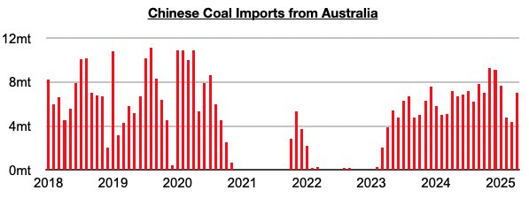
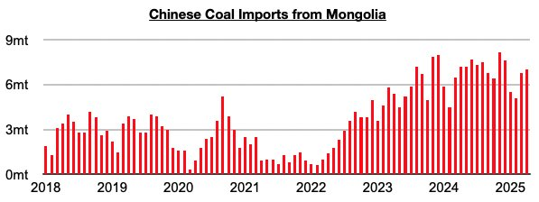
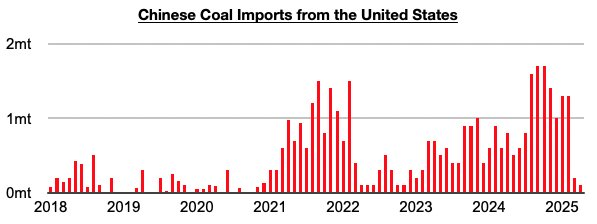

# Indonesia Remains China's Primary Source of Coal Imports

**Date:** June 13, 2025  
**Publisher:** Breakwave Advisors | **Category:** Market Insights  
**Original URL:** [https://www.breakwaveadvisors.com/insights/2025/6/13/indonesia-remains-chinas-primary-source-of-coal-imports](https://www.breakwaveadvisors.com/insights/2025/6/13/indonesia-remains-chinas-primary-source-of-coal-imports)  

---

*By*[*Jeffrey Landsberg*](https://www.linkedin.com/in/jeffrey-landsberg-70ab957/)

As we discussed in Commodore Research's most recent Weekly China Report, April saw China's coal imports from Indonesia total 14.3 million tons. This is down month-on-month by 3.7 million tons (21%) and is down year-on-year by 3.5 million tons (-20%). Indonesia remains China’s primary source of coal imports.

> **Figure 1: Chart 1**  
> [Local Asset](file:///C:/Users/Dell/Github/Shipping/corpus/03-breakwave/insights/2025/assets/2025-06-13_indonesia-remains-chinas-primary-source-of-coal-imports_img_chart1_14924afe2f19.jpg)

Imports from Russia, China’s second largest source of coal imports during the last several months, totaled 7.4 million tons. This is up month-on-month by 100,000 tons (1%) but is down year-on-year by 1.1 million tons (-13%).

> **Figure 2: Chart 2**  
> [Local Asset](file:///C:/Users/Dell/Github/Shipping/corpus/03-breakwave/insights/2025/assets/2025-06-13_indonesia-remains-chinas-primary-source-of-coal-imports_img_chart2_4caca4cdf94c.jpg)

Imports from Australia totaled 7 million tons. This is up month-on-month by 2.6 million tons (59%) but is down year-on-year by 200,000 tons (-3%). Imports from Australia peaked in November.

> **Figure 3: Chart 3**  
> [Local Asset](file:///C:/Users/Dell/Github/Shipping/corpus/03-breakwave/insights/2025/assets/2025-06-13_indonesia-remains-chinas-primary-source-of-coal-imports_img_chart3_0fa9122e9154.jpg)

Imports from Mongolia totaled 7 million tons. This is up from March by 200,000 tons (3%) but is down year-on-year by 200,000 tons (-3%).

> **Figure 4: Chart 4**  
> [Local Asset](file:///C:/Users/Dell/Github/Shipping/corpus/03-breakwave/insights/2025/assets/2025-06-13_indonesia-remains-chinas-primary-source-of-coal-imports_img_chart4_ab064c3c6019.jpg)

Imports from the United States totaled 100,000 tons. This is down from March by 100,000 tons (-50%) and is down year-on-year by 700,000 tons (-88%).

> **Figure 5: Chart 5**  
> [Local Asset](file:///C:/Users/Dell/Github/Shipping/corpus/03-breakwave/insights/2025/assets/2025-06-13_indonesia-remains-chinas-primary-source-of-coal-imports_img_chart5_76ba577d2aad.jpg)

---

**Tags:** Coal, Markets, Shipping  
