# Iron Ore Trade Flows

**Date:** June 13, 2025  
**Publisher:** Breakwave Advisors | **Category:** Market Insights  
**Original URL:** [https://www.breakwaveadvisors.com/insights/2025/6/13/iron-ore-trade-flows](https://www.breakwaveadvisors.com/insights/2025/6/13/iron-ore-trade-flows)  

---

**Dry Weekly Market Monitor - Week 24, 2025**
Snapshot of Spot Freight Rates, Supply-Demand Trends, Port Congestions
June 13, 2025

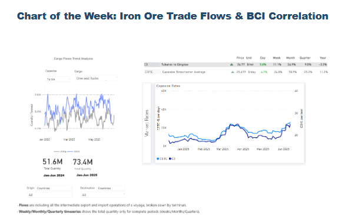

> **Figure 1: Στιγμιότυπο Οθόνης 2025 06 13 133816**  
> **Interactive Data & Source:** [Signal Ocean Platform](https://www.thesignalgroup.com/signal-ocean-platform) | [Local Asset](file:///C:/Users/Dell/Github/Shipping/corpus/03-breakwave/insights/2025/assets/2025-06-13_iron-ore-trade-flows_img_cea3cf84ceb9ceb3cebcceb9cf8ccf84cf85_542582629a53.png)

This week’s Market Monitor highlights the strong performance in Capesize iron ore flows, which have continued to support demand throughout the year. This trend is reflected in the recent strengthening of the Baltic Capesize Index and average earnings on the C5TC route.

Bauxite shipments have also played a notable role in supporting Capesize fleet employment, with a significant increase in volumes from**Guinea to China**during the first quarter of the year. However, there are growing concerns about the sustainability of this trend into the second and third quarters.**West Africa's wet season, which typically spans from May to October**, could disrupt mining and logistics operations and reduce loading efficiency at ports such as Kamsar. This seasonal pattern could lead to a drop in bauxite exports, particularly in Q3, placing downward pressure on Capesize employment from this trade.

Meanwhile, the broader strength of the Baltic Dry Index continues to be supported by the Capesize segment. Voyage data estimates show a firm 7-day moving average in iron ore shipments, indicating consistent demand for Capesize vessels.

On the supply side, while there are indications of a decline in the number of ballast vessels, today’s market sentiment appears primarily driven by**cargo demand rather than vessel supply tightening**. This suggests that the current bullish trend may remain stable in the near term, provided demand for key cargoes like iron ore and bauxite holds.

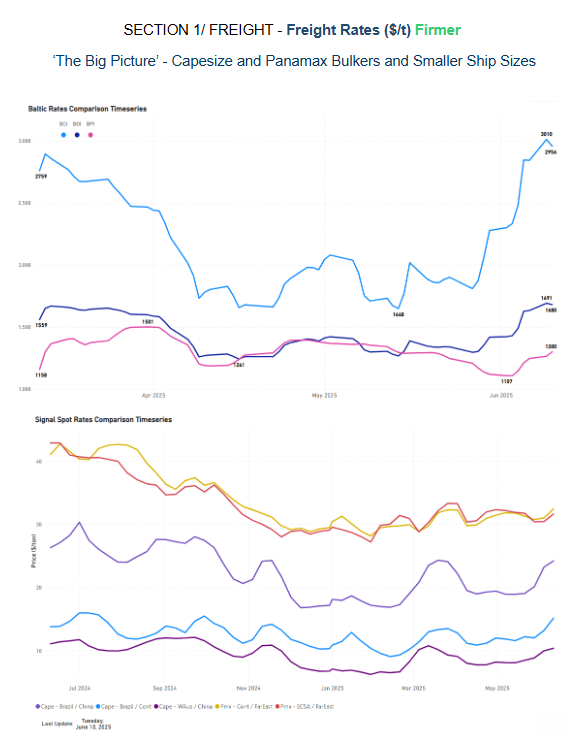

> **Figure 2: Στιγμιότυπο Οθόνης 2025 06 13 133754**  
> **Interactive Data & Source:** [Signal Ocean Platform](https://www.thesignalgroup.com/signal-ocean-platform) | [Local Asset](file:///C:/Users/Dell/Github/Shipping/corpus/03-breakwave/insights/2025/assets/2025-06-13_iron-ore-trade-flows_img_cea3cf84ceb9ceb3cebcceb9cf8ccf84cf85_118a5adff153.png)

The second week of June was marked by a stronger performance in both the Capesize and Panamax vessel size segments, with the Baltic Dry Index reaching its highest level since mid-March. According to real-time assessments by Signal Ocean, Capesize freight rates on the Brazil–North China, Brazil–Continent, and West Australia–China routes aligned with the positive weekly trends recorded in the Baltic Capesize Index, continuing to post stronger gains in terms of $/tonne. In the Panamax segment, Signal Ocean assessments for the Continent–Far East and ECSA–Far East routes showed slightly improved trends, while the outstanding performer route remained the Capesize Brazil–North China.

- **Capesize**vessel freight rates on the Brazil–North China route increased by 8% week-on-week, reaching approximately $24 per tonne. This upward trend, as projected last week, continued to be driven by a reduced number of Capesize ballasters heading to the South Atlantic and a higher daily volume of cargo being loaded. As shown in the image below, the daily cargo volume loaded onto Capesize vessels in the South Atlantic reached 1.3 million tonnes (mt), compared to the recent low of under 1 million tonnes recorded in mid-February.

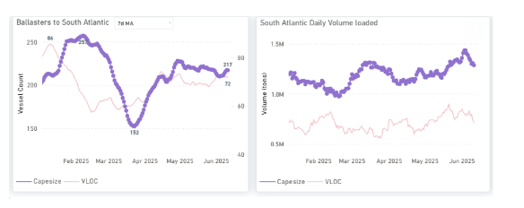

> **Figure 3: Στιγμιότυπο Οθόνης 2025 06 13 133829**  
> **Interactive Data & Source:** [Signal Ocean Platform](https://www.thesignalgroup.com/signal-ocean-platform) | [Local Asset](file:///C:/Users/Dell/Github/Shipping/corpus/03-breakwave/insights/2025/assets/2025-06-13_iron-ore-trade-flows_img_cea3cf84ceb9ceb3cebcceb9cf8ccf84cf85_5d15a0916fe5.png)

- **Panamax**vessel freight rates from the Continent and ECSA to the Far East were approximately $32 per tonne. Despite an increase in Panamax ballasters to ECSA, which caused oversupply and limited freight returns, the daily ECSA loading volume peaked, indicating sufficient cargo demand.

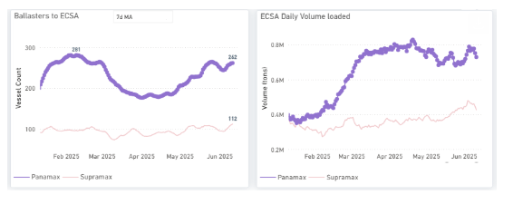

> **Figure 4: Στιγμιότυπο Οθόνης 2025 06 13 133838**  
> **Interactive Data & Source:** [Signal Ocean Platform](https://www.thesignalgroup.com/signal-ocean-platform) | [Local Asset](file:///C:/Users/Dell/Github/Shipping/corpus/03-breakwave/insights/2025/assets/2025-06-13_iron-ore-trade-flows_img_cea3cf84ceb9ceb3cebcceb9cf8ccf84cf85_0b7cfa23b299.png)

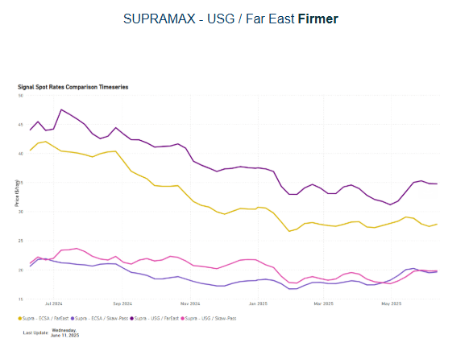

> **Figure 5: Στιγμιότυπο Οθόνης 2025 06 13 133844**  
> **Interactive Data & Source:** [Signal Ocean Platform](https://www.thesignalgroup.com/signal-ocean-platform) | [Local Asset](file:///C:/Users/Dell/Github/Shipping/corpus/03-breakwave/insights/2025/assets/2025-06-13_iron-ore-trade-flows_img_cea3cf84ceb9ceb3cebcceb9cf8ccf84cf85_a5318bade9c0.png)

- **Supramax**vessel freight rates from the US Gulf (USG) to the Far East have strengthened since the end of April, reaching around $35/tonne, nearly 7% higher than a month earlier. This recent firmness is underpinned by a rebound in daily cargo volumes loaded and a gradual easing of the vessel oversupply that had built up earlier in the month. This trend is illustrated below with Supramax vessel counts (USG/USEC) declining from their March peak before rising again in June, while loaded volumes show a steady recovery across May and early June.

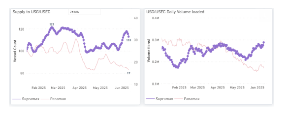

> **Figure 6: Στιγμιότυπο Οθόνης 2025 06 13 133851**  
> **Interactive Data & Source:** [Signal Ocean Platform](https://www.thesignalgroup.com/signal-ocean-platform) | [Local Asset](file:///C:/Users/Dell/Github/Shipping/corpus/03-breakwave/insights/2025/assets/2025-06-13_iron-ore-trade-flows_img_cea3cf84ceb9ceb3cebcceb9cf8ccf84cf85_20844df011dc.png)

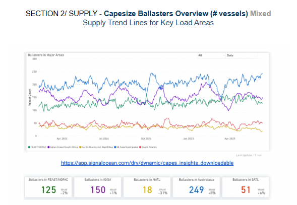

> **Figure 7: Στιγμιότυπο Οθόνης 2025 06 13 133858**  
> **Interactive Data & Source:** [Signal Ocean Platform](https://www.thesignalgroup.com/signal-ocean-platform) | [Local Asset](file:///C:/Users/Dell/Github/Shipping/corpus/03-breakwave/insights/2025/assets/2025-06-13_iron-ore-trade-flows_img_cea3cf84ceb9ceb3cebcceb9cf8ccf84cf85_a039b9d9d925.png)

**Capesize ballasters view**: Available vessels in the North Atlantic have declined compared to earlier this month. In the Pacific, while ballast vessel numbers are down in the Far East and North Pacific, Australasia has seen a recent surge, keeping overall levels high in that region.

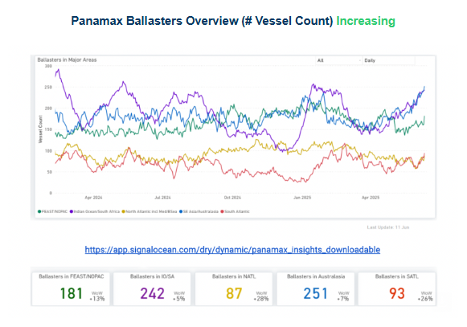

> **Figure 8: Στιγμιότυπο Οθόνης 2025 06 13 133905**  
> **Interactive Data & Source:** [Signal Ocean Platform](https://www.thesignalgroup.com/signal-ocean-platform) | [Local Asset](file:///C:/Users/Dell/Github/Shipping/corpus/03-breakwave/insights/2025/assets/2025-06-13_iron-ore-trade-flows_img_cea3cf84ceb9ceb3cebcceb9cf8ccf84cf85_5e9f0e3bd620.png)

**Panamax ballasters view**: The tightening signs previously observed in the Atlantic market at the end of May have started to ease, as indicated by a gradual increase in the number of ballast vessels. Meanwhile, the Pacific market remains heavily oversupplied in the Panamax sector, with ballast vessel counts peaking at 180 in the Far East/NOPAC region and 250 in Australasia.

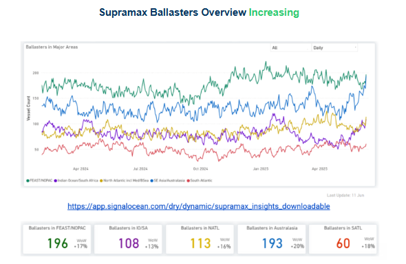

> **Figure 9: Στιγμιότυπο Οθόνης 2025 06 13 133912**  
> **Interactive Data & Source:** [Signal Ocean Platform](https://www.thesignalgroup.com/signal-ocean-platform) | [Local Asset](file:///C:/Users/Dell/Github/Shipping/corpus/03-breakwave/insights/2025/assets/2025-06-13_iron-ore-trade-flows_img_cea3cf84ceb9ceb3cebcceb9cf8ccf84cf85_16c04d382768.png)

**Supramax ballasters view**: The Pacific market, specifically for the Far East/NOPAC and Australasia routes, is experiencing oversupply. This is evidenced by over 190 vessels currently ballasting in those areas. In contrast, the South Atlantic market indicates a possible tightening of vessel supply. In the North Atlantic, the number of ballasting vessels is also significant, exceeding 100.

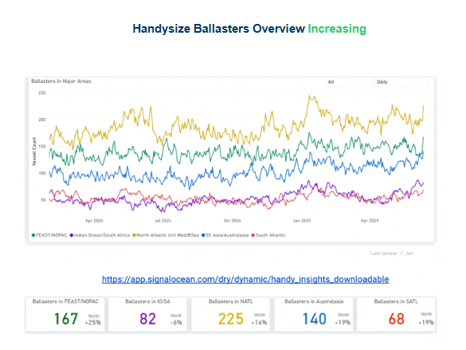

> **Figure 10: Στιγμιότυπο Οθόνης 2025 06 13 133918**  
> **Interactive Data & Source:** [Signal Ocean Platform](https://www.thesignalgroup.com/signal-ocean-platform) | [Local Asset](file:///C:/Users/Dell/Github/Shipping/corpus/03-breakwave/insights/2025/assets/2025-06-13_iron-ore-trade-flows_img_cea3cf84ceb9ceb3cebcceb9cf8ccf84cf85_f3b85c76b35b.png)

**Handysize ballasters:**Significant weekly increases in vessel oversupply were observed across both the Pacific and North Atlantic basins. The Pacific basin faced a more substantial burden, with the Far East/North Pacific region reaching approximately 170 vessels and Australasia peaking at 140. The North Atlantic's oversupply surpassed 220 ballasters.

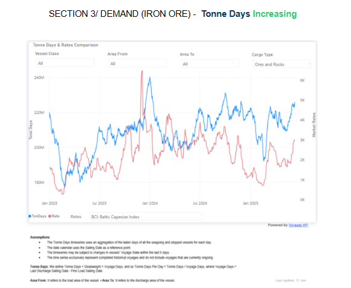

> **Figure 11: Στιγμιότυπο Οθόνης 2025 06 13 133926**  
> **Interactive Data & Source:** [Signal Ocean Platform](https://www.thesignalgroup.com/signal-ocean-platform) | [Local Asset](file:///C:/Users/Dell/Github/Shipping/corpus/03-breakwave/insights/2025/assets/2025-06-13_iron-ore-trade-flows_img_cea3cf84ceb9ceb3cebcceb9cf8ccf84cf85_714d059782ef.png)

**Iron ore's**dry bulk tonne days, measured as an aggregation of the laden days of all the seagoing and stopped vessels for each day, saw a significant surge from mid-May lows, propelling the overall growth of dry bulk tonne days. Notably, this rise coincided with the strong performance of the Baltic Capesize Index. Since mid-May, iron ore tonne days' growth has increased by 7%, while the BCI has jumped 25% quarter-over-quarter.

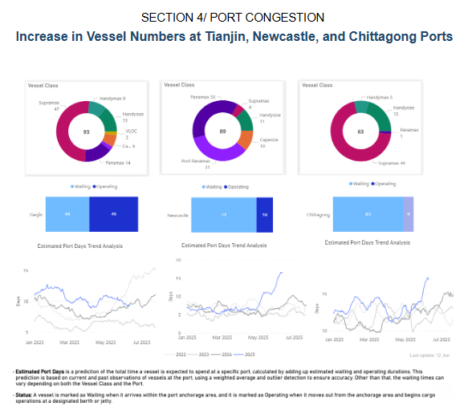

> **Figure 12: Στιγμιότυπο Οθόνης 2025 06 13 133943**  
> **Interactive Data & Source:** [Signal Ocean Platform](https://www.thesignalgroup.com/signal-ocean-platform) | [Local Asset](file:///C:/Users/Dell/Github/Shipping/corpus/03-breakwave/insights/2025/assets/2025-06-13_iron-ore-trade-flows_img_cea3cf84ceb9ceb3cebcceb9cf8ccf84cf85_c8f93ac80312.png)

During the second week of June 2025,**vessel counts**at Newcastle and Chittagong experienced significant increases in the number of vessels anchored and awaiting berths, contributing to an estimated four-year high in port days. Newcastle's port congestion, initially noted in the Week 22 Market Monitor and exacerbated by ongoing weather disruptions, continues to affect operational efficiency. Increased challenges are evident at Chittagong, where imported containers are piling up. This buildup stems from limited deliveries during the Eid al-Adha holidays. Consequently, many factories and transport services have not yet fully resumed their operations.

Data Source:[Signal Ocean Platform](https://www.thesignalgroup.com/signal-ocean-platform)

---

**Tags:** Ironore, Drybulk, Shipping  
