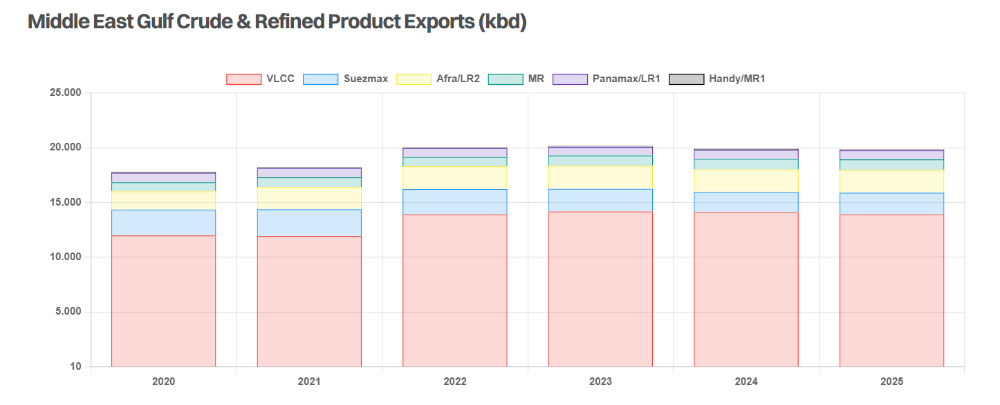

# Tense Times

**Date:** June 16, 2025  
**Publisher:** Breakwave Advisors | **Category:** Market Insights  
**Original URL:** [https://www.breakwaveadvisors.com/insights/2025/6/16/tense-times](https://www.breakwaveadvisors.com/insights/2025/6/16/tense-times)  

---

> **Figure 1: Tanker Off Port**  
> **Interactive Data & Source:** [Gibsons Co](https://www.gibsons.co.uk/market-reports) | [Local Asset](file:///C:/Users/Dell/Github/Shipping/corpus/03-breakwave/insights/2025/assets/2025-06-16_tense-times_img_tanker-off-port_2b501372fef3.jpg)

Tensions between Israel and Iran are nothing new, but they came to a head overnight. The situation remains fluid and at this point in time could turn in a number of different directions. Israel has been clear that further attacks are planned. The United States, claimed not to be involved in supporting the attacks, but has warned that more intense strikes are planned, unless Iran agrees to a nuclear deal. Talks with Iran are/were planned for this coming weekend, but only time will tell if those talks do indeed proceed. So, with all that in mind, how might the tanker markets be impacted?

Given that further attacks are likely, and Iran will also want to retaliate, our analysis focuses on the options for retaliation.

Iran could try to close the Straits of Hormuz. A prolonged closure is highly unlikely to succeed, but if it did, would have catastrophic implications for global oil trade. Approximately 20 million b/d of crude and products transit Hormuz daily, an amount which cannot be fully replaced from other sources or redirected via pipeline. Whilst tanker rates could surge following a closure, though in the long term they would likely suffer from a lack of cargo, whilst the global economy would also suffer from high energy prices. Given how critical the waterway is for the regional and global economy, any closure is likely to be short-lived.

A more likely scenario is that Iran seeks to disrupt shipping activity in the region, which could include limited attacks, hijacking, and the harassment of ships passing by. Under such a scenario, the pool of shipowners willing to transit would likely shrink, leading to an increase in freight costs for exports via Hormuz. Demand for lifting crude from safer load zones in the Atlantic could also benefit, whilst higher oil prices might help reverse the decline in US production. Under this scenario Middle East exports would be largely sustained, with some upside for producers elsewhere in the world, likely benefitting freight rates.

Iran could also seek to use the Houthi’s to increase attacks against Red Sea shipping, as well as targeting Israel. How much capacity the Houthi’s have remains unclear, given US efforts to substantially degrade their abilities this year. In any case, increased caution in the Red Sea is likely, with UK flagged vessels yesterday being warned against sailing through the waterway.

Diplomatic options may also be considered, although it feels like the opportunity for such diplomacy may have now passed. The US could also step up sanctions pressure on Iran in an attempt to drive its export revenue even lower. On Monday, we should have a better view of whether Israel really intends to continue strikes, whether any diplomatic measures can succeed, and perhaps further insight into Iran’s response.

### Middle East Gulf Crude & Refined Product Exports (Kbd)

> **Figure 2: Στιγμιότυπο Οθόνης 2025 06 16 104516**  
> **Interactive Data & Source:** [Gibsons Co](https://www.gibsons.co.uk/market-reports) | [Local Asset](file:///C:/Users/Dell/Github/Shipping/corpus/03-breakwave/insights/2025/assets/2025-06-16_tense-times_img_cea3cf84ceb9ceb3cebcceb9cf8ccf84cf85_5978a6f85a4c.png)

Data source:[Gibson Shipbrokers](https://www.gibsons.co.uk/market-reports)

---

**Tags:** Crude, Tankers, Markets  
