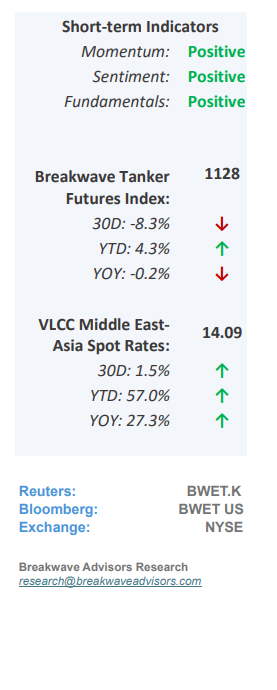
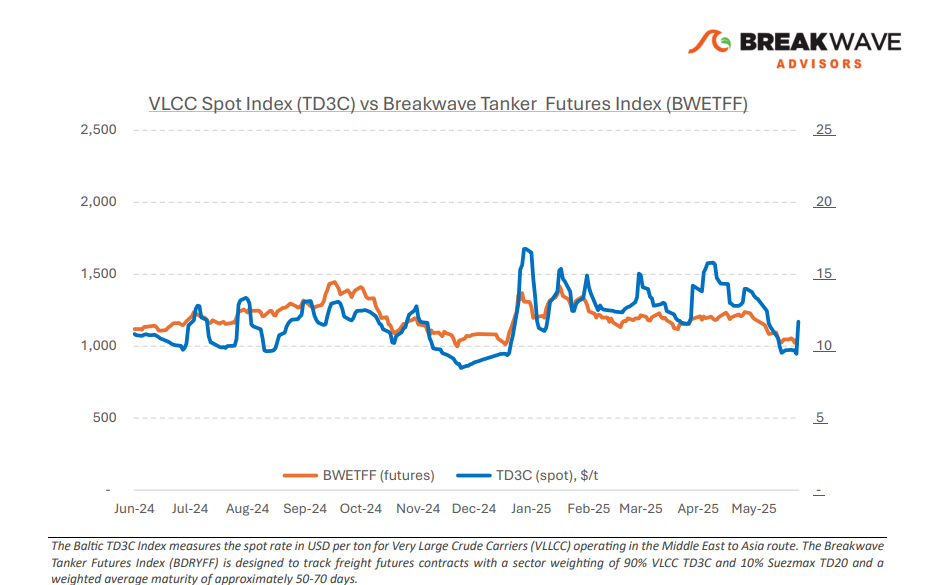
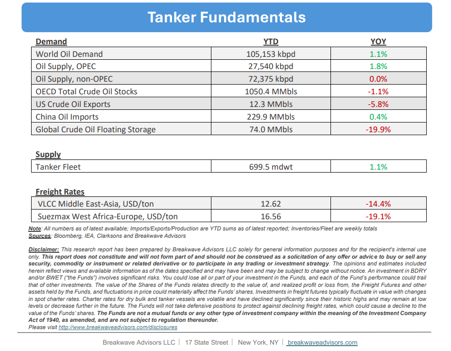

# Breakwave Bi-Weekly Tanker Report - June 17, 2025

**Date:** June 17, 2025  
**Publisher:** Breakwave Advisors | **Category:** Market Insights  
**Original URL:** [https://www.breakwaveadvisors.com/insights/2025176wetjhyu514](https://www.breakwaveadvisors.com/insights/2025176wetjhyu514)  

---

•**Black Swans Everywhere as VLCCs Surge**– The most**severe conflict**in the Middle East in decades has introduced considerable instability into the oil markets, which in turn**has impacted tanker shipping operations.**The ongoing war between Israel and Iran has significantly heightened risks to oil supplies, while the trajectory of the situation remains**uncertain**in the coming days and weeks. Given that the broader Middle East accounts for more than 25% of seaborne oil, such increased uncertainty is to be expected. In response,**VLCC**(Very Large Crude Carriers) freight rates have**moved up quickly,**as owners become increasingly hesitant to commit vessels in light of the escalating conflict. Without speculating on specific outcomes, it is reasonable to expect that this**heightened uncertainty**will**support firmer freight rates**, all other factors being equal, with the potential for sharp spikes. During such periods of tension,**tankers**are arguably the most**valuable assets**, acting as the crucial link in the oil supply chain. Historical precedent may offer some insights; however, the current situation is**unprecedented**, rendering traditional forecasting tools largely ineffective. War risk premiums are expected to influence gross rates significantly. The reluctance to dispatch multi-million-dollar vessels loaded with millions of barrels of oil through a conflict zone requires**higher compensation**, which is likely to keep freight rates elevated for cargoes originating from the Persian Gulf. Given the fluid situation and evolving risks, our focus remains on one core concern: the corresponding**riskadjusted cost of shipping**oil from the region.

> **Figure 1: Στιγμιότυπο Οθόνης 2025 06 17 124546**  
> [Local Asset](file:///C:/Users/Dell/Github/Shipping/corpus/03-breakwave/insights/2025/assets/2025-06-17_2025176wetjhyu514_img_cea3cf84ceb9ceb3cebcceb9cf8ccf84cf85_331ad0cbbae3.png)

•**Oil Prices Spike as Risk Premium Explodes**– Recent developments in the Middle East over the past week have prompted a sharp reevaluation of oil prices, as traders attempt to gauge the**likelihood of disruptions**in the global oil markets. While there are currently no indications of supply shortages, given that the market generally remains well-supplied, the prevailing uncertainty continues to keep participants cautious. This heightened vigilance is expected to persist for the time being. However, our assessment is that**potential disruptions of the scale**we are experiencing today are generally short-lived, supported by significant spare capacity and contingency plans within the global energy system. Nevertheless, this outlook is based on more typical circumstances, whereas the current situation involves a**full-scale conflict**, an inherently unpredictable scenario with potentially farreaching implications. Our best (albeit cautious) estimate is that the situation will eventually de-escalate, which would likely result in a**reduction of the risk premiums**embedded in oil prices over the coming weeks. On the other hand, it is prudent to consider that the current circumstances merit a cautious approach as a broadening of the conflict could directly impact regional oil production and exports, underscoring the importance of maintaining a low-risk stance overall.

•**Our Long-term View**– The tanker market is recovering from a long period of staggered rates as the growth in new vessel supply shrinks while oil demand remains elevated in line with the global economy. A historically low orderbook combined with favorable shifting trade patterns should continue to support increased spot rate volatility, which combined with the ongoing geopolitical turmoil, should sustain freight rates in the medium to long term.

> **Figure 2: Στιγμιότυπο Οθόνης 2025 06 17 093026**  
> [Local Asset](file:///C:/Users/Dell/Github/Shipping/corpus/03-breakwave/insights/2025/assets/2025-06-17_2025176wetjhyu514_img_cea3cf84ceb9ceb3cebcceb9cf8ccf84cf85_2bda0f188ae8.png)

> **Figure 3: Στιγμιότυπο Οθόνης 2025 06 17 124605**  
> [Local Asset](file:///C:/Users/Dell/Github/Shipping/corpus/03-breakwave/insights/2025/assets/2025-06-17_2025176wetjhyu514_img_cea3cf84ceb9ceb3cebcceb9cf8ccf84cf85_76727e94d626.png)

### Subscribe:
