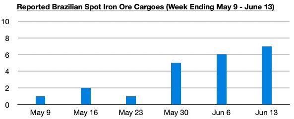
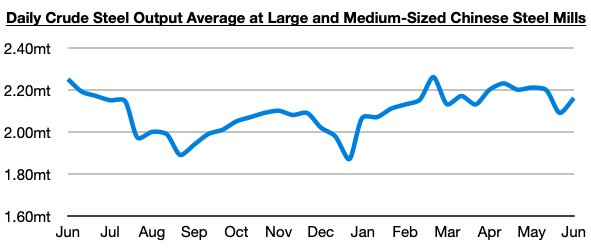

# Capesize Market Jumping on Brazil Iron Ore and Chinese Steel

**Date:** June 17, 2025  
**Publisher:** Breakwave Advisors | **Category:** Market Insights  
**Original URL:** [https://www.breakwaveadvisors.com/insights/2025/6/17/capesize-market-jumping-on-brazil-iron-ore-and-chinese-steel](https://www.breakwaveadvisors.com/insights/2025/6/17/capesize-market-jumping-on-brazil-iron-ore-and-chinese-steel)  

---

*By*[*Jeffrey Landsberg*](https://www.linkedin.com/in/jeffrey-landsberg-70ab957/)

As we discussed in Commodore Research's most recent Weekly Executive Report, dry bulk rates rose again last week, this time with rates rising in all four vessel classes. As with two weeks ago, capesize rates skyrocketed again due in great part from strong spot iron ore cargo volume, which continues to include more Brazilian cargoes. Last week’s initial officially reported Brazilian spot iron ore cargo volume alone came in at 7 cargoes, which marked the largest amount reported all year.

> **Figure 1: Chart 1**  
> [Local Asset](file:///C:/Users/Dell/Github/Shipping/corpus/03-breakwave/insights/2025/assets/2025-06-17_capesize-market-jumping-on-brazil-iron-ore-and-chinese-steel_img_chart1_5e5a92305ace.jpg)

Overall, we continue to stress that we remain bullish for China’s iron ore import prospects, and we remain of our long-held view that iron ore prices just have to stay high enough that global iron ore miners will continue to keep pumping out production (if the miners produce, China will continue to buy). Also of note in China is that while steel production has very recently re-entered a year-on-year contraction, it still remains at a relatively strong level. The most recently released data shows that daily crude steel production at large and medium-sized mills in China averaged 2.16 million tons during June 1 - June 10. This is up by 3% from late May and is down year-on-year by 4%. This level is still close to this year's peak and is well above recent lows.

> **Figure 2: Chart 2**  
> [Local Asset](file:///C:/Users/Dell/Github/Shipping/corpus/03-breakwave/insights/2025/assets/2025-06-17_capesize-market-jumping-on-brazil-iron-ore-and-chinese-steel_img_chart2_7714a198baa6.jpg)

---

**Tags:** Ironore, Capesize, Shipping  
