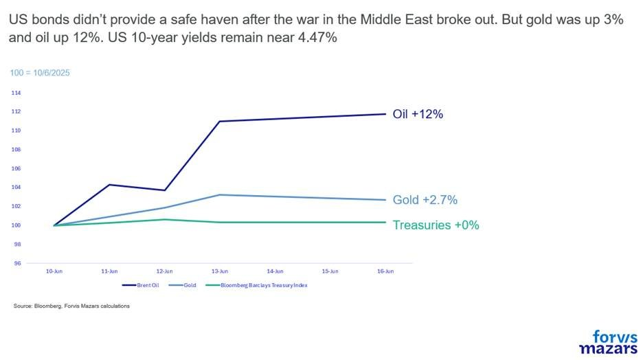
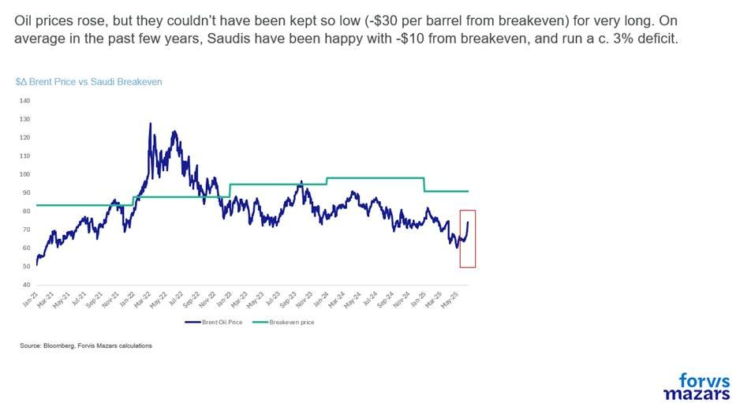
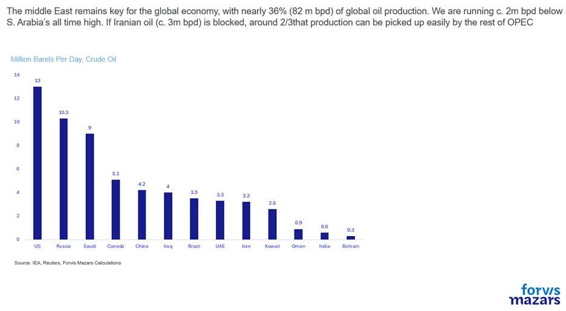
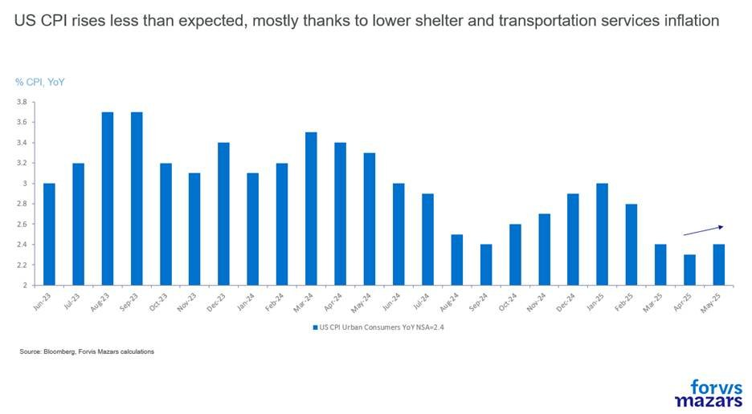
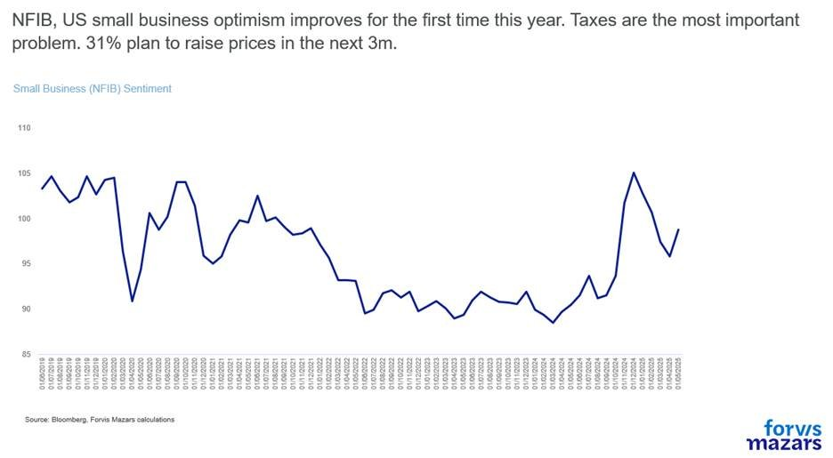
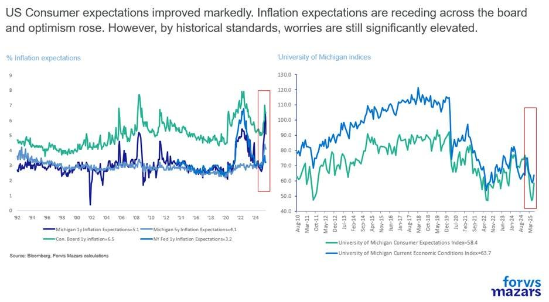
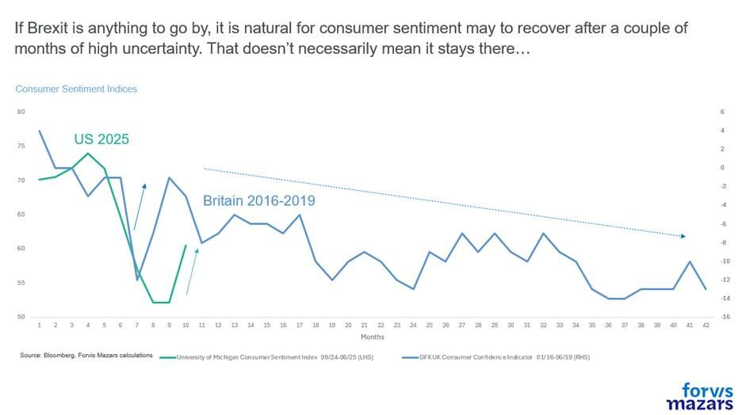

# Don’t look at war. US data was great

**Date:** June 17, 2025  
**Publisher:** Breakwave Advisors | **Category:** Market Insights  
**Original URL:** [https://www.breakwaveadvisors.com/insights/2025/6/17/dont-look-at-war-us-data-was-great](https://www.breakwaveadvisors.com/insights/2025/6/17/dont-look-at-war-us-data-was-great)  

---

The three things investors should know about this week:

1. The conflagration in the Middle East has raised worries, but markets treat it as a regionalised event.
2. Investors didn’t rush into US debt to protect themselves, making refinancing efforts for Washington a more difficult proposition.
3. However, the week also featured some good news from US consumers and businesses, with optimism rebounding in two key surveys, and inflation expectations subsiding.

*By*[*George Lagarias*](https://www.linkedin.com/in/george-lagarias-mba-3baa769/)

--------------------------

### Executive Summary

***Geopolitical tensions stirred markets, but investors still view conflict as regional. Oil’s rebound reflects more fundamentals and less panic, even as US Treasuries failed to offer their usual safe-haven appeal. However, war obscured some positive US surprises: inflation stayed moderate, business and consumer sentiment improved, and US-China trade tensions showed signs of easing. The key message is disruption remains central to the 2025 outlook as a test of adaptability. Rather than overreact to volatility, businesses and investors should focus on resilience—building strategies that withstand shocks, adapt to change, and seize opportunities where others see only risk. Resilience, not reactivity, will define success.***

-------------------------

The thing with war is that it epitomises Mike Tyson’s saying: “Everyone has a plan until they get punched in the face”. Once started, outcomes of a conflict[are unpredictable](https://www.youtube.com/watch?v=41cJUliIuH0), especially at an age when a £300 drone can take out a £3m tank. So we’ll do the smart thing this week and avoid assumptions. How might it end? How many countries might be drawn in? What will happen if?...

Financial markets have been jittery about it, and equities lost some momentum, to be sure, but in the past few years, investors have consistently seen that geopolitical conflict tends to remain a regionalised event, and are presently pricing in such an outcome.

The conflagration in the Middle East was a litmus test, however, as to whether US bonds are still the go-to safe haven for investors. And the outcomes were not particularly reassuring for an economy that wants to raise $10tn worth of debt this year, even after a 30-year bond auction last week went better than expected. Gold and Oil rallied as expected, but investors didn’t rush to the US 10-year Treasury which now yields around 2.5%.

> **Figure 1: Market Chart 1**  
> [Local Asset](file:///C:/Users/Dell/Github/Shipping/corpus/03-breakwave/insights/2025/assets/2025-06-17_dont-look-at-war-us-data-was-great_img_image008_4f1a704e2eb9.jpg)

Having said that, the jump in oil prices doesn’t necessarily mean that traders are beginning to price in oil shocks. Far from it. Oil prices were due a rebound. In the past few weeks, Brent Crude has been trading near $60, when the breakeven for the Saudi budget is around $90-$98. Saudia Arabia has been happy of course to let it drift lower to capture a larger market share, and possibly as a result of a wider agreement with the US, but $30 to $40 below Saudi breakeven was not sustainable for very long.

> **Figure 2: Market Chart 2**  
> [Local Asset](file:///C:/Users/Dell/Github/Shipping/corpus/03-breakwave/insights/2025/assets/2025-06-17_dont-look-at-war-us-data-was-great_img_image009_7ae225beaa14.jpg)

And Saudi Arabia is really what markets and investors should be focusing on. Even if Iranian oil goes out of production (c. only 3mn barrels per day(bpd)), the Saudi Kingdom alone can increase output from c. 9mn bpd to 11-12m bpd to compensate.

> **Figure 3: Market Chart 3**  
> [Local Asset](file:///C:/Users/Dell/Github/Shipping/corpus/03-breakwave/insights/2025/assets/2025-06-17_dont-look-at-war-us-data-was-great_img_image010_4c6e0802efc9.jpg)

The investment and economic problem with the war, is that it took the focus outside some much-needed good news for the US economy. For one, the consumer price index yet again delivered a benign reading of 2.4%. While we don’t believe that inflation will necessarily remain tame and without some volatility (1/3 of businesses pan to raise prices, input prices have been rising), good news is still good news.

> **Figure 4: Market Chart 4**  
> [Local Asset](file:///C:/Users/Dell/Github/Shipping/corpus/03-breakwave/insights/2025/assets/2025-06-17_dont-look-at-war-us-data-was-great_img_image011_bc9e4a29703e.jpg)

Second, business sentiment improved markedly, with companies focusing on taxes (and potential tax cuts) while becoming slightly more optimistic about the future.

> **Figure 5: Market Chart 5**  
> [Local Asset](file:///C:/Users/Dell/Github/Shipping/corpus/03-breakwave/insights/2025/assets/2025-06-17_dont-look-at-war-us-data-was-great_img_image012_853d2b659cdc.jpg)

Third, consumers have become more positive about the economy, while inflation expectations receded somewhat. Again, sentiment remains damp by historical standards and inflation expectations are way above any point of comfort for the Federal Reserve, but good news is good news and should be welcomed.

> **Figure 6: Market Chart 6**  
> [Local Asset](file:///C:/Users/Dell/Github/Shipping/corpus/03-breakwave/insights/2025/assets/2025-06-17_dont-look-at-war-us-data-was-great_img_image013_32c88ae3545a.jpg)

Looking back at Brexit, of course, we understand that avoiding an initial demand shock is not the same thing as the return of long-term optimism, but we also need to remember that companies can better adjust to slower economic movements, is the shocks they have trouble absorbing. So still good news.

> **Figure 7: Market Chart 7**  
> [Local Asset](file:///C:/Users/Dell/Github/Shipping/corpus/03-breakwave/insights/2025/assets/2025-06-17_dont-look-at-war-us-data-was-great_img_image014_0e6acd59f1e5.jpg)

And yet there’s a fourth one. The US and China are finally acknowledging that a trade war hurts them both and that a “yes, but it hurts the other guy more” rationale doesn’t help economic performance. So in the past week, there have been reports of a deal, which would allow China to unblock its rare earth trade and in return regain, with some tariffs, access to the US consumer.

“Disruption”, one of our key themes for 2025 is still central to our thinking. The trade wars are not a crisis, but rather a challenge to the paradigm. Central banks can absorb a lot of investment and economic shocks. We expect volatility in the data, markets and business decisions, not one-directional conclusions. Businesses and investors should neither extrapolate a bull market after some positivity nor a disaster after some negativity. Instead, portfolio holders and CEOs should emphasise “resilience” and anti-fragility. Take the good news where available, and invest accordingly, or look at the bad news from a critical standpoint rather than with negativity.

---

**Tags:** Macro, Economy, Markets  
