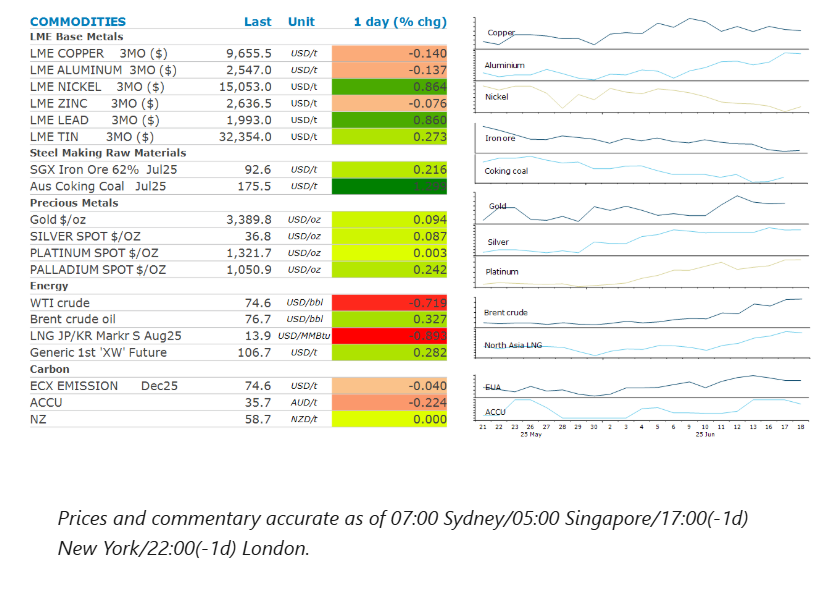
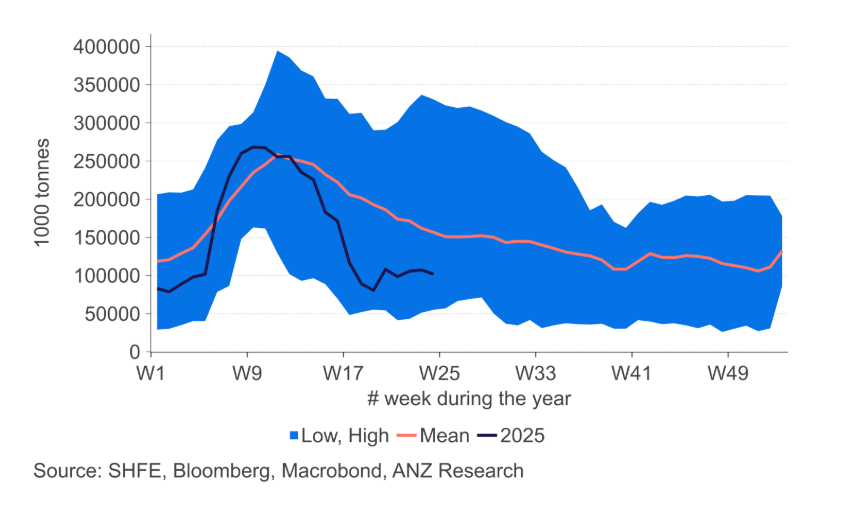

# Energy market on edge amid Middle East tensions

**Date:** June 19, 2025  
**Publisher:** Breakwave Advisors | **Category:** Market Insights  
**Original URL:** [https://www.breakwaveadvisors.com/insights/2025/6/19/energy-market-on-edge-amid-middle-east-tensions](https://www.breakwaveadvisors.com/insights/2025/6/19/energy-market-on-edge-amid-middle-east-tensions)  

---

Tensions in the Middle East remained elevated, keeping energy markets on edge. A stronger USD weighed in investor appetite in the base and precious metal markets.

*By*[*Daniel Hynes*](https://www.linkedin.com/in/dahynes/)

> **Figure 1: Στιγμιότυπο Οθόνης 2025 06 19 150427**  
> **Interactive Data & Source:** [Linkedin](https://www.linkedin.com/newsletters/commodities-wrap-6692196755876012032/?fbclid=IwAR3kiXJqZdxmp9ZcRwBNI7FsBySI-XSC0pfPur1qzjt7OZp7PTE59Tsl1QI) | [Local Asset](file:///C:/Users/Dell/Github/Shipping/corpus/03-breakwave/insights/2025/assets/2025-06-19_energy-market-on-edge-amid-middle-east-tensions_img_cea3cf84ceb9ceb3cebcceb9cf8ccf84cf85_757e5a8e23da.png)

### Market Commentary

**Crude oil**prices edged higher, briefly touching a year-to-date high amid speculation that the US will become involved in the Israel-Iran conflict. Trump said Iran had squandered the chance to make a deal over its nuclear enrichment but declined to say whether the US plans to join Israel’s offensive aimed at destroying the program. This comes after Trump demanded Iran surrender and warned of a possible strike against its leader earlier this week. The oil market remains concerned that any further escalation in the war will bring risks to supply disruptions. Almost a fifth of the world’s oil supply transits the Strait of Hormuz, which Iran has threatened to block in the past. The oil derivatives market highlights the nervousness of investors. Bullish options are fetching their biggest premium in more than a decade and volatility has surged to a three year high. For now, there are no disruptions to supply. Iranian crude oil exports have jumped since the nation came under attack from Israel. Its shipped 2.33mb/d since 13 June, an increase of 44% compared with the year to 12 June, according to TankerTrackers.com. Demand also looks robust. US crude oil inventories fell by 11.6mbbl last week, the biggest decline in almost a year. The Energy Information Administration report also showed that production continues to stall as the rig count declines.

**Global gas**prices gave back recent gains as traders contemplated the risk of disruptions to supply from the Middle East conflict. Earlier this week, Qatar asked LNG vessels to wait outside the Strait of Hormuz until they were ready to load, amid rising tensions in the region. So far, LNG shipments through the waterway have been unaffected, according to Bloomberg ship tracking data. Vessels that had been waiting have now crossed the Strait. Meanwhile, Israel announced that some of its own gas exports may resume as early as Thursday after it stopped flows to Egypt and Jordan last week. The initial supplies are expected to be small. Traders in the**North Asia LNG**market remained nervous. Japanese shipper Nippon Yusen KK instructed its ships to maintain a safe distance from the shore while navigating the Iranian waters. Some support emerged after Chinese state-owned CNOOC purchased several cargoes to help replenish falling inventories in the south of the country as summer heat adds to the nations power demand.

**Copper**edged lower as traders weighed on rising Middle East tensions against signs of tightness in the spot market. Readily available inventories of the metal have dropped by 80% this year, driven in part by a surge in US imports amid concerns of impending tariffs. Spot copper contracts have this week risen to trade at their biggest premium to three-month futures since February, with the widening spread indicating near term tightness. However, any sustained spike in energy prices is likely to ultimately weigh on the copper market due to the higher cost to producers.

**Gold**fell after the USD rose after Fed Chair Powell indicated inflation risks remained high and flagged uncertainty stemming from tariffs. More inflation going forward raises the risk that the central bank may have to keep rates high, or even raise them, to contain the price pressures. Earlier in the session, gold found some support from haven buying amid the rising tensions in the Middle East. The precious metal is up more than 25% this year, driven by a cocktail of trade, economic and geopolitical risks that have prompted investors to scoop up the metal.

### Chart of the Day

China’s copper inventories have been continuing to fall despite the uncertain economic outlook. On a seasonal basis, warehouse stockpiles are near their lowest seen over the past 15 years, highlighting the tightness in the market.

> **Figure 2: Στιγμιότυπο Οθόνης 2025 06 19 150530**  
> **Interactive Data & Source:** [Linkedin](https://www.linkedin.com/newsletters/commodities-wrap-6692196755876012032/?fbclid=IwAR3kiXJqZdxmp9ZcRwBNI7FsBySI-XSC0pfPur1qzjt7OZp7PTE59Tsl1QI) | [Local Asset](file:///C:/Users/Dell/Github/Shipping/corpus/03-breakwave/insights/2025/assets/2025-06-19_energy-market-on-edge-amid-middle-east-tensions_img_cea3cf84ceb9ceb3cebcceb9cf8ccf84cf85_ece1cd5da1ed.png)

Data source:[Commodities Wrap](https://www.linkedin.com/newsletters/commodities-wrap-6692196755876012032/?fbclid=IwAR3kiXJqZdxmp9ZcRwBNI7FsBySI-XSC0pfPur1qzjt7OZp7PTE59Tsl1QI)

---

**Tags:** Commodities, Shipping, Markets  
