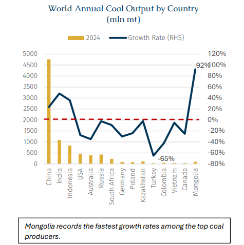
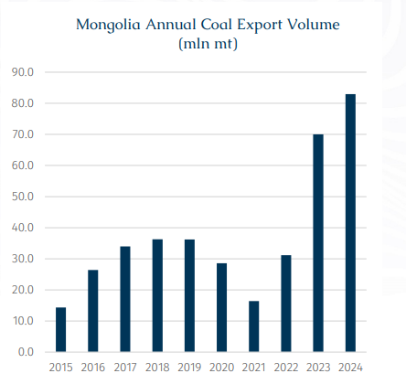
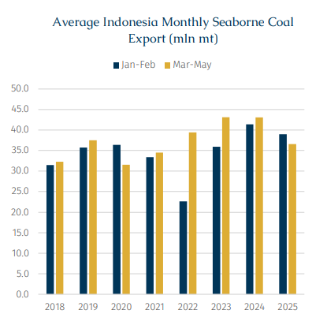
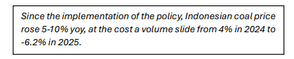

# Rumor falsified on Mongolia coal tariff

**Date:** June 19, 2025  
**Publisher:** Breakwave Advisors | **Category:** Market Insights  
**Original URL:** [https://www.breakwaveadvisors.com/insights/2025/6/19/rumor-falsified-on-mongolia-coal-tariff](https://www.breakwaveadvisors.com/insights/2025/6/19/rumor-falsified-on-mongolia-coal-tariff)  

---

> **Figure 1: Rgb Color Brs Shipbrokers Monogram Logo**  
> [Local Asset](file:///C:/Users/Dell/Github/Shipping/corpus/03-breakwave/insights/2025/assets/2025-06-19_rumor-falsified-on-mongolia-coal-tariff_img_rgb-color-brs-shipbrokers-monogram-l_ee79606c8e74.png)

On 4 June, a recent market rumour suggested that Mongolia was planning to put a 20% tariff on its coal, which caused the market to panic which accordingly led to a surge in coking coal futures prices. Although this rumour was later proven false, the level of attention it drew highlights the market’s sensitivity to potential policy shifts in Mongolia. To understand this reaction, it is worth examining the country’s coal sector its evolving trade strategy, and what this rumour might reveal about future policy intentions.

Mongolia, as the world's largest inland country, holds an estimated 300 bln tonnes of coal reserves (7th largest globally) and produced 98 mln tons in 2024 (9th largest globally). Yet, due to both geographic constraints and a highly concentrated trade structure, Mongolia has long been marginalized in the global coal trade—excluded from the seaborne coal system that dominates international flows. Nearly all Mongolian coal exports are transported overland to China via truck and railway, creating a fragile “single market, single route” export model. Due to its singular reliance on China, the largest seaborne coal importer, this is how Mongolian coal indirectly impacts the dry bulker market. Simultaneously, it also functions as a window towards gauging China’s overall coal appetite.

> **Figure 2: Στιγμιότυπο Οθόνης 2025 06 19 141850**  
> [Local Asset](file:///C:/Users/Dell/Github/Shipping/corpus/03-breakwave/insights/2025/assets/2025-06-19_rumor-falsified-on-mongolia-coal-tariff_img_cea3cf84ceb9ceb3cebcceb9cf8ccf84cf85_c831491f6c8b.png)

Against the backdrop of plateauing Chinese coal demand, this fragility may deepen further. According to the latest data from the Mongolian Customs General Administration, Mongolian coal exports appeared sluggish during the first five months of 2025. Total exports reached 31.8 mln tonnes, down 2.3% y-o-y, while export revenues fell 40.8% to $2.3 bln. The average export price dropped to $71.9/ton, down $46.6/ton y-o-y. Compared to the peak of $366.2/ton in November 2021, current prices are nearly $300/ton lower. In May 2025, Mongolian coal exports were estimated at 6.8 mln tons, down 9.3% y-o-y and 8.3% m-o-m, according to Sxcoal.

> **Figure 3: Στιγμιότυπο Οθόνης 2025 06 19 141903**  
> [Local Asset](file:///C:/Users/Dell/Github/Shipping/corpus/03-breakwave/insights/2025/assets/2025-06-19_rumor-falsified-on-mongolia-coal-tariff_img_cea3cf84ceb9ceb3cebcceb9cf8ccf84cf85_020f7da4ba3d.png)

In a bid to support its coal industry, Mongolia is pursuing a dual-track strategy:

On one hand, it is exploring diversified markets by engaging with countries including India, South Korea, and Japan, evaluating the feasibility of shipping coal via Chinese or Russian ports.

India’s steel giant JSW Steel recently imported 30,000 tonnes of Mongolian coking coal, while SAIL (Steel Authority of India Limited) trialled 3,000–5,000 tonnes which was shipped overland via China. Meanwhile, other shipments could involve potential future routing via Russian sea ports such as Vladivostok. The move coincides with India’s broader effort to reduce its reliance on Australian coking coal, which traded between $185–190/t FOB from January to May 2025. Although Mongolia’s landlocked geography and high logistic costs have historically constrained its competitiveness, if the SAIL trial proves economic and successful, this could open the door to more regular shipments. Indeed, reports suggest that it could be upscaled to 75,000 tonnes annually, further strengthening India–Mongolia trade ties.

On the other hand, Mongolia is deepening its core cooperation with China by upgrading cross-border infrastructure to solidify its baseload of over 80 mln tonnes of annual exports. Over the past few years, Mongolia's infrastructure development has significantly reduced coal transportation costs and greatly boosted its exports. In 2024, Mongolian coal exports soared by 129% compared to 2019, making it one of China’s most important coal suppliers. This infrastructure development shall continue and in the last month, construction officially began on the Gashuun Sukhait–Ganqimaodu railway, a key cooperation corridor between China and Mongolia. This is the second cross-border rail link between the two countries since the 1956 opening of the Erenhot–Zamyn Uud railway. The new railway will connect Ganqimaodu Port in Inner Mongolia with Gashuun Sukhait in Mongolia’s South Gobi province. Financed by both governments, the project is slated to be completed in 2027. According to the railway’s design capacity, the line is expected to handle 30 mln tonnes of cargo annually.

Although the rumour of a 20% tariff was later proven to be false, speculation suggests that Mongolia might follow Indonesia's example in trying to gain more pricing power. In late February, Indonesia’s Ministry of Energy and Mineral Resources approved an export pricing policy, stipulating the use of HBA as the reference price for exports instead of other pricing benchmarks such as the Indonesia Coal Index (ICI) or Newcastle coal futures prices. Indonesia's new coal pricing policy has been in effect since 1 March. Three months into its implementation, AXSMarine data shows a decline in coal exports from March to May. This drop cannot be attributed to seasonal factors—historically, with the exception of the pandemic-impacted year 2020, average exports in March through May have typically exceeded those of the previous two months. This suggests that while the policy has succeeded in pushing up coal prices, it has done so at the cost of reduced export volumes.

> **Figure 4: Στιγμιότυπο Οθόνης 2025 06 19 141919**  
> [Local Asset](file:///C:/Users/Dell/Github/Shipping/corpus/03-breakwave/insights/2025/assets/2025-06-19_rumor-falsified-on-mongolia-coal-tariff_img_cea3cf84ceb9ceb3cebcceb9cf8ccf84cf85_792ea1cbf631.png)

> **Figure 5: Στιγμιότυπο Οθόνης 2025 06 19 141926**  
> [Local Asset](file:///C:/Users/Dell/Github/Shipping/corpus/03-breakwave/insights/2025/assets/2025-06-19_rumor-falsified-on-mongolia-coal-tariff_img_cea3cf84ceb9ceb3cebcceb9cf8ccf84cf85_70c2ea99e0c5.png)

In summary, as Mongolia continues to upgrade its export infrastructure, lower logistics costs might eventually allow Mongolian coal to head to a greater variety of purchasers, potentially making seaborne exports via China or Russia economically feasible. At the same time, although the likelihood of Mongolia adjusting its coal resource tax in the short term appears low, if such a policy was to be implemented, the resulting export price increase—such as already seen in Indonesia—would likely come at the expense of export volumes. This could prompt Chinese buyers to shift procurement from Mongolian coal to other premium coking coal exporters such as Australia and Russia, potentially becoming a future source of growth for the seaborne market.

---

**Tags:** Coal, Shipping, Markets  
