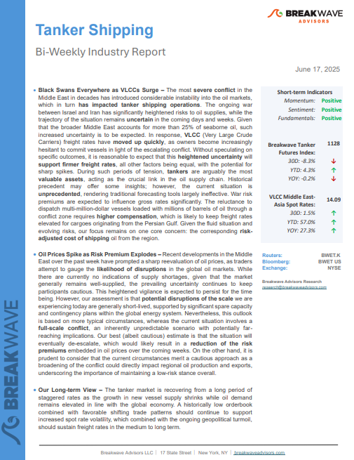
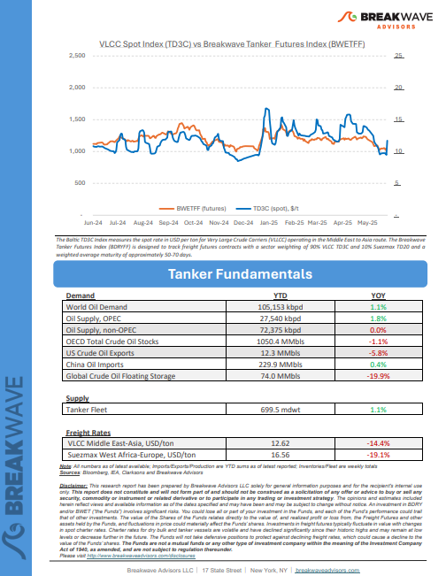
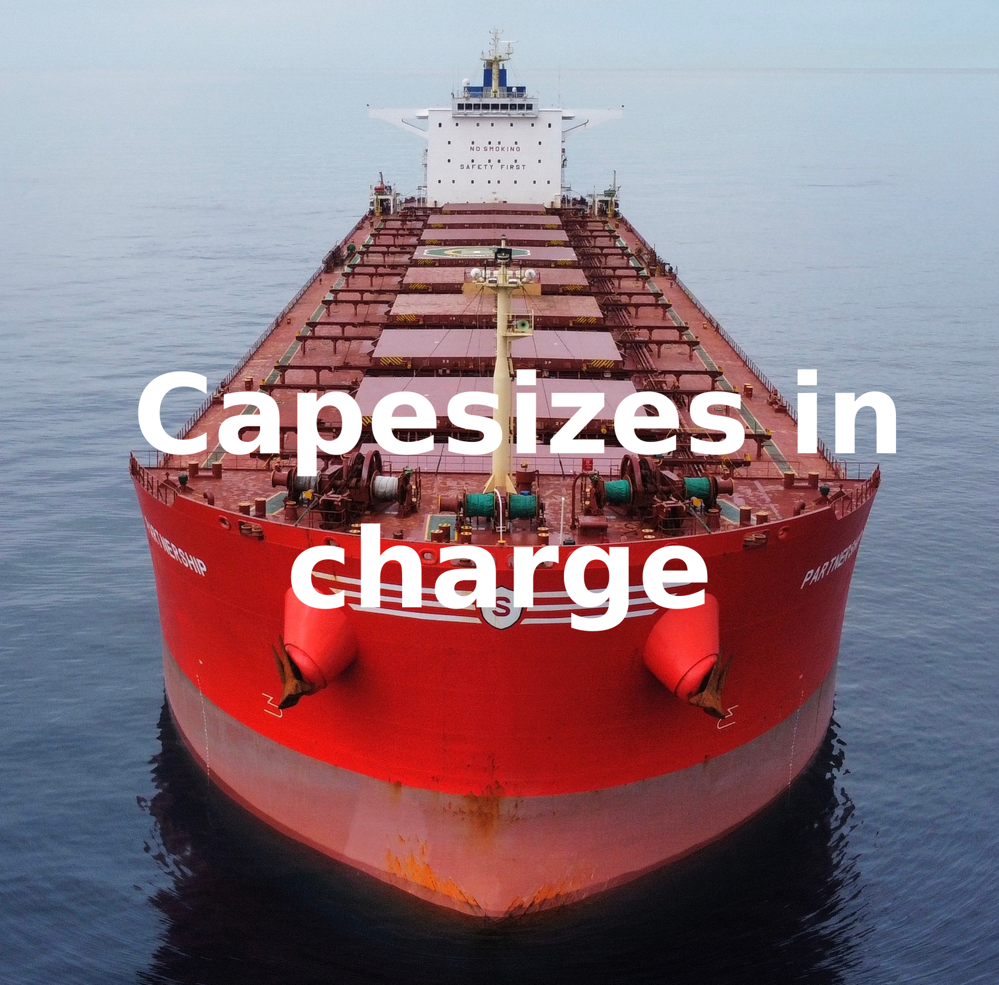
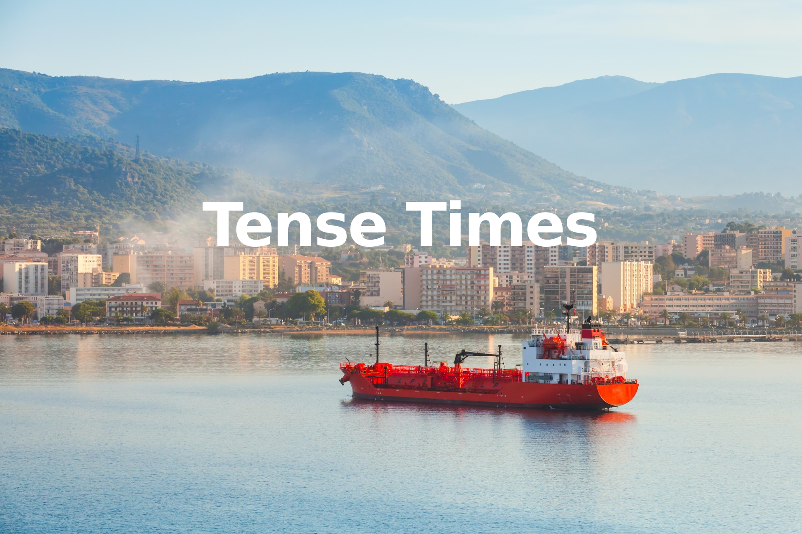
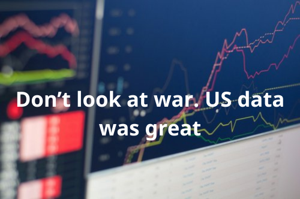
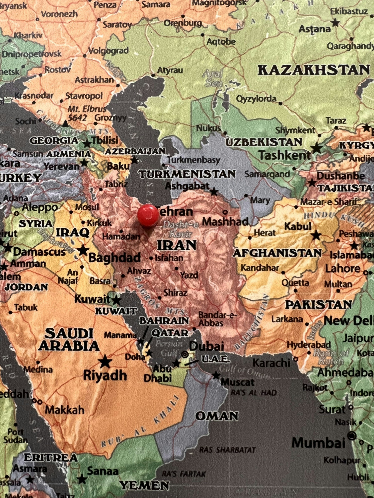
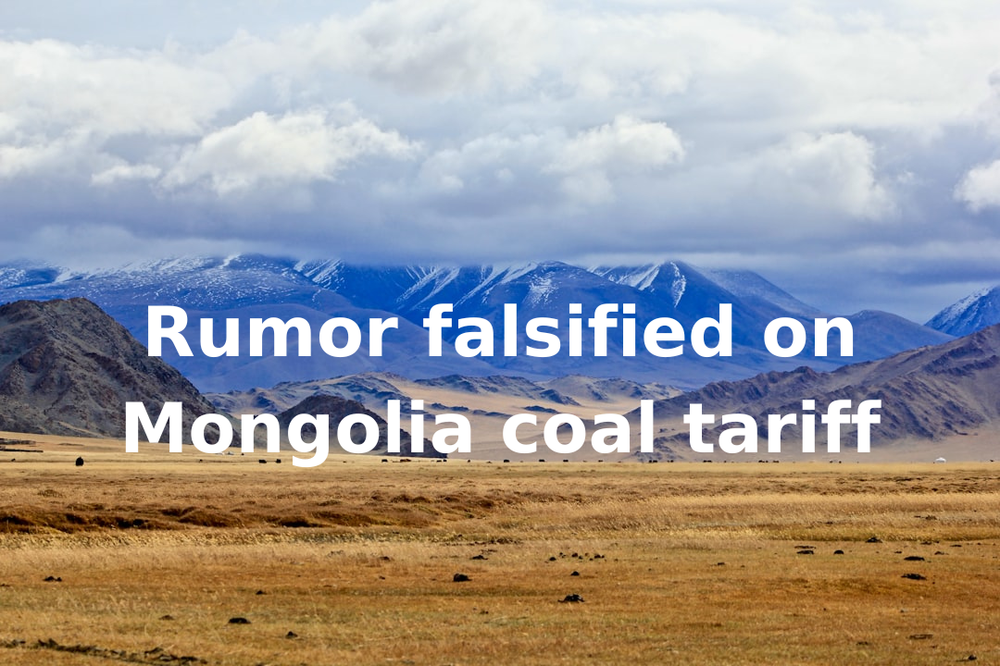
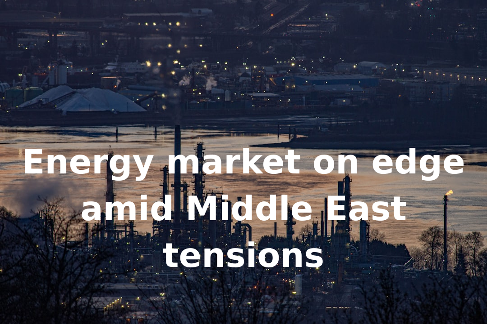

# Breakwave Weekend Read

**Date:** June 20, 2025  
**Publisher:** Breakwave Advisors | **Category:** Market Insights  
**Original URL:** [https://www.breakwaveadvisors.com/insights/2024/10/25/breakwave-weekend-read-547kk-rw7zy-awmfb-mf26k-dk29d](https://www.breakwaveadvisors.com/insights/2024/10/25/breakwave-weekend-read-547kk-rw7zy-awmfb-mf26k-dk29d)  

---

## Welcome Tobreakwave Advisorsweekend Read

***As the week comes to a close, take a moment to review the key insights from the past few days. Missed something? We've gathered all the top insights for you to catch up at your convenience.***

## Breakwave Shipping Report

**Black Swans Everywhere as VLCCs Surge**– The most**severe conflict**in the Middle East in decades has introduced considerable instability into the oil markets, which in turn**has impacted tanker shipping operations.**

[Read More](https://www.breakwaveadvisors.com/insights/2025176wetjhyu514)

> **Figure 1: Στιγμιότυπο Οθόνης 2025 06 20 095552**  
> **Interactive Data & Source:** [Breakwave Advisors Market Insights](https://www.breakwaveadvisors.com/insights/2025/6/16/capesizes-in-charge) | [Local Asset](file:///C:/Users/Dell/Github/Shipping/corpus/03-breakwave/insights/2025/assets/2025-06-20_breakwave-weekend-read-547kk-rw7zy-awmfb-mf26k-dk29d_img_cea3cf84ceb9ceb3cebcceb9cf8ccf84cf85_942960fbef33.png)

> **Figure 2: Στιγμιότυπο Οθόνης 2025 06 20 095605**  
> **Interactive Data & Source:** [Breakwave Advisors Market Insights](https://www.breakwaveadvisors.com/insights/2025/6/16/capesizes-in-charge) | [Local Asset](file:///C:/Users/Dell/Github/Shipping/corpus/03-breakwave/insights/2025/assets/2025-06-20_breakwave-weekend-read-547kk-rw7zy-awmfb-mf26k-dk29d_img_cea3cf84ceb9ceb3cebcceb9cf8ccf84cf85_58611f0918dd.png)

## Capesizes in Charge

> **Figure 3: Ανώνυμο Σχέδιο (7)**  
> **Interactive Data & Source:** [Breakwave Advisors Market Insights](https://www.breakwaveadvisors.com/insights/2025/6/16/capesizes-in-charge) | [Local Asset](file:///C:/Users/Dell/Github/Shipping/corpus/03-breakwave/insights/2025/assets/2025-06-20_breakwave-weekend-read-547kk-rw7zy-awmfb-mf26k-dk29d_img_ce91cebdcf8ecebdcf85cebccebfcf83cf87_bf727807579d.png)

Despite a deteriorating global economic outlook, the dry bulk spot market has continued to show unexpected strength, with Capesize rates leading the charge.

Doric Weekly Market Insights

## Tense Times

> **Figure 4: Ανώνυμο Σχέδιο (6)**  
> **Interactive Data & Source:** [Breakwave Advisors Market Insights](https://www.breakwaveadvisors.com/insights/2025/6/16/tense-times) | [Local Asset](file:///C:/Users/Dell/Github/Shipping/corpus/03-breakwave/insights/2025/assets/2025-06-20_breakwave-weekend-read-547kk-rw7zy-awmfb-mf26k-dk29d_img_ce91cebdcf8ecebdcf85cebccebfcf83cf87_c7069e6280db.png)

Tensions between Israel and Iran are nothing new, but they came to a head overnight.

Gibson Tanker Market Report

## Capesize Market Jumping on Brazil Iron Ore and Chinese Steel

> **Figure 5: Ανώνυμο Σχέδιο (8)**  
> **Interactive Data & Source:** [Breakwave Advisors Market Insights](https://www.breakwaveadvisors.com/insights/2025/6/17/capesize-market-jumping-on-brazil-iron-ore-and-chinese-steel) | [Local Asset](file:///C:/Users/Dell/Github/Shipping/corpus/03-breakwave/insights/2025/assets/2025-06-20_breakwave-weekend-read-547kk-rw7zy-awmfb-mf26k-dk29d_img_ce91cebdcf8ecebdcf85cebccebfcf83cf87_71206ed3682d.png)

As we discussed in Commodore Research's most recent Weekly Executive Report, dry bulk rates rose again last week, this time with rates rising in all four vessel classes.

From Commodore's Weekly Dry Bulk Reports

## Don’t Look at War. Us Data Was Great

> **Figure 6: Ανώνυμο Σχέδιο (9)**  
> **Interactive Data & Source:** [Breakwave Advisors Market Insights](https://www.breakwaveadvisors.com/insights/2025/6/17/dont-look-at-war-us-data-was-great) | [Local Asset](file:///C:/Users/Dell/Github/Shipping/corpus/03-breakwave/insights/2025/assets/2025-06-20_breakwave-weekend-read-547kk-rw7zy-awmfb-mf26k-dk29d_img_ce91cebdcf8ecebdcf85cebccebfcf83cf87_4451022f3afa.png)

Geopolitical tensions stirred markets, but investors still view conflict as regional.

[Read More](https://www.breakwaveadvisors.com/insights/2025/6/17/dont-look-at-war-us-data-was-great)

Forvis Mazars Weekly Note

## Geopolitical Spillover: Assessing the Impact of Iran-Israel Tensions on the Tanker Shipping Industry

> **Figure 7: Istock 1284894553**  
> **Interactive Data & Source:** [Breakwave Advisors Market Insights](https://www.breakwaveadvisors.com/insights/2025/6/18/geopolitical-spillover-assessing-the-impact-of-iran-israel-tensions-on-the-tanker-shipping-industry) | [Local Asset](file:///C:/Users/Dell/Github/Shipping/corpus/03-breakwave/insights/2025/assets/2025-06-20_breakwave-weekend-read-547kk-rw7zy-awmfb-mf26k-dk29d_img_istock-1284894553_f88db87e91d9.jpg)

Escalating tensions between Iran and Israel are analysed for their potential effects on global energy markets, particularly concerning the Strait of Hormuz.

Signal Ocean Special Report

## Concerns Over a Potential Disruption of the Strait of Hormuz

> **Figure 8: Unsplash Image Xif1p97u3fc**  
> **Interactive Data & Source:** [Breakwave Advisors Market Insights](https://www.breakwaveadvisors.com/insights/2025/6/18/concerns-over-a-potential-disruption-of-the-straitofhormuz) | [Local Asset](file:///C:/Users/Dell/Github/Shipping/corpus/03-breakwave/insights/2025/assets/2025-06-20_breakwave-weekend-read-547kk-rw7zy-awmfb-mf26k-dk29d_img_unsplash-image-xif1p97u3fc_6f72590b5170.jpg)

The escalation in mid-June 2025, marked by Israeli strikes against Iranian military and energy infrastructure..

Intermodal Weekly Market Report

## Rumor Falsified on Mongolia Coal Tariff

> **Figure 9: Ανώνυμο Σχέδιο (1)**  
> **Interactive Data & Source:** [Breakwave Advisors Market Insights](https://www.breakwaveadvisors.com/insights/2025/6/19/rumor-falsified-on-mongolia-coal-tariff) | [Local Asset](file:///C:/Users/Dell/Github/Shipping/corpus/03-breakwave/insights/2025/assets/2025-06-20_breakwave-weekend-read-547kk-rw7zy-awmfb-mf26k-dk29d_img_ce91cebdcf8ecebdcf85cebccebfcf83cf87_4b04cac19d35.png)

Mongolia, as the world's largest inland country, holds an estimated 300 bln tonnes of coal reserves (7th largest globally) and produced 98 mln tons in 2024 (9th largest globally).

BRS Weekly Dry Bulk Newsletter

## Energy Market on Edge Amid Middle East Tensions

> **Figure 10: Προσθέστε Επικεφαλίδα**  
> **Interactive Data & Source:** [Breakwave Advisors Market Insights](https://www.breakwaveadvisors.com/insights/2025/6/19/energy-market-on-edge-amid-middle-east-tensions) | [Local Asset](file:///C:/Users/Dell/Github/Shipping/corpus/03-breakwave/insights/2025/assets/2025-06-20_breakwave-weekend-read-547kk-rw7zy-awmfb-mf26k-dk29d_img_cea0cf81cebfcf83ceb8ceadcf83cf84ceb5_f845e15dea87.png)

Tensions in the Middle East remained elevated, keeping energy markets on edge.

Commodities Wrap

## Oil in Supply Chain Explains Muted Price Reaction to Shocks

> **Figure 11: Ανώνυμο Σχέδιο (2)**  
> **Interactive Data & Source:** [Breakwave Advisors Market Insights](https://www.breakwaveadvisors.com/insights/2025/6/20/oil-in-supply-chain-explains-muted-price-reaction-to-shocks) | [Local Asset](file:///C:/Users/Dell/Github/Shipping/corpus/03-breakwave/insights/2025/assets/2025-06-20_breakwave-weekend-read-547kk-rw7zy-awmfb-mf26k-dk29d_img_ce91cebdcf8ecebdcf85cebccebfcf83cf87_603964de81d5.png)

In this insight, we take a look at the global state of oil, potential challenges and projections for the markets amid rising Israel-Iran tension.

Vortexa Freight Weekly

---

**Tags:** Shipping, Tankers, Drybulk  
