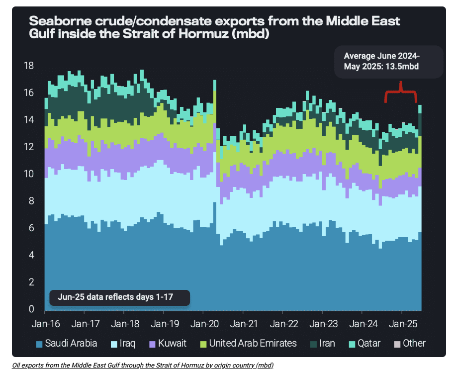

# Oil in supply chain explains muted price reaction to shocks

**Date:** June 20, 2025  
**Publisher:** Breakwave Advisors | **Category:** Market Insights  
**Original URL:** [https://www.breakwaveadvisors.com/insights/2025/6/20/oil-in-supply-chain-explains-muted-price-reaction-to-shocks](https://www.breakwaveadvisors.com/insights/2025/6/20/oil-in-supply-chain-explains-muted-price-reaction-to-shocks)  

---

In this insight, we take a look at the global state of oil, potential challenges and projections for the markets amid rising Israel-Iran tension.

*By*[*David Wech*](https://www.linkedin.com/in/david-wech-83a163165/)

Israel’s strikes on Iran as of 12 June 2025 triggered an immediate price spike of $8/b for Brent, which receded soon to around $5/b. Given that there are concerns 1) Iran’s oil infrastructure could be hit, 2) the Strait of Hormuz could be temporarily closed, and 3) there could be some type of indirect retaliation with Iranian strikes, e.g. on Saudi oil infrastructure, $5/b does not sound much. Why is that?

On the one hand, there is a long history of incidents over recent decades where outages actually happened or were anticipated, but days or weeks later, everything was more or less back to normal. This sticks in many minds.

## On the Other Hand, the Market Is More and More Aware of the Massive Amount of Oil in Storage and the Wider Supply Chain.

Let’s look at crude oil. We at Vortexa track about[3300mb of crude oil in onshore storage tanks](https://tinyurl.com/yc79f4p2), and typically[another 1200mb at sea](https://analytics.vortexa.com/Flows?dateRange=last-exact-six-months&filtersEnabled=%5B%22p%22%2C%22o%22%2C%22d%22%2C%22d_r%22%2C%22v%22%2C%22intra_d%22%2C%22sts_o%22%2C%22c_o%22%2C%22w%22%2C%22sts%22%5D&frequency=day&intraMovementDropdown=all&metric=bpd&movementEvent=cargo_on_water_state&page=Flows&products=%5B%2254af755a090118dcf9b0724c9a4e9f14745c26165385ffa7f1445bc768f06f11%22%5D&tabId=c6f9e5c5-5194-4257-8a66-ff4ad1067951&v=3). That makes 4.5 billion barrels of tracked oil, which can be easily expanded to 5.5 billion barrels, if underground strategic storage, untracked sites and oil in pipelines are added to the mix. This compares to an estimated 84mbd of crude demand.

In a completely theoretical scenario, if global production stopped entirely, this would be sufficient to cover demand for 65 days, with product stocks and other volumes in the supply chain probably topping this up to close to 100 days of global demand cover. Now this is not the relevant calculation, but it is still giving a first indication of the power of oil in the supply chain.

In a somewhat more realistic scenario, let’s assume the[13.5mbd of crude that were exported out of the Middle East Gulf through the Strait of Hormuz on average during the last 12 months](https://tinyurl.com/5n82ahmu)are entirely lost. Roughly speaking, global crude in the supply chain could cover for such a situation for about 13 months. The[4.6mbd of product exports through the Strait of Hormuz](https://tinyurl.com/2hmfnswb)could probably be covered for more than 2 years (based on product stock indications from JODI and Vortexa[products at sea data).](https://analytics.vortexa.com/Flows?dateRange=last-exact-six-months&filtersEnabled=%5B%22p%22%2C%22o%22%2C%22d%22%2C%22d_r%22%2C%22v%22%2C%22intra_d%22%2C%22sts_o%22%2C%22c_o%22%2C%22w%22%2C%22sts%22%5D&frequency=day&intraMovementDropdown=all&metric=bpd&movementEvent=cargo_on_water_state&page=Flows&products=%5B%22b68cbb746f8b9098c50e2ba36bcad83001a53bd362e9031fb49085d02c36659c%22%2C%225de0b00094e0fd7542c10f9f8a71b4008d55750f21dc905cda9b0f7f5f76bc08%22%5D&tabId=c6f9e5c5-5194-4257-8a66-ff4ad1067951&v=3)Finally, let’s take a more realistic assumption, e.g. that 1mb of crude is being lost persistently. In such a situation, the storage coverage would last for more than 15 years.

> **Figure 1: Στιγμιότυπο Οθόνης 2025 06 20 103000**  
> **Interactive Data & Source:** [Vortexa](https://www.vortexa.com//oil-gas-data-traders-analysts-data-scientists?gclid=Cj0KCQjw8_qRBhCXARIsAE2AtRZKOvMnbilZ_6_91d7huSFFy71pWLrnPwGwOHVzXsmsG-1a1mZnQw8aAt89EALw_wcB&hsa_acc=1782073842&hsa_ad=548425387665&hsa_cam=14746637662&hsa_grp=125038601902&hsa_kw=&hsa_mt=&hsa_net=adwords&hsa_src=g&hsa_tgt=dsa-1431852288425&hsa_ver=3&utm_campaign=%5BCD%5D%20-%20DSA%20-%20EMEA&utm_medium=cpc&utm_medium=ppc&utm_source=google&utm_source=adwords&utm_term=) | [Local Asset](file:///C:/Users/Dell/Github/Shipping/corpus/03-breakwave/insights/2025/assets/2025-06-20_oil-in-supply-chain-explains-muted-price-reaction-to-shocks_img_cea3cf84ceb9ceb3cebcceb9cf8ccf84cf85_537d6d1839ed.png)

In reality of course, all oil would never be drawn down entirely, but at the same time, there would be many adjustment mechanisms at play to cope with any type of challenge, such as new supply routes, alternative supplies (oil by other players like US shale, other energy sources), demand curtailments, and so on.

The point is, we do not really need to be afraid to run out of oil – there are much more relevant concerns in global geopolitics than this one. Accordingly, the oil price reaction to the latest escalation in the Middle East is relatively lukewarm.

Data Source:[Vortexa](https://www.vortexa.com//oil-gas-data-traders-analysts-data-scientists?gclid=Cj0KCQjw8_qRBhCXARIsAE2AtRZKOvMnbilZ_6_91d7huSFFy71pWLrnPwGwOHVzXsmsG-1a1mZnQw8aAt89EALw_wcB&hsa_acc=1782073842&hsa_ad=548425387665&hsa_cam=14746637662&hsa_grp=125038601902&hsa_kw=&hsa_mt=&hsa_net=adwords&hsa_src=g&hsa_tgt=dsa-1431852288425&hsa_ver=3&utm_campaign=%5BCD%5D%20-%20DSA%20-%20EMEA&utm_medium=cpc&utm_medium=ppc&utm_source=google&utm_source=adwords&utm_term=)

---

**Tags:** Crude, Tankers, Market  
