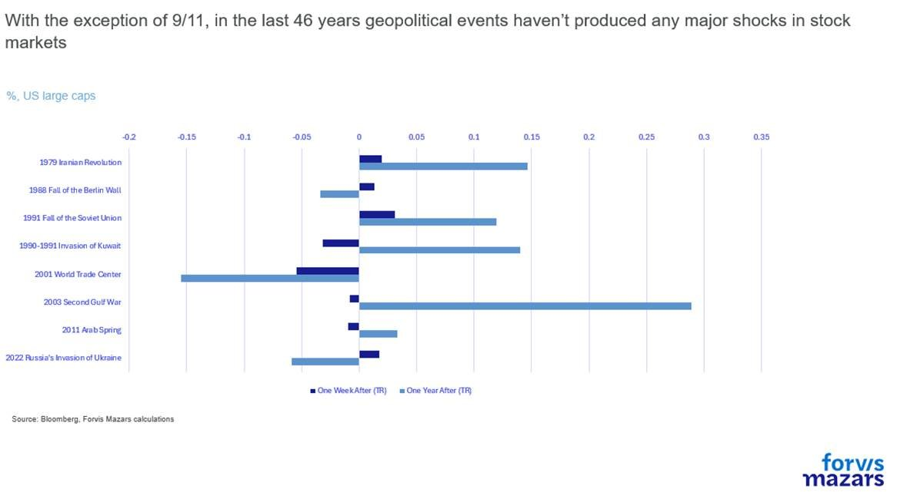
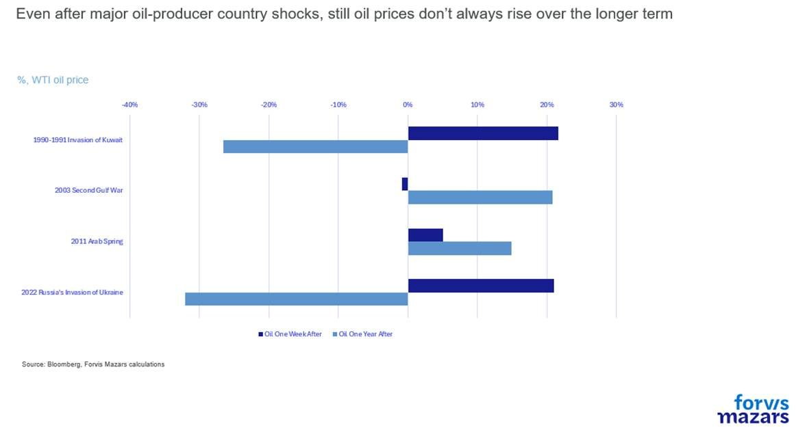
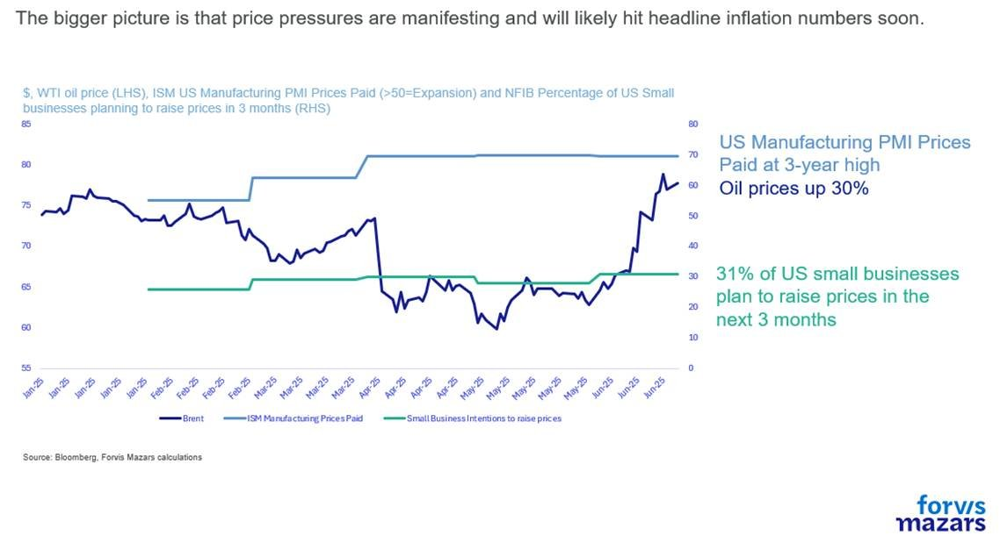
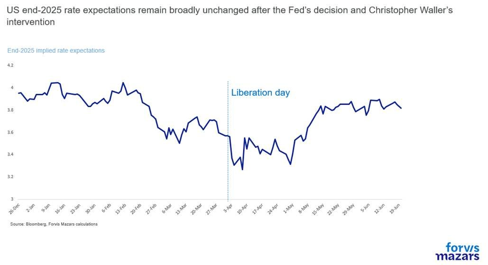

# Inflation, not Iran

**Date:** June 23, 2025  
**Publisher:** Breakwave Advisors | **Category:** Market Insights  
**Original URL:** [https://www.breakwaveadvisors.com/insights/2025/6/23/inflation-not-iran](https://www.breakwaveadvisors.com/insights/2025/6/23/inflation-not-iran)  

---

The three things investors should know about this week:

1. Escalating geopolitical tensions in the Middle East have not significantly worried investment markets, as historically they have had little long-term impact on risk assets.
2. Our attention would rather focus on rising tensions inside central banks, with some voices calling for rate cuts.
3. However, rising energy prices will probably give more ammunition to central bankers who feel that maintaining rates at the current levels, instead of lowering them, is the right thing to do for now.

*By*[*George Lagarias*](https://www.linkedin.com/in/george-lagarias-mba-3baa769/)

----------------

### Executive Summary

*Geopolitical events rarely have lasting effects on financial markets; economic and financial fundamentals remain the key drivers. Historical oil shocks linked to conflicts often reverse within a year, with limited impact on equities. However, recent Middle East tensions have driven a 30% rebound in oil prices since May, potentially stoking inflation in the US, UK, and Europe. Central banks, particularly the Fed and BoE, may lean hawkish in response, delaying expected rate cuts. Despite political pressure, the Fed remains focused on inflation risks. The key takeaway: short-term volatility aside, rising energy prices strengthen the case for holding rates steady.*

--------------------

Most of the time, it’s economic and financial developments that drive the global economy and global finance. Sometimes, not very often and usually over the shorter term, guns do the talking. I have always respected generals for staying in their lane and not dabbling into global finance, as much as I am aghast at economic analysts becoming geopolitical experts. Investors may make assumptions as to the outcome of major geopolitical events, but the moment the discussion devolves into the efficacy of minesweeping and drone defence operations in the Persian Gulf, we, as investment strategists, are definitely in the wrong lane. ( If I’m being entirely honest, if I hear the term “Straights of Hormuz” coming out of an economists lips, I fear that my head might explode.)

So let’s stick to our lane and look at the impact of major geopolitical and oil-related events on major assets. In the last 46 years, the only event that has a causal relationship with a major equity retrenchment is 9/11, which accentuated the impact of the dot-com bubble. One could argue that the invasion of Ukraine which ramped up inflation and forced the Fed to accelerate rate hikes also had some limited impact, but the truth is that the world was on a rate-hike path before February 2022.

> **Figure 1: Market Chart 1**  
> **Interactive Data & Source:** [Youtube](https://www.youtube.com/watch?v=qZmguw8KB6A&pp=0gcJCdgAo7VqN5tD) | [Local Asset](file:///C:/Users/Dell/Github/Shipping/corpus/03-breakwave/insights/2025/assets/2025-06-23_inflation-not-iran_img_image005_e3e09ecf714f.jpg)

So here it is. Geopolitics don’t tend to affect equities over the medium term so much. Do they affect oil? We looked at oil-producing-specific events, and even then the outcome was not conclusive.

> **Figure 2: Market Chart 2**  
> **Interactive Data & Source:** [Youtube](https://www.youtube.com/watch?v=qZmguw8KB6A&pp=0gcJCdgAo7VqN5tD) | [Local Asset](file:///C:/Users/Dell/Github/Shipping/corpus/03-breakwave/insights/2025/assets/2025-06-23_inflation-not-iran_img_image006_4e081f9848ac.jpg)

One year after the invasions of Kuwait and Ukraine, oil prices were down over 20%, despite their initial reactions. After the 2003 Second Gulf War and the 2011 Arab Spring, oil prices indeed rose materially, but neither event saw a significant initial oil price shock.

All this explains the muted reaction from equity, bond and oil markets at least early on Monday. US large caps remain just 3% below their all-time highs

To[paraphrase the great Frank Herbert](https://www.youtube.com/watch?v=qZmguw8KB6A&pp=0gcJCdgAo7VqN5tD), simply “Oil Must Flow”, and the oil-hungry big economies of this world, some of which include Iran’s allies, will likely do everything in their power to make this happen. It’s a good reminder that Iran has been a disruptive force for almost half a century, which gave time to Saudi Arabia and the Emirates to[prepare pipelines](https://www.reuters.com/markets/commodities/iran-oil-doomsday-hormuz-may-be-more-fear-than-reality-bousso-2025-06-22/)so as not to be held hostage to any particular sea lane chokepoints.

It may be tempting fate to say so, but looking at similar events in the past does not suggest a major economic or financial impact.

Having said that, while this weekend’s developments may not necessarily exacerbate the general picture, we need to remember that oil has been trading much lower than average in the past couple of months, which helped inflation remain tame during the initial stages of the trade war. Tensions in the Middle East have catalysed a 30% rebound since the beginning of May, which will very likely impact inflation in the US, UK and Europe in the coming months, accelerate underlying upward pressures which are, until now hidden under the bonnet.

> **Figure 3: Market Chart 3**  
> **Interactive Data & Source:** [Reuters](https://www.reuters.com/business/finance/trump-says-he-may-have-change-his-mind-about-firing-fed-chair-powell-2025-06-20/) | [Local Asset](file:///C:/Users/Dell/Github/Shipping/corpus/03-breakwave/insights/2025/assets/2025-06-23_inflation-not-iran_img_image007_4a75720fb56c.jpg)

As Fed Chair Jerome Powell said causing the[ire of the President](https://www.reuters.com/business/finance/trump-says-he-may-have-change-his-mind-about-firing-fed-chair-powell-2025-06-20/)in what could (and possibly should) have otherwise been last week’s top economic news story, “tariff impact is coming”. The US central bank fears that the combination of tariffs and rising energy prices may cause inflation to rebound, upping their inflation outlook. And despite Jerome Powell’s verbal acrobatics, balancing a negative outlook for inflation with a solid growth outlook, and still able to justify the outlook for two cuts by the end of the year, this was not enough for the White House, which launched a fresh attack on the Fed’s Chair, with threats to fire him.

Markets, now confident that the level-headed Scott Bessent has a firm hand on the economy, shrugged it off, as much as aspiring Fed Chair Christopher Waller’s comment that he would be inclined to cut rates in July, maintaining their outlook for just two rate cuts until the end of the year, in line with the Fed’s own (low-confidence) forecast.

To be sure, in both the Fed and the Bank of England we see some growing scepticism about the decision to hold rates steady by some voting members, but recent energy price rises should give more ammunition to the hawkish members.

> **Figure 4: Market Chart 4**  
> [Local Asset](file:///C:/Users/Dell/Github/Shipping/corpus/03-breakwave/insights/2025/assets/2025-06-23_inflation-not-iran_img_image008_9c28b7d7ff67.jpg)

Ultimately this is the biggest takeaway of the week:**it is very difficult to predict the short-term effect of geopolitical events or its impact on the financial markets. But over the medium term, it is economic and financial developments that drive markets. From this perspective, rising energy prices will probably give more ammunition to central bankers who feel that maintaining rates at the current levels, instead of lowering them, is the right thing to do for now.**

---

**Tags:** Macro, Economy, Markets  
