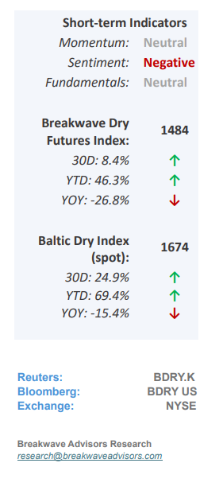
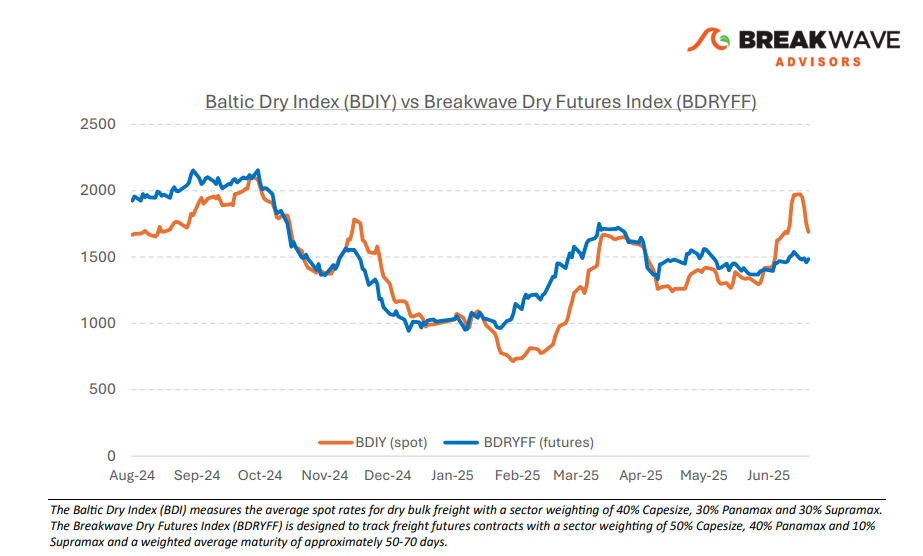
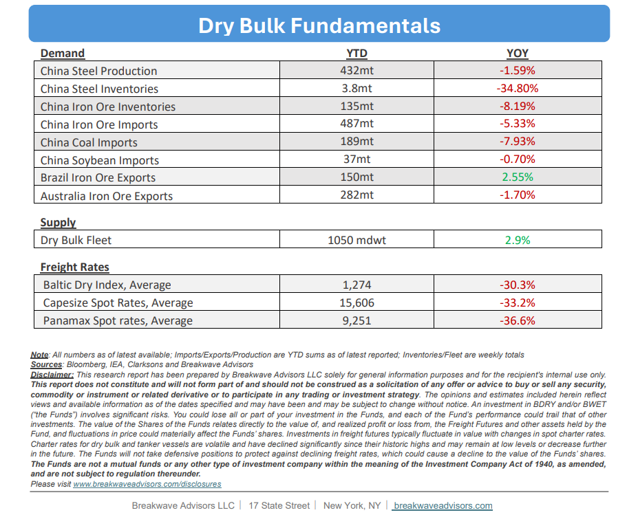

# Breakwave Bi-Weekly Dry Bulk Report - June 24, 2025

**Date:** June 24, 2025  
**Publisher:** Breakwave Advisors | **Category:** Market Insights  
**Original URL:** [https://www.breakwaveadvisors.com/insights/2025624-drybulk](https://www.breakwaveadvisors.com/insights/2025624-drybulk)  

---

•**Capesize Spike Fades as Market Balance Loosens**– The recent rally that pushed spot**Capesize rates to the $30,000**mark is beginning to lose steam, with signs of weakness emerging in the Pacific market. Simultaneously, the previously**overheated Atlantic**basin is now experiencing an**increase**in vessel**availability**for July loading dates. These developments have long been anticipated by the freight futures market, which has notably not mirrored the surge in spot rates to the same extent. The central question now is**whether**spot**rates**will continue to**decline below the $20,000**threshold, an outcome that freight futures are currently pricing in, or whether a rebound will materialize beforehand, potentially triggering a sharp reversal in the prevailing bearish trend. In our view,**downside risk**for the spot index appears**limited**in the near term. While an immediate recovery may not be imminent, a stabilization around the $20,000 level seems increasingly likely. Meanwhile, support for**Panamax spot rates remains firm,**providing an anchor of confidence for the broader dry bulk sector. Geopolitical uncertainties, historically supportive for shipping markets, have also reemerged. Although the latest developments in the Middle East are unlikely to directly affect dry bulk cargo flows, they are contributing to**stronger sentiment**among shipowners. Despite a soft patch in Chinese commodity imports so far this year, the dry bulk market has delivered a relatively**resilient performance**. A recovery in import demand during the second half of the year could offer**unexpected upside,**especially given that the freight futures curve remains flat and subdued amid continued bearish sentiment surrounding China’s steel industry and macroeconomic outlook.

> **Figure 1: Στιγμιότυπο Οθόνης 2025 06 24 094821**  
> [Local Asset](file:///C:/Users/Dell/Github/Shipping/corpus/03-breakwave/insights/2025/assets/2025-06-24_2025624-drybulk_img_cea3cf84ceb9ceb3cebcceb9cf8ccf84cf85_30a9de1c237e.png)

•**West African Rain Season to Reduce Bauxite Exports**– Seasonality remains a key determinant of spot freight rates in the dry bulk market. However, in recent years, traditional patterns have been evolving, with**bauxite increasingly emerging****as the primary driver**of spot market activity. The summer months typically coincide with a seasonal decline in bauxite exports, as**heavy rainfall in West Africa**disrupts both production and shipments of this critical raw material for aluminum production. We anticipate a notable**reduction in bauxite exports**over the coming months, which is expected to lead to a corresponding decline in spot market activity within the Atlantic basin. This decline may be**partially offset by stronger iron ore export**volumes from Brazil, in line with historical seasonal trends. Nevertheless, we expect**overall Capesize cargo flows to weaken**during the summer before recovering into the fall. Coal demand remains subdued, and while summer weather could trigger a temporary uptick in Chinese coal imports, our base case scenario assumes a continued year-over-year decline in import volumes.

•**Our Long-term View**– The last few years have been characterized by increased geopolitical uncertainty. Going forward, we expect such events to continue to affect global trade and have a meaningful impact on effective vessel supply. Combined with the potential for a multi-year cyclical rebound in China’s economic activity following the recent economic turmoil, dry bulk shipping should experience higher volatility on top of a secular tightness driven by stable bulk commodity demand and a slower fleet growth owing to a relatively low orderbook.

> **Figure 2: Στιγμιότυπο Οθόνης 2025 06 24 094842**  
> [Local Asset](file:///C:/Users/Dell/Github/Shipping/corpus/03-breakwave/insights/2025/assets/2025-06-24_2025624-drybulk_img_cea3cf84ceb9ceb3cebcceb9cf8ccf84cf85_8c1eb726ec71.png)

> **Figure 3: Στιγμιότυπο Οθόνης 2025 06 24 094856**  
> [Local Asset](file:///C:/Users/Dell/Github/Shipping/corpus/03-breakwave/insights/2025/assets/2025-06-24_2025624-drybulk_img_cea3cf84ceb9ceb3cebcceb9cf8ccf84cf85_8c930f362919.png)

### Subscribe:
