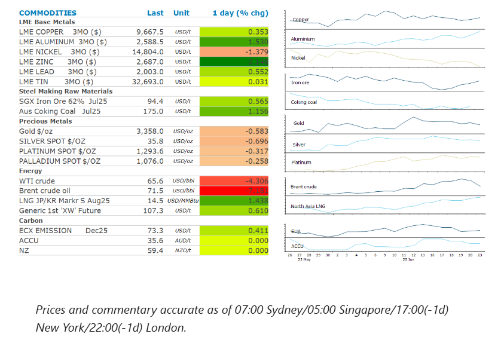
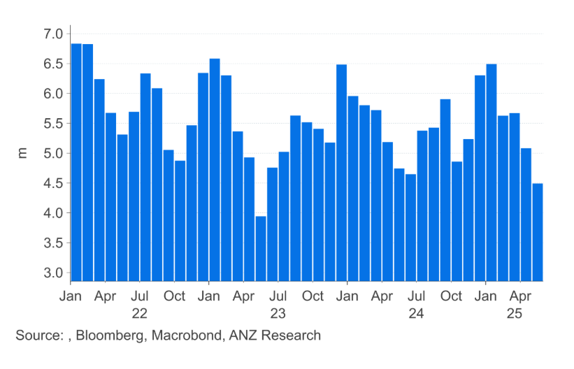

# Oil falls as tensions ease in Middle East

**Date:** June 24, 2025  
**Publisher:** Breakwave Advisors | **Category:** Market Insights  
**Original URL:** [https://www.breakwaveadvisors.com/insights/2025/6/24/oil-falls-as-tensions-ease-in-middle-east](https://www.breakwaveadvisors.com/insights/2025/6/24/oil-falls-as-tensions-ease-in-middle-east)  

---

Easing fears of supply disruptions pushed energy markets lower. Metals were mixed amid the shift in sentiment.

*By*[*Daniel Hynes*](https://www.linkedin.com/in/dahynes/)

> **Figure 1: Στιγμιότυπο Οθόνης 2025 06 24 131613**  
> [Local Asset](file:///C:/Users/Dell/Github/Shipping/corpus/03-breakwave/insights/2025/assets/2025-06-24_oil-falls-as-tensions-ease-in-middle-east_img_cea3cf84ceb9ceb3cebcceb9cf8ccf84cf85_30b6cce1d747.png)

### Market Commentary

**Crude oil**prices fell amid easing fears of supply disruptions. Following the US attack on its nuclear facilities, Iran launched missiles at a US base in Qatar. The attack appeared to be measured though, with no casualties reported. The New York Times reported that three Iranian officials said their government had given advance notice that the missile strike was coming. The market had feared that Iran’s retaliatory response would involve attacks on energy infrastructure in the region, including disrupting flows through the Strait of Hormuz. While the situation can change quickly, this initial response indicates it’s reluctant to drag the US into the conflict. It also highlights that the market had already priced in the risk of a significant disruption. Should Iran refrain from escalatory responses, this should keep oil prices elevated but contained. This fits the[**extended conflict scenario**](../pdfs/2025-06-24_oil-falls-as-tensions-ease-in-middle-east_commodity-call-energy-markets-eye-su_b0bb89fabbf8.pdf)we highlighted last week as the most likely. Under this scenario, energy infrastructure in the region is untouched, however, it threatens oil flows through the Strait of Hormuz. Ultimately disruptions remain limited. We would expect prices to trade in USD75-85/bbl.

**North Asia LNG**prices surged higher on fears of supply disruptions. Spot prices traded above USD14/MMBtu, their highest level since late February following the US attack on Iran nuclear facilities. This comes amid an outlook for strong demand across the region. Japanese power prices soared 25% w/w as weather forecasts point to higher-than-normal temperatures. Japan has already issued multiple heat alerts, which doesn’t bode well for the remainder of the summer. Strong cooling demand will require additional gas-fired power generation.**European gas**futures followed oil prices lower; However, it pared some of the losses late in the session after Qatar suspend airspace traffic. The country is also one of the biggest LNG exporters and concerns remain that cargoes will still be impacted by the tensions in the region.

Base metals were mixed as the market contemplates the impact of a broader Middle East conflict.**Copper**managed to end the session higher as a risk-on tone across markets emerged following Iran’s contained response to US attacks.**Aluminium**rallied to a three-month high on concerns that the escalating conflict in the Middle East disrupts supplies. Middle Eastern countries produce almost 9% of the world’s aluminium. If the Strait of Hormuz was blocked, it could affect bauxite and alumina shipments to the various smelters in the region. Energy also makes up more than 35% of total operating costs, with higher oil & gas prices likely to weigh on margins for many other global producers.

**Iron ore**prices edged higher on signs of steady supply and demand. Data from Mysteel Global last week showed that daily molten steel production rose 5,700t to 2.42mt. Volumes have stayed around 2.4mt since April, suggesting resilience in the world’s largest steel market. Increased destocking at ports also supported prices.

**Gold**was higher earlier in the session after Iran pledged retaliation for the US military strikes. Those gains were subsequently erased as haven buying eased later in the session. The precious metal did find some support from the prospect of lower rates. Treasury yields fell after Federal Reserve Governor Michelle Bowman said she could support a July interest rate cut. This followed similarly dovish remarks last week from another Fed Governor, Christopher Waller.

### Chart of the Day

Japanese LNG imports have been subdued in recent months. However, that may be about to change with higher-than-normal temperatures expected to boost electricity demand. Strong cooling demand will require additional gas-fired power generation.

> **Figure 2: Στιγμιότυπο Οθόνης 2025 06 24 131734**  
> **Interactive Data & Source:** [Linkedin](https://www.linkedin.com/newsletters/commodities-wrap-6692196755876012032/?fbclid=IwAR3kiXJqZdxmp9ZcRwBNI7FsBySI-XSC0pfPur1qzjt7OZp7PTE59Tsl1QI) | [Local Asset](file:///C:/Users/Dell/Github/Shipping/corpus/03-breakwave/insights/2025/assets/2025-06-24_oil-falls-as-tensions-ease-in-middle-east_img_cea3cf84ceb9ceb3cebcceb9cf8ccf84cf85_f43df2a1f3b6.png)

Data source:[Commodities Wrap](https://www.linkedin.com/newsletters/commodities-wrap-6692196755876012032/?fbclid=IwAR3kiXJqZdxmp9ZcRwBNI7FsBySI-XSC0pfPur1qzjt7OZp7PTE59Tsl1QI)

---

**Tags:** Commodities, Shipping, Markets  
