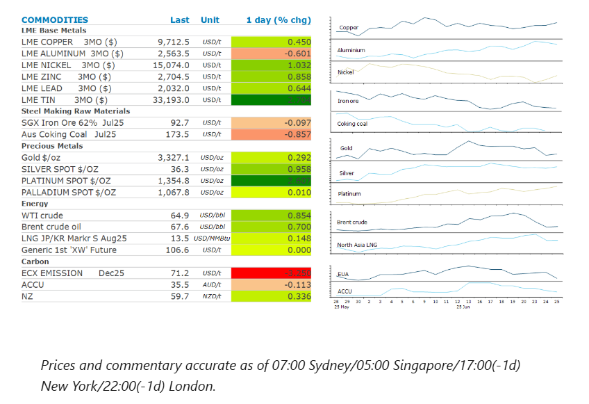
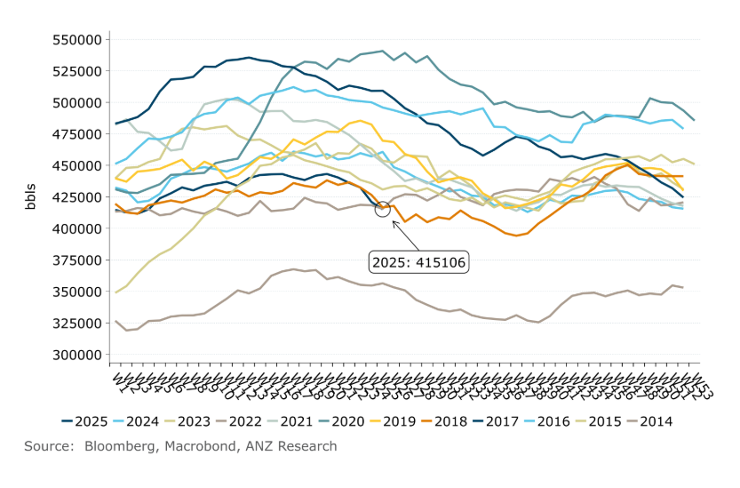

# Strong US demand boost sentiment in oil market

**Date:** June 26, 2025  
**Publisher:** Breakwave Advisors | **Category:** Market Insights  
**Original URL:** [https://www.breakwaveadvisors.com/insights/2025/6/26/strong-us-demand-boost-sentiment-in-oil-market](https://www.breakwaveadvisors.com/insights/2025/6/26/strong-us-demand-boost-sentiment-in-oil-market)  

---

Crude oil rebounded after Trump pulled back from sanction relief on Iran. Metals were broadly higher amid signs of stronger demand.

*By*[*Daniel Hynes*](https://www.linkedin.com/in/dahynes/)

> **Figure 1: Στιγμιότυπο Οθόνης 2025 06 26 143022**  
> **Interactive Data & Source:** [Linkedin](https://www.linkedin.com/newsletters/commodities-wrap-6692196755876012032/?fbclid=IwAR3kiXJqZdxmp9ZcRwBNI7FsBySI-XSC0pfPur1qzjt7OZp7PTE59Tsl1QI) | [Local Asset](file:///C:/Users/Dell/Github/Shipping/corpus/03-breakwave/insights/2025/assets/2025-06-26_strong-us-demand-boost-sentiment-in-oil-market_img_cea3cf84ceb9ceb3cebcceb9cf8ccf84cf85_0b5a363752a3.png)

### Market Commentary

**Crude oil**prices lifted after President Trump said the US would hold a meeting with Iran next week but maintained that he was not giving up his ‘maximum pressure’ campaign. The comments came as the US seeks to hammer out a new trade framework with China and climb down from the tariff war.

Easing tension in the Middle East saw the market return its focus to fundamentals. US government data showed the US driving season is in full swing after a slow start. The country’s crude oil inventories fell for the fifth straight week, dropping 5.8mbbl to sit at an 11-year seasonal low. Gasoline inventories also saw a strong drawdown, falling 2,075kbbl last week. Stockpiles of distillate fuel also saw a fall.

The American Automobile Association expects 61.6m people will travel by car in the week starting 28 June. That’s a 2.2% increase from last year. Its forecast is being driven by gasoline prices that are down about USD0.25/gallon from a year ago and are the lowest for this time of year since 2011.

**Global gas**prices were mixed as easing supply concerns were offset by the need to stockpile fuel for the winter. The cessation of hostilities has seen traders turn attention to refilling depleted storage facilities. Europe’s biggest economy, Germany, has lagged behind its neighbours in refilling storage facilities.**North Asia LNG**prices were relatively unchanged. LNG stockpiles held by Japan utilities rose 5.14% to 2.25mt on 22 June from a week earlier, according to data from the trade ministry.

**Gold**steadied as traders weighed up easing tensions in the Middle East with comments from Federal Reserve Chair Jerome Powell. The Fed chief said the US central bank is still struggling to determine the impact of tariffs on consumer prices. He also noted that the US has the strongest economy, and it makes sense to move slowly in times of uncertainty.

**Copper**rose for a fourth day, even amid signs the LME squeeze is abating. Contracts for immediate delivery traded at a premium of USD98/t to the LME benchmark 3mth contract, down from USD398/t earlier this week. Supplies in LME warehouses have been partly drained due to record shipments to the US ahead of upcoming tariffs. However, strong demand from China has also played its part.

**Iron ore**futures threatened to record a new year-to-date low as robust supplies and lower steel production in China weighs on sentiment. Iron ore shipments from the two largest exporters have set records for the month of May. Exports from Port Hedland increase to 53.1mt last month, up 13.7% from April. This takes year to date volumes to 233.4mt, the highest in data going back to 2010. The world’s second largest exporter, Brazil, also saw a rise in shipments in May, sending out 35.1mt, according to customs data. This comes as steel production in China moderates

### Chart of the Day

Crude oil inventories in the US have fallen for five consecutive weeks and are now sitting at their lowest seasonal level since 2014. The apparent strength in demand should provide some support to crude oil prices.

> **Figure 2: Στιγμιότυπο Οθόνης 2025 06 26 143143**  
> **Interactive Data & Source:** [Linkedin](https://www.linkedin.com/newsletters/commodities-wrap-6692196755876012032/?fbclid=IwAR3kiXJqZdxmp9ZcRwBNI7FsBySI-XSC0pfPur1qzjt7OZp7PTE59Tsl1QI) | [Local Asset](file:///C:/Users/Dell/Github/Shipping/corpus/03-breakwave/insights/2025/assets/2025-06-26_strong-us-demand-boost-sentiment-in-oil-market_img_cea3cf84ceb9ceb3cebcceb9cf8ccf84cf85_57498b8732bd.png)

Data source:[Commodities Wrap](https://www.linkedin.com/newsletters/commodities-wrap-6692196755876012032/?fbclid=IwAR3kiXJqZdxmp9ZcRwBNI7FsBySI-XSC0pfPur1qzjt7OZp7PTE59Tsl1QI)

---

**Tags:** Shipping, Commodities, Markets  
