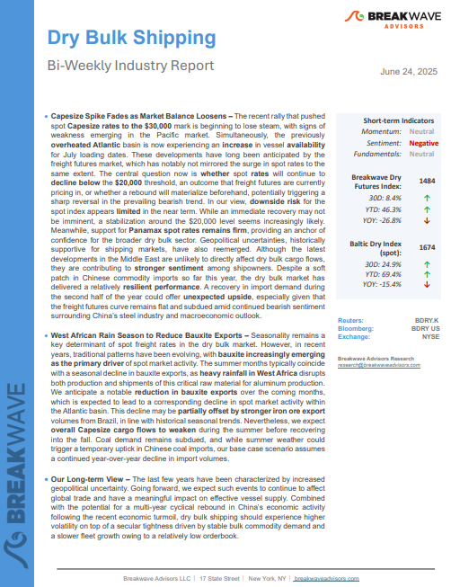
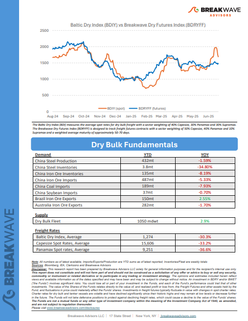
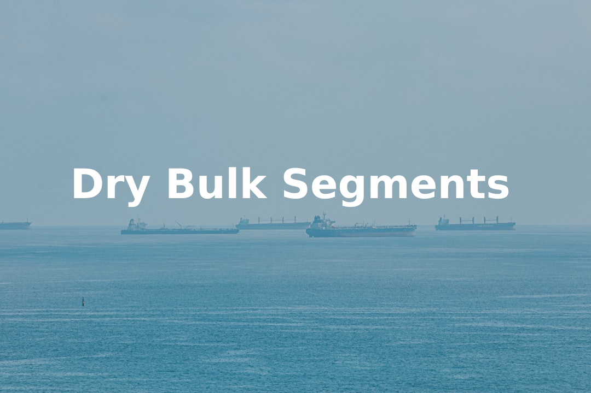
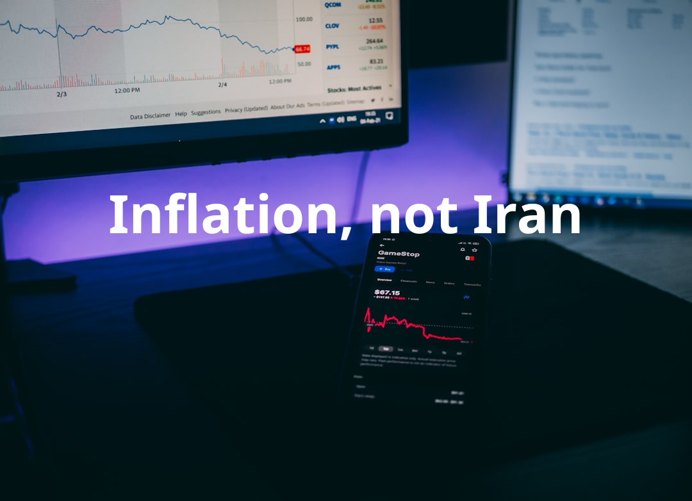
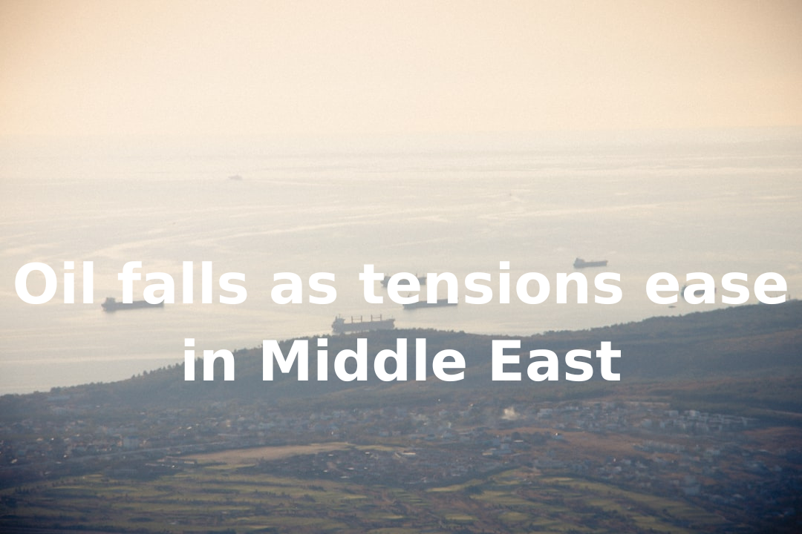
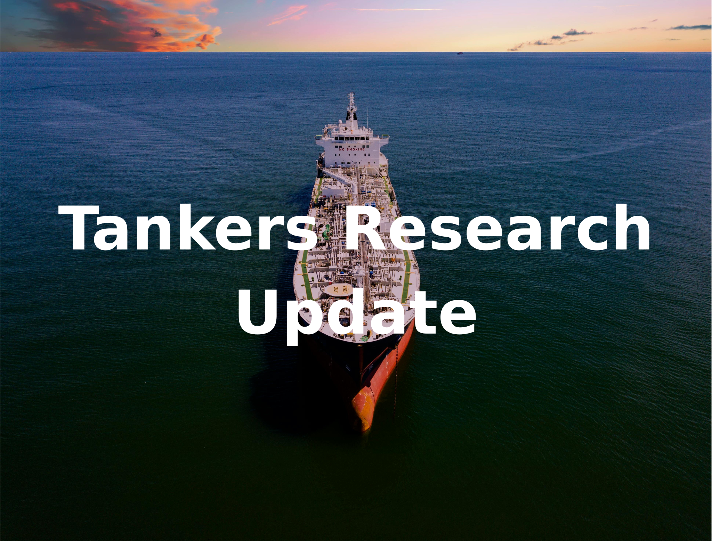
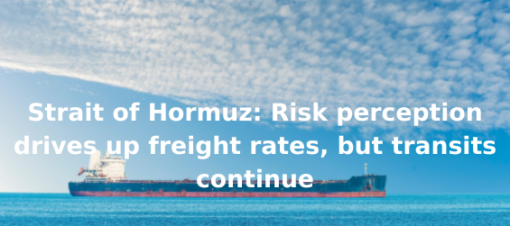
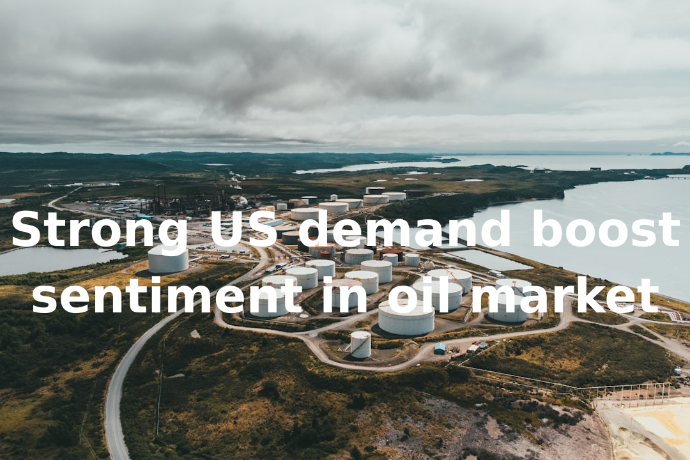

# Breakwave Weekend Read

**Date:** June 27, 2025  
**Publisher:** Breakwave Advisors | **Category:** Market Insights  
**Original URL:** [https://www.breakwaveadvisors.com/insights/2024/10/25/breakwave-weekend-read-547kk-rw7zy-awmfb-mf26k-dk29d-56ysb](https://www.breakwaveadvisors.com/insights/2024/10/25/breakwave-weekend-read-547kk-rw7zy-awmfb-mf26k-dk29d-56ysb)  

---

## Welcome Tobreakwave Advisorsweekend Read

***As the week comes to a close, take a moment to review the key insights from the past few days. Missed something? We've gathered all the top insights for you to catch up at your convenience.***

## Breakwave Shipping Report

**Capesize Spike Fades as Market Balance Loosens**– The recent rally that pushed spot**Capesize rates to the $30,000**mark is beginning to lose steam, with signs of weakness emerging in the Pacific market.

[Read More](https://www.breakwaveadvisors.com/insights/2025624-drybulk)

> **Figure 1: Στιγμιότυπο Οθόνης 2025 06 27 132235**  
> **Interactive Data & Source:** [Breakwave Advisors Market Insights](https://www.breakwaveadvisors.com/insights/2025/6/23/dry-bulk-segments) | [Local Asset](file:///C:/Users/Dell/Github/Shipping/corpus/03-breakwave/insights/2025/assets/2025-06-27_breakwave-weekend-read-547kk-rw7zy-awmfb-mf26k-dk29d-56ysb_img_cea3cf84ceb9ceb3cebcceb9cf8ccf84cf85_1cd8f2595b96.png)

> **Figure 2: Στιγμιότυπο Οθόνης 2025 06 27 132253**  
> **Interactive Data & Source:** [Breakwave Advisors Market Insights](https://www.breakwaveadvisors.com/insights/2025/6/23/dry-bulk-segments) | [Local Asset](file:///C:/Users/Dell/Github/Shipping/corpus/03-breakwave/insights/2025/assets/2025-06-27_breakwave-weekend-read-547kk-rw7zy-awmfb-mf26k-dk29d-56ysb_img_cea3cf84ceb9ceb3cebcceb9cf8ccf84cf85_33c9a7340b2d.png)

## Dry Bulk Segments

> **Figure 3: Dry Bulk Segments**  
> **Interactive Data & Source:** [Breakwave Advisors Market Insights](https://www.breakwaveadvisors.com/insights/2025/6/23/dry-bulk-segments) | [Local Asset](file:///C:/Users/Dell/Github/Shipping/corpus/03-breakwave/insights/2025/assets/2025-06-27_breakwave-weekend-read-547kk-rw7zy-awmfb-mf26k-dk29d-56ysb_img_drybulksegments_b3e1de640a9a.png)

In a notable departure from the same period last year, the twenty-fifth trading week concluded with a far more subdued tone, particularly across the larger dry bulk segments.

Doric Weekly Market Insights

## Inflation, Not Iran

> **Figure 4: Προσθέστε Επικεφαλίδα**  
> **Interactive Data & Source:** [Breakwave Advisors Market Insights](https://www.breakwaveadvisors.com/insights/2025/6/23/inflation-not-iran) | [Local Asset](file:///C:/Users/Dell/Github/Shipping/corpus/03-breakwave/insights/2025/assets/2025-06-27_breakwave-weekend-read-547kk-rw7zy-awmfb-mf26k-dk29d-56ysb_img_cea0cf81cebfcf83ceb8ceadcf83cf84ceb5_b84d998cf230.png)

Geopolitical events rarely have lasting effects on financial markets; economic and financial fundamentals remain the key drivers.

Forvis Mazars Weekly Note

## Oil Falls As Tensions Ease in Middle East

> **Figure 5: Προσθέστε Επικεφαλίδα (1)**  
> **Interactive Data & Source:** [Breakwave Advisors Market Insights](https://www.breakwaveadvisors.com/insights/2025/6/24/oil-falls-as-tensions-ease-in-middle-east) | [Local Asset](file:///C:/Users/Dell/Github/Shipping/corpus/03-breakwave/insights/2025/assets/2025-06-27_breakwave-weekend-read-547kk-rw7zy-awmfb-mf26k-dk29d-56ysb_img_cea0cf81cebfcf83ceb8ceadcf83cf84ceb5_407dab594740.png)

Easing fears of supply disruptions pushed energy markets lower. Metals were mixed amid the shift in sentiment.

Commodities Wrap

## Tankers Research Update

> **Figure 6: Ανώνυμο Σχέδιο**  
> **Interactive Data & Source:** [Breakwave Advisors Market Insights](https://www.breakwaveadvisors.com/insights/2025/6/24/tankers-research-update) | [Local Asset](file:///C:/Users/Dell/Github/Shipping/corpus/03-breakwave/insights/2025/assets/2025-06-27_breakwave-weekend-read-547kk-rw7zy-awmfb-mf26k-dk29d-56ysb_img_ce91cebdcf8ecebdcf85cebccebfcf83cf87_45489ca15c83.png)

Tanker spot rates on key Middle East export routes have surged to their highest levels this year on June 23 amid a sharp escalation in regional tensions in the Middle East.

Braemar Research

## A Fluid and Fast-Evolving Geopolitical Landscape

> **Figure 7: A Fluid and Fast Evolving Geopolitical Landscape**  
> **Interactive Data & Source:** [Breakwave Advisors Market Insights](https://www.breakwaveadvisors.com/insights/2025/6/25/a-fluid-and-fast-evolving-geopolitical-landscape) | [Local Asset](file:///C:/Users/Dell/Github/Shipping/corpus/03-breakwave/insights/2025/assets/2025-06-27_breakwave-weekend-read-547kk-rw7zy-awmfb-mf26k-dk29d-56ysb_img_afluidandfast-evolvinggeopoliticalla_8f5a7ff151f1.png)

Amid a fluid and fast-evolving geopolitical landscape in the Middle East marked by geostrategic calculated moves, energy and shipping markets are adjusting to the latest developments, reflecting the broader geopolitical dynamics at play.

Intermodal Weekly Market Report

## Strait of Hormuz: Risk Perception Drives Up Freight Rates, But Transits Continue

> **Figure 8: Προσθέστε Επικεφαλίδα (2)**  
> **Interactive Data & Source:** [Breakwave Advisors Market Insights](https://www.breakwaveadvisors.com/insights/2025/6/25/strait-of-hormuz-risk-perception-drives-up-freight-rates-but-transits-continue) | [Local Asset](file:///C:/Users/Dell/Github/Shipping/corpus/03-breakwave/insights/2025/assets/2025-06-27_breakwave-weekend-read-547kk-rw7zy-awmfb-mf26k-dk29d-56ysb_img_cea0cf81cebfcf83ceb8ceadcf83cf84ceb5_9f8a036b3f4e.png)

1.5 weeks into the Israel-Iran conflict, we discuss impacts to the freight market as seen in freight rate developments and actual transits in the Strait of Hormuz.

Vortexa Freight Weekly

## Strong Us Demand Boost Sentiment in Oil Market

> **Figure 9: Ανώνυμο Σχέδιο (1)**  
> **Interactive Data & Source:** [Breakwave Advisors Market Insights](https://www.breakwaveadvisors.com/insights/2025/6/26/strong-us-demand-boost-sentiment-in-oil-market) | [Local Asset](file:///C:/Users/Dell/Github/Shipping/corpus/03-breakwave/insights/2025/assets/2025-06-27_breakwave-weekend-read-547kk-rw7zy-awmfb-mf26k-dk29d-56ysb_img_ce91cebdcf8ecebdcf85cebccebfcf83cf87_0924a5dfee34.png)

Crude oil rebounded after Trump pulled back from sanction relief on Iran. Metals were broadly higher amid signs of stronger demand.

Commodities Wrap

## Capesize Market Falling Due in Part to Drop in Brazilian Spot Iron Ore Cargo Volume

> **Figure 10: Capesize Market Falling Due in Part to Drop in Brazilian Spot Iron Ore Cargo Volume**  
> **Interactive Data & Source:** [Breakwave Advisors Market Insights](https://www.breakwaveadvisors.com/insights/2025/6/27/capesize-market-falling-due-in-part-to-drop-in-brazilian-spot-iron-ore-cargo-volume) | [Local Asset](file:///C:/Users/Dell/Github/Shipping/corpus/03-breakwave/insights/2025/assets/2025-06-27_breakwave-weekend-read-547kk-rw7zy-awmfb-mf26k-dk29d-56ysb_img_capesizemarketfallingdueinparttodrop_13874ac623c0.png)

As we discussed in Commodore Research's June 23rd Weekly Executive Report, overall dry bulk rates fell last week with capesize rates in particular coming under significant pressure.

From Commodore's Weekly Dry Bulk Reports

## Spotlight on Indonesian Thermal Coal Shipments

> **Figure 11: Ανώνυμο Σχέδιο (2)**  
> **Interactive Data & Source:** [Breakwave Advisors Market Insights](https://www.breakwaveadvisors.com/insights/2025/6/27/spotlight-on-indonesian-thermal-coal-shipments) | [Local Asset](file:///C:/Users/Dell/Github/Shipping/corpus/03-breakwave/insights/2025/assets/2025-06-27_breakwave-weekend-read-547kk-rw7zy-awmfb-mf26k-dk29d-56ysb_img_ce91cebdcf8ecebdcf85cebccebfcf83cf87_8507978fee0f.png)

This week’s Market Monitor highlights a notable shift in thermal coal trade flows, particularly in the evolving import strategies of China and India.

Signal Ocean Dry Weekly Market Monitor

---

**Tags:** Shipping, Tankers, Drybulk  
