# Spotlight on Indonesian Thermal Coal Shipments

**Date:** June 27, 2025  
**Publisher:** Breakwave Advisors | **Category:** Market Insights  
**Original URL:** [https://www.breakwaveadvisors.com/insights/2025/6/27/spotlight-on-indonesian-thermal-coal-shipments](https://www.breakwaveadvisors.com/insights/2025/6/27/spotlight-on-indonesian-thermal-coal-shipments)  

---

**WEEKLY DRY MARKET MONITOR**
*Spot Rates | Supply-Demand Trends | Port Congestion Overview*

Week 26, 2025 | Date: June 26, 2025

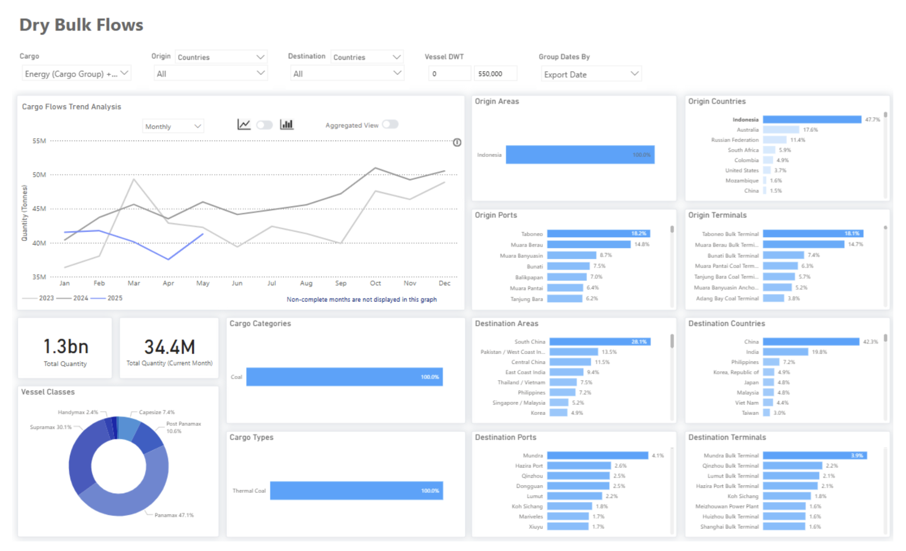

> **Figure 1: Chart of the Week: Spotlight on Indonesian Thermal Coal Shipments**  
> **Interactive Data & Source:** [Signal Ocean Platform](https://go.signalocean.com/e/983831/amic-drybulkflows-downloadable/2r7gxx/506106936/h/1cCf1HbH259FoyN5B7cgGryYlEgqZv4_op4HzRuDMm4) | [Local Asset](file:///C:/Users/Dell/Github/Shipping/corpus/03-breakwave/insights/2025/assets/2025-06-27_spotlight-on-indonesian-thermal-coal-shipments_img_unnamed_b50df50c3246.png)

This week’s**Market Monitor**highlights a notable shift in thermal coal trade flows, particularly in the evolving import strategies of China and India. According to the latest dry bulk flow data, Indonesia continues to account for 48% of global thermal coal exports, with Taboneo and Muara Berau remaining the most active origin terminals. However, Chinese and Indian buyers are increasingly turning to higher-grade coal alternatives from countries such as Australia and Russia. This trend appears to be mainly driven by the current downturn in global coal prices, which has made energy-dense coal from non-Indonesian sources more cost-competitive.

**World Bank**data confirms that Australia’s Newcastle 6,300 kcal/kg FOB coal price averaged $104.41/t in May 2025, up approximately 6% from $98.61 in April, but down about 26.5% compared to $142.01 in May 2024. Meanwhile, as early as March, trends indicated that railborne coal imports from[Mongolia](https://go.signalocean.com/e/983831/-523718-utm-source-chatgpt-com/2r7gy1/506106936/h/1cCf1HbH259FoyN5B7cgGryYlEgqZv4_op4HzRuDMm4)and Russia were gaining share, as improved infrastructure made land transport cheaper than seaborne alternatives.

**China**continues to dominate, receiving 42% of Indonesian coal shipments, followed by India at 19%. However, both nations are showing a clear shift toward sourcing coal with higher calorific values. At the same time, Chinese seaborne coal imports are being gradually displaced by rising domestic coal production, which is a trend reinforced by policy support and the continued approval of new coal-fired power plants.

In**Q1**2025,**China**approved 11.3 GW of new coal plant capacity, surpassing the 10.3 GW approved in the entire first half of 2024, signaling continued support for domestic coal infrastructure. In early June, the China Coal Transportation & Distribution Association projected that[coal imports](https://go.signalocean.com/e/983831/p-says--utm-source-chatgpt-com/2r7gy4/506106936/h/1cCf1HbH259FoyN5B7cgGryYlEgqZv4_op4HzRuDMm4)could decline by 50–100 million tonnes in 2025, stemming from significantly higher domestic production and state directives to reduce imports and stockpile local coal.

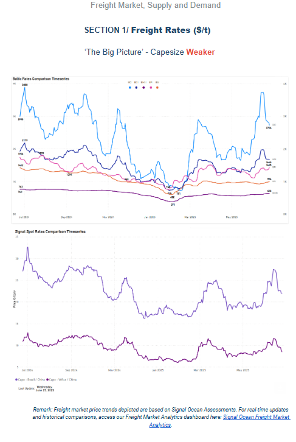

> **Figure 2: Στιγμιότυπο Οθόνης 2025 06 27 114010**  
> **Interactive Data & Source:** [Signal Ocean Platform](https://go.signalocean.com/e/983831/ic-capes-insights-downloadable/2r7gyf/506106936/h/1cCf1HbH259FoyN5B7cgGryYlEgqZv4_op4HzRuDMm4) | [Local Asset](file:///C:/Users/Dell/Github/Shipping/corpus/03-breakwave/insights/2025/assets/2025-06-27_spotlight-on-indonesian-thermal-coal-shipments_img_cea3cf84ceb9ceb3cebcceb9cf8ccf84cf85_d2f7c4fc5648.png)

The Baltic Dry Index (BDI) softened toward the end of June, primarily due to oversupply concerns in the Capesize segment. While the Atlantic basin experienced a modest tightening in tonnage availability, the Pacific market continued to face a surplus of vessel capacity relative to cargo demand.

vessel freight rates on the Brazil–North China route fell by 6% week-on-week, settling at around $21.8 per tonne. A similar downward pattern is visible on the Western Australia–China route, where rates declined by 12% over the same period. Potential drivers of downward pressure include seasonal weakness in Chinese steel mill activity. Additionally, cargo availability increased in May following the post-cyclone recovery. With overall supply, including waiting vessels, expected to remain ample, the C5 route is likely to stay oversupplied in the near term.

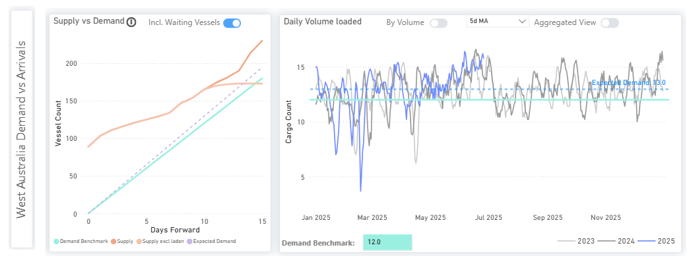

> **Figure 3: Capesize**  
> **Interactive Data & Source:** [Signal Ocean Platform](https://go.signalocean.com/e/983831/ic-capes-insights-downloadable/2r7gyf/506106936/h/1cCf1HbH259FoyN5B7cgGryYlEgqZv4_op4HzRuDMm4) | [Local Asset](file:///C:/Users/Dell/Github/Shipping/corpus/03-breakwave/insights/2025/assets/2025-06-27_spotlight-on-indonesian-thermal-coal-shipments_img_unnamed28129_17cce30461f1.png)

Panamax - ECSA / Far East**Weaker**

vessel freight rates from the ECSA to the Far East have dropped to $32 per tonne, though they remain above the late-May low of $29 per tonne. This weakening trend is expected to persist, as the number of Panamax ballasters heading to the ECSA holds above 260, while daily loading volumes in the region are trending downward, falling below 0.8 million metric tons.

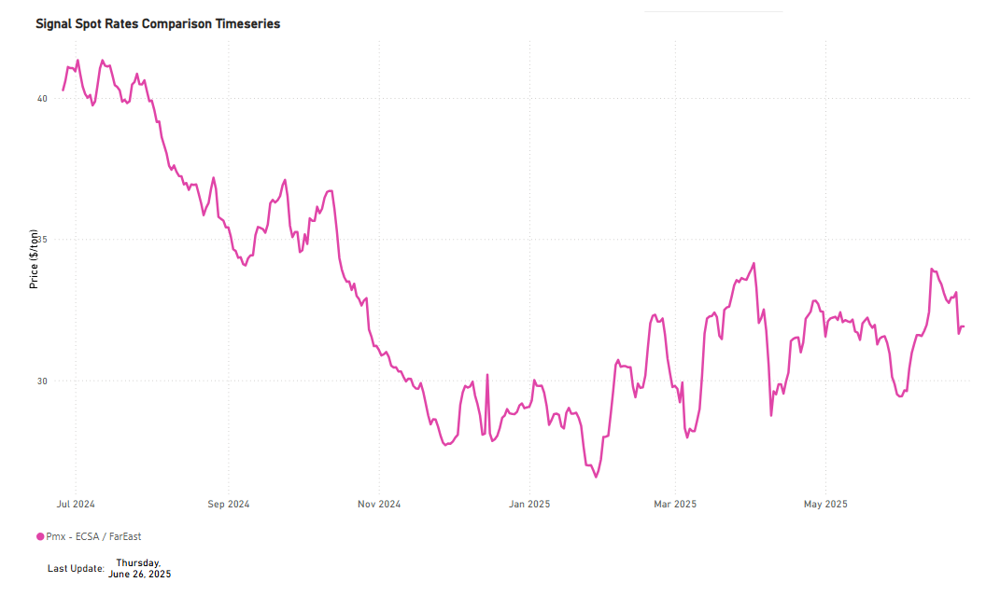

> **Figure 4: Panamax**  
> **Interactive Data & Source:** [Signal Ocean Platform](https://go.signalocean.com/e/983831/-panamax-insights-downloadable/2r7gyj/506106936/h/1cCf1HbH259FoyN5B7cgGryYlEgqZv4_op4HzRuDMm4) | [Local Asset](file:///C:/Users/Dell/Github/Shipping/corpus/03-breakwave/insights/2025/assets/2025-06-27_spotlight-on-indonesian-thermal-coal-shipments_img_unnamed28229_ac4008a405f1.png)

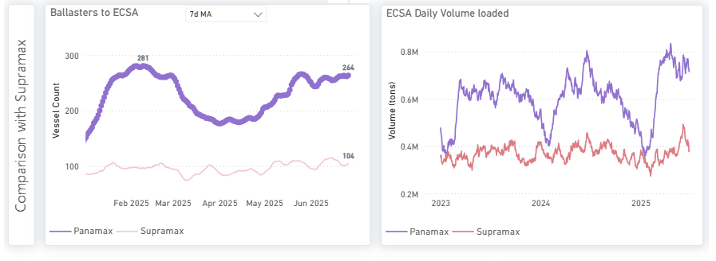

> **Figure 5: Market Chart 5**  
> **Interactive Data & Source:** [Signal Ocean Platform](https://go.signalocean.com/e/983831/-panamax-insights-downloadable/2r7gyj/506106936/h/1cCf1HbH259FoyN5B7cgGryYlEgqZv4_op4HzRuDMm4) | [Local Asset](file:///C:/Users/Dell/Github/Shipping/corpus/03-breakwave/insights/2025/assets/2025-06-27_spotlight-on-indonesian-thermal-coal-shipments_img_unnamed28329_c224df1a8636.png)

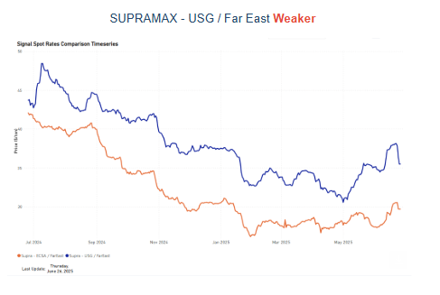

> **Figure 6: Στιγμιότυπο Οθόνης 2025 06 27 114034**  
> **Interactive Data & Source:** [Signal Ocean Platform](https://go.signalocean.com/e/983831/supramax-insights-downloadable/2r7gym/506106936/h/1cCf1HbH259FoyN5B7cgGryYlEgqZv4_op4HzRuDMm4) | [Local Asset](file:///C:/Users/Dell/Github/Shipping/corpus/03-breakwave/insights/2025/assets/2025-06-27_spotlight-on-indonesian-thermal-coal-shipments_img_cea3cf84ceb9ceb3cebcceb9cf8ccf84cf85_51bd41573bbc.png)

vessel freight rates from the US Gulf (USG) to the Far East have weakened by 7%, falling to $35 per tonne. Meanwhile, ECSA–Far East rates are holding around $30 per tonne, reflecting a 2% weekly decline. The softening trend in the ECSA market does not appear to be driven by an increase in ballasters, as the 7-day moving average has declined to approximately 120 vessels, about 20 fewer than at the end of May. On the demand side, signals remain mixed. A recent spike has been observed in daily cargo volumes loaded in the Panamax segment, whereas Supramax volumes are trending downward, with the latest figures showing daily loadings of less than 0.3 million metric tonnes.

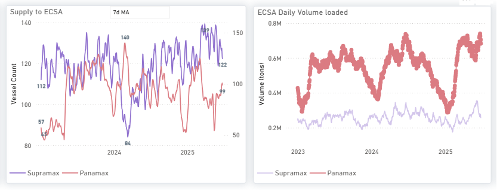

> **Figure 7: Supramax**  
> **Interactive Data & Source:** [Signal Ocean Platform](https://go.signalocean.com/e/983831/supramax-insights-downloadable/2r7gym/506106936/h/1cCf1HbH259FoyN5B7cgGryYlEgqZv4_op4HzRuDMm4) | [Local Asset](file:///C:/Users/Dell/Github/Shipping/corpus/03-breakwave/insights/2025/assets/2025-06-27_spotlight-on-indonesian-thermal-coal-shipments_img_unnamed28429_e2bf5bca0954.png)

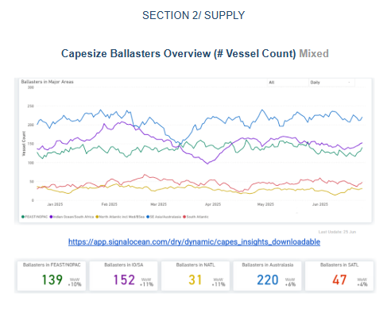

> **Figure 8: Στιγμιότυπο Οθόνης 2025 06 27 114048**  
> **Interactive Data & Source:** [Signal Ocean Platform](https://www.thesignalgroup.com/signal-ocean-platform) | [Local Asset](file:///C:/Users/Dell/Github/Shipping/corpus/03-breakwave/insights/2025/assets/2025-06-27_spotlight-on-indonesian-thermal-coal-shipments_img_cea3cf84ceb9ceb3cebcceb9cf8ccf84cf85_3a7a79105726.png)

**Capesize ballasters view**: Available vessels in the North Atlantic have shown a slight tightening before the end of the month. In the Pacific, ballast vessel counts have climbed, exceeding 150 in the Indian Ocean/South Africa region and reaching a recent high of 139 in the Far East/NOPAC.

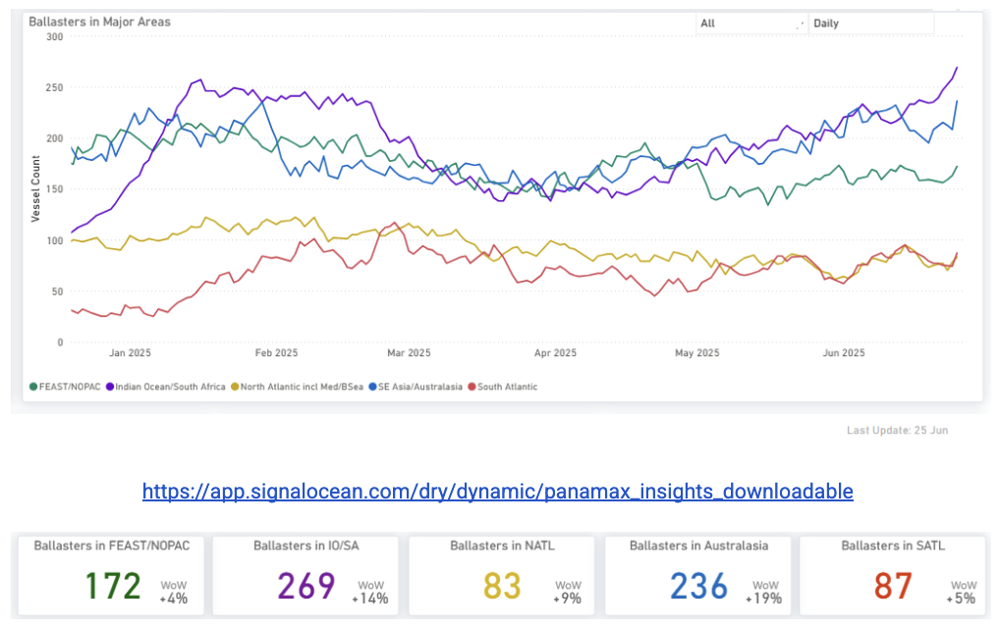

> **Figure 9: Panamax Ballasters Overview (# Vessel Count) Increasing**  
> **Interactive Data & Source:** [Signal Ocean Platform](https://www.thesignalgroup.com/signal-ocean-platform) | [Local Asset](file:///C:/Users/Dell/Github/Shipping/corpus/03-breakwave/insights/2025/assets/2025-06-27_spotlight-on-indonesian-thermal-coal-shipments_img_unnamed28529_a70e439a9beb.png)

**Panamax ballasters view**: The Pacific market remains heavily oversupplied in the Panamax sector, with ballast vessel counts peaking nearly at 270 in the Indian Ocean/South Africa region and 236 in Australasia.

​​​​​

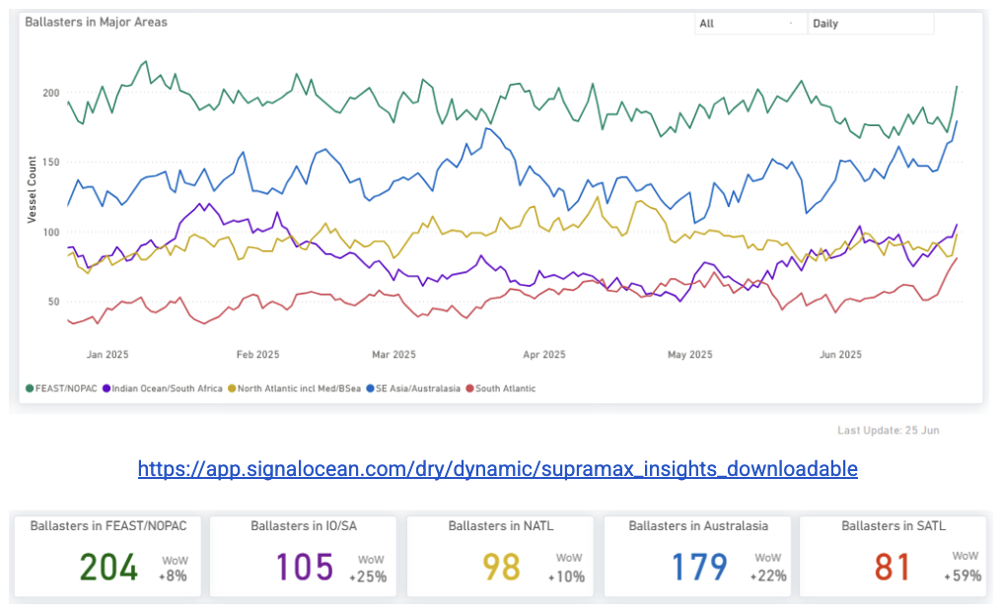

> **Figure 10: Supramax Ballasters Overview Increasing**  
> **Interactive Data & Source:** [Signal Ocean Platform](https://www.thesignalgroup.com/signal-ocean-platform) | [Local Asset](file:///C:/Users/Dell/Github/Shipping/corpus/03-breakwave/insights/2025/assets/2025-06-27_spotlight-on-indonesian-thermal-coal-shipments_img_unnamed28629_32ed35db1ce1.png)

**Supramax ballasters view**: The Pacific market, specifically for the Far East/NOPAC and Australasia routes, is experiencing oversupply. This is evidenced by over 200 vessels currently ballasting in the Far East/NOPAC. In the Atlantic, the number of ballasting vessels is also significant, exceeding 90 in the North Atlantic.

​​​​​​

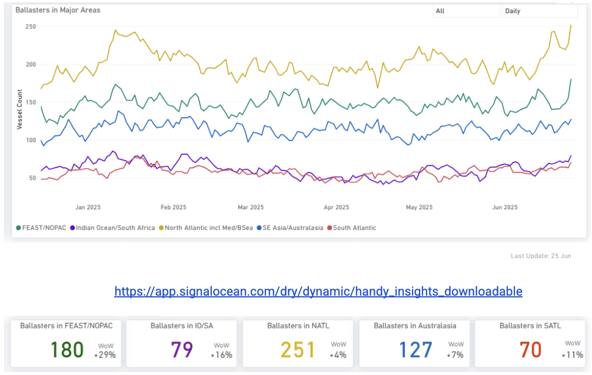

> **Figure 11: Handysize Ballasters Overview Increasing**  
> **Interactive Data & Source:** [Signal Ocean Platform](https://www.thesignalgroup.com/signal-ocean-platform) | [Local Asset](file:///C:/Users/Dell/Github/Shipping/corpus/03-breakwave/insights/2025/assets/2025-06-27_spotlight-on-indonesian-thermal-coal-shipments_img_unnamed28729_245dfcdf9cfb.png)

**Handysize ballasters**: Significant weekly increases in vessel oversupply were observed across both the Pacific and North Atlantic basins. The Pacific basin faced a more substantial burden, with the Far East/North Pacific region reaching approximately 180 vessels and Australasia at 127. The North Atlantic's oversupply almost surpassed 250 ballasters.

## Section 3/ Demand (Coal)

## Tonne Days Decreasing

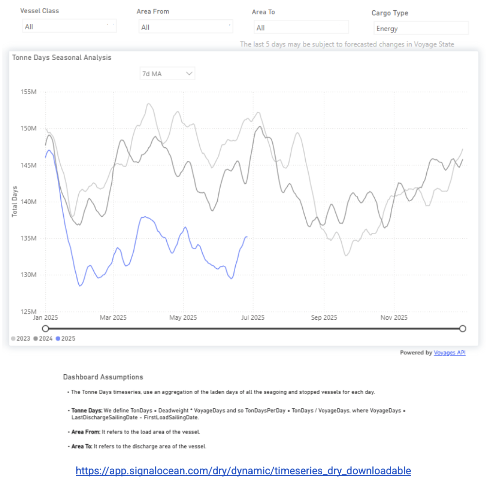

> **Figure 12: Tonne Days Decreasing**  
> **Interactive Data & Source:** [Signal Ocean Platform](https://www.thesignalgroup.com/signal-ocean-platform) | [Local Asset](file:///C:/Users/Dell/Github/Shipping/corpus/03-breakwave/insights/2025/assets/2025-06-27_spotlight-on-indonesian-thermal-coal-shipments_img_unnamed28829_cddd7c5d4678.png)

Two weeks ago, our weekly market monitor highlighted the growth in iron ore tonne-days, which underpinned a stronger performance in the Baltic Capesize Index. Conversely, the coal segment faces pressure; Panamax and Supramax earnings are challenged by a continuous decline in tonne-day growth, consistently staying below the levels seen in the past two years.

## Section 4/ Waypoints

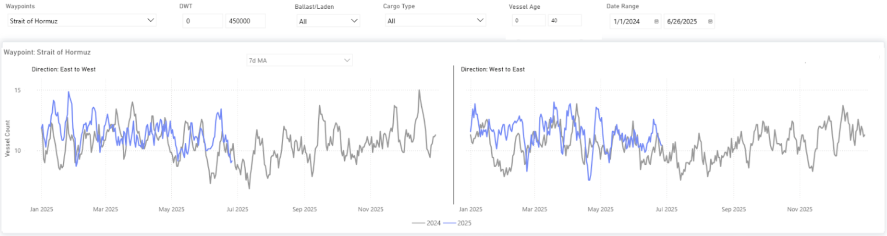

> **Figure 13: Strait of Hormuz**  
> **Interactive Data & Source:** [Signal Ocean Platform](https://www.thesignalgroup.com/signal-ocean-platform) | [Local Asset](file:///C:/Users/Dell/Github/Shipping/corpus/03-breakwave/insights/2025/assets/2025-06-27_spotlight-on-indonesian-thermal-coal-shipments_img_unnamed28929_88a49af8b712.png)

Following the peaceful agreement between Iran and Israel, maritime activity through the Strait of Hormuz is expected to remain normalized. However, a degree of risk persists for shipowners due to ongoing security concerns in the region. Electronic interference continues to be a key issue affecting vessels and their operators. While commercial traffic remains steady, we are closely monitoring the situation, with a particular focus on vessel count and overall transit patterns.

Data Source:[Signal Ocean Platform](https://www.thesignalgroup.com/signal-ocean-platform)

---

**Tags:** Drybulk, Shipping, Capesize  
