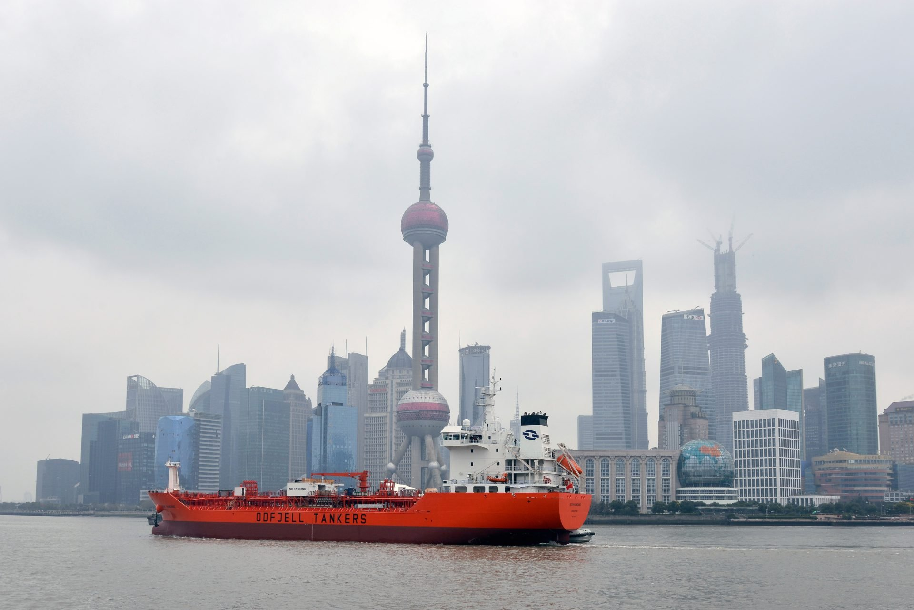
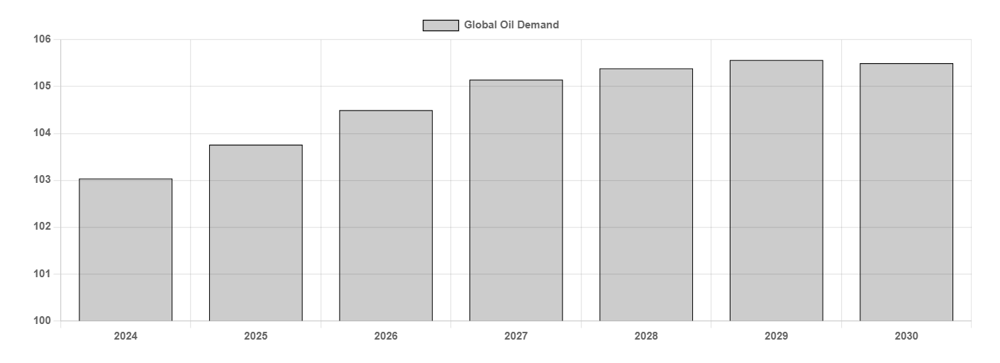

# A Longer View

**Date:** June 30, 2025  
**Publisher:** Breakwave Advisors | **Category:** Market Insights  
**Original URL:** [https://www.breakwaveadvisors.com/insights/2025/6/30/a-longer-view](https://www.breakwaveadvisors.com/insights/2025/6/30/a-longer-view)  

---

> **Figure 1: Chemical Tanker**  
> **Interactive Data & Source:** [Gibsons Co](https://www.gibsons.co.uk/market-reports) | [Local Asset](file:///C:/Users/Dell/Github/Shipping/corpus/03-breakwave/insights/2025/assets/2025-06-30_a-longer-view_img_chemical-tanker_8d59a120f236.jpg)

Earlier this month, the International Energy Agency (IEA) released their annual report detailing a medium-term outlook for oil markets. Oil 2025 has reiterated last year’s assertion that global oil demand will peak in 2029, only slightly changing the forecast for 2030 from 105.4 mbd to 105.5 mbd, with the trend gradually slowing and reaching contraction in 2030. Most of this growth is anticipated to take place in Asia Pacific, specifically in India, which is projected to grow by 1 mbd between 2024 and 2030, and Southeast Asia, with Indonesia leading the pack at 470 kbd. This growth is primarily made up of demand increases in petrochemical feedstocks and jet fuel. Elsewhere, the IEA sees demand growing in South and Central America and Africa by 600 and 800 kbd, respectively. Relative growth rates in Africa are projected to be the strongest globally, largely following population and GDP growth patterns. This year, global oil demand is seen at 103.8 mbd, an 800 kbd increase from 2024.

The biggest change in this year’s iteration is that Chinese demand is expected to increase by a mere 100 kbd between 2024 and 2030, a step change from last year’s report, which saw significant growth. Overall, Chinese oil demand expectations were revised downwards by 1.4 mbd in 2030. The main reasons behind this change are lower projected GDP growth and a more rapid decarbonisation of the vehicle fleet. Global demand displaced by EVs will reach over 5 mbd in 2030, with nearly half of that consisting of lower Chinese gasoline demand.

Balancing this change is a large markup in demand in the OECD, with North American demand revised up by 1 mbd and Europe by 400 kbd compared with last year, though both regions are expected to have peaked already with demand slowing more gradually throughout the decade. In contrast to China, EV penetration prospects were revised downwards for both Europe and North America, particularly in the US.

On the supply side, global oil production is forecast to rise by 3.4 mbd between 2024 and 2030, with strong growth especially in the Americas. US production is expected to rise this year and then slowly begin plateauing, with growth continuing more consistently in Canada, Guyana, Brazil, and Argentina. Strong supply growth in non-OPEC+ countries leads the IEA to expect the call on OPEC+ to decrease by 1.8 mbd by 2030, further lowering OPEC+ market share. OPEC+ on the other hand may have different ideas.

In refining, global capacity is projected to increase by 2.5 mbd between 2024 and 2030. Refining capacity additions are largely expected to take place in the East, led by China and India, at 1 mbd each, as well as 600 kbd of additions in the Middle East. Elsewhere, capacity will shrink slightly West of Suez. In terms of throughput, only 600 kbd of global growth are forecast to take place in this period, with runs increasing by 1.3 mbd in the East, and shrinking by 700 kbd in the West. Refiners will also increasingly be forced to modify their crude slates to reflect lower road fuel demand and pivot towards petrochemical feedstock as well as invest in biofuel production.

The IEA view has been challenged in recent years, with other forecasters expounding more bullish assessments and expecting oil demand to keep growing well into the next decade. However, if the IEA’s predictions come to pass, the impacts on tanker markets will be manifold. A large share of demand growth will come in the form of petrochemical feedstocks and NGLs, shifting demand towards chemical tankers and gas carriers. Further, some demand for conventional refined fuels will shift to biofuels, which provides opportunities for specialised tankers. Crude tanker markets are likely to remain supported, as growing demand East of Suez is met by growing supply West of Suez, largely in the Americas, supporting long haul trade throughout the forecast period. However, in a change from last year’s outlook, slower domestic demand declines in the West and slowing demand growth in the East somewhat moderates this effect. The outlook for the product tanker market looks more challenging, with conventional refined fuel demand easing as well as refinery capacity coming online close to demand growth centres. This could see clean tonne mile demand tested in the coming years.

### Global Oil Demand (Kbd)

> **Figure 2: Στιγμιότυπο Οθόνης 2025 06 30 094120**  
> **Interactive Data & Source:** [Gibsons Co](https://www.gibsons.co.uk/market-reports) | [Local Asset](file:///C:/Users/Dell/Github/Shipping/corpus/03-breakwave/insights/2025/assets/2025-06-30_a-longer-view_img_cea3cf84ceb9ceb3cebcceb9cf8ccf84cf85_536ce898ada1.png)

Data source:[Gibson Shipbrokers](https://www.gibsons.co.uk/market-reports)

---

**Tags:** Crude, Tankers, Markets  
