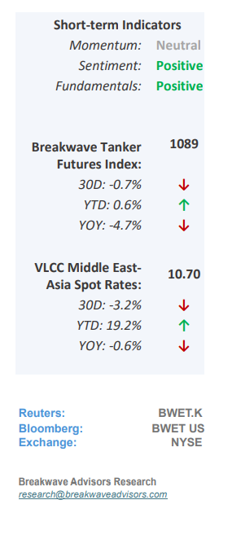
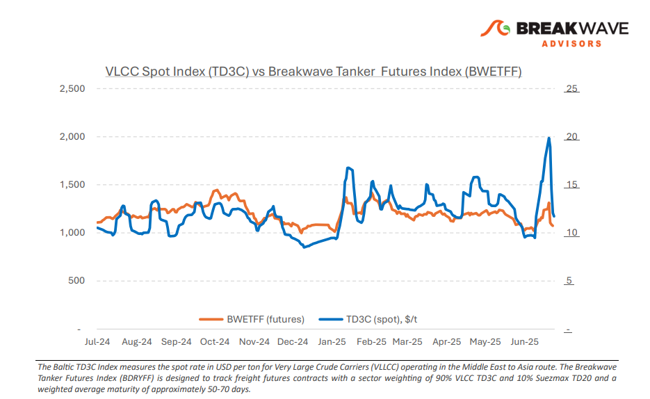
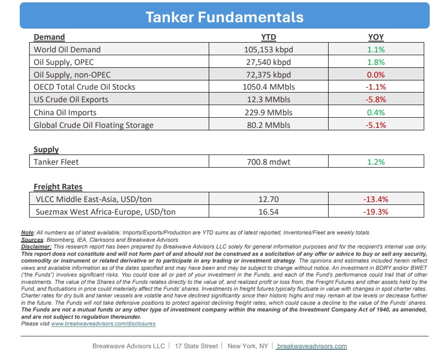

# Breakwave Bi-Weekly Tanker Report - July 1, 2025

**Date:** July 01, 2025  
**Publisher:** Breakwave Advisors | **Category:** Market Insights  
**Original URL:** [https://www.breakwaveadvisors.com/insights/2025177wreport114kio](https://www.breakwaveadvisors.com/insights/2025177wreport114kio)  

---

•**VLCC Rates Face Reality Amid De-escalation, Lack of Disruptions**– Following weeks of geopolitical tensions, the VLCC market is entering a**phase of normalization**after the landmark ceasefire agreement between Iran and Israel. Crucially, the Straits of Hormuz remain open, and the latest AIS tracking data shows a clear uptick in vessel transits, signaling**improved confidence**and operational continuity through this strategic chokepoint. Previously and ahead of the intense fighting, owners had diverted tonnage or held back in anticipation of further escalation. However, such hesitation is now subsiding.**Eastbound rates,**which had reached triple-digit levels, eventually**fell**by nearly**50%**almost overnight, reflecting the easing of regional risk and a thinning of second-decade July inquiries. Some charterers have also re-let tonnage secured earlier at elevated levels, further weakening sentiment. In the West African market, rates are also adjusting downward, though the decline is less pronounced. Looking ahead, the**direction of VLCC rates**will likely be shaped by a combination of peace-driven**risk repricing, OPEC+**production policies, and rate**normalization**following speculative highs. Key watchpoints include owner resistance near current rate floors, the potential replenishment of July stems, and continued monitoring of vessel transits through the Strait of Hormuz for signs of sustained stability. Interestingly, toward the end of June and despite the typical summer seasonality that usually dampens demand projections,**Asian****oil****appetite**reached**relatively high levels.**This surge has created a supportive pillar for a potential tanker market rebalancing, even as vessel supply remains a key negative influence.

> **Figure 1: Στιγμιότυπο Οθόνης 2025 07 01 085037**  
> [Local Asset](file:///C:/Users/Dell/Github/Shipping/corpus/03-breakwave/insights/2025/assets/2025-07-01_2025177wreport114kio_img_cea3cf84ceb9ceb3cebcceb9cf8ccf84cf85_7ae990a67dc6.png)

•**Oil Prices Drop Sharply but Stabilize Above Pre-Attack Levels**– The sharp and short US military operation in Iran and the very**limited response**, has brought significant selling in the oil markets amid no oil flow disruption and scattered but unsubstantiated rumors about Iran action related to Persian Gulf oil flows. As a result, a**large portion of the embedded geopolitical premium**in oil prices is now gone. However, despite such a sharp decline,**oil**prices remain**above the levels**seen**prior**to the military conflict in Iran. As the market awaits more oil supply coming from OPEC+, one wonders whether**oil demand**is actually**not as soft**as previously thought. Indeed, recent economic numbers out of China point to more stability and analysts are**questioning**the need for imminent**stimulus**. In addition, inventories continue to draw and although there are structural reasons that might argue for lower-than-normal**inventories**, it is notable that levels sit at the**lower end of the historical range**. We believe there is still some room for decline when it comes to oil prices, but we are a bit**more constructive**than previously on the outlook for oil demand for the remainder of the year.

•**Our Long-term View**– The tanker market is recovering from a long period of staggered rates as the growth in new vessel supply shrinks while oil demand remains elevated in line with the global economy. A historically low orderbook combined with favorable shifting trade patterns should continue to support increased spot rate volatility, which combined with the ongoing geopolitical turmoil, should sustain freight rates in the medium to long term.

> **Figure 2: Στιγμιότυπο Οθόνης 2025 07 01 085108**  
> [Local Asset](file:///C:/Users/Dell/Github/Shipping/corpus/03-breakwave/insights/2025/assets/2025-07-01_2025177wreport114kio_img_cea3cf84ceb9ceb3cebcceb9cf8ccf84cf85_6b8a8296f9fd.png)

> **Figure 3: Στιγμιότυπο Οθόνης 2025 07 01 085125**  
> [Local Asset](file:///C:/Users/Dell/Github/Shipping/corpus/03-breakwave/insights/2025/assets/2025-07-01_2025177wreport114kio_img_cea3cf84ceb9ceb3cebcceb9cf8ccf84cf85_e1bac8fce61f.png)

### Subscribe:
