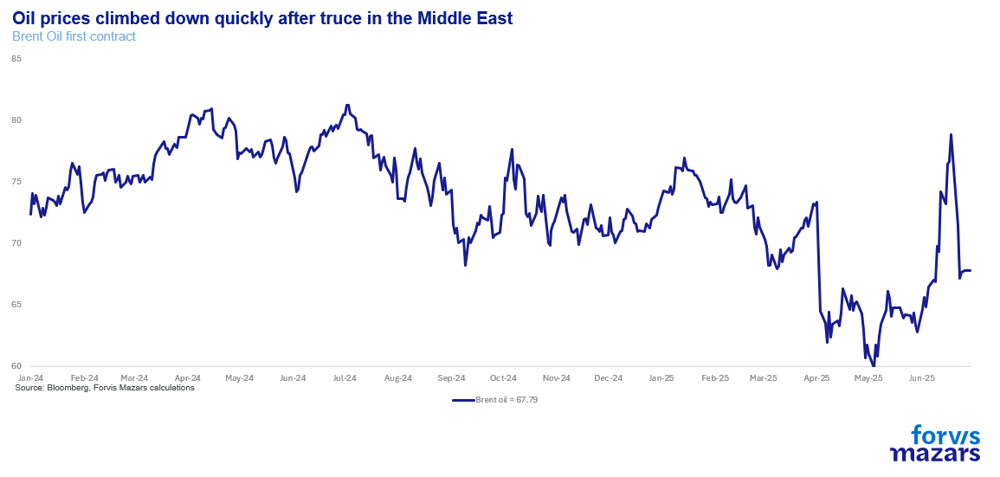
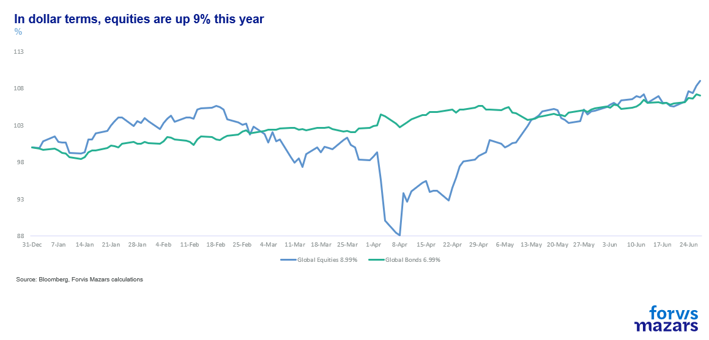
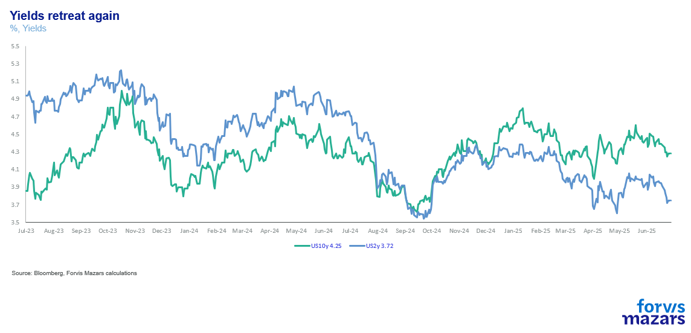
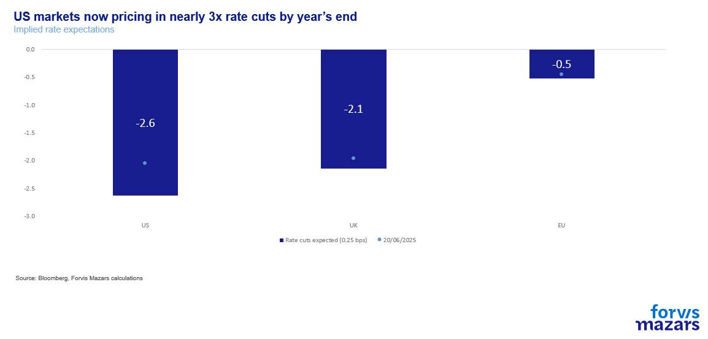
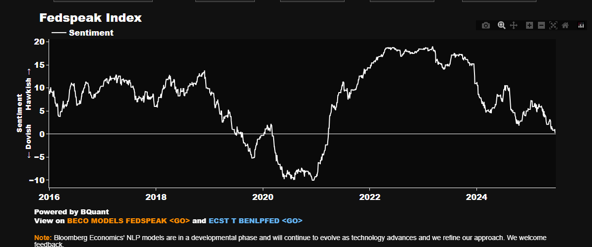
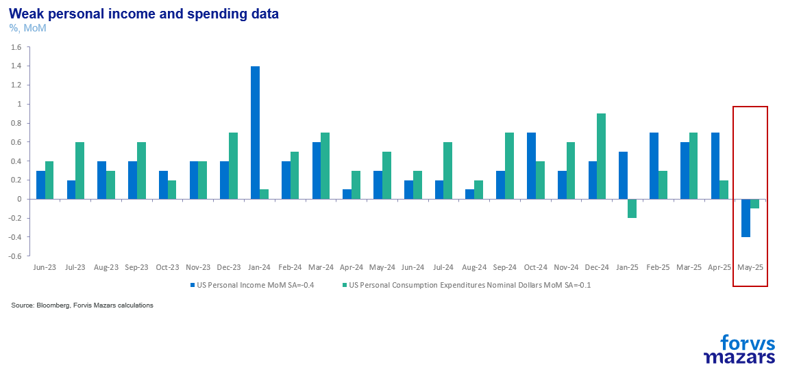
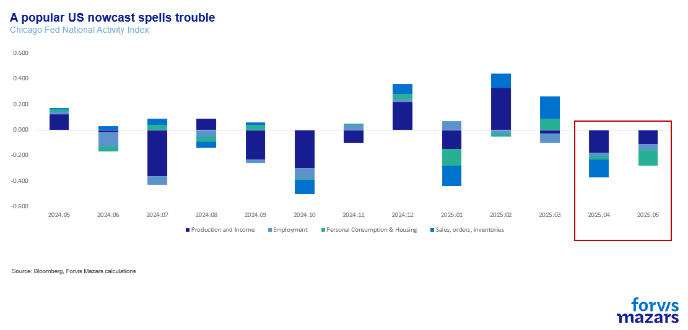
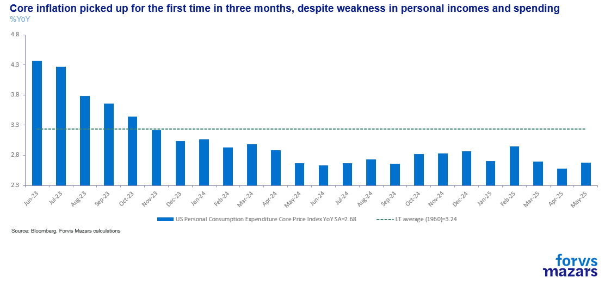
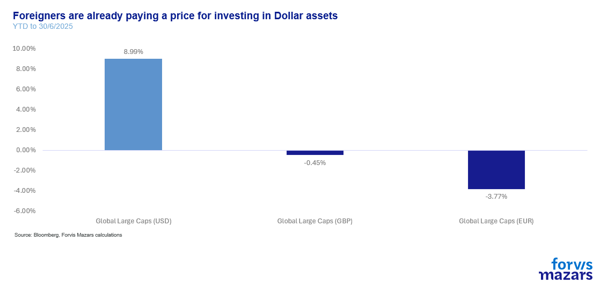

# Are exuberant markets ignoring risks?

**Date:** July 01, 2025  
**Publisher:** Breakwave Advisors | **Category:** Market Insights  
**Original URL:** [https://www.breakwaveadvisors.com/insights/2025/7/1/are-exuberant-markets-ignoring-risks](https://www.breakwaveadvisors.com/insights/2025/7/1/are-exuberant-markets-ignoring-risks)  

---

The three things investors should know this week:

1. Markets rallied on relief from the Middle East, but trade challenges are just around the corner.
2. The Fed is now projected to cut rates in September and later in the year, but investors should not put all their faith in those forecasts as inflation lurks.
3. The dollar’s move may become the most important determinant of financial performance this year.

*By*[*George Lagarias*](https://www.linkedin.com/in/george-lagarias-mba-3baa769/)

### ------------------

Summary

Markets are rallying due to easing Middle East tensions, falling oil prices, lower yields, and dovish signals from the Fed, which may cut rates by September. US large-cap equities hit all-time highs, buoyed by USD-driven profit inflation and rising liquidity. Yet risks remain: growth data is soft, core inflation is edging up, and the Fed's stance is still cautious. Currency exposure is erasing returns for non-US investors, making FX a key risk factor. Businesses should avoid overreacting to short-term noise, downplay near-term US debt fears, and not overprice rate cuts. Instead, they should focus on fundamentals and currency dynamics.

---------------------

I remember Mark Rutte from the Greek crisis. In 2015, the then Dutch Prime Minister, stood up in the Dutch parliament and bravely exclaimed, “Not one more cent for Greece”, fully acknowledging the consequences of letting a Eurozone country fail. He was strong back then. Then, last week, the same Mark Rutte, now Secretary General of NATO, sent an embarrassingly fawning text to the US President and, bizarrely, referred to him as “daddy” during a NATO press conference where European leaders accepted to roughly double their defence spending in the next few years without so much as a peep (to be fair Spain showed some backbone).

Apparently, the new European approach is to say “yes” to everything and then test how long they can drag their feet. No point arguing. It’s the same principle with trade. The pragmatist Friedrich Merz suggested to opt for a “quick and dirty deal” with the US, similar to the UK. A business deal on some issues, which would relieve Europe from a 10%-20% tariff rate as long as it bought some aircraft or something. Some others advocate threats, a similar approach to China’s.

So here it is. Power is relative. So are principles, it appears. The multilateral international order has broken down, and country leaders deal with the US President like Mandarin bureaucrats would with an idiosyncratic emperor: first sycophantically praising and then prevaricating. The politics simply refuses to rise to the minimum threshold of responsibility businesses need if they are to operate smoothly.

Will the Europeans ever spend 5% of their GDP on defence? Will there be enough sobriety to achieve a trade, or even a business deal, between the EU and the US?

Asset managers can look at this cheap political Kabuki theatre with some amusement, but they can take very little from it. Would one invest in European steelmakers if one weren’t certain that European governments don’t plan to honour their defence spending pledge? Should we “bet” on a[quick and dirty](https://www.politico.eu/article/merz-trump-trade-deal-germany-united-states-european-union-tariffs/)(according to Politico) deal between the US and the EU (“quick and dirty” being the only thing one can get in such a short space of time – real trade deals take years), or should we position on a protracted trade war? What will the world look like by the 9th of July, the end date of the (first) postponement of American reciprocal tariffs? We don’t know. And with such low visibility, the safest way is

- To go with the market flow
- Focus on fundamentals
- React to high-confidence outcomes

And that is exactly what we should be doing right now. Instead of making assumptions about how the trade war will play out, we should focus on a different set of variables altogether.

Let’s start with the equity markets. Investors want to know two things:

- Why are markets rallying?
- Will money stay cheap?
- Will the Dollar stay weak?

Let’s start with the first. Markets are rallying because the war in the Middle East didn’t materialise. Oil prices are down

> **Figure 1: Market Chart 1**  
> [Local Asset](file:///C:/Users/Dell/Github/Shipping/corpus/03-breakwave/insights/2025/assets/2025-07-01_are-exuberant-markets-ignoring-risks_img_image001_ff07f224bfb7.png)

> **Figure 2: Equities Are Back Up**  
> [Local Asset](file:///C:/Users/Dell/Github/Shipping/corpus/03-breakwave/insights/2025/assets/2025-07-01_are-exuberant-markets-ignoring-risks_img_image002_0c60c8054fab.png)

> **Figure 3: And Yields Are Pushed Down**  
> [Local Asset](file:///C:/Users/Dell/Github/Shipping/corpus/03-breakwave/insights/2025/assets/2025-07-01_are-exuberant-markets-ignoring-risks_img_image003_d47b331cc156.png)

Gold corrected and volatility levels have subsided significantly. It’s the perfect risk-on market. We could put some of the blame on the low dollar, which inflates US equities, but this doesn’t account for the lower borrowing costs. So why are markets so happy?

After all, debt levels continue to climb, the US mega-bill may be delayed and not deliver the spending cuts it promised, the truce in the Middle East is as tentative as ever, and the 9th of July is just next week.

The answer? For one, the Fed has turned more dovish. While some more dovish members suggest a July cut, markets are now fully pricing a September rate cut.

> **Figure 4: Market Chart 4**  
> [Local Asset](file:///C:/Users/Dell/Github/Shipping/corpus/03-breakwave/insights/2025/assets/2025-07-01_are-exuberant-markets-ignoring-risks_img_image004_a29b5a0973cc.png)

because of pressures from the President (and rumours of a dovish “shadow Fed President” installed months before Powell’s tenure ends) and partly because of persistently benign economic data, we are now seeing the most dovish Fed since mid-2021.

> **Figure 5: Market Chart 5**  
> [Local Asset](file:///C:/Users/Dell/Github/Shipping/corpus/03-breakwave/insights/2025/assets/2025-07-01_are-exuberant-markets-ignoring-risks_img_image005_73fb952f7b34.png)

Source: Bloomberg

This is a liquid market and is projected to be even more liquid. Add the Dollar inflating profits reported in USD and the Mega-bill that will likely offset some of the tariff impact on growth nearing passage, catalysed with good news from the Middle East, and we can somewhat explain why we are now seeing US large caps at their all-time highs.

Is this sustainable?

To consider this, we need to look at inflation and growth. Last week wasn’t particularly good for either. Despite a small rebound in US consumer sentiment, personal income and spending were disappointing as some social security-related benefits ended.

> **Figure 6: Market Chart 6**  
> [Local Asset](file:///C:/Users/Dell/Github/Shipping/corpus/03-breakwave/insights/2025/assets/2025-07-01_are-exuberant-markets-ignoring-risks_img_image006_ed8f092e4f9c.png)

The Chicago Fed National Activity Index, a relatively reliable economic “Nowcast” (a forecast of what the economy is doing “now”) contracted for the second straight month.

> **Figure 7: Market Chart 7**  
> [Local Asset](file:///C:/Users/Dell/Github/Shipping/corpus/03-breakwave/insights/2025/assets/2025-07-01_are-exuberant-markets-ignoring-risks_img_image007_b1460c50cf34.png)

Despite economic weakness, core PCE expenditure, the Fed’s preferred gauge of inflation unexpectedly climbed higher. Tariff inflationary pressures are partly offset by a weak housing market and Chinese deflation, but these are big forces and the data could tilt either way. So we would best heed Jerome Powell’s warning that “Tariffs will impact inflation” and recall his reminder that the Fed’s projections, and comments, don’t come from a very high level of certainty.

> **Figure 8: Market Chart 8**  
> [Local Asset](file:///C:/Users/Dell/Github/Shipping/corpus/03-breakwave/insights/2025/assets/2025-07-01_are-exuberant-markets-ignoring-risks_img_image008_0112e1adc687.png)

Right now the equity market is pricing in some very good outcomes. So, while there’s optimism that the Fed will cut rates, it is probably more prudent for investors to focus on the Fed’s real message which is “wait and see after the summer”.

And then there is the Dollar. US portfolios are having a good year, but nearly every other international investor with exposure to global stocks (more than 50% dollar assets) is actually negative since the beginning of the year.

> **Figure 9: Market Chart 9**  
> [Local Asset](file:///C:/Users/Dell/Github/Shipping/corpus/03-breakwave/insights/2025/assets/2025-07-01_are-exuberant-markets-ignoring-risks_img_image009_61465a951a28.png)

So the second concern is currency exposure, which has erased profits for most non-US investors. This is not unlikely to continue as the US government has been positive about the benefits of a weaker Dollar.

As for the bond market, which seems to have forgotten all about the impending US debt Armageddon? Experience suggests that debt crises are not linear events. Risks are low until one day, they begin to rise exponentially. Until such a day manifestly dawns on the biggest economy in the world with the deepest market and the world’s reserve currency, we would be less worried about the bond market mis-pricing risk.

### How Should Businesses and Investors Deal with Such an Environment?

1. Avoid too much speculation and projection of present events forward. We are at a negotiation phase of a new version of the global economic system, and this can get noisy.
2. Avoid pricing in a US debt collapse. The debt buildup is a big problem, to be sure, but it could be years before that particular risk begins to play out.
3. Avoid too much exuberance on rate cuts from the Fed, as central banks tend to err on the side of caution. If the US central bank cuts into an inflation rebound, it could risk losing its credibility and any control over the long end of the yield curve (where mortgages live), without even having its independence compromised.
4. Focus on the currency. While they are nearly impossible to predict, this year, and possibly forward, they could be the most important determinant of returns and even business decisions.

---

**Tags:** Macro, Economy, Markets  
