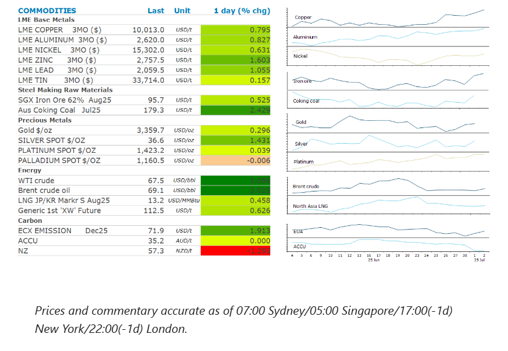
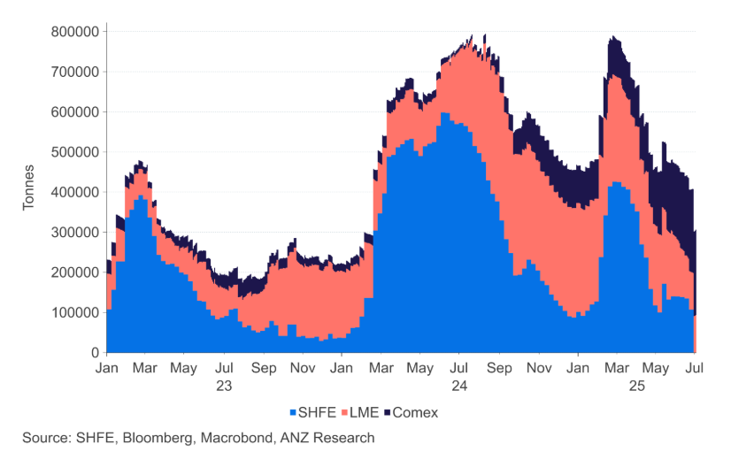

# Copper gains amid renewed supply side issues

**Date:** July 03, 2025  
**Publisher:** Breakwave Advisors | **Category:** Market Insights  
**Original URL:** [https://www.breakwaveadvisors.com/insights/2025/7/3/copper-gains-amid-renewed-supply-side-issues](https://www.breakwaveadvisors.com/insights/2025/7/3/copper-gains-amid-renewed-supply-side-issues)  

---

Easing trade tensions triggered a risk on tone across markets, boosting appetite for risk assets such as commodities. Metals led the gains while energy was also higher.

*By*[*Daniel Hynes*](https://www.linkedin.com/in/dahynes/)

> **Figure 1: Cea3cf84ceb9ceb3cebcceb9cf8ccf84cf85**  
> **Interactive Data & Source:** [Linkedin](https://www.linkedin.com/newsletters/commodities-wrap-6692196755876012032/?fbclid=IwAR3kiXJqZdxmp9ZcRwBNI7FsBySI-XSC0pfPur1qzjt7OZp7PTE59Tsl1QI) | [Local Asset](file:///C:/Users/Dell/Github/Shipping/corpus/03-breakwave/insights/2025/assets/2025-07-03_copper-gains-amid-renewed-supply-side-issues_img_cea3cf84ceb9ceb3cebcceb9cf8ccf84cf85_90c26919afe9.png)

### Market Commentary

**Copper**pushed above USD10,000/t, as supply side issues raised the prospect of tightness in the physical market. Artisanal miners are blockading the transport of copper from some operations in Peru. While onsite operations are not impacted, transport of semi-processed copper from operations including Las Bambas and Constancia has been interrupted. This comes amid a supply squeeze on the London Metal Exchange and in China that has led to widening spreads between spot prices and futures contracts. Copper inventory in LME warehouses has fallen more than 66% to around 93.3kt. However, some of the metal seems to have found its way to the US, with inventories in COMEX warehouses up 128% to 212kt over the same period.**Zinc**led the sector higher despite signs of weakness in demand. Refined zinc inventories in major China mainland markets including Shanghai, Guandong and Tianjin rose 12% in the past month to 73.5kt, according to Shanghai Metals Market data. The broader industrial metals markets also found some support from easing trade tensions. President Trump said he reached a deal with Vietnam, with the country set to pay a 20% tariff on exports to the US while imports from America would have no levy. Goods deemed to be transhipped through the country face a 40% levy.

**Gold**edged higher as easing trade tensions raised the prospect of the Fed cutting rates sooner than expected. Last week Chair Powell warned that he is still uncertain about the impact of tariffs on consumer price inflation. More trade deals at lower tariffs could build some confidence that inflation will remain benign, thus allowing the Fed to ease monetary policy.

**Iron ore**and steel prices in China surged after Beijing vowed to crack down on disorderly low-price competition and phase out some industrial capacity. The move shows China’s leaders are trying to tackle deflationary pressures weighing on the economy. The plans should also bring some relief to the steel industry, which has been weighed down by overcapacity. Steel prices gained amid reports that steel mills in the northern steel hub of Tangshan have received notice to continue to curb production to combat poor air quality. Sintering production is limited to 30% and some blast furnaces are not fully operational.

The risk-on tone triggered by the Vietnam trade deal helped boost sentiment across the energy complex.**Brent crude oil**rose more than 3% as investors priced in tentative optimism that more deals will be reached ahead of the 9 July deadline. This helped offset signs of waning demand in the US. EIA’s weekly inventory report showed a buildup in US crude inventories of 3.85mbbl. The increase was the largest in three months and more than five times the 680kbbl increase projected by the industry-funded American Petroleum Institute on Tuesday. Growth in US supply is likely to fall further, according to a Federal Reserve Bank of Dallas survey. US shale executive expects to drill fewer wells this year than planned due to lower oil prices and uncertainty surrounding tariffs.

**Global gas**markets were steady as traders assess the impact of heat waves that may boost energy consumption for cooling. The hot weather that has gripped Europe is expected to peak in the coming days, triggering red alerts. North Asia LNG prices edged higher amid renewed buying interest from importers.

### Chart of the Day

The prospect of tariffs on copper imports into the US has seen traders rush to secure supplies. Comex inventories have subsequently risen sharply. However, that has stopped total global exchange inventories falling. Strong demand and tightening supplies are playing a much greater part in prices than trade-related dislocations.

> **Figure 2: Στιγμιότυπο Οθόνης 2025 07 03 153303**  
> **Interactive Data & Source:** [Linkedin](https://www.linkedin.com/newsletters/commodities-wrap-6692196755876012032/?fbclid=IwAR3kiXJqZdxmp9ZcRwBNI7FsBySI-XSC0pfPur1qzjt7OZp7PTE59Tsl1QI) | [Local Asset](file:///C:/Users/Dell/Github/Shipping/corpus/03-breakwave/insights/2025/assets/2025-07-03_copper-gains-amid-renewed-supply-side-issues_img_cea3cf84ceb9ceb3cebcceb9cf8ccf84cf85_a2e9c3b0e5f8.png)

Data source:[Commodities Wrap](https://www.linkedin.com/newsletters/commodities-wrap-6692196755876012032/?fbclid=IwAR3kiXJqZdxmp9ZcRwBNI7FsBySI-XSC0pfPur1qzjt7OZp7PTE59Tsl1QI)

---

**Tags:** Shipping, Commodities, Markets  
