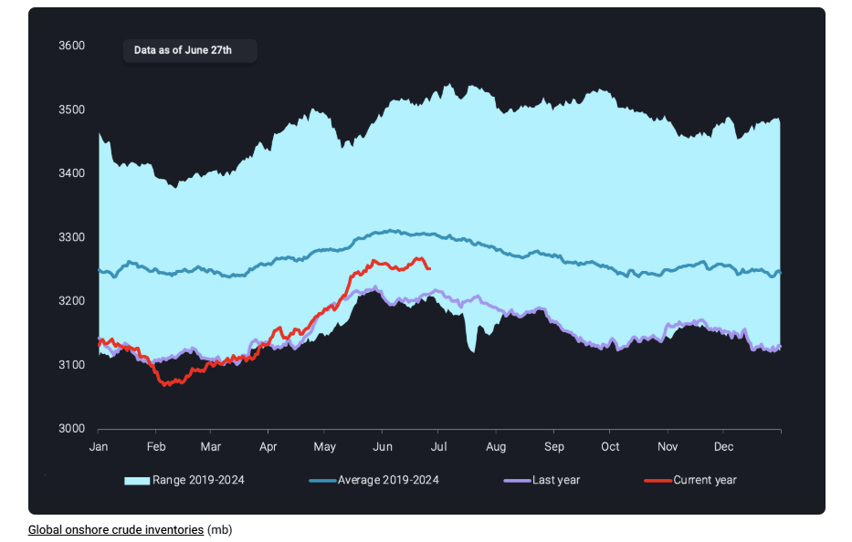
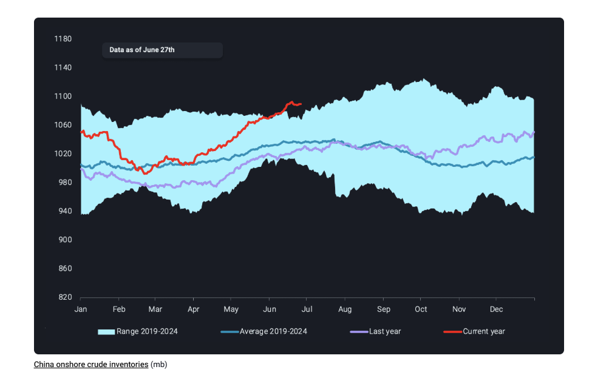

# Crude oil prices kept in check by rising onshore inventories

**Date:** July 03, 2025  
**Publisher:** Breakwave Advisors | **Category:** Market Insights  
**Original URL:** [https://www.breakwaveadvisors.com/insights/2025/7/3/crude-oil-prices-kept-in-check-by-rising-onshore-inventories](https://www.breakwaveadvisors.com/insights/2025/7/3/crude-oil-prices-kept-in-check-by-rising-onshore-inventories)  

---

As fragile peace has been brokered in the Middle East, we look at how rising onshore crude inventories across the globe kept crude oil prices in check.

*By*[*Rohit Rathod*](https://www.linkedin.com/in/rathodrohit/)

Over the past month, crude oil prices have been pretty volatile, driven mainly by the Israel-Iran conflict in the Middle East. While this conflict had the potential to further escalate, causing major trade flow disruptions, which would have caused oil prices to shoot past $90/bbl, they did not. This was mainly due to a US-brokered ceasefire on the geopolitical front and steadily rising global onshore crude stocks keeping things in check on the oil market side. While it would be incorrect to say that oil prices did not react to the conflict – Brent rose by $10/bbl and WTI by $9/bbl from June 10 to June 19 — the impact was somewhat softened by onshore inventory levels, which is what we shall investigate in this insight.

## Inventories Soften the Blow

> **Figure 1: Στιγμιότυπο Οθόνης 2025 07 03 134949**  
> **Interactive Data & Source:** [Analytics Vortexa](https://analytics.vortexa.com/OnShoreCrudeInventories?dateRange=2022-01-01T00%3A00%3A00.000Z__2025-06-27T23%3A59%3A59.999Z&frequency=day&onshoreInventoriesLocations=%5B%225e0cb0b66780a00576309aecff1b65934fc580d775bab29ac2a79397d8544e04%22%2C%220fddbfd0d90bad306a92fcb483a19276f101a5f7f0783363f9f2a9d40c10558d%22%2C%22934c47f36c16a58d68ef5e007e62a23f5f036ee3f3d1f5f85a48c572b90ad8b2%22%5D&owners=%5B%220378fb82d2401de13a59bd08bb385f1a20adf21e2da07db44a946af23130f729%22%5D&page=OnShoreCrudeInventories&selectedRegion=%5B%22934c47f36c16a58d68ef5e007e62a23f5f036ee3f3d1f5f85a48c572b90ad8b2%22%5D&tabId=9699b6f4-a5ed-48ea-989a-232b8f7c28b7&tankCrude=%5B%22confirmed%22%2C%22probable%22%5D) | [Local Asset](file:///C:/Users/Dell/Github/Shipping/corpus/03-breakwave/insights/2025/assets/2025-07-03_crude-oil-prices-kept-in-check-by-rising-onshore-inventories_img_cea3cf84ceb9ceb3cebcceb9cf8ccf84cf85_f3339595a562.png)

As mentioned earlier, global onshore crude inventories have been steadily increasing since mid-February, in line with seasonal patterns, surpassed 2024 levels by mid-May and have remained there ever since. This was driven by conducive prices that pushed Chinese buyers to build stocks as well as the OPEC+ announcement to unwind voluntary production cuts. Since then, we have seen a drawing of stocks over the past week or so, but inventories remain well above year-ago levels.

This meant that as crude oil prices reached $77/bbl for Brent and $74/bbl for WTI at the height of the conflict, they were quick to return to early June levels once the US-brokered ceasefire came into effect. Also, crucial here was that this ceasefire ensured that the flow of oil through the Strait of Hormuz remained unaffected and the increase in prices was just a war-premium that oil markets were expecting.

## Chinese Buying to Build Stocks Continues

As for inventory levels, most of these increases was driven by stock-building activities across demand centres in Far East Asia, South Asia and Northwest Europe, perhaps in anticipation of the Iran-Israel conflict intensifying. The most prolific of the stock builds was, and still is being, driven by China, where inventory levels are now setting new seasonal highs.

> **Figure 2: Στιγμιότυπο Οθόνης 2025 07 03 140339**  
> **Interactive Data & Source:** [Analytics Vortexa](https://analytics.vortexa.com/OnShoreCrudeInventories?dateRange=2022-01-01T00%3A00%3A00.000Z__2025-06-27T23%3A59%3A59.999Z&frequency=day&onshoreInventoriesLocations=%5B%225e0cb0b66780a00576309aecff1b65934fc580d775bab29ac2a79397d8544e04%22%2C%220fddbfd0d90bad306a92fcb483a19276f101a5f7f0783363f9f2a9d40c10558d%22%2C%22934c47f36c16a58d68ef5e007e62a23f5f036ee3f3d1f5f85a48c572b90ad8b2%22%5D&owners=%5B%220378fb82d2401de13a59bd08bb385f1a20adf21e2da07db44a946af23130f729%22%5D&page=OnShoreCrudeInventories&selectedRegion=%5B%22934c47f36c16a58d68ef5e007e62a23f5f036ee3f3d1f5f85a48c572b90ad8b2%22%5D&tabId=9699b6f4-a5ed-48ea-989a-232b8f7c28b7&tankCrude=%5B%22confirmed%22%2C%22probable%22%5D) | [Local Asset](file:///C:/Users/Dell/Github/Shipping/corpus/03-breakwave/insights/2025/assets/2025-07-03_crude-oil-prices-kept-in-check-by-rising-onshore-inventories_img_cea3cf84ceb9ceb3cebcceb9cf8ccf84cf85_4c7c253a1bed.png)

As seen in the above chart, Chinese stock building was already happening since October 2024, but it really shifted into top gear during this April and has not looked back since. Even within China, inventories can be broadly divided into state-owned, led by Sinopec, and the Shandong region inventories, led by the teapot refiners. Shandong inventory levels have been building since 2024 itself, but it was the[Sinopec held inventories](https://analytics.vortexa.com/OnShoreCrudeInventories?dateRange=2022-01-01T00%3A00%3A00.000Z__2025-06-27T23%3A59%3A59.999Z&frequency=day&onshoreInventoriesLocations=%5B%225e0cb0b66780a00576309aecff1b65934fc580d775bab29ac2a79397d8544e04%22%2C%220fddbfd0d90bad306a92fcb483a19276f101a5f7f0783363f9f2a9d40c10558d%22%2C%22934c47f36c16a58d68ef5e007e62a23f5f036ee3f3d1f5f85a48c572b90ad8b2%22%5D&owners=%5B%220378fb82d2401de13a59bd08bb385f1a20adf21e2da07db44a946af23130f729%22%5D&page=OnShoreCrudeInventories&selectedRegion=%5B%22934c47f36c16a58d68ef5e007e62a23f5f036ee3f3d1f5f85a48c572b90ad8b2%22%5D&tabId=9699b6f4-a5ed-48ea-989a-232b8f7c28b7&tankCrude=%5B%22confirmed%22%2C%22probable%22%5D)that were behind this aggressive build-up. Favourable crude oil prices were the foremost driver of this Chinese stock-building but the anticipation of conflict in the Middle East could likely have sped up the process.

Looking ahead, the ceasefire seems to be holding for now and there also seems to a tacit approval from the US administration towards Chinese buying of Iranian oil. But given the unpredictability of the current US administration and how fragile the peace in the Middle East can be it is difficult to predict where prices are going to settle for the rest of 2025. What remains certain though, is that the price impact of such conflicts flaring up again will remain muted thanks to current onshore crude inventory levels.

Data Source:[Vortexa](https://www.vortexa.com//oil-gas-data-traders-analysts-data-scientists?gclid=Cj0KCQjw8_qRBhCXARIsAE2AtRZKOvMnbilZ_6_91d7huSFFy71pWLrnPwGwOHVzXsmsG-1a1mZnQw8aAt89EALw_wcB&hsa_acc=1782073842&hsa_ad=548425387665&hsa_cam=14746637662&hsa_grp=125038601902&hsa_kw=&hsa_mt=&hsa_net=adwords&hsa_src=g&hsa_tgt=dsa-1431852288425&hsa_ver=3&utm_campaign=%5BCD%5D%20-%20DSA%20-%20EMEA&utm_medium=cpc&utm_medium=ppc&utm_source=google&utm_source=adwords&utm_term=)

---

**Tags:** Crude, Tankers, Markets  
