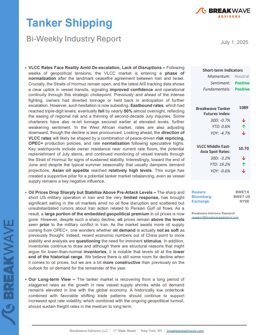
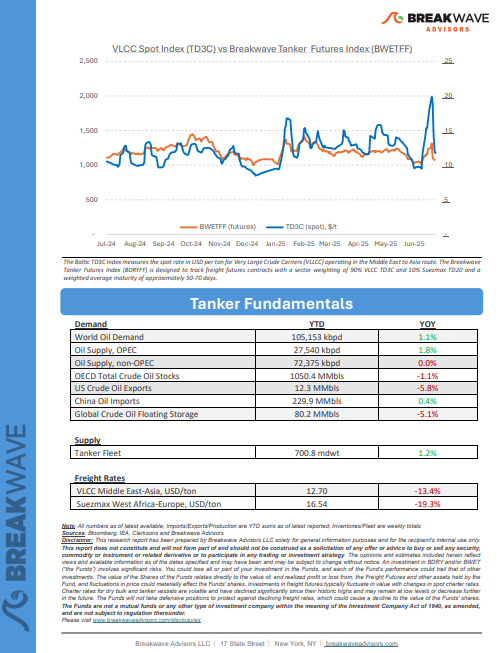
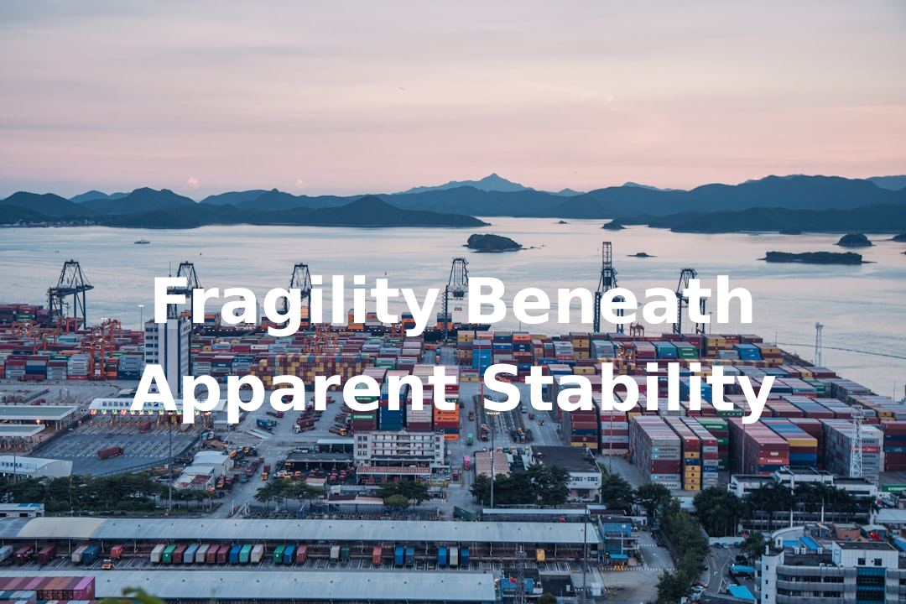
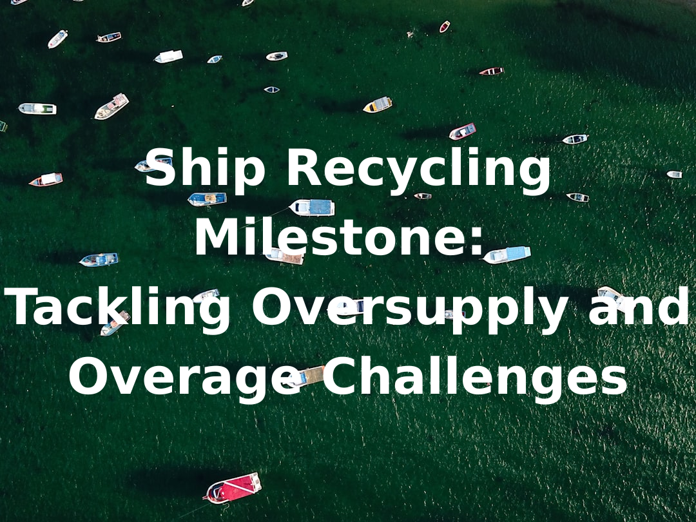

# Breakwave Weekend Read

**Date:** July 04, 2025  
**Publisher:** Breakwave Advisors | **Category:** Market Insights  
**Original URL:** [https://www.breakwaveadvisors.com/insights/2024/10/25/breakwave-weekend-read-547kk-rw7zy-awmfb-mf26k-dk29d-56ysb-x3jbe](https://www.breakwaveadvisors.com/insights/2024/10/25/breakwave-weekend-read-547kk-rw7zy-awmfb-mf26k-dk29d-56ysb-x3jbe)  

---

## Welcome Tobreakwave Advisorsweekend Read

***As the week comes to a close, take a moment to review the key insights from the past few days. Missed something? We've gathered all the top insights for you to catch up at your convenience.***

## Breakwave Shipping Report

**VLCC Rates Face Reality Amid De-escalation, Lack of Disruptions**– Following weeks of geopolitical tensions, the VLCC market is entering a**phase of normalization**after the landmark ceasefire agreement between Iran and Israel.

[Read More](https://www.breakwaveadvisors.com/insights/2025177wreport114kio)

> **Figure 1: Στιγμιότυπο Οθόνης 2025 07 04 134501**  
> **Interactive Data & Source:** [Breakwave Advisors Market Insights](https://www.breakwaveadvisors.com/insights/2025/6/30/fragility-beneath-apparent-stability) | [Local Asset](file:///C:/Users/Dell/Github/Shipping/corpus/03-breakwave/insights/2025/assets/2025-07-04_breakwave-weekend-read-547kk-rw7zy-awmfb-mf26k-dk29d-56ysb-x3jbe_img_cea3cf84ceb9ceb3cebcceb9cf8ccf84cf85_2fbf936b389f.png)

> **Figure 2: Στιγμιότυπο Οθόνης 2025 07 04 134512**  
> **Interactive Data & Source:** [Breakwave Advisors Market Insights](https://www.breakwaveadvisors.com/insights/2025/6/30/fragility-beneath-apparent-stability) | [Local Asset](file:///C:/Users/Dell/Github/Shipping/corpus/03-breakwave/insights/2025/assets/2025-07-04_breakwave-weekend-read-547kk-rw7zy-awmfb-mf26k-dk29d-56ysb-x3jbe_img_cea3cf84ceb9ceb3cebcceb9cf8ccf84cf85_873191981d30.png)

## Fragility Beneath Apparent Stability

> **Figure 3: Ανώνυμο Σχέδιο**  
> **Interactive Data & Source:** [Breakwave Advisors Market Insights](https://www.breakwaveadvisors.com/insights/2025/6/30/fragility-beneath-apparent-stability) | [Local Asset](file:///C:/Users/Dell/Github/Shipping/corpus/03-breakwave/insights/2025/assets/2025-07-04_breakwave-weekend-read-547kk-rw7zy-awmfb-mf26k-dk29d-56ysb-x3jbe_img_ce91cebdcf8ecebdcf85cebccebfcf83cf87_84b53a707cdd.png)

Oil markets began the week on edge as fears mounted over a potential closure of the Strait of Hormuz following U.S. airstrikes on Iranian nuclear sites.

Doric Weekly Market Insights

## A Longer View

> **Figure 4: A Longer View**  
> **Interactive Data & Source:** [Breakwave Advisors Market Insights](https://www.breakwaveadvisors.com/insights/2025/6/30/a-longer-view) | [Local Asset](file:///C:/Users/Dell/Github/Shipping/corpus/03-breakwave/insights/2025/assets/2025-07-04_breakwave-weekend-read-547kk-rw7zy-awmfb-mf26k-dk29d-56ysb-x3jbe_img_alongerview_e88d1260e7da.png)

Earlier this month, the International Energy Agency (IEA) released their annual report detailing a medium-term outlook for oil markets.

Gibson Tanker Market Report

## Are Exuberant Markets Ignoring Risks?

> **Figure 5: Προσθέστε Επικεφαλίδα**  
> **Interactive Data & Source:** [Breakwave Advisors Market Insights](https://www.breakwaveadvisors.com/insights/2025/7/1/are-exuberant-markets-ignoring-risks) | [Local Asset](file:///C:/Users/Dell/Github/Shipping/corpus/03-breakwave/insights/2025/assets/2025-07-04_breakwave-weekend-read-547kk-rw7zy-awmfb-mf26k-dk29d-56ysb-x3jbe_img_cea0cf81cebfcf83ceb8ceadcf83cf84ceb5_1a9119296dfe.png)

Markets are rallying due to easing Middle East tensions, falling oil prices, lower yields, and dovish signals from the Fed, which may cut rates by September.

Forvis Mazars Weekly Note

## Ship Recycling Milestone: Tackling Oversupply and Overage Challenges

> **Figure 6: Ship Recycling Milestone Tackling Oversupply and Overage Challenges**  
> **Interactive Data & Source:** [Breakwave Advisors Market Insights](https://www.breakwaveadvisors.com/insights/2025/7/2/ship-recycling-milestone-tackling-oversupply-and-overage-challenges) | [Local Asset](file:///C:/Users/Dell/Github/Shipping/corpus/03-breakwave/insights/2025/assets/2025-07-04_breakwave-weekend-read-547kk-rw7zy-awmfb-mf26k-dk29d-56ysb-x3jbe_img_shiprecyclingmilestonetacklingoversu_69a472b3ac4c.png)

First adopted in Hong Kong in 2009, the Convention’s implementation has been a long and complex process, reflecting years of negotiation, debate, and determination from governments, regulators, industry stakeholders, and NGOs.

Allied Weekly Report

## China Is Entering a New Phase of Recalibration

> **Figure 7: Ανώνυμο Σχέδιο (1)**  
> **Interactive Data & Source:** [Breakwave Advisors Market Insights](https://www.breakwaveadvisors.com/insights/2025/7/2/china-is-entering-a-new-phase-of-recalibration) | [Local Asset](file:///C:/Users/Dell/Github/Shipping/corpus/03-breakwave/insights/2025/assets/2025-07-04_breakwave-weekend-read-547kk-rw7zy-awmfb-mf26k-dk29d-56ysb-x3jbe_img_ce91cebdcf8ecebdcf85cebccebfcf83cf87_a64742581627.png)

After setting an all-time high for coal imports in 2024, China appears to be entering a new phase of recalibration.

Intermodal Weekly Market Report

## Crude Oil Prices Kept in Check by Rising Onshore Inventories

> **Figure 8: Προσθέστε Επικεφαλίδα (1)**  
> **Interactive Data & Source:** [Breakwave Advisors Market Insights](https://www.breakwaveadvisors.com/insights/2025/7/3/crude-oil-prices-kept-in-check-by-rising-onshore-inventories) | [Local Asset](file:///C:/Users/Dell/Github/Shipping/corpus/03-breakwave/insights/2025/assets/2025-07-04_breakwave-weekend-read-547kk-rw7zy-awmfb-mf26k-dk29d-56ysb-x3jbe_img_cea0cf81cebfcf83ceb8ceadcf83cf84ceb5_80e80e06cb96.png)

As fragile peace has been brokered in the Middle East, we look at how rising onshore crude inventories across the globe kept crude oil prices in check.

Vortexa Freight Weekly

## Copper Gains Amid Renewed Supply Side Issues

> **Figure 9: Προσθέστε Επικεφαλίδα (3)**  
> **Interactive Data & Source:** [Breakwave Advisors Market Insights](https://www.breakwaveadvisors.com/insights/2025/7/3/copper-gains-amid-renewed-supply-side-issues) | [Local Asset](file:///C:/Users/Dell/Github/Shipping/corpus/03-breakwave/insights/2025/assets/2025-07-04_breakwave-weekend-read-547kk-rw7zy-awmfb-mf26k-dk29d-56ysb-x3jbe_img_cea0cf81cebfcf83ceb8ceadcf83cf84ceb5_998cd108cb34.png)

Easing trade tensions triggered a risk on tone across markets, boosting appetite for risk assets such as commodities. Metals led the gains while energy was also higher.

Commodities Wrap

## Weakness Recently in Both Brazilian and Australian Spot Iron Ore Cargo Volume

> **Figure 10: Ανώνυμο Σχέδιο (2)**  
> **Interactive Data & Source:** [Breakwave Advisors Market Insights](https://www.breakwaveadvisors.com/insights/2025/7/4/weakness-recently-in-both-brazilian-and-australian-spot-iron-ore-cargo-volume) | [Local Asset](file:///C:/Users/Dell/Github/Shipping/corpus/03-breakwave/insights/2025/assets/2025-07-04_breakwave-weekend-read-547kk-rw7zy-awmfb-mf26k-dk29d-56ysb-x3jbe_img_ce91cebdcf8ecebdcf85cebccebfcf83cf87_d6fdbc5ca4d7.png)

As we discussed in Commodore Research's most recent Weekly Executive Report, overall dry bulk rates increased last week, with only capesize rates declining.

From Commodore's Weekly Dry Bulk Reports

## Global Crude/condensate Supplies Show Surprising Upside Despite Muted OPEC-8 Exports

> **Figure 11: Ανώνυμο Σχέδιο (3)**  
> **Interactive Data & Source:** [Breakwave Advisors Market Insights](https://www.breakwaveadvisors.com/insights/2025/7/4/global-crudecondensate-supplies-show-surprising-upside-despite-muted-opec-8-exports) | [Local Asset](file:///C:/Users/Dell/Github/Shipping/corpus/03-breakwave/insights/2025/assets/2025-07-04_breakwave-weekend-read-547kk-rw7zy-awmfb-mf26k-dk29d-56ysb-x3jbe_img_ce91cebdcf8ecebdcf85cebccebfcf83cf87_8cc2ea9b5377.png)

Despite relaxed voluntary production targets, OPEC-8 crude exports remained stable, while the rest of OPEC+ crude exports show growth over the last two months.

Vortexa Freight Weekly

## Sudan Crude Oil Exports Via Bashayer

> **Figure 12: Προσθέστε Επικεφαλίδα (2)**  
> **Interactive Data & Source:** [Breakwave Advisors Market Insights](https://www.breakwaveadvisors.com/insights/2025/7/4/sudan-crude-oil-exports-via-bashayer) | [Local Asset](file:///C:/Users/Dell/Github/Shipping/corpus/03-breakwave/insights/2025/assets/2025-07-04_breakwave-weekend-read-547kk-rw7zy-awmfb-mf26k-dk29d-56ysb-x3jbe_img_cea0cf81cebfcf83ceb8ceadcf83cf84ceb5_c2a74f65a877.png)

Since late April 2023, Sudan has been gripped by an internal conflict between the Sudanese Armed Forces (SAF) and the Rapid Support Forces (RSF), which has significantly disrupted crude oil exports via the Bashayer terminal.

Signal Ocean Tanker Weekly Market Monitor

---

**Tags:** Shipping, Tankers, Drybulk  
