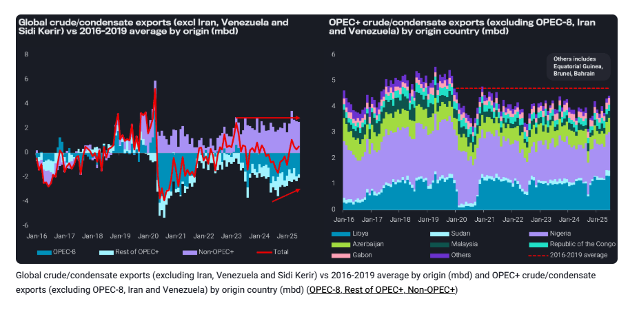
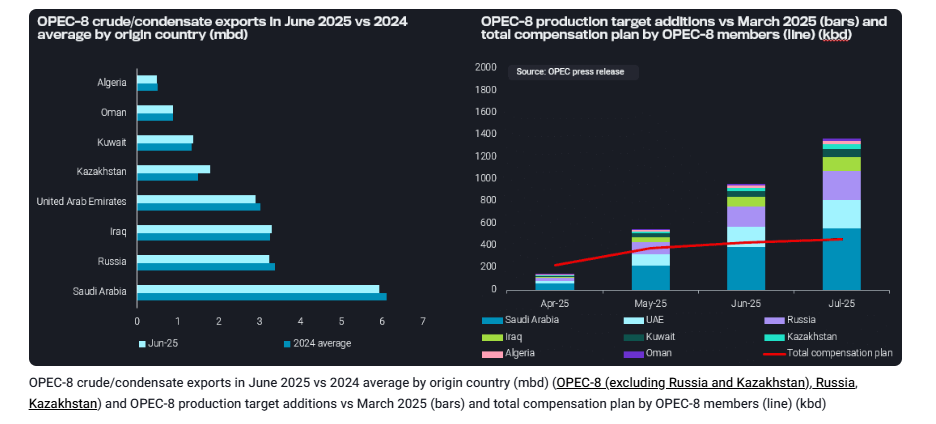

# Global crude/condensate supplies show surprising upside despite muted OPEC-8 exports

**Date:** July 04, 2025  
**Publisher:** Breakwave Advisors | **Category:** Market Insights  
**Original URL:** [https://www.breakwaveadvisors.com/insights/2025/7/4/global-crudecondensate-supplies-show-surprising-upside-despite-muted-opec-8-exports](https://www.breakwaveadvisors.com/insights/2025/7/4/global-crudecondensate-supplies-show-surprising-upside-despite-muted-opec-8-exports)  

---

Despite relaxed voluntary production targets, OPEC-8 crude exports remained stable, while the rest of OPEC+ crude exports show growth over the last two months.

*By*[*Xavier Tang*](https://www.linkedin.com/in/xavier-tang/)

Global crude/condensate exports (excluding Iran, Venezuela, and Sidi Kerir) have been increasing steadily since last September, driven by growing OPEC+ exports, while non-OPEC+ exports have remained relatively stable since mid-2023. The Sidi Kerir port has been excluded from this analysis because exports from this port are primarily crude re-exports from Ain Sukhna via the SUMED pipeline. To focus on mainstream barrels, crude exports from Iran and Venezuela have also been excluded.

> **Figure 1: Στιγμιότυπο Οθόνης 2025 07 04 103650**  
> **Interactive Data & Source:** [Analytics Vortexa](https://analytics.vortexa.com/Flows?dateRange=2016-01-01T00%3A00%3A00.000Z__2025-06-30T23%3A59%3A59.999Z&filtersEnabled=%5B%22p%22%2C%22o%22%2C%22d%22%2C%22d_r%22%2C%22v%22%2C%22intra_d%22%2C%22sts_o%22%2C%22c_o%22%2C%22w%22%5D&from=%5B%2282a6dd5bf8dfb66a8a8a684d60b69474785ed5878f9987ecd5dff6c8b83d3435%22%5D&geoBreakdownOriginGlobal=shipping_region_v2&metric=bpd&page=Flows&products=%5B%2254af755a090118dcf9b0724c9a4e9f14745c26165385ffa7f1445bc768f06f11%22%5D&tabId=c72d86b9-60fd-46f5-8936-2ea676bc191b&timeSeriesBaselineEnd=2024-04-01T10%3A59%3A59.999Z&timeSeriesBaselineStart=2023-01-01T10%3A59%3A59.999Z&timeSeriesProperty=origin_country&v=3) | [Local Asset](file:///C:/Users/Dell/Github/Shipping/corpus/03-breakwave/insights/2025/assets/2025-07-04_global-crudecondensate-supplies-show-surprising-upside-despite-muted-opec-8-expo_img_cea3cf84ceb9ceb3cebcceb9cf8ccf84cf85_5038662cb018.png)

Using 2016-2019 average levels as a baseline for comparison, global crude/condensate exports reached a 23-month high of over 1mbd in March 2025, before declining to 540kbd in June of this year. Most of these increases come from the rest of OPEC+ (excluding the OPEC-8 members), where volumes are just shy of 280kbd from 4-year average levels before the COVID-19 pandemic in June. The recent growth in crude exports mainly comes from Libya and Sudan.[Libya’s crude exports](https://analytics.vortexa.com/Flows?dateRange=2016-01-01T00%3A00%3A00.000Z__2025-06-30T23%3A59%3A59.999Z&filtersEnabled=%5B%22p%22%2C%22o%22%2C%22d%22%2C%22d_r%22%2C%22v%22%2C%22intra_d%22%2C%22sts_o%22%2C%22c_o%22%2C%22w%22%5D&from=%5B%2282a6dd5bf8dfb66a8a8a684d60b69474785ed5878f9987ecd5dff6c8b83d3435%22%5D&geoBreakdownOriginGlobal=shipping_region_v2&metric=bpd&page=Flows&products=%5B%2254af755a090118dcf9b0724c9a4e9f14745c26165385ffa7f1445bc768f06f11%22%5D&tabId=c72d86b9-60fd-46f5-8936-2ea676bc191b&timeSeriesBaselineEnd=2024-04-01T10%3A59%3A59.999Z&timeSeriesBaselineStart=2023-01-01T10%3A59%3A59.999Z&timeSeriesProperty=origin_country&v=3)reached a 6-year high of 1.3mbd in May and continued to remain high in June, while[the resumption of Dar Blend exports](https://analytics.vortexa.com/Flows?dateRange=2016-01-01T00%3A00%3A00.000Z__2025-06-30T23%3A59%3A59.999Z&filtersEnabled=%5B%22p%22%2C%22o%22%2C%22d%22%2C%22d_r%22%2C%22v%22%2C%22intra_d%22%2C%22sts_o%22%2C%22c_o%22%2C%22w%22%5D&from=%5B%2275d0436e9f47508020863fb5108eb31955a95d754083075d014f3564dfb432b5%22%5D&geoBreakdownOriginGlobal=shipping_region_v2&metric=bpd&page=Flows&products=%5B%2254af755a090118dcf9b0724c9a4e9f14745c26165385ffa7f1445bc768f06f11%22%5D&tabId=c72d86b9-60fd-46f5-8936-2ea676bc191b&timeSeriesBaselineEnd=2024-04-01T10%3A59%3A59.999Z&timeSeriesBaselineStart=2023-01-01T10%3A59%3A59.999Z&timeSeriesProperty=product_grade&v=3)boosted Sudan’s crude exports.

## OPEC-8 Crude Exports Fell Short of Expectations in Recent Months

Since April 2023, OPEC-8 members have contributed 2.2mbd of additional voluntary cuts. These countries have been unwinding their production cuts at an accelerated rate over the past three months. Expectations of higher crude exports from OPEC-8 members have not been actualised, despite a 959kbd increase in production target compared to March 2025 target. However, the production increase may have been offset by 431kbd in compensation cuts.

> **Figure 2: Στιγμιότυπο Οθόνης 2025 07 04 105321**  
> **Interactive Data & Source:** [Analytics Vortexa](https://analytics.vortexa.com/OnShoreCrudeInventories?dateRange=2021-12-01T00%3A00%3A00.000Z__2025-07-03T23%3A59%3A59.999Z&frequency=day&multiSelect=1&onshoreInventoriesLocations=%5B%2243a70ba6b21894cd24165d9d7ee59b012e698cf97e22fd275ccdd05a556e7061%22%2C%22f2ac0b4ca7b0e481ec41197ddbd37f6c60251f369ed74872691988bed8a07e0a%22%2C%229fa4354c24b3c7a2b0d40f870a1f57da4907bd816f130033f994ee9dcfdf08d1%22%2C%22b996521be9c996db3560ca234a56286ac38f798d34be229437555fab4f12a6a5%22%2C%226253047d839a51684f2ab6e3a4fa9956f582c73dfbbb276ebcd51ee01697b024%22%2C%22c6ff2896411f84434df3502a56281afc69240ffd403ec92c8bb026b9e5655757%22%2C%2287269b28eaea324d2c35e97b0ecc837ebc9a244faf94e260c08b518580b9e164%22%2C%22869ab3d28136025484ecb4235eed83d0eacef3129d0ac4cf8b23afdab847fd6f%22%5D&page=OnShoreCrudeInventories&tabId=4aa367ae-1f18-49c8-ab09-c49ddf7a1764&tankCrude=%5B%22confirmed%22%2C%22probable%22%5D) | [Local Asset](file:///C:/Users/Dell/Github/Shipping/corpus/03-breakwave/insights/2025/assets/2025-07-04_global-crudecondensate-supplies-show-surprising-upside-despite-muted-opec-8-expo_img_cea3cf84ceb9ceb3cebcceb9cf8ccf84cf85_2141f5cdc9f0.png)

2024 averages have been selected as the baseline in this review of OPEC-8 crude and condensate exports, as some members have increased their crude exports since the first quarter of this year. Compared to 2024 averages, crude exports from Saudi Arabia, the United Arab Emirates, and Russia have not increased, despite being the top three countries with the most significant production additions. Conversely, Iraq and Kazakhstan crude exports reflected gains, with the latter being the primary contributor to export growth amongst the OPEC-8 members. The rest of the OPEC-8 members, such as Algeria, Oman, and Kuwait, maintained their crude exports at similar levels to those of last year’s averages.

## Rising Inventories May Curb Production Increases

Crude prices retreated in end-June after tensions in the Middle East eased, reflecting the market’s growing awareness of the increasing availability of oil supplies. With the growing abundance of mainstream barrels entering the market,[global onshore inventories](https://analytics.vortexa.com/OnShoreCrudeInventories?dateRange=2021-12-01T00%3A00%3A00.000Z__2025-07-03T23%3A59%3A59.999Z&frequency=day&multiSelect=1&onshoreInventoriesLocations=%5B%2243a70ba6b21894cd24165d9d7ee59b012e698cf97e22fd275ccdd05a556e7061%22%2C%22f2ac0b4ca7b0e481ec41197ddbd37f6c60251f369ed74872691988bed8a07e0a%22%2C%229fa4354c24b3c7a2b0d40f870a1f57da4907bd816f130033f994ee9dcfdf08d1%22%2C%22b996521be9c996db3560ca234a56286ac38f798d34be229437555fab4f12a6a5%22%2C%226253047d839a51684f2ab6e3a4fa9956f582c73dfbbb276ebcd51ee01697b024%22%2C%22c6ff2896411f84434df3502a56281afc69240ffd403ec92c8bb026b9e5655757%22%2C%2287269b28eaea324d2c35e97b0ecc837ebc9a244faf94e260c08b518580b9e164%22%2C%22869ab3d28136025484ecb4235eed83d0eacef3129d0ac4cf8b23afdab847fd6f%22%5D&page=OnShoreCrudeInventories&tabId=4aa367ae-1f18-49c8-ab09-c49ddf7a1764&tankCrude=%5B%22confirmed%22%2C%22probable%22%5D)have increased by approximately 200 million barrels over the past four months, with China leading the stock builds. ([Read our inventory insight](https://www.vortexa.com/insights/crude/crude-oil-prices-kept-in-check-during-turbulent-times-by-rising-onshore-inventories/))

With Brent and WTI futures falling below $70/bbl since late June, oil producers will weigh their options between vying for market share and maintaining the supply-demand balance. However, such decisions are also dependent on each oil producer’s cost of production and the ability to withstand low prices for prolonged periods.

Data Source:[Vortexa](https://www.vortexa.com//oil-gas-data-traders-analysts-data-scientists?gclid=Cj0KCQjw8_qRBhCXARIsAE2AtRZKOvMnbilZ_6_91d7huSFFy71pWLrnPwGwOHVzXsmsG-1a1mZnQw8aAt89EALw_wcB&hsa_acc=1782073842&hsa_ad=548425387665&hsa_cam=14746637662&hsa_grp=125038601902&hsa_kw=&hsa_mt=&hsa_net=adwords&hsa_src=g&hsa_tgt=dsa-1431852288425&hsa_ver=3&utm_campaign=%5BCD%5D%20-%20DSA%20-%20EMEA&utm_medium=cpc&utm_medium=ppc&utm_source=google&utm_source=adwords&utm_term=)

---

**Tags:** Crude, Tankers, Markets  
