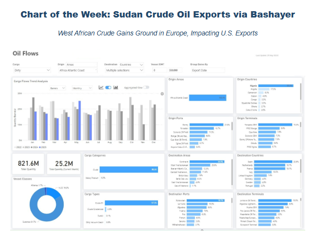
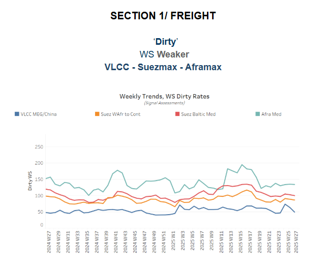
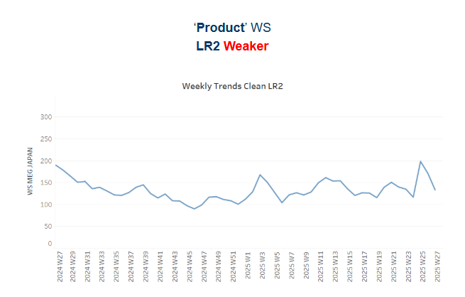
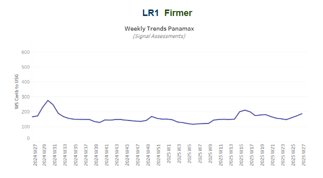
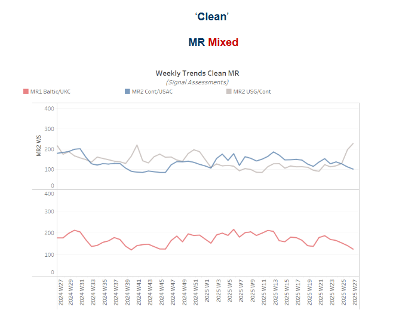
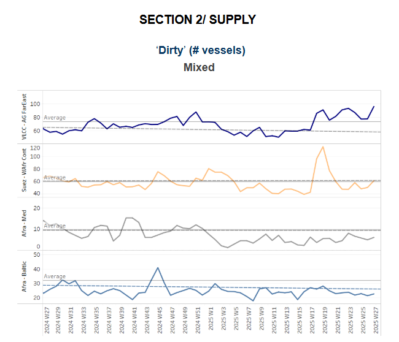
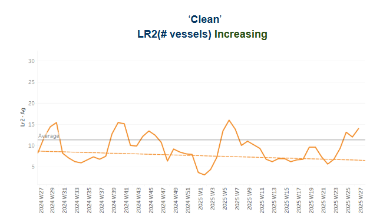
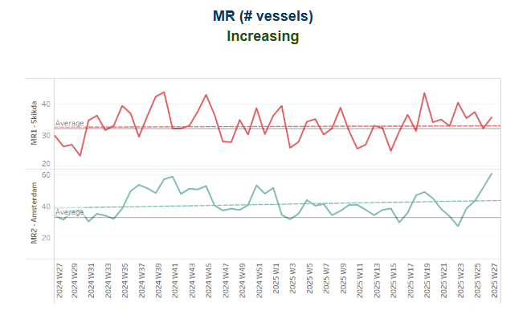
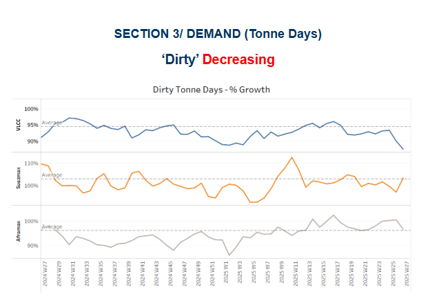
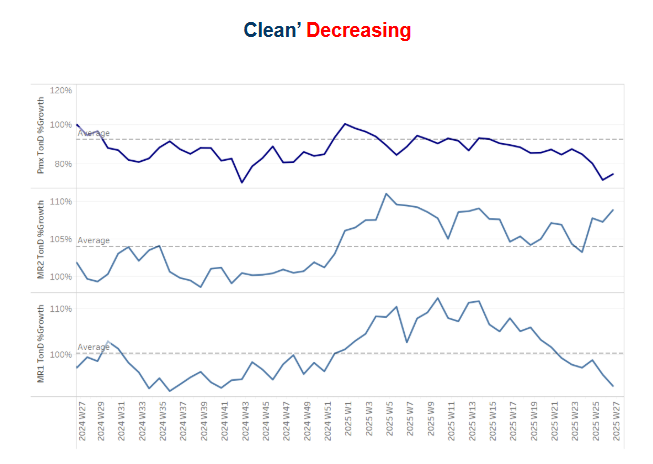

# Sudan Crude Oil Exports via Bashayer

**Date:** July 04, 2025  
**Publisher:** Breakwave Advisors | **Category:** Market Insights  
**Original URL:** [https://www.breakwaveadvisors.com/insights/2025/7/4/sudan-crude-oil-exports-via-bashayer](https://www.breakwaveadvisors.com/insights/2025/7/4/sudan-crude-oil-exports-via-bashayer)  

---

## Tanker - Weekly Market Monitor

Snapshot of Crude and Product Freight Rates, Supply-Demand

Week 27, 4 July, 2025

> **Figure 1: Στιγμιότυπο Οθόνης 2025 07 04 124144**  
> **Interactive Data & Source:** [Signal Ocean Platform](https://go.signalocean.com/e/983831/n-the-tanker-shipping-industry/2r829t/507767388/h/f9m3A8O5KOz9xHDqE0RVS3MRS5-z4lnLQrwYJaLkuG8) | [Local Asset](file:///C:/Users/Dell/Github/Shipping/corpus/03-breakwave/insights/2025/assets/2025-07-04_sudan-crude-oil-exports-via-bashayer_img_cea3cf84ceb9ceb3cebcceb9cf8ccf84cf85_c1a18bfc9d40.png)

Since late April 2023, Sudan has been gripped by an internal conflict between the Sudanese Armed Forces (SAF) and the Rapid Support Forces (RSF), which has significantly disrupted crude oil exports via the Bashayer erminal. Although most of the crude, particularly Dar Blend and Nile Blend, is produced in South Sudan, it must be exported through Sudan’s Red Sea port infrastructure. The civil war has led to operational uncertainty, suspected pipeline disruptions, and a sharp reduction in export volumes, which dropped to just 2 million barrels in April. However, signs of recovery have emerged: exports reached 7 million barrels in May and climbed further to 11 million in June.

Based on Red Sea crude shipment data, Sudan now accounts for approximately 14% of total exports, with most volumes loaded via Bashayer Marine Terminal (53%) and PLOC Marine Terminal (35%). The recovery observed in May and June suggests a potential return to more stable export activity, despite the ongoing conflict and absence of a formal peace agreement. Multiple mediation attempts, including a UK-hosted peace conference in April 2025, have failed to produce a ceasefire or meaningful negotiations.

The rebound in exports appears to be primarily driven by progress in pipeline repairs, which have enabled increased throughput of Dar and Nile Blend. This technical recovery, rather than any political resolution, has highly facilitated the higher volumes now seen leaving Bashayer.

The recent improvement of flows also implies renewed support for regional dirty tanker demand, particularly in the Aframax and Suezmax segments. Sudanese crude has mostly been transported via Aframax (59%) and Suezmax (42%) vessels. The main destinations for these exports include the United Arab Emirates (41% share, primarily to the Fujairah refinery) and Malaysia (24%, mainly to Tanjung Bin).

Looking ahead, the situation remains fragile. Peace talks have not concluded, and Sudan remains effectively split along territorial lines. The SAF maintains control of the eastern region, including Port Sudan and the critical Bashayer terminal, while the RSF dominates large swathes of central and western Sudan, including parts of Khartoum and much of Darfur. This de facto division has hindered efforts to re-establish a unified national government or power-sharing arrangement.

Nonetheless, a functional operational status quo has emerged, allowing oil flows to continue. If this continues, and the pipeline network remains intact, Sudan’s export viability could remain stable in the short term, potentially supporting sustained Aframax employment in the Red Sea.

> **Figure 2: Στιγμιότυπο Οθόνης 2025 07 04 124014**  
> **Interactive Data & Source:** [Signal Ocean Platform](https://go.signalocean.com/e/983831/n-the-tanker-shipping-industry/2r829t/507767388/h/f9m3A8O5KOz9xHDqE0RVS3MRS5-z4lnLQrwYJaLkuG8) | [Local Asset](file:///C:/Users/Dell/Github/Shipping/corpus/03-breakwave/insights/2025/assets/2025-07-04_sudan-crude-oil-exports-via-bashayer_img_cea3cf84ceb9ceb3cebcceb9cf8ccf84cf85_9de7d78e768c.png)

The Baltic Dirty Tanker Index (BDTI) has declined by 15% compared to the same period last year, with a noticeable drop in VLCC AG–China rates. Market sentiment is gradually returning to normalized levels after the extraordinary spike triggered by the Iran–Israel tensions. At the time, we had already mapped out[scenarios](https://go.signalocean.com/e/983831/n-the-tanker-shipping-industry/2r829t/507767388/h/f9m3A8O5KOz9xHDqE0RVS3MRS5-z4lnLQrwYJaLkuG8), with the expectation that a full closure of the Strait was unlikely. Now, as we enter the summer season, which typically exerts downward pressure on rates, the freight market is adjusting accordingly. Meanwhile, AG supply counts have been rising since the end of Week 25.

VLCC freight rates on the MEG–China route have declined to WS 49, marking an 11% drop week-on-week but remaining 5% higher on a monthly basis. Suezmax rates on the West Africa–Europe route stand at WS 85, reflecting sentiment similar to that of a month ago, while Baltic–Mediterranean rates have fallen to WS 95, down 7% week-on-week. A weakening trend is also evident in Aframax rates in the Mediterranean, which have slipped below WS 135.

> **Figure 3: Στιγμιότυπο Οθόνης 2025 07 04 124025**  
> **Interactive Data & Source:** [Signal Ocean Platform](https://www.thesignalgroup.com/signal-ocean-platform) | [Local Asset](file:///C:/Users/Dell/Github/Shipping/corpus/03-breakwave/insights/2025/assets/2025-07-04_sudan-crude-oil-exports-via-bashayer_img_cea3cf84ceb9ceb3cebcceb9cf8ccf84cf85_82d46aa1a1d9.png)

**LR2**clean freight rates on the AG route dropped to WS 130, a 22% decline in a week, after reaching their highest point this year. The shift in freight sentiment appears to be driven by a rising number of vessels, as shown in the supply section.

> **Figure 4: Στιγμιότυπο Οθόνης 2025 07 04 124032**  
> **Interactive Data & Source:** [Signal Ocean Platform](https://www.thesignalgroup.com/signal-ocean-platform) | [Local Asset](file:///C:/Users/Dell/Github/Shipping/corpus/03-breakwave/insights/2025/assets/2025-07-04_sudan-crude-oil-exports-via-bashayer_img_cea3cf84ceb9ceb3cebcceb9cf8ccf84cf85_d59bc52ba007.png)

**Panamax**Carib-to-USG rates rose to WS190, marking a 10% week-on-week increase. The last notable spike occurred shortly after mid-April, when rates briefly surged above WS200.

> **Figure 5: Στιγμιότυπο Οθόνης 2025 07 04 124041**  
> **Interactive Data & Source:** [Signal Ocean Platform](https://www.thesignalgroup.com/signal-ocean-platform) | [Local Asset](file:///C:/Users/Dell/Github/Shipping/corpus/03-breakwave/insights/2025/assets/2025-07-04_sudan-crude-oil-exports-via-bashayer_img_cea3cf84ceb9ceb3cebcceb9cf8ccf84cf85_00ec339a4289.png)

**Baltic–Continent****MR1**freight rates have dropped to WS 120, extending last week's decline and reflecting a 29% decrease on a monthly basis.**Continent–USAC MR2**freight rates also fell to WS 100, down 13% week-on-week. In contrast, a positive trend is observed on the**MR2 USG–Continent**route, with rates exceeding WS 200.

> **Figure 6: Cea3cf84ceb9ceb3cebcceb9cf8ccf84cf85**  
> **Interactive Data & Source:** [Signal Ocean Platform](https://www.thesignalgroup.com/signal-ocean-platform) | [Local Asset](file:///C:/Users/Dell/Github/Shipping/corpus/03-breakwave/insights/2025/assets/2025-07-04_sudan-crude-oil-exports-via-bashayer_img_cea3cf84ceb9ceb3cebcceb9cf8ccf84cf85_4c967ddaf9df.png)

The recent bearish outlook for VLCC crude oil freight is being reinforced by a surge in vessel availability in the Arabian Gulf. At Ras Tanura, the number of VLCCs has risen to approximately 96, about 23 above the yearly average adding tonnage pressure in the region. In contrast, vessel availability in the Suezmax sector in West Africa remains below the six-week average of 60. Meanwhile, Aframax availability in the Baltic continues to be notably constrained, with current levels remaining well below the historical benchmark of 10 for nearly ten consecutive weeks.

> **Figure 7: Στιγμιότυπο Οθόνης 2025 07 04 124100**  
> **Interactive Data & Source:** [Signal Ocean Platform](https://www.thesignalgroup.com/signal-ocean-platform) | [Local Asset](file:///C:/Users/Dell/Github/Shipping/corpus/03-breakwave/insights/2025/assets/2025-07-04_sudan-crude-oil-exports-via-bashayer_img_cea3cf84ceb9ceb3cebcceb9cf8ccf84cf85_7bfb5b91884c.png)

> **Figure 8: Στιγμιότυπο Οθόνης 2025 07 04 124108**  
> **Interactive Data & Source:** [Signal Ocean Platform](https://www.thesignalgroup.com/signal-ocean-platform) | [Local Asset](file:///C:/Users/Dell/Github/Shipping/corpus/03-breakwave/insights/2025/assets/2025-07-04_sudan-crude-oil-exports-via-bashayer_img_cea3cf84ceb9ceb3cebcceb9cf8ccf84cf85_c78626c37ec3.png)

Clean tanker supply showed signs of increasing toward the end of June, particularly for**LR2**vessels in the**Arabian Gulf**and**MR2**vessels in**Amsterdam**. In both regions, ship counts are hovering above their respective annual averages, with**LR2**availability in the**AG**peaking at nearly 14 vessels and**MR2**counts in**Amsterdam**reaching around 60. In contrast,**MR1**vessel activity at**Skikda**hovered just above the annual average of 32, following a notable spike in Week 19.

> **Figure 9: Στιγμιότυπο Οθόνης 2025 07 04 124117**  
> **Interactive Data & Source:** [Signal Ocean Platform](https://www.thesignalgroup.com/signal-ocean-platform) | [Local Asset](file:///C:/Users/Dell/Github/Shipping/corpus/03-breakwave/insights/2025/assets/2025-07-04_sudan-crude-oil-exports-via-bashayer_img_cea3cf84ceb9ceb3cebcceb9cf8ccf84cf85_303acb008c96.png)

**Dirty**tonne days: The seasonal development of**dirty**tonne-days remains below the growth rate seen in the same week of July 2024 for the**VLCC**segment, with**Suezmax**also falling below the annual trend. In the**Aframax**segment, despite signs of a decline from the peak recorded at the end of Week 17, activity remains above the average trend.

> **Figure 10: Στιγμιότυπο Οθόνης 2025 07 04 124125**  
> **Interactive Data & Source:** [Signal Ocean Platform](https://www.thesignalgroup.com/signal-ocean-platform) | [Local Asset](file:///C:/Users/Dell/Github/Shipping/corpus/03-breakwave/insights/2025/assets/2025-07-04_sudan-crude-oil-exports-via-bashayer_img_cea3cf84ceb9ceb3cebcceb9cf8ccf84cf85_61bbc3620096.png)

The seasonal development of tonne-days in the clean tanker segment continues to show a significant decline from the levels seen at the end of Week 15 for the**MR1**vessel size. In contrast, the**MR2**segment appears to be following a firmer trend. Meanwhile,**Panamax**tonne-days are also weakening, now falling to their lowest level so far this year

Data Source:[Signal Ocean Platform](https://www.thesignalgroup.com/signal-ocean-platform)

---

**Tags:** Tankers, Markets, Crude  
