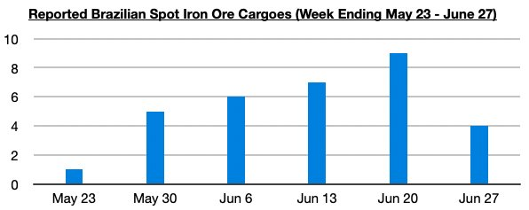
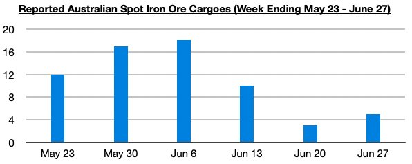

# Weakness Recently in Both Brazilian and Australian Spot Iron Ore Cargo Volume

**Date:** July 04, 2025  
**Publisher:** Breakwave Advisors | **Category:** Market Insights  
**Original URL:** [https://www.breakwaveadvisors.com/insights/2025/7/4/weakness-recently-in-both-brazilian-and-australian-spot-iron-ore-cargo-volume](https://www.breakwaveadvisors.com/insights/2025/7/4/weakness-recently-in-both-brazilian-and-australian-spot-iron-ore-cargo-volume)  

---

*By*[*Jeffrey Landsberg*](https://www.linkedin.com/in/jeffrey-landsberg-70ab957/)

As we discussed in Commodore Research's most recent Weekly Executive Report, overall dry bulk rates increased last week, with only capesize rates declining. However, as with two weeks ago, the decline in capesize rates was very large. Last week again saw capesize rates fall by 23%. Capesize rates have now fallen sharply over the past two weeks from their $30,944 peak due in part as the surge in Brazilian spot iron ore cargo volume has subsided.

> **Figure 1: Chart 1**  
> [Local Asset](file:///C:/Users/Dell/Github/Shipping/corpus/03-breakwave/insights/2025/assets/2025-07-04_weakness-recently-in-both-brazilian-and-australian-spot-iron-ore-cargo-volume_img_chart1_a8695b981f68.jpg)

Australian spot iron ore cargo volume has also recently plummeted.

> **Figure 2: Chart 2**  
> [Local Asset](file:///C:/Users/Dell/Github/Shipping/corpus/03-breakwave/insights/2025/assets/2025-07-04_weakness-recently-in-both-brazilian-and-australian-spot-iron-ore-cargo-volume_img_chart2_04b137fea52d.jpg)

---

**Tags:** Ironore, Capesize, Shipping  
