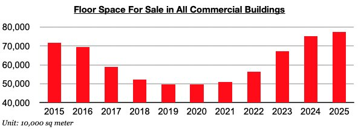
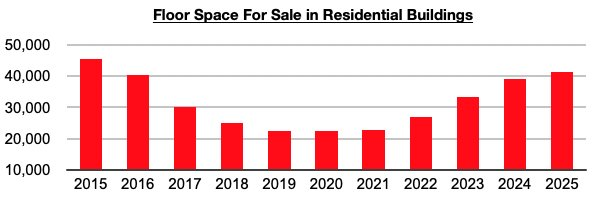
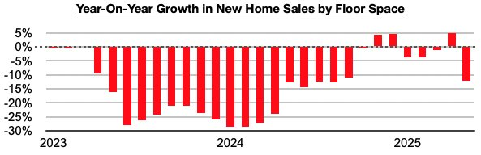

# Excess Housing Supply Remains Extreme in China

**Date:** July 07, 2025  
**Publisher:** Breakwave Advisors | **Category:** Market Insights  
**Original URL:** [https://www.breakwaveadvisors.com/insights/2025/7/7/excess-housing-supply-remains-extreme-in-china](https://www.breakwaveadvisors.com/insights/2025/7/7/excess-housing-supply-remains-extreme-in-china)  

---

*By*[*Jeffrey Landsberg*](https://www.linkedin.com/in/jeffrey-landsberg-70ab957/)

As we discussed in Commodore Research's most recent Weekly China Report, excess housing oversupply remains extreme in China. The most recently released data shows that May ended with 774 million square meters of floor space available in China's commercial buildings (the majority of which are residential buildings). This is down month-on-month by 1%, but it is still a huge amount that continues to show extreme oversupply.

> **Figure 1: Chart 1**  
> [Local Asset](file:///C:/Users/Dell/Github/Shipping/corpus/03-breakwave/insights/2025/assets/2025-07-07_excess-housing-supply-remains-extreme-in-china_img_chart1_1ee914ca61b6.jpg)

May ended with 413 million square meters of floor space available in purely residential buildings. This is also down month-on-month by 1%, but of course is still a huge amount as well.

> **Figure 2: Chart 2**  
> [Local Asset](file:///C:/Users/Dell/Github/Shipping/corpus/03-breakwave/insights/2025/assets/2025-07-07_excess-housing-supply-remains-extreme-in-china_img_chart2_5de611ce72d2.jpg)

Also of note is that new home sales in May decreased year-on-year by 12%. They have now decreased on a year-on-year basis during four of the last five months.

> **Figure 3: Chart 3**  
> [Local Asset](file:///C:/Users/Dell/Github/Shipping/corpus/03-breakwave/insights/2025/assets/2025-07-07_excess-housing-supply-remains-extreme-in-china_img_chart3_857c1c07835c.jpg)

---

**Tags:** Markets, China, Economy  
