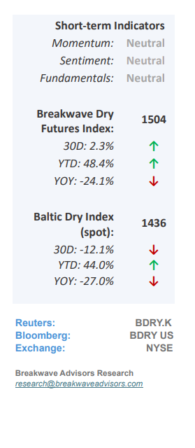
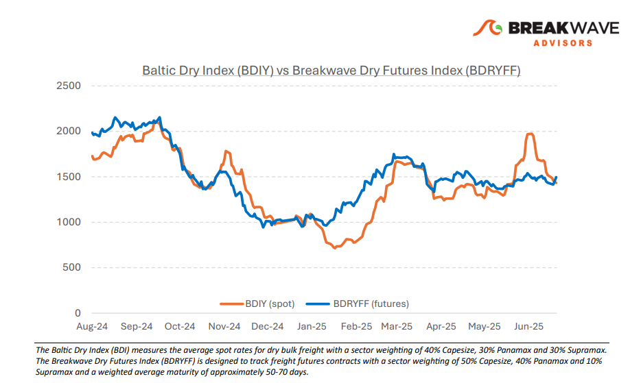
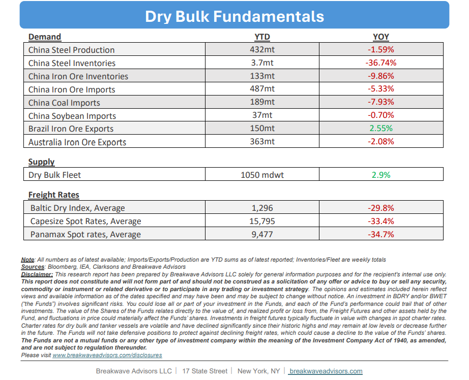

# Breakwave Bi-Weekly Dry Bulk Report - July 8, 2025

**Date:** July 08, 2025  
**Publisher:** Breakwave Advisors | **Category:** Market Insights  
**Original URL:** [https://www.breakwaveadvisors.com/insights/202578-drybulk-kil-114klo](https://www.breakwaveadvisors.com/insights/202578-drybulk-kil-114klo)  

---

•**Anemic Pacific Capesize Rates Drag the Overall Index Down**– A sharp and unexpected collapse in Capesize Pacific rates, down nearly 70% in just two weeks to below $10,000, has now begun to weigh on the broader dry bulk market, with the average spot index hovering around $15,000. While freight futures remained backwardated during the early June rally, the magnitude of the recent decline, particularly in the typically active Australian export market, has taken many market participants by surprise. As a result, the Atlantic basin continues to be the strongest region for Capesize vessels. However, given its relative strength, we anticipate a significant inflow of tonnage into the region, which could place downward pressure on spot rates there as well. Interestingly, Panamax rates have held up well during this period. The Panamax index is currently flat year-over-year, and the futures market is pricing in further gains. A weakening U.S. dollar has increased the appeal of commodities to emerging markets, potentially supporting continued Panamax demand going forward, given the more diversified cargoes. Although the summer months are typically a slower period for dry bulk shipping, the current landscape, marked by commodity price swings and heightened foreign exchange volatility, could serve as a catalyst for increased dry bulk activity in the months ahead.

> **Figure 1: Στιγμιότυπο Οθόνης 2025 07 08 092634**  
> [Local Asset](file:///C:/Users/Dell/Github/Shipping/corpus/03-breakwave/insights/2025/assets/2025-07-08_202578-drybulk-kil-114klo_img_cea3cf84ceb9ceb3cebcceb9cf8ccf84cf85_0e9027ee1e09.png)

•**Iron Ore Continues to Defy Fundamentals**– Despite heightened volatility across most major commodity markets, iron ore prices have remained remarkably stable, trading within a narrow range for several months. On the demand side, sentiment remains bearish, particularly due to developments in China, where steel production is constrained by increasingly stringent efficiency measures and domestic demand growth remains subdued. These factors make a near-term rebound in global iron ore demand unlikely. On the supply side, record-high exports from Brazil and consistently strong shipments from Australia are set to be joined by new high-grade iron ore production from West Africa by the end of the year. This growing supply backdrop presents one of the most unbalanced market outlooks in recent years. While weather-related disruptions may offer temporary price support, the overall trend suggests a downward trajectory. Nonetheless, both spot and futures prices continue to hover just below the critical $100/ton threshold. In our view, this period of price stability is unlikely to persist. We anticipate a decisive break below the $90/ton level, with further downside likely as fundamentals continue to deteriorate. While our forecast is not tied to a specific catalyst, it is grounded in the welltelegraphed supply-demand imbalance that has been evident to the market for some time.

•**Our Long-term View**– The last few years have been characterized by increased geopolitical uncertainty. Going forward, we expect such events to continue to affect global trade and have a meaningful impact on effective vessel supply. Combined with the potential for a multi-year cyclical rebound in China’s economic activity following the recent economic turmoil, dry bulk shipping should experience higher volatility on top of a secular tightness driven by stable bulk commodity demand and a slower fleet growth owing to a relatively low orderbook.

> **Figure 2: Στιγμιότυπο Οθόνης 2025 07 08 081942**  
> [Local Asset](file:///C:/Users/Dell/Github/Shipping/corpus/03-breakwave/insights/2025/assets/2025-07-08_202578-drybulk-kil-114klo_img_cea3cf84ceb9ceb3cebcceb9cf8ccf84cf85_801c367967f4.png)

> **Figure 3: Στιγμιότυπο Οθόνης 2025 07 08 092650**  
> [Local Asset](file:///C:/Users/Dell/Github/Shipping/corpus/03-breakwave/insights/2025/assets/2025-07-08_202578-drybulk-kil-114klo_img_cea3cf84ceb9ceb3cebcceb9cf8ccf84cf85_59975195f7a6.png)

### Subscribe:
