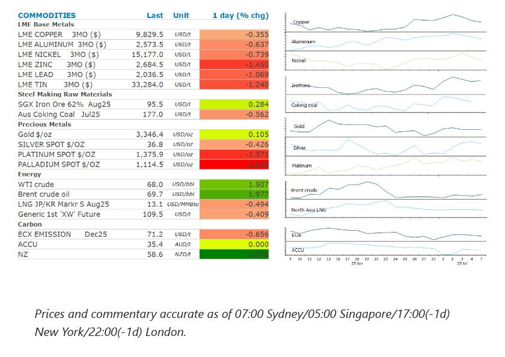
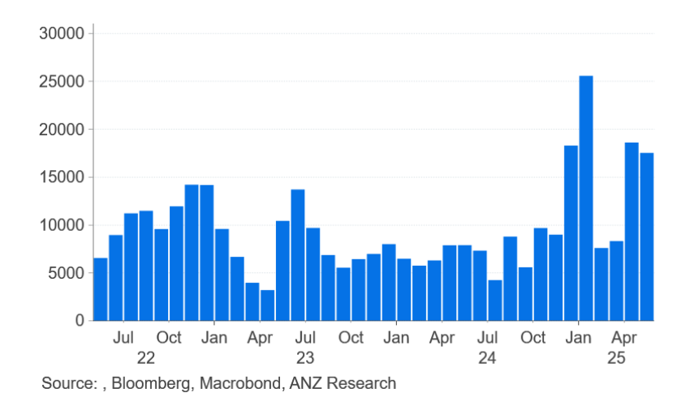

# Rising trade tensions push metals lower

**Date:** July 08, 2025  
**Publisher:** Breakwave Advisors | **Category:** Market Insights  
**Original URL:** [https://www.breakwaveadvisors.com/insights/2025/7/8/rising-trade-tensions-push-metals-lower](https://www.breakwaveadvisors.com/insights/2025/7/8/rising-trade-tensions-push-metals-lower)  

---

Renewed trade uncertainty pushed industrial commodities lower. Signs of tightness in the oil market offset concerns of higher output from OPEC.

*By*[*Daniel Hynes*](https://www.linkedin.com/in/dahynes/)

> **Figure 1: Στιγμιότυπο Οθόνης 2025 07 08 115304**  
> **Interactive Data & Source:** [Linkedin](https://www.linkedin.com/newsletters/commodities-wrap-6692196755876012032/?fbclid=IwAR3kiXJqZdxmp9ZcRwBNI7FsBySI-XSC0pfPur1qzjt7OZp7PTE59Tsl1QI) | [Local Asset](file:///C:/Users/Dell/Github/Shipping/corpus/03-breakwave/insights/2025/assets/2025-07-08_rising-trade-tensions-push-metals-lower_img_cea3cf84ceb9ceb3cebcceb9cf8ccf84cf85_e6a79d32b0f5.png)

### Market Commentary

**Crude oil**prices rose as the market shrugged off OPEC’s decision to accelerate production hikes. Eight members of the OPEC+ alliance agreed to raise output in August by 548kb/d. This is up from the 411kb/d increase in May, June and July. The reaction suggests the market feels it’s well placed to handle the additional barrels of oil, despite fears of weak demand emanating from the uncertain economic backdrop. OPEC pointed to a steady global economic outlook and current healthy market fundamentals, as reflected in the low oil inventories following its decision to raise output. There are signs of tightness in the physical market. Refineries are running flat out to meet peak Northern Hemisphere demand, which has seen middle distillate crack spreads surge higher. Saudi Aramco also raised its official selling prices for its main crude grade for buyers in Asia next month. Investor positioning also appears to have amplified the bounce, with the recent sharp correction following the easing of tensions in the Middle East washing out the bearish positions. Nevertheless, the spectre of another 548kb/d hike in September would raise the risk of inventories beginning to build as seasonal demand wanes.

**European gas**markets edged higher as traders await the impact of US tariffs on global economic activity. The region remains vulnerable to sudden shifts in supply or demand following a winter heating season that heavily depleted its storage facilities. It is now reliant on strong inflows of LNG to refill those stockpiles before next winter. That could be difficult given the warm temperatures the region is currently experiencing. The boost in cooling demand would put more pressure on gas-fired power generation. This could be exacerbated by nuclear reactors being forced to curb power generation.**North Asia LNG**prices remained steady amid increased buying interest from some regions. Thailand’s PTT purchased a shipment for delivery in the second half of August.

**Copper**led base metals lower amid further trade uncertainty. US President Donald Trump announced he would impose an additional 10% tariff on countries that aligned with BRICS. This is following a move by the group of nations including Brazil, China, Russia and India to ramp up talks on cross-border payment systems for trade and investment. Trump has previously threatened to slap 100% levies on these countries if they ditch the USD in bilateral trade. US Treasury Secretary Scott Bessent said that the US will make several trade announcements in the next 48 hours. The first could be tariffs of at least 25% on goods from Japan and South Korea starting 1 August. Details of sectoral tariffs geared toward boosting industrial production in the US, including aluminium, steel and copper are still under discussion. Sentiment was also weighed down by signs of stronger supply. Chilean copper mines had their best month of export revenue in over three years in June. More than USD4.7bn worth of copper was exported last month, up 17% y/y.

**Iron ore**futures were also dragged lower by trade tensions despite data suggesting improving fundamentals. Inventory levels at major Chinese steel mills fell 4.7% to 15.5mt in late June compared with mid-June.

**Gold**pared losses after Trump announced the 25% tariffs on Japan and South Korea. The rush to clarify overall US trade policies has served as a steady source of uncertainty for markets. This has continued to boost haven demand for gold.

### Chart of the Day

China continues to ramp up its purchases of nickel metal. China’s imports of refined nickel has reached 78.7kt in the first five months of 2025, up 121% y/y. Beijing appears to be making use of the recent slump in prices, with reports that Beijing has added more than 100kt of nickel for its state reserves this year. The metal is key to its electric vehicle sector, via nickel manganese cobalt and nickel cobalt aluminium batteries.

> **Figure 2: Στιγμιότυπο Οθόνης 2025 07 08 115357**  
> **Interactive Data & Source:** [Linkedin](https://www.linkedin.com/newsletters/commodities-wrap-6692196755876012032/?fbclid=IwAR3kiXJqZdxmp9ZcRwBNI7FsBySI-XSC0pfPur1qzjt7OZp7PTE59Tsl1QI) | [Local Asset](file:///C:/Users/Dell/Github/Shipping/corpus/03-breakwave/insights/2025/assets/2025-07-08_rising-trade-tensions-push-metals-lower_img_cea3cf84ceb9ceb3cebcceb9cf8ccf84cf85_d0a3ee3d2fb3.png)

Data source:[Commodities Wrap](https://www.linkedin.com/newsletters/commodities-wrap-6692196755876012032/?fbclid=IwAR3kiXJqZdxmp9ZcRwBNI7FsBySI-XSC0pfPur1qzjt7OZp7PTE59Tsl1QI)

---

**Tags:** Shipping, Commodities, Markets  
